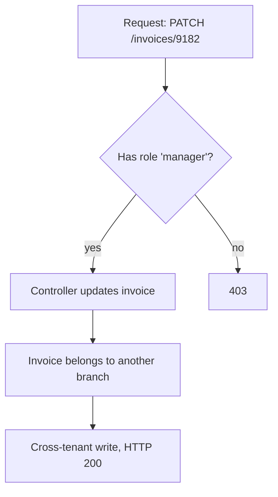
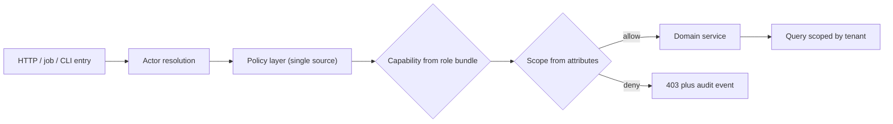

> **Scenario** — একটি B2B SaaS ship করল "regional manager নিজের branch-এর $5,000-এর কম invoice approve করতে পারবে"। দুই sprint পরে `roles` table-এ ৬৩টি row, `role_permission`-এ ১,৪০০টি, আর কেউ বলতে পারে না support agent অন্য tenant-এর invoice পড়তে পারে কিনা।

## Why it matters

- Authorization bug penetration test-এর সবচেয়ে সাধারণ critical finding, আর এটা error হিসেবে ধরা পড়ে না — request `200 OK` দেয়, শুধু অন্যের data নিয়ে।
- Role explosion-এ প্রতিটি product request একটা migration হয়ে যায়। নতুন একটা dimension (branch, amount, contract type) attribute যোগ না করে role সংখ্যা গুণ করে দেয়।
- On-call load "service down" থেকে "customer X, customer Y-এর data দেখছে"-তে সরে যায় — এটা legal reporting deadline সহ incident, শুধু rollback নয়।
- Permission model UI, API, background job ও report-এ ছড়িয়ে পড়ে। প্রতিটি copy drift করে, তাই উত্তর নির্ভর করে কোন surface-এ জিজ্ঞেস করছেন।

## Symptoms

| Signal | What you observe |
| --- | --- |
| Role count বাড়ছে | feature list-এর চেয়ে `roles` table দ্রুত বাড়ে; নাম হয় `manager_branch_approver_v2` |
| Duplicated check | একই rule controller, Vue guard ও nightly job-এ তিন রকম condition নিয়ে থাকে |
| Ad-hoc `if` | hotfix commit-এ `if ($user->id === 7 || $user->email === 'ops@…')` |
| Silent over-permission | ticket আসে "যে record দেখা উচিত নয় সেটা দেখলাম"; log-এ স্বাভাবিক 200 |
| Test gap | feature test শুধু anonymous user-এর 403 assert করে, ভুল authenticated user-এর কখনো নয় |

## How it breaks

সমস্যা প্রায় কখনোই ভাঙা check নয় — সমস্যা *অনুপস্থিত* check। RBAC উত্তর দেয় "এই subject-এর কি এই role আছে?" কিন্তু আসল প্রশ্ন হলো "এই subject কি এই নির্দিষ্ট resource-এ এখন এই action করতে পারে?" resource dimension না থাকলে check ওই type-এর প্রতিটি record-এর জন্য pass করে। এরপর team প্রতিটি endpoint আলাদা patch করে, ফলে policy কয়েক ডজন জায়গায় থাকে এবং সবচেয়ে নতুন endpoint সবসময় অরক্ষিত থাকে।



## Root causes

1. Role check coarse: এটা encode করে *user কে*, কখনো *কোন resource touch হচ্ছে* তা নয়।
2. Contextual rule (amount limit, ownership, time window) attribute-এ না গিয়ে role-এর নামে ঢুকে যায়।
3. Authorization controller-এ enforce হয়, তাই console command, queue worker, GraphQL resolver — অন্য যেকোনো entry point bypass করে।
4. Client-side guard-কে UX hint নয়, enforcement ধরা হয়।
5. Effective policy একজায়গায় পড়ার উপায় নেই, তাই review বাদ পড়া check ধরতে পারে না।

## How to solve it

### 1. Signature-এ resource রাখুন

প্রতি resource type-এ একটা policy object, আর সবসময় instance pass করুন। Laravel-এ `Gate`/policy method actor ও resource দুটোই পায়:

```php
// app/Policies/InvoicePolicy.php
namespace App\Policies;

use App\Models\Invoice;
use App\Models\User;

class InvoicePolicy
{
    public function view(User $user, Invoice $invoice): bool
    {
        return $user->tenant_id === $invoice->tenant_id
            && ($user->hasPermission('invoice.view.any')
                || $user->branch_id === $invoice->branch_id);
    }

    public function approve(User $user, Invoice $invoice): bool
    {
        if ($user->tenant_id !== $invoice->tenant_id) {
            return false;
        }

        return $user->hasPermission('invoice.approve')
            && $user->branch_id === $invoice->branch_id
            && $invoice->amount_cents <= $user->approval_limit_cents;
    }
}
```

`approval_limit_cents` একটা **attribute**, role নয়। manager-এর limit বাড়ানো মানে column update, নতুন role + migration নয়।

### 2. Permission-এর নাম action অনুযায়ী, পদবি অনুযায়ী নয়

একটা flat permission vocabulary (`invoice.approve`, `invoice.export`) রাখুন, role হবে সেগুলোর *bundle*। Role স্থির থাকে; product change শুধু permission যোগ করে।

```php
// database/seeders/PermissionSeeder.php
$manager = Role::firstOrCreate(['name' => 'branch_manager']);
$manager->syncPermissions([
    'invoice.view',
    'invoice.approve',
    'report.branch.read',
]);
```

### 3. Boundary-তে enforce করুন, প্রতি controller-এ নয়

Policy register করে resource binding-এ একবার authorize করুন, তাহলে সব route সেটা পায়:

```php
// app/Providers/AuthServiceProvider.php
protected $policies = [
    \App\Models\Invoice::class => \App\Policies\InvoicePolicy::class,
];

// routes/web.php — authorizeResource wires index/show/update/destroy
Route::resource('invoices', InvoiceController::class);

// app/Http/Controllers/InvoiceController.php
public function __construct()
{
    $this->authorizeResource(Invoice::class, 'invoice');
}
```

Queue job ও console command-এ actor স্পষ্টভাবে resolve করে একই policy ডাকুন — কখনো duplicate condition নয়:

```php
Gate::forUser($job->actor)->authorize('approve', $invoice);
```

### 4. Attribute rule সঠিক জায়গায় রাখুন

Practice-এ hybrid model ভালো কাজ করে: RBAC ঠিক করে *capability*, attribute ঠিক করে *scope*। Scope-কে policy পড়তে পারে এমন data (tenant, branch, limit, contract state) হিসেবে রাখুন, role নামের suffix হিসেবে নয়।

### 5. Policy testable ও reviewable করুন

```php
public function test_manager_cannot_approve_above_limit(): void
{
    $manager = User::factory()->create([
        'approval_limit_cents' => 500_000,
        'branch_id' => 3,
    ]);
    $invoice = Invoice::factory()->for($manager->tenant)->create([
        'branch_id' => 3,
        'amount_cents' => 500_001,
    ]);

    $this->assertFalse($manager->can('approve', $invoice));
}
```

আগে negative case লিখুন। বিপজ্জনক test হলো সেটাই যেখানে *অন্য একজন authenticated user* 403 পায় — anonymous user নয়।

## Target design



## Tradeoffs

| Option | Pros | Cons | Choose when |
| --- | --- | --- | --- |
| Pure RBAC | বোঝা সহজ; UI সরল | context এলেই role explosion | ছোট permission surface, single tenant |
| Pure ABAC | expressive; role churn নেই | admin-কে বোঝানো কঠিন; debugging সূক্ষ্ম | rule অনেক runtime attribute-এর উপর নির্ভর করে |
| Hybrid (capability = role, scope = attribute) | পড়ার মতো admin UI + contextual limit | দুটো concept document করতে হয় | অধিকাংশ multi-tenant B2B product |
| External policy engine | central audit, language-agnostic | বাড়তি hop, latency, availability dependency | অনেক service একই policy share করে |

## Verification checklist

- [ ] প্রতিটি policy method শুধু user নয়, resource instance নেয়।
- [ ] `grep -r "hasRole(" app/` controller বা query-তে কোনো hit দেয় না।
- [ ] প্রতিটি write endpoint-এ test আছে যেখানে অন্য tenant/branch-এর *বৈধ* user 403 পায়।
- [ ] Queue job ও console command HTTP-র মতো একই `Gate`/policy ডাকে।
- [ ] Denied authorization actor, resource id ও policy name সহ audit event পাঠায়।
- [ ] একটি command বা page একটি role-এর effective permission print করে।

## Anti-patterns

- প্রতিটি customer request-এ নতুন role যোগ করা, যতক্ষণ roles table-ই requirement document হয়ে যায়।
- শুধু frontend router guard-এ permission check করে SPA-কে trust করা।
- `is_admin` boolean column যা policy layer পুরো bypass করে।
- JWT-তে permission encode করে server-side আর কখনো re-evaluate না করা।
- "শুধু staff-এর জন্য" বলে internal tooling-কে wildcard grant (`*.*`) দেওয়া।

## Related

- [Multi-tenant authorization leaks](/systems/auth-security/multi-tenant-authorization-leaks)
- [Audit logging that survives compliance review](/systems/auth-security/audit-logging-for-compliance)
- [OAuth token lifecycle and tenant isolation](/systems/auth-security/oauth-token-lifecycle)
