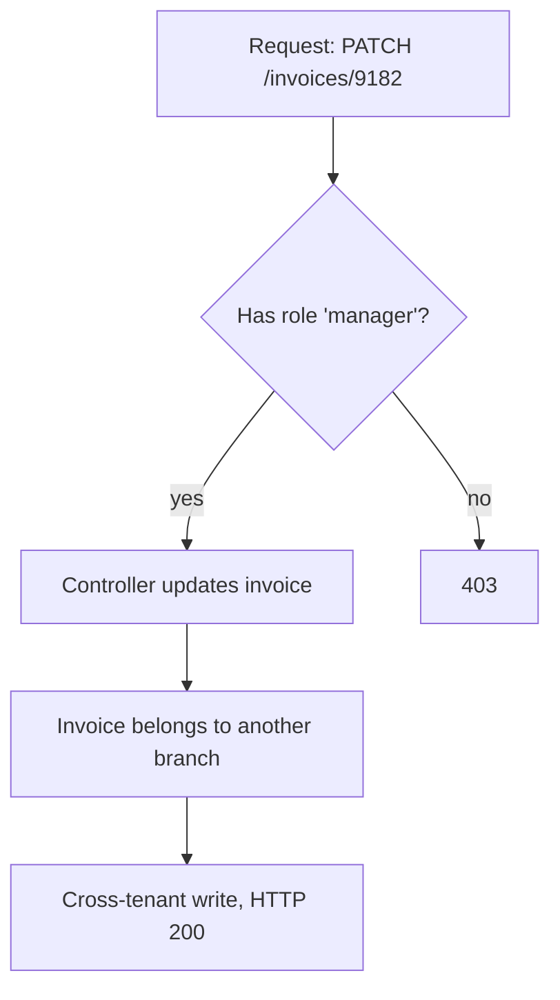
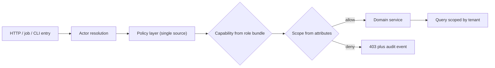

> **Scenario** — A B2B SaaS ships "let regional managers approve invoices under $5,000 for their own branch". Two sprints later the roles table has 63 rows, `role_permission` has 1,400, and nobody can answer whether a support agent can read another tenant's invoice.

## Why it matters

- Authorization bugs are the most common critical finding in application penetration tests, and they rarely show up as errors — the request returns `200 OK` with someone else's data.
- Role explosion turns every product request into a migration. A single new dimension (branch, amount, contract type) multiplies role count instead of adding one attribute.
- On-call load moves from "the service is down" to "customer X can see customer Y" — an incident with legal reporting deadlines, not just a rollback.
- The permission model leaks into the UI, the API, background jobs, and reports. Each copy drifts, so the answer depends on which surface you ask.

## Symptoms

| Signal | What you observe |
| --- | --- |
| Role count growth | `roles` table grows faster than the feature list; names like `manager_branch_approver_v2` |
| Duplicated checks | The same rule appears in a controller, a Vue guard, and a nightly job with three different conditions |
| Ad-hoc `if` blocks | `if ($user->id === 7 || $user->email === 'ops@…')` in a hotfix commit |
| Silent over-permission | Support tickets say "I could see a record I should not have"; logs show a normal 200 |
| Test gaps | Feature tests assert 403 for anonymous users only, never for the *wrong* authenticated user |

## How it breaks

The failure is almost never a broken check — it is a *missing* one. RBAC answers "does this subject hold this role?" but the real question is "may this subject perform this action on this specific resource, right now?" When the resource dimension is absent, the check passes for every record of that type. Teams then patch individual endpoints, so the policy lives in dozens of places and the newest endpoint is always the unprotected one.



## Root causes

1. Role checks are coarse: they encode *who the user is*, never *which resource is being touched*.
2. Contextual rules (amount limits, ownership, time windows) get pushed into role names instead of attributes.
3. Authorization is enforced in controllers, so any other entry point — console command, queue worker, GraphQL resolver — bypasses it.
4. The client-side guard is treated as enforcement rather than a UX hint.
5. There is no single place to read the effective policy, so review cannot catch omissions.

## How to solve it

### 1. Put the resource in the signature

Use a policy object per resource type and always pass the instance. In Laravel, `Gate`/policy methods receive both actor and resource:

```php
// app/Policies/InvoicePolicy.php
namespace App\Policies;

use App\Models\Invoice;
use App\Models\User;

class InvoicePolicy
{
    public function view(User $user, Invoice $invoice): bool
    {
        return $user->tenant_id === $invoice->tenant_id
            && ($user->hasPermission('invoice.view.any')
                || $user->branch_id === $invoice->branch_id);
    }

    public function approve(User $user, Invoice $invoice): bool
    {
        if ($user->tenant_id !== $invoice->tenant_id) {
            return false;
        }

        return $user->hasPermission('invoice.approve')
            && $user->branch_id === $invoice->branch_id
            && $invoice->amount_cents <= $user->approval_limit_cents;
    }
}
```

`approval_limit_cents` is an **attribute**, not a role. Raising a manager's limit becomes a column update, not a new role plus a migration.

### 2. Name permissions after actions, not job titles

Keep a flat permission vocabulary (`invoice.approve`, `invoice.export`) and let roles be *bundles* of permissions. Roles stay stable; product changes add permissions.

```php
// database/seeders/PermissionSeeder.php
$manager = Role::firstOrCreate(['name' => 'branch_manager']);
$manager->syncPermissions([
    'invoice.view',
    'invoice.approve',
    'report.branch.read',
]);
```

### 3. Enforce at the boundary, not in each controller

Register the policy and authorise once per resource binding so every route inherits it:

```php
// app/Providers/AuthServiceProvider.php
protected $policies = [
    \App\Models\Invoice::class => \App\Policies\InvoicePolicy::class,
];

// routes/web.php — authorizeResource wires index/show/update/destroy
Route::resource('invoices', InvoiceController::class);

// app/Http/Controllers/InvoiceController.php
public function __construct()
{
    $this->authorizeResource(Invoice::class, 'invoice');
}
```

For queue jobs and console commands, resolve the actor explicitly and call the same policy — never a duplicated condition:

```php
Gate::forUser($job->actor)->authorize('approve', $invoice);
```

### 4. Add attribute rules where they belong

A hybrid model works well in practice: RBAC decides *capability*, attributes decide *scope*. Express scope as data the policy reads (tenant, branch, limit, contract state) rather than a role name suffix.

### 5. Make the policy testable and reviewable

```php
public function test_manager_cannot_approve_above_limit(): void
{
    $manager = User::factory()->create([
        'approval_limit_cents' => 500_000,
        'branch_id' => 3,
    ]);
    $invoice = Invoice::factory()->for($manager->tenant)->create([
        'branch_id' => 3,
        'amount_cents' => 500_001,
    ]);

    $this->assertFalse($manager->can('approve', $invoice));
}
```

Write the negative case first. The dangerous test is the one asserting a *different authenticated user* gets 403 — not the anonymous one.

## Target design



## Tradeoffs

| Option | Pros | Cons | Choose when |
| --- | --- | --- | --- |
| Pure RBAC | Simple to reason about; easy UI | Role explosion once context matters | Small permission surface, single tenant |
| Pure ABAC | Expressive; no role churn | Hard to explain to admins; policy debugging is subtle | Rules depend on many runtime attributes |
| Hybrid (roles for capability, attributes for scope) | Readable admin UI plus contextual limits | Two concepts to document | Most multi-tenant B2B products |
| External policy engine | Central audit, language-agnostic | Extra hop, latency, availability dependency | Many services must share one policy |

## Verification checklist

- [ ] Every policy method takes the resource instance, not just the user.
- [ ] `grep -r "hasRole(" app/` returns no hits inside controllers or queries.
- [ ] Each write endpoint has a test where a *valid* user of another tenant/branch receives 403.
- [ ] Queue jobs and console commands call the same `Gate`/policy as HTTP.
- [ ] Denied authorization emits an audit event with actor, resource id, and policy name.
- [ ] A single command or page prints the effective permissions of a given role.

## Anti-patterns

- Adding a role per customer request until the roles table is the requirements document.
- Checking permissions only in the frontend router guard and trusting the SPA.
- `is_admin` boolean columns that bypass the policy layer entirely.
- Encoding permissions inside a JWT and never re-evaluating them server-side.
- Wildcard grants (`*.*`) handed to internal tooling because "it is only for staff".

## Related

- [Multi-tenant authorization leaks](/systems/auth-security/multi-tenant-authorization-leaks)
- [Audit logging that survives compliance review](/systems/auth-security/audit-logging-for-compliance)
- [OAuth token lifecycle and tenant isolation](/systems/auth-security/oauth-token-lifecycle)
