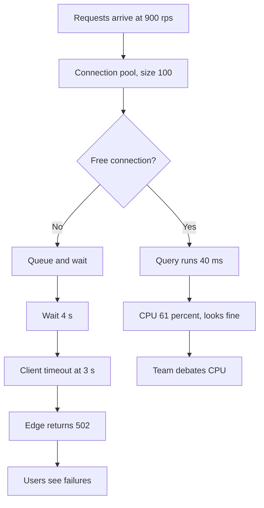
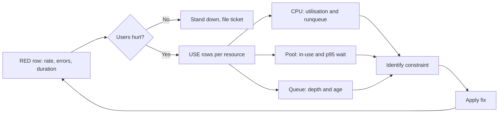

> **Scenario** — API 502 দিচ্ছে। Incident-এর বিশ মিনিট পর তিন engineer তর্ক করছে Postgres CPU 61% "high" কি না। কেউ দেখেনি connection pool saturate কি না — সেটি 100/100-এ, median wait 4 সেকেন্ড — কারণ dashboard-এ pool-এর কোনো saturation panel নেই।

## Why it matters

- RED বলে "user ভুগছে কি, কতটা"; USE বলে "constraint কোন resource"। দুটো মেশালে প্রতিটি incident-এর প্রথম বিশ মিনিট নষ্ট।
- Saturation-এর বদলি হিসেবে utilisation ভয়ানক: IO-র জন্য অপেক্ষায় CPU বসে থাকলেও queue ভরে যেতে পারে।
- Queue-length বা wait-time signal ছাড়া Little's Law প্রয়োগ করা যায় না, তাই capacity planning অনুমান হয়ে যায়।
- Error দুই method-এই আসে কিন্তু অর্থ ভিন্ন: request error মানে user ক্ষতি; device error মানে hardware বা driver fault।
- যে team দুটো method আলাদা রাখে তাদের triage order থাকে: RED দিয়ে ক্ষতি নিশ্চিত করা, USE দিয়ে constraint খোঁজা, তারপর আবার RED দিয়ে fix যাচাই।

## Symptoms

| Signal | What you observe |
| --- | --- |
| Triage | Incident call-এ user impact নিশ্চিত করার আগেই resource সংখ্যা নিয়ে তর্ক |
| Saturation | শুধু CPU ও memory graph; pool, queue বা thread-pool panel নেই |
| Latency | Service latency বাড়ে, CPU/memory-তে মেলানো নড়াচড়া নেই |
| Errors | Edge-এ 502, application log-এ 200 |
| Capacity | Load test ছাড়া "কত headroom আছে"-র উত্তর নেই |
| Dashboards | এক board-এ node ও request metric মেশানো, কোনো ক্রম নেই |

## How it breaks

RED (Rate, Errors, Duration) হলো *demand-side* দৃশ্য: কত কাজ আসছে ও কতটা ভালোভাবে পরিবেশিত হচ্ছে। USE (Utilisation, Saturation, Errors) হলো প্রতিটি resource-এর *supply-side* দৃশ্য। শুধু utilisation মাপলে চিরচেনা failure অদৃশ্য থাকে: bounded resource যত দিতে পারে তার চেয়ে দ্রুত request আসে, তাই তারা queue-তে অপেক্ষা করে। Wait time-ই latency, কিন্তু resource দেখতে সুস্থ — 60% CPU, প্রচুর memory। এদিকে queue বাড়ে, timeout budget কাজ করার বদলে অপেক্ষায় খরচ হয়, edge 502 দিতে শুরু করে আর application কোনো error-ই দেখে না।



## Root causes

1. Utilisation দিয়ে saturation proxy করা, তাই queue-যুক্ত bounded resource অদৃশ্য।
2. Pool, thread ও queue metric একেবারেই export না করা।
3. Service-level symptom diagnose করতে node-level dashboard ব্যবহার।
4. Latency শুধু application-এ মাপা, edge-এ queue-তে কাটানো সময় বাদ।
5. Documented triage order নেই, তাই যার যেখানে সন্দেহ সেখান থেকেই শুরু।
6. Error layer ধরে ভাগ করা নেই, তাই upstream timeout application bug-এর মতো দেখায়।

## How to solve it

### 1. প্রতিটি service-এ একরকমভাবে RED export করুন

```promql
# Rate
sum by (service, route) (rate(http_server_requests_total[5m]))

# Errors, as a ratio
sum by (service) (rate(http_server_requests_total{outcome=~"server_error|exception|aborted"}[5m]))
  / sum by (service) (rate(http_server_requests_total[5m]))

# Duration, p50 / p95 / p99 from one histogram
histogram_quantile(0.95, sum by (le, service) (rate(http_server_request_duration_seconds_bucket[5m])))
```

### 2. শুধু machine নয়, প্রতিটি bounded resource-এ USE export করুন

সাধারণ stack-এ bounded resource-এর তালিকা ছোট ও জানা: CPU, memory, disk IO, network, database connection pool, HTTP client pool, worker thread, queue depth, file descriptor, এবং নিজের লেখা যেকোনো semaphore।

```ts
import { Gauge, Histogram } from 'prom-client'

export const poolInUse = new Gauge({
  name: 'db_pool_in_use',
  help: 'Connections currently checked out',
  labelNames: ['pool'] as const,
})
export const poolSize = new Gauge({
  name: 'db_pool_size',
  help: 'Configured pool size',
  labelNames: ['pool'] as const,
})
export const poolWait = new Histogram({
  name: 'db_pool_wait_seconds',
  help: 'Time spent waiting for a connection — this is saturation',
  labelNames: ['pool'] as const,
  buckets: [0.001, 0.005, 0.01, 0.05, 0.1, 0.5, 1, 3, 10],
})

export async function withConnection<T>(fn: (c: Client) => Promise<T>): Promise<T> {
  const t0 = process.hrtime.bigint()
  const conn = await pool.connect()
  poolWait.observe({ pool: 'primary' }, Number(process.hrtime.bigint() - t0) / 1e9)
  poolInUse.set({ pool: 'primary' }, pool.totalCount - pool.idleCount)
  try {
    return await fn(conn)
  } finally {
    conn.release()
  }
}
```

বেশিরভাগ service-এর কাছে যা নেই, সেই `db_pool_wait_seconds`-ই সবচেয়ে কাজের saturation metric।

### 3. প্রতি resource-এ USE-কে তিনটি recording rule বানান

```yaml
groups:
  - name: use-method
    interval: 30s
    rules:
      - record: use:cpu_utilisation:ratio
        expr: 1 - avg by (instance) (rate(node_cpu_seconds_total{mode="idle"}[5m]))
      - record: use:cpu_saturation:runqueue
        expr: avg by (instance) (node_load1) / on (instance) count by (instance) (node_cpu_seconds_total{mode="idle"})
      - record: use:disk_saturation:ratio
        expr: rate(node_disk_io_time_weighted_seconds_total[5m])
      - record: use:pool_utilisation:ratio
        expr: sum by (service, pool) (db_pool_in_use) / sum by (service, pool) (db_pool_size)
      - record: use:pool_saturation:p95_wait
        expr: histogram_quantile(0.95, sum by (le, service, pool) (rate(db_pool_wait_seconds_bucket[5m])))
      - record: use:queue_saturation:depth
        expr: sum by (queue) (worker_queue_depth)
```

`node_load1 / cpu_count` 1-এর উপরে মানে process CPU-র জন্য অপেক্ষা করছে — সেটাই saturation, utilisation থেকে আলাদা।

### 4. Pool size ঠিক করতে Little's Law প্রয়োগ করুন

Little's Law: `L = λ × W` — concurrency = arrival rate × service time। 900 rps-এ 40 ms query হলে শুধু তাল মেলাতে দরকার `900 × 0.04 = 36` connection, headroom ছাড়াই। 100-এর pool যথেষ্ট — অর্থাৎ আসল সমস্যা pool size নয়, service time drift।

```promql
# Required concurrency, measured
sum by (service) (rate(db_queries_total[5m]))
  *
histogram_quantile(0.5, sum by (le, service) (rate(db_query_duration_seconds_bucket[5m])))

# Compare against configured capacity
sum by (service) (db_pool_size)
```

মাপা required concurrency pool size-এর কাছে গেলে হয় capacity বাড়ান, নয় service time কমান। না গেলে latency অন্য কোথাও থেকে আসছে।

### 5. Triage order ঠিক করে লিখে রাখুন

```bash
# 1. RED: is anyone hurt?
promtool query instant http://prom:9090 \
  'sum(rate(http_server_requests_total{outcome=~"server_error|aborted"}[5m])) / sum(rate(http_server_requests_total[5m]))'

# 2. USE: which resource is saturated?
promtool query instant http://prom:9090 'topk(5, use:pool_saturation:p95_wait)'
promtool query instant http://prom:9090 'topk(5, use:queue_saturation:depth)'

# 3. RED again: did the fix move the user-facing number?
```

## Target design



## Tradeoffs

| Option | Pros | Cons | Choose when |
| --- | --- | --- | --- |
| শুধু RED | ছোট metric set, user-aligned | constraint স্থানীয়করণ করা যায় না | এক dependency-র খুব ছোট service |
| শুধু USE | গভীর resource insight | user-এর কিছু যায় আসে কি না জানা নেই | infrastructure ও node-level ownership |
| দুটো, আলাদা row-তে | দ্রুত triage, স্পষ্ট ক্রম | বেশি panel maintain | service dashboard-এর default |
| Saturation proxy হিসেবে utilisation | সস্তা, আগেই export করা | queueing পুরো বাদ | bounded pool-এ কখনো নয় |
| Wait-time histogram | সরাসরি queueing মাপে | প্রতি resource-এ বাড়তি instrumentation | request path-এর যেকোনো pool |

## Verification checklist

- [ ] প্রতিটি service dashboard-এর উপরে RED row, নিচে USE row আছে।
- [ ] Request path-এর প্রতিটি pool-এ `db_pool_wait_seconds` (বা সমতুল্য) আছে।
- [ ] Saturation পর্যন্ত load test করে দেখুন saturation metric latency-র আগে নড়ে।
- [ ] `use:cpu_saturation:runqueue` ও `use:cpu_utilisation:ratio` দুটোই graph করা ও আলাদা করা যায়।
- [ ] Little's Law থেকে মাপা required concurrency configured pool size-এর 3x-এর মধ্যে।
- [ ] লিখিত triage order runbook-এ আছে এবং শেষ incident review-তে অনুসরণ করা হয়েছে।

## Anti-patterns

- Resource-এর কাজ যাই হোক, প্রতিটির 80% utilisation-এ alert করা।
- CPU count দিয়ে ভাগ না করে শুধু load average ব্যবহার, যা instance type জুড়ে অর্থহীন।
- এক বিশাল dashboard-এ node ও service metric মেশানো, কোনো visual বিভাজন ছাড়া।
- Queue depth মাপা কিন্তু queue *age* নয়, তাই backlog আর burst আলাদা করা যায় না।
- Service time regress করেছে কি না না দেখেই ভরা pool-কে pool-size সমস্যা ভাবা।

## Related

- [Instrumenting the four golden signals](/systems/observability-sli/golden-signals-instrumentation)
- [Dashboards that answer questions](/systems/observability-sli/dashboards-that-answer-questions)
- [Alert design and noise reduction](/systems/observability-sli/alert-design-and-noise-reduction)
- [p99 tail latency and capacity planning](/systems/performance-capacity/p99-tail-latency-planning)
