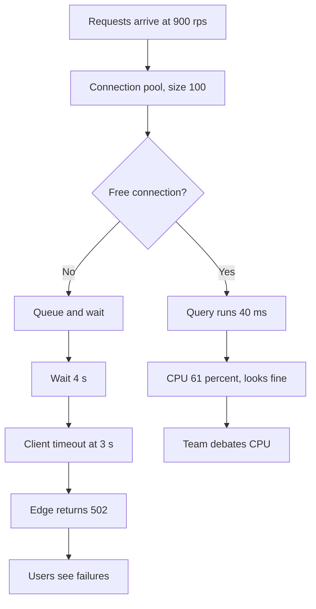
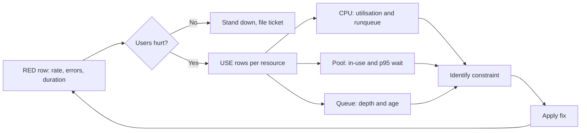

> **Scenario** - The API is returning 502s. Twenty minutes into the incident three engineers are arguing about whether Postgres CPU at 61% is "high". Nobody has looked at whether the connection pool is saturated - it is, at 100/100, with a 4-second median wait - because the dashboard has no saturation panel for pools.

## Why it matters

- RED answers "are users being hurt and how badly"; USE answers "which resource is the constraint". Conflating them wastes the first twenty minutes of every incident.
- Utilisation is a terrible stand-in for saturation: a queue can be full while the CPU idles waiting on IO.
- Without a queue-length or wait-time signal you cannot apply Little's Law, so capacity planning becomes guesswork.
- Errors appear in both methods but mean different things: a request error is user harm; a device error is a hardware or driver fault.
- Teams that separate the two methods have a triage order: confirm harm with RED, find the constraint with USE, then verify the fix with RED again.

## Symptoms

| Signal | What you observe |
| --- | --- |
| Triage | Incident calls debate resource numbers before confirming user impact |
| Saturation | Only CPU and memory graphed; no pool, queue, or thread-pool panels |
| Latency | Service latency rises with no matching CPU or memory movement |
| Errors | 502s at the edge with 200s in the application logs |
| Capacity | No answer to "how much headroom do we have" without a load test |
| Dashboards | One board mixes node metrics and request metrics with no ordering |

## How it breaks

RED (Rate, Errors, Duration) is a *demand-side* view: it measures the work arriving and how well it is served. USE (Utilisation, Saturation, Errors) is a *supply-side* view of each resource. When only utilisation is measured, the classic failure is invisible: requests arrive faster than a bounded resource can serve them, so they wait in a queue. Wait time is latency, but the resource itself looks fine - 60% CPU, plenty of memory. Meanwhile the queue grows, the timeout budget is consumed by waiting rather than working, and the edge starts returning 502 while the application never sees an error at all.



## Root causes

1. Saturation proxied by utilisation, so bounded resources with queues are invisible.
2. Pool, thread, and queue metrics not exported at all.
3. Node-level dashboards used to diagnose service-level symptoms.
4. Latency measured only at the application, not including time spent queued at the edge.
5. No documented triage order, so investigation starts wherever someone has a hunch.
6. Errors not split by layer, so an upstream timeout looks like an application bug.

## How to solve it

### 1. Export RED for every service, uniformly

```promql
# Rate
sum by (service, route) (rate(http_server_requests_total[5m]))

# Errors, as a ratio
sum by (service) (rate(http_server_requests_total{outcome=~"server_error|exception|aborted"}[5m]))
  / sum by (service) (rate(http_server_requests_total[5m]))

# Duration, p50 / p95 / p99 from one histogram
histogram_quantile(0.95, sum by (le, service) (rate(http_server_request_duration_seconds_bucket[5m])))
```

### 2. Export USE for every bounded resource, not just the machine

The list of bounded resources in a typical stack is short and knowable: CPU, memory, disk IO, network, database connection pool, HTTP client pool, worker threads, queue depth, file descriptors, and any semaphore you wrote yourself.

```ts
import { Gauge, Histogram } from 'prom-client'

export const poolInUse = new Gauge({
  name: 'db_pool_in_use',
  help: 'Connections currently checked out',
  labelNames: ['pool'] as const,
})
export const poolSize = new Gauge({
  name: 'db_pool_size',
  help: 'Configured pool size',
  labelNames: ['pool'] as const,
})
export const poolWait = new Histogram({
  name: 'db_pool_wait_seconds',
  help: 'Time spent waiting for a connection - this is saturation',
  labelNames: ['pool'] as const,
  buckets: [0.001, 0.005, 0.01, 0.05, 0.1, 0.5, 1, 3, 10],
})

export async function withConnection<T>(fn: (c: Client) => Promise<T>): Promise<T> {
  const t0 = process.hrtime.bigint()
  const conn = await pool.connect()
  poolWait.observe({ pool: 'primary' }, Number(process.hrtime.bigint() - t0) / 1e9)
  poolInUse.set({ pool: 'primary' }, pool.totalCount - pool.idleCount)
  try {
    return await fn(conn)
  } finally {
    conn.release()
  }
}
```

`db_pool_wait_seconds` is the single most useful saturation metric most services do not have.

### 3. Turn USE into three recording rules per resource

```yaml
groups:
  - name: use-method
    interval: 30s
    rules:
      - record: use:cpu_utilisation:ratio
        expr: 1 - avg by (instance) (rate(node_cpu_seconds_total{mode="idle"}[5m]))
      - record: use:cpu_saturation:runqueue
        expr: avg by (instance) (node_load1) / on (instance) count by (instance) (node_cpu_seconds_total{mode="idle"})
      - record: use:disk_saturation:ratio
        expr: rate(node_disk_io_time_weighted_seconds_total[5m])
      - record: use:pool_utilisation:ratio
        expr: sum by (service, pool) (db_pool_in_use) / sum by (service, pool) (db_pool_size)
      - record: use:pool_saturation:p95_wait
        expr: histogram_quantile(0.95, sum by (le, service, pool) (rate(db_pool_wait_seconds_bucket[5m])))
      - record: use:queue_saturation:depth
        expr: sum by (queue) (worker_queue_depth)
```

`node_load1 / cpu_count` above 1 means processes are waiting for CPU - that is saturation, distinct from utilisation.

### 4. Apply Little's Law to size the pool

Little's Law: `L = λ × W`, concurrency equals arrival rate times service time. At 900 rps with a 40 ms query, required concurrency is `900 × 0.04 = 36` connections just to keep up, with no headroom. A pool of 100 should be ample - which tells you the real problem is service time drift, not pool size.

```promql
# Required concurrency, measured
sum by (service) (rate(db_queries_total[5m]))
  *
histogram_quantile(0.5, sum by (le, service) (rate(db_query_duration_seconds_bucket[5m])))

# Compare against configured capacity
sum by (service) (db_pool_size)
```

If measured required concurrency approaches the pool size, either add capacity or reduce service time. If it does not, your latency is coming from somewhere else.

### 5. Fix the triage order and write it down

```bash
# 1. RED: is anyone hurt?
promtool query instant http://prom:9090 \
  'sum(rate(http_server_requests_total{outcome=~"server_error|aborted"}[5m])) / sum(rate(http_server_requests_total[5m]))'

# 2. USE: which resource is saturated?
promtool query instant http://prom:9090 'topk(5, use:pool_saturation:p95_wait)'
promtool query instant http://prom:9090 'topk(5, use:queue_saturation:depth)'

# 3. RED again: did the fix move the user-facing number?
```

## Target design



## Tradeoffs

| Option | Pros | Cons | Choose when |
| --- | --- | --- | --- |
| RED only | Small metric set, user-aligned | Cannot localise the constraint | Very small services with one dependency |
| USE only | Deep resource insight | No idea whether users care | Infrastructure and node-level ownership |
| Both, separate rows | Fast triage, clear order | More panels to maintain | Default for service dashboards |
| Utilisation as saturation proxy | Cheap, already exported | Misses queueing entirely | Never for bounded pools |
| Wait-time histograms | Directly measures queueing | Extra instrumentation per resource | Any pool on a request path |

## Verification checklist

- [ ] Every service dashboard has a RED row at the top and USE rows below it.
- [ ] `db_pool_wait_seconds` (or equivalent) exists for every pool on a request path.
- [ ] Load test until saturation and confirm the saturation metric moves before latency.
- [ ] `use:cpu_saturation:runqueue` and `use:cpu_utilisation:ratio` are both graphed and distinguishable.
- [ ] Measured required concurrency from Little's Law is within 3x of configured pool sizes.
- [ ] The written triage order is in the runbook and was followed in the last incident review.

## Anti-patterns

- Alerting on utilisation above 80% for every resource regardless of what the resource does.
- Using load average alone without dividing by CPU count, making it meaningless across instance types.
- Building one giant dashboard that mixes node and service metrics with no visual separation.
- Measuring queue depth but not queue *age*, so you cannot tell a backlog from a burst.
- Treating a full pool as a pool-size problem before checking whether service time regressed.

## Related

- [Instrumenting the four golden signals](/systems/observability-sli/golden-signals-instrumentation)
- [Dashboards that answer questions](/systems/observability-sli/dashboards-that-answer-questions)
- [Alert design and noise reduction](/systems/observability-sli/alert-design-and-noise-reduction)
- [p99 tail latency and capacity planning](/systems/performance-capacity/p99-tail-latency-planning)
