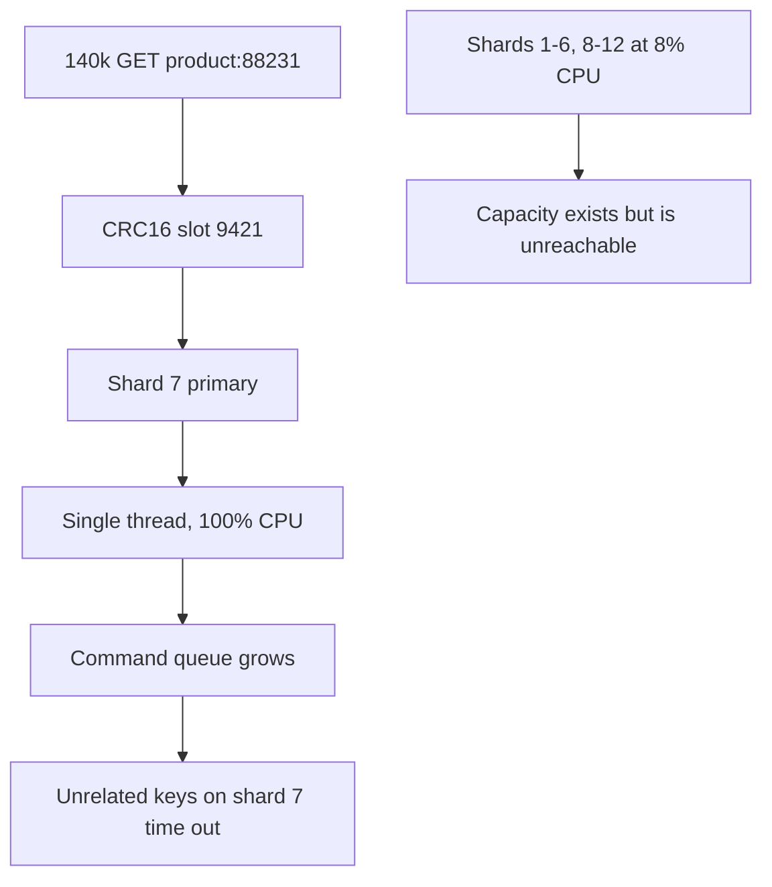
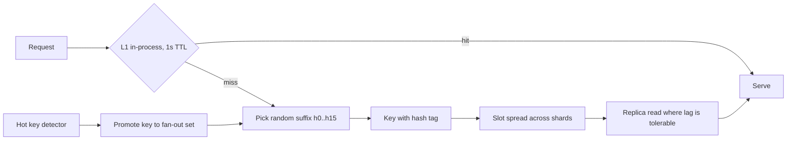

> **Scenario** — এক celebrity একটি product-এর link পোস্ট করেন। `product:88231` এখন সেকেন্ডে 140,000 GET পাচ্ছে। Redis Cluster-এ 12টি shard; এগারোটি 8% CPU-তে বসে আছে, আর ওই key-র মালিক shard একটি core saturate করে ফেলেছে — সেই shard-এর প্রতিটি অসম্পর্কিত key 200 ms-এ timeout করছে।

## Why it matters

- Redis shard-প্রতি command execution single-threaded। hot key core জুড়ে ছড়ায় না — এক core আটকে রাখে, আর shard যোগ করে কোনো লাভ হয় না।
- Blast radius হলো ওই slot-এর shard-এ সহাবস্থানকারী সবকিছু। viral key-র সাথে node ভাগ করার কারণে অসম্পর্কিত feature অবনত হয়।
- Cluster autoscaling ব্যাপারটা খারাপ করে: node যোগ করলে slot পুনর্বণ্টন হয়, কিন্তু hot slot এখনো পুরোটাই এক node-এ পড়ে।
- বড় value একে বাড়ায়। 140k QPS-এ 400 KB serialized object মানে 56 GB/s network — CPU-র আগেই NIC-এ ধাক্কা লাগে।
- এই ঘটনা অননুমেয় ও স্বল্পস্থায়ী। মানুষ প্রতিক্রিয়া দেওয়ার আগেই traffic অন্য key-তে সরে যায়।

## Symptoms

| Signal | What you observe |
|--------|------------------|
| Per-node CPU | একটি node প্রায় 100%, বাকিরা প্রায় idle |
| `redis-cli --hotkeys` | একটি key-তে কয়েক গুণ বেশি access |
| `INFO commandstats` | `calls` একটি `GET` pattern-এর দিকে ভীষণ skewed |
| Latency | hot node-এ `redis-cli --latency` p99 কয়েক দশ ms দেখায় |
| Client errors | hot key-র সাথে সম্পর্কহীন key-তে timeout |
| Network | `instantaneous_output_kbps` node-এর NIC saturate করছে |

## How it breaks

Redis Cluster `CRC16(key) mod 16384` দিয়ে key-কে 16,384টি hash slot-এর একটিতে map করে, এবং প্রতিটি slot ঠিক একটি primary-তে থাকে। তাই একটি key = একটি slot = একটি node-এর একটি thread। Sharding একটি *distribution* ব্যবস্থা, *replication* নয় — এটি একটি key-র load ভাগ করতে পারে না।

Head-of-line blocking বাকিটা শেষ করে। hot node-এ command queue জমে; বড় value-র serialization event loop দখল করে; ওই node-এ key আছে এমন প্রতিটি client পেছনে অপেক্ষা করে।



## Root causes

1. একটি logical key = একটি slot = একটি thread — একক key-র জন্য কোনো horizontal path নেই।
2. Local L1 cache নেই, তাই একই bytes-এর জন্য প্রতিটি request network-এ যায়।
3. Read replica থেকে serve হয় না, primary-ই একমাত্র উৎস।
4. Value যথেষ্ট বড়, তাই serialization ও network প্রাধান্য পায়।
5. Node saturate না হওয়া পর্যন্ত hot key শনাক্ত হয় না।
6. Client library-তে ছোট timeout ও আগ্রাসী retry, তাই saturation retry storm হয়ে যায়।

## How to solve it

### 1. Detect hot keys continuously

```bash
# Sampling-based, safe to run in production (needs maxmemory-policy allkeys-lfu)
redis-cli --hotkeys

# Per-node command distribution
redis-cli -h shard7 INFO commandstats | sort -t= -k2 -rn | head

# Short, targeted sample when you need the exact key
timeout 2 redis-cli -h shard7 MONITOR | awk '{print $4}' | sort | uniq -c | sort -rn | head
```

`MONITOR` সত্যিকারের throughput খরচ করে; কয়েক সেকেন্ডের জন্য ব্যবহার করুন, monitor হিসেবে কখনো নয়।

### 2. Split the key into N replicas of itself

সব copy লিখুন, একটি এলোমেলোভাবে পড়ুন। load N দিয়ে ভাগ হয় এবং ভালো suffix দিলে copy-গুলো ভিন্ন slot-এ পড়ে।

```ts
const FANOUT = 16

const shardedKey = (key: string, i: number) => `${key}:{h${i % FANOUT}}`

export async function readHot(key: string): Promise<string | null> {
  return redis.get(shardedKey(key, Math.floor(Math.random() * FANOUT)))
}

export async function writeHot(key: string, value: string, ttl: number) {
  const pipeline = redis.pipeline()
  for (let i = 0; i < FANOUT; i++) {
    pipeline.set(shardedKey(key, i), value, 'EX', jitteredTtl(ttl))
  }
  await pipeline.exec()
}
```

`{h0}`…`{h15}` hash tag Redis-কে কেবল brace-এর ভেতরের অংশ hash করতে বাধ্য করে, ফলে slot placement আপনার নিয়ন্ত্রণে। fan-out কেবল hot হিসেবে শনাক্ত key-তে করুন — প্রতিটি key-তে 16× write amplification কাম্য নয়।

### 3. Put a small L1 in front

সেকেন্ডে 140,000 বার পড়া key-তে 1 সেকেন্ডের in-process cache Redis traffic-কে pod-প্রতি সেকেন্ডে একটি request-এ নামায়। এটাই সবচেয়ে বেশি leverage-এর পরিবর্তন।

```ts
const l1 = new Map<string, { value: string; expires: number }>()

export async function getWithL1(key: string, ttlMs = 1_000): Promise<string | null> {
  const hit = l1.get(key)
  if (hit && hit.expires > Date.now()) return hit.value

  const value = await readHot(key)
  if (value !== null) l1.set(key, { value, expires: Date.now() + ttlMs })
  return value
}
```

Redis 6+ client-side caching (`CLIENT TRACKING`) একই জিনিস দেয়, সাথে server-driven invalidation:

```bash
CLIENT TRACKING ON BCAST PREFIX product: REDIRECT 42
```

### 4. Read from replicas

যেসব read-heavy key-তে কয়েকশ millisecond replication lag গ্রহণযোগ্য, সেখানে read replica-তে ছড়ান।

```bash
# On the connection, allow reads from replicas
READONLY
# Cluster clients: enable replica reads for GET-only workloads
```

### 5. Shrink the value

hot path-এর দরকারি field-ই রাখুন, বড় payload compress করুন, এবং একটি বিশাল object-কে hash-এ ভাগ করুন যাতে client 400 KB না টেনে `HMGET`-এ দুটি field নিতে পারে।

## Target design



## Tradeoffs

| Option | Pros | Cons | Choose when |
|--------|------|------|-------------|
| Local L1 cache | hot-key traffic-এর 99%+ সরায়; যোগ করা সহজ | L1 TTL-এর সমান staleness window যোগ হয় | প্রায় সবসময় প্রথম পদক্ষেপ |
| Key fan-out (N copies) | একটি key shard জুড়ে ছড়ায় | N× write cost ও memory; invalidation-কে সব copy ছুঁতে হয় | পরিচিত key-তে দীর্ঘস্থায়ী hotness |
| Replica reads | বিদ্যমান hardware ব্যবহার; key বদলাতে হয় না | replication lag; replica-ও saturate হতে পারে | read-heavy, lag-সহনীয় data |
| Client-side caching with tracking | server-driven invalidation, খুব সামান্য staleness | Redis 6+, client জটিলতা, invalidation traffic | অনেক pod একই ছোট key পড়ছে |
| Bigger instance | তাৎক্ষণিক, code পরিবর্তন নেই | single-threaded ceiling তবু থাকে; ব্যয়বহুল | কেবল জরুরি প্রশমন |

## Verification checklist

- [ ] `redis-cli --hotkeys` নির্ধারিত সময়ে চলে এবং তার output একটি alert-এ যায়।
- [ ] Per-node CPU আলাদাভাবে graph করা, cluster গড় নয়।
- [ ] একটি key-তে 100k QPS load-test করে দেখুন কোনো node 60% CPU ছাড়ায় না।
- [ ] `redis-cli -c CLUSTER KEYSLOT 'product:88231:{h3}'` ভিন্ন suffix-এ ভিন্ন slot দেয়।
- [ ] pod-প্রতি L1 hit ratio export হয়, এবং hot key-র Redis QPS প্রায় `pods / l1_ttl`।
- [ ] fanned-out key invalidate করলে প্রতিটি copy মুছে যায় (test-এ assert করুন)।
- [ ] Client timeout ও retry budget এমন যে saturated shard amplify না করে degrade করে।

## Anti-patterns

- hot key ঠিক করতে shard যোগ করা — slot ভাগ হয় না।
- ইতিমধ্যেই saturated node-এ `KEYS *` বা দীর্ঘ `MONITOR`।
- ডিফল্টে প্রতিটি key fan-out করা, পুরো keyspace জুড়ে memory ও write cost গুণ করা।
- 400 KB blob রেখে একটি field render করতে পুরোটা পড়া।
- timeout-এ আগ্রাসী client retry, যা saturation-কে collapse-এ পরিণত করে।
- viral key ধরার জন্য মানুষের উপর ভরসা; ticket triage হওয়ার আগেই traffic pattern শেষ।

## Related

- [Choosing a cache eviction policy that matches your workload](/systems/caching-cdn/cache-eviction-policy-choice)
- [Distributed cache consistency across regions](/systems/caching-cdn/distributed-cache-consistency)
- [Cache stampede prevention with locks and early refresh](/systems/caching-cdn/cache-stampede-prevention)
- [Cache invalidation strategies that survive deploys](/systems/caching-cdn/cache-invalidation-strategies)
