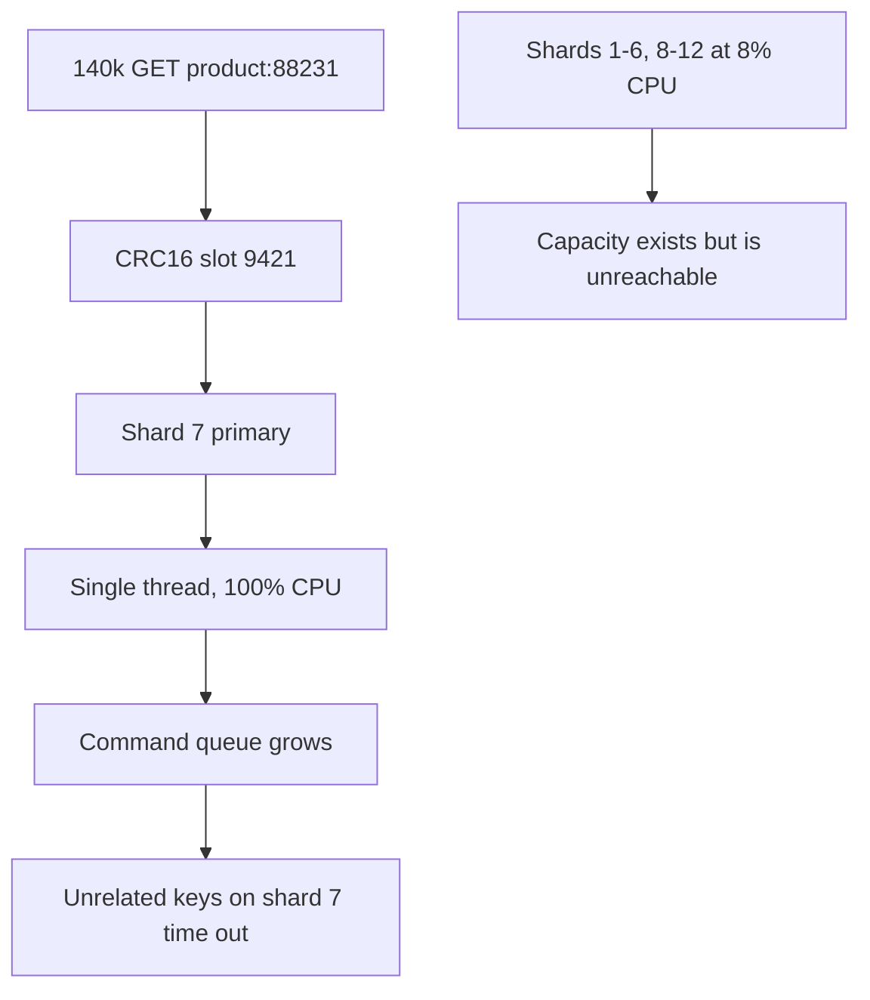
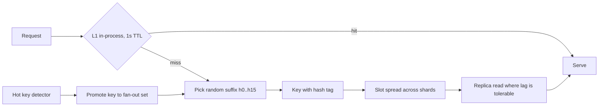

> **Scenario** — A celebrity posts a link to one product. `product:88231` now receives 140,000 GETs per second. The Redis Cluster has 12 shards; eleven of them sit at 8% CPU while the shard owning that key saturates a single core, and every unrelated key on that shard starts timing out at 200 ms.

## Why it matters

- Redis is single-threaded per shard for command execution. A hot key does not spread across cores — it pins one core, and no amount of adding shards helps.
- The blast radius is everything co-located on that slot's shard. Unrelated features degrade because they share a node with a viral key.
- Cluster autoscaling makes it worse: adding nodes redistributes slots but the hot slot still lands entirely on one node.
- Large values amplify it. A 400 KB serialized object at 140k QPS is 56 GB/s of network — you hit the NIC before you hit the CPU.
- These events are unpredictable and short. By the time a human reacts, the traffic has moved to a different key.

## Symptoms

| Signal | What you observe |
|--------|------------------|
| Per-node CPU | One node near 100%, the rest near idle |
| `redis-cli --hotkeys` | A single key with orders of magnitude more accesses |
| `INFO commandstats` | `calls` heavily skewed toward one `GET` pattern |
| Latency | `redis-cli --latency` on the hot node shows p99 in the tens of ms |
| Client errors | Timeouts on keys that have nothing to do with the hot one |
| Network | `instantaneous_output_kbps` saturating the node's NIC |

## How it breaks

Redis Cluster maps a key to one of 16,384 hash slots by `CRC16(key) mod 16384`, and each slot lives on exactly one primary. A single key is therefore a single slot on a single node executing commands on a single thread. Sharding is a *distribution* mechanism, not a *replication* one — it cannot split one key's load.

Head-of-line blocking finishes the job. Commands queue on the hot node; a large value's serialization occupies the event loop; every other client with a key on that node waits behind it.



## Root causes

1. One logical key equals one slot equals one thread — no horizontal path for a single key.
2. No local L1 cache, so every request goes over the network for the same bytes.
3. Reads not served by replicas, leaving the primary as the only source.
4. Value size large enough that serialization and network dominate.
5. No detection of hot keys until a node saturates.
6. Client library configured with a short timeout and aggressive retries, so saturation becomes a retry storm.

## How to solve it

### 1. Detect hot keys continuously

```bash
# Sampling-based, safe to run in production (needs maxmemory-policy allkeys-lfu)
redis-cli --hotkeys

# Per-node command distribution
redis-cli -h shard7 INFO commandstats | sort -t= -k2 -rn | head

# Short, targeted sample when you need the exact key
timeout 2 redis-cli -h shard7 MONITOR | awk '{print $4}' | sort | uniq -c | sort -rn | head
```

`MONITOR` costs real throughput; use it for seconds, never as a monitor.

### 2. Split the key into N replicas of itself

Write all copies, read one at random. The load divides by N and, with a good key suffix, the copies land on different slots.

```ts
const FANOUT = 16

const shardedKey = (key: string, i: number) => `${key}:{h${i % FANOUT}}`

export async function readHot(key: string): Promise<string | null> {
  return redis.get(shardedKey(key, Math.floor(Math.random() * FANOUT)))
}

export async function writeHot(key: string, value: string, ttl: number) {
  const pipeline = redis.pipeline()
  for (let i = 0; i < FANOUT; i++) {
    pipeline.set(shardedKey(key, i), value, 'EX', jitteredTtl(ttl))
  }
  await pipeline.exec()
}
```

The `{h0}`…`{h15}` hash tags force Redis to hash only the braced portion, giving you deterministic control over slot placement. Do the fan-out only for keys detected as hot — 16× write amplification on every key is not a trade you want by default.

### 3. Put a small L1 in front

For a key read 140,000 times per second, a 1-second in-process cache reduces Redis traffic to one request per pod per second. This is the highest-leverage change available.

```ts
const l1 = new Map<string, { value: string; expires: number }>()

export async function getWithL1(key: string, ttlMs = 1_000): Promise<string | null> {
  const hit = l1.get(key)
  if (hit && hit.expires > Date.now()) return hit.value

  const value = await readHot(key)
  if (value !== null) l1.set(key, { value, expires: Date.now() + ttlMs })
  return value
}
```

Redis 6+ client-side caching (`CLIENT TRACKING`) gives you the same thing with server-driven invalidation:

```bash
CLIENT TRACKING ON BCAST PREFIX product: REDIRECT 42
```

### 4. Read from replicas

For read-heavy keys where a few hundred milliseconds of replication lag is acceptable, spread reads across replicas.

```bash
# On the connection, allow reads from replicas
READONLY
# Cluster clients: enable replica reads for GET-only workloads
```

### 5. Shrink the value

Store only the fields the hot path needs, compress large payloads, and split a monolithic object into a hash so clients can `HMGET` two fields instead of transferring 400 KB.

## Target design



## Tradeoffs

| Option | Pros | Cons | Choose when |
|--------|------|------|-------------|
| Local L1 cache | Removes 99%+ of hot-key traffic; trivial to add | Adds a staleness window equal to the L1 TTL | Almost always the first move |
| Key fan-out (N copies) | Spreads a single key across shards | N× write cost and N× memory; invalidation must touch all copies | Sustained hotness on a known key |
| Replica reads | Uses existing hardware; no key changes | Replication lag; replicas can also saturate | Read-heavy, lag-tolerant data |
| Client-side caching with tracking | Server-driven invalidation, tiny staleness | Redis 6+, more client complexity, invalidation traffic | Many pods reading the same small keys |
| Bigger instance | Immediate, no code change | Single-threaded ceiling still applies; expensive | Emergency mitigation only |

## Verification checklist

- [ ] `redis-cli --hotkeys` runs on a schedule and its output feeds an alert.
- [ ] Per-node CPU is graphed individually, not averaged across the cluster.
- [ ] Load-test one key at 100k QPS and confirm no single node exceeds 60% CPU.
- [ ] `redis-cli -c CLUSTER KEYSLOT 'product:88231:{h3}'` returns different slots for different suffixes.
- [ ] L1 hit ratio is exported per pod, and the Redis QPS for the hot key is roughly `pods / l1_ttl`.
- [ ] Invalidating a fanned-out key removes every copy (assert in a test).
- [ ] Client timeouts and retry budgets are set so a saturated shard degrades instead of amplifying.

## Anti-patterns

- Adding shards to fix a hot key — the slot does not split.
- `KEYS *` or a long-running `MONITOR` on a node that is already saturated.
- Fanning out every key by default, multiplying memory and write cost across the whole keyspace.
- Storing a 400 KB blob and reading all of it to render one field.
- Aggressive client retries on timeout, which converts saturation into collapse.
- Relying on a human to notice a viral key; the traffic pattern is over before the ticket is triaged.

## Related

- [Choosing a cache eviction policy that matches your workload](/systems/caching-cdn/cache-eviction-policy-choice)
- [Distributed cache consistency across regions](/systems/caching-cdn/distributed-cache-consistency)
- [Cache stampede prevention with locks and early refresh](/systems/caching-cdn/cache-stampede-prevention)
- [Cache invalidation strategies that survive deploys](/systems/caching-cdn/cache-invalidation-strategies)
