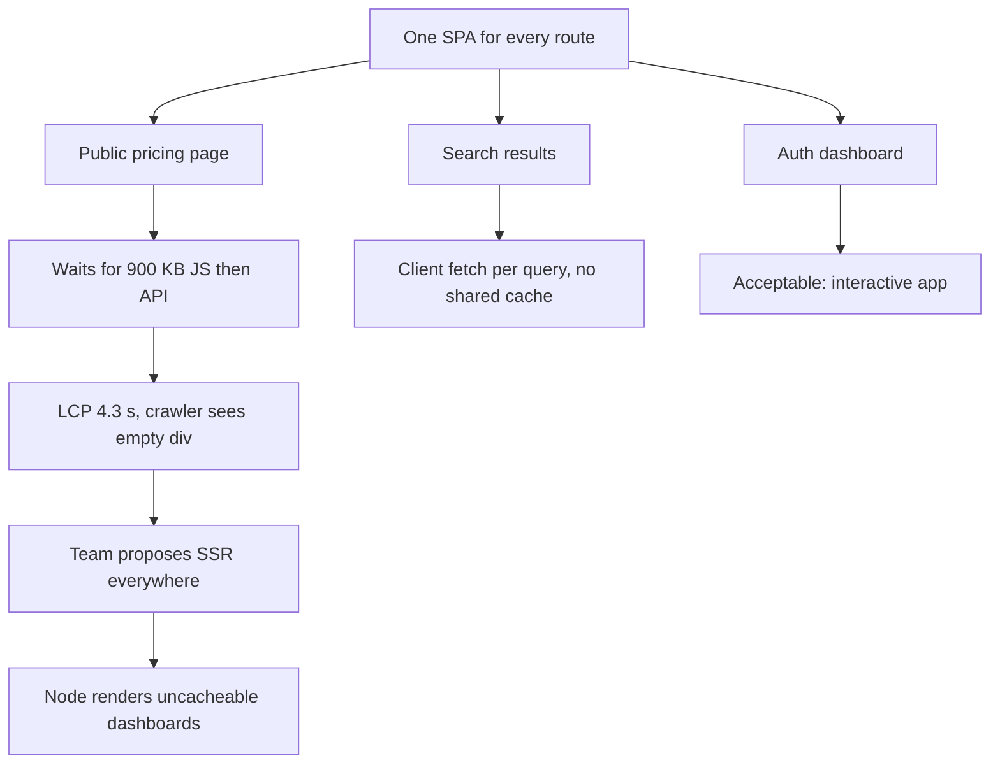
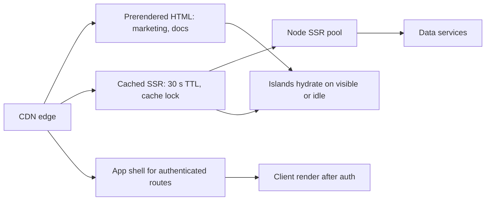

> **Scenario** - একটা marketing site আর logged-in dashboard একই Vue SPA ভাগ করে। Field data দেখায় public pricing page-এ LCP ৪.৩ সেকেন্ড, কারণ দর্শক কোনো text আঁকার আগেই ৯০০ KB dashboard code নামায়। টিমের প্রস্তাবিত সমাধান "সব জায়গায় SSR", যা কখনও না বদলানো page-এর critical path-এ Node render বসিয়ে দেবে।

## Why it matters

- Rendering strategy LCP-র মেঝে ঠিক করে। Client-rendered page JS download, parse ও data fetch না হওয়া পর্যন্ত content আঁকতে পারে না - prerendered page এই তিনটা serial ধাপ পুরোপুরি এড়ায়।
- Search ও social crawler JS-rendered content ভিন্নভাবে দেখে। Client rendering-নির্ভর public page নিয়মিতই crawler-এর প্রত্যাশিত meta ও content হারায়।
- SSR খরচ আপনার server-এ সরায়। ৮০ ms CPU-তে render হওয়া page সেকেন্ডে ৫০০ request-এ ৪০ core headroom চায়, সাথে cache strategy ও cache expire হলে stampede guard।
- Hydration-এই INP নষ্ট হয়। ৯০০ KB hydration JS পাঠানো পূর্ণ server-rendered page দেখতে দ্রুত কিন্তু সাড়া দেয় ধীরে, যা user-এর কাছে সৎ spinner-এর চেয়েও খারাপ।

## Symptoms

| Signal | What you observe |
| --- | --- |
| ধীর public LCP | API দ্রুত হলেও content page-এ field LCP ২.৫ সেকেন্ডের উপরে |
| খালি view-source | crawler ও "view source"-এ ফাঁকা `#app` div |
| Load-এ উচ্চ TTFB | traffic spike-এ SSR TTFB ৯০ ms থেকে ৭০০ ms |
| Hydration mismatch | console-এ text mismatch warning; content ঝিলিক দিয়ে বদলায় |
| Paint-এর পর ধীর INP | ১.২ সেকেন্ডে content আসে, ৩.৫ সেকেন্ড পর্যন্ত click কাজ করে না |
| Origin CPU spike | page cache purge হলেই Node render pool saturate |

## How it breaks

"Rendering strategy"-কে একক global সিদ্ধান্ত ভাবাই মূল ভুল। Pricing page, search results page ও authenticated dashboard-এর economics পুরোপুরি আলাদা: একটা সবার জন্য একই ও সাপ্তাহিক বদলায়, একটা per-query ও কয়েক সেকেন্ড cacheable, একটা per-user ও uncacheable। তিনটাতেই এক strategy চাপালে অন্তত দুইটা ভুল হবেই।



## Root causes

1. Route family অনুযায়ী নয়, পুরো app-এর জন্য এক rendering mode বেছে নেওয়া।
2. Static page-এর ভিতরে personalised fragment বসানো, ফলে পুরো page uncacheable।
3. Full-page cache ছাড়া SSR, তাই প্রতিটি request render খরচ দেয়।
4. Non-deterministic render input (`Date.now()`, `Math.random()`, client-only locale) hydration mismatch তৈরি করে।
5. আসলে কয়েকটা component interactive হলেও full-page hydration।
6. Stampede protection ছাড়া cache expiry, তাই purge render pool ভেঙে দেয়।

## How to solve it

### 1. Tool বাছার আগে route শ্রেণিবদ্ধ করুন

| Route family | Data freshness | Personalised | Strategy |
| --- | --- | --- | --- |
| Marketing, docs, pricing | সাপ্তাহিক | না | Build-এ prerender |
| Search, category listing | সেকেন্ড | না | SSR + edge cache |
| Authenticated dashboard | live | হ্যাঁ | auth-এর পিছনে client render |
| Order confirmation | একবার | হ্যাঁ | SSR, cache নেই, `private` |

### 2. যা বদলায় না তা prerender করুন

```ts
// vite.config.ts
import { defineConfig } from 'vite'
import vue from '@vitejs/plugin-vue'
import { prerender } from 'vite-plugin-prerender'

export default defineConfig({
  plugins: [
    vue(),
    prerender({ routes: ['/', '/pricing', '/docs/getting-started'] }),
  ],
})
```

Static HTML-এ render খরচ নেই, cold start নেই, hydration mismatch-এর ঝুঁকি নেই। Content page-এর জন্য প্রায় সবসময়ই এটাই সঠিক উত্তর।

### 3. SSR আক্রমণাত্মকভাবে cache করুন ও stampede আটকান

```nginx
proxy_cache_path /var/cache/ssr keys_zone=ssr:64m inactive=10m;

location / {
  proxy_cache ssr;
  proxy_cache_key "$scheme$host$request_uri$http_accept_language";
  proxy_cache_valid 200 30s;
  proxy_cache_lock on;               # one origin render per key
  proxy_cache_use_stale updating error timeout;
  add_header X-Cache $upstream_cache_status;
  proxy_pass http://ssr_upstream;
}
```

`proxy_cache_lock` ও `use_stale updating`-ই purge-কে origin outage হতে দেয় না।

### 4. Personalised অংশ cached shell-এর বাইরে রাখুন

Placeholder-সহ shell render করে client-side-এ ভরুন, বা edge-side include ব্যবহার করুন। Header-এ একটা "Hi, Asif"-এর জন্য পুরো page `Cache-Control: private` হওয়া উচিত নয়।

### 5. কেবল interactive অংশ hydrate করুন

```ts
// Vue 3.5+ lazy hydration
const Comments = defineAsyncComponent({
  loader: () => import('./Comments.vue'),
  hydrate: hydrateOnVisible(),
})
const CookieBar = defineAsyncComponent({
  loader: () => import('./CookieBar.vue'),
  hydrate: hydrateOnIdle(2000),
})
```

Static marketing copy-তে শূন্য JS লাগে। Below-the-fold component-এর hydration পিছিয়ে দিলে mid-tier device-এ সাধারণত ১০০–৩০০ ms INP বাঁচে।

### 6. Render deterministic রাখুন

সময়, locale ও feature flag server-এ resolve করে props হিসেবে পাঠান। Render-এর সময় `window` থেকে পড়া যেকোনো কিছুই ভবিষ্যতের hydration mismatch।

### 7. LCP element রক্ষা করুন

Hero image ও তার font preload করুন, স্পষ্ট `width`/`height` দিন, `fetchpriority="high"` দিন। Rendering strategy মেঝে ঠিক করে; LCP element ঠিক করে আপনি সেখানে পৌঁছাবেন কি না।

## Target design



## Tradeoffs

| Option | Pros | Cons | Choose when |
| --- | --- | --- | --- |
| Client rendering | সস্তা server, সরল deploy | খারাপ LCP, দুর্বল crawler support | login-এর পিছনের authenticated app |
| SSR | দ্রুত first paint, crawlable | server খরচ, cache ও stampede খাটুনি | public, data-driven, ঘন বদলায় |
| Static prerender | দ্রুততম ও সস্তা | content প্রকাশে rebuild লাগে | marketing, docs, changelog |
| Islands / partial hydration | কম JS, ভালো INP | build জটিলতা বাড়ে | কয়েকটা widget-সহ content page |

## Verification checklist

- [ ] `curl -s https://site/pricing | grep -c "Starter plan"` শূন্যের বেশি ফেরত দেয়।
- [ ] Site-wide average নয়, প্রতিটি route family-তে field LCP p75 ২.৫ সেকেন্ডের নিচে।
- [ ] Peak-এ cached SSR route-এ `X-Cache: HIT` অনুপাত ৯০%-এর উপরে।
- [ ] Load-এ SSR cache purge করুন; cache lock-এর কারণে origin CPU ৭০%-এর নিচে থাকে।
- [ ] কোনো prerendered route-এ console-এ hydration mismatch warning নেই।
- [ ] Initial hydration profile-এ below-the-fold component নেই।
- [ ] সবচেয়ে ভারী public page-এ INP p75 ২০০ ms-এর নিচে।

## Anti-patterns

- এমন authenticated dashboard-এ SSR নেওয়া যা কোনো cache দুইবার serve করতে পারবে না।
- SSR-এ `new Date().toLocaleString()` render করে ভিন্ন timezone-এ hydrate করা।
- Personalised header greeting-এর জন্য পুরো page-এ `Cache-Control: private` দেওয়া।
- Build-এ হাজার হাজার page prerender করে deploy ৪০ মিনিটে নিয়ে যাওয়া।
- Field RUM ছাড়া শুধু lab Lighthouse score দেখে rendering strategy বিচার করা।

## Related

- [Code splitting and lazy route boundaries](/systems/frontend-architecture/code-splitting-and-lazy-routes)
- [Frontend performance budgets that hold](/systems/frontend-architecture/frontend-performance-budgets)
- [Cache invalidation strategies that survive deploys](/systems/caching-cdn/cache-invalidation-strategies)
