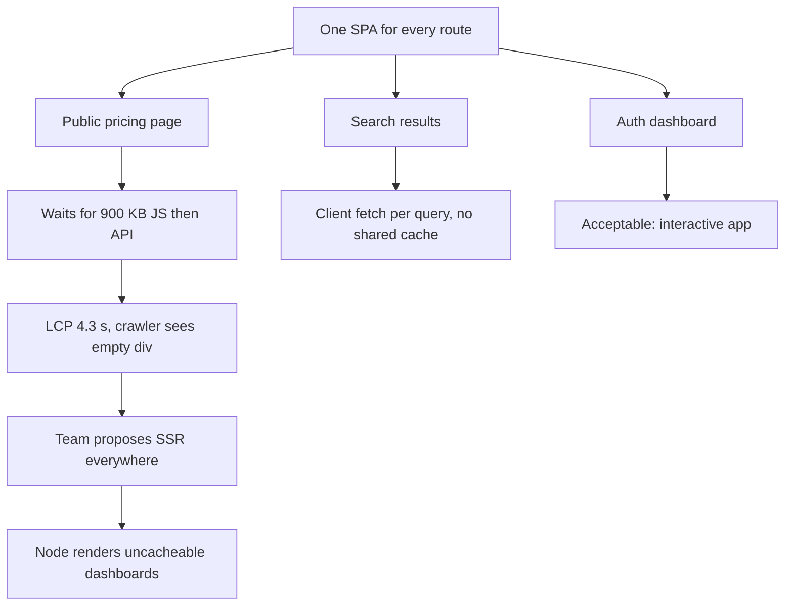
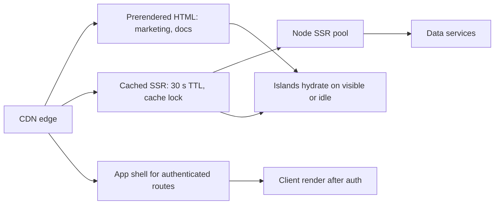

> **Scenario** - A marketing site and a logged-in dashboard share one Vue SPA. Field data shows LCP at 4.3 s on the public pricing page because visitors download 900 KB of dashboard code before any text paints. The team's proposed fix is "add SSR everywhere", which would put a Node render on the critical path for pages that never change.

## Why it matters

- Rendering strategy sets the floor on LCP. A client-rendered page cannot paint content until JS downloads, parses, and fetches data - three serial steps that a prerendered page skips entirely.
- Search and social crawlers vary in how they treat JS-rendered content. Public pages that depend on client rendering routinely lose the meta and content a crawler expected.
- SSR moves cost to your servers. A page rendering in 80 ms of CPU at 500 requests per second needs 40 cores of headroom, plus a cache strategy, plus a stampede guard when the cache expires.
- Hydration is where INP goes wrong. A fully server-rendered page that ships 900 KB of hydration JS looks fast and responds slowly, which users find worse than an honest spinner.

## Symptoms

| Signal | What you observe |
| --- | --- |
| Slow public LCP | Field LCP over 2.5 s on content pages while the API is fast |
| Empty view-source | Crawlers and "view source" show an empty `#app` div |
| High TTFB under load | SSR TTFB climbs from 90 ms to 700 ms during a traffic spike |
| Hydration mismatch | Console warns about mismatched text; content flashes and swaps |
| Slow INP after paint | Content appears at 1.2 s but clicks do nothing until 3.5 s |
| Origin CPU spike | Node render pool saturates whenever the page cache is purged |

## How it breaks

Treating "rendering strategy" as a single global choice is the core mistake. A pricing page, a search results page, and an authenticated dashboard have completely different economics: one is identical for everyone and changes weekly, one is per-query and cacheable for seconds, one is per-user and uncacheable. Applying one strategy to all three guarantees two of them are wrong.



## Root causes

1. One rendering mode chosen for the whole app rather than per route family.
2. Personalised fragments embedded in otherwise static pages, making the whole page uncacheable.
3. SSR with no full-page cache, so every request pays render cost.
4. Non-deterministic render inputs (`Date.now()`, `Math.random()`, locale from a client-only source) causing hydration mismatches.
5. Full-page hydration when only a few components are actually interactive.
6. Cache expiry with no stampede protection, so a purge collapses the render pool.

## How to solve it

### 1. Classify routes before choosing tools

| Route family | Data freshness | Personalised | Strategy |
| --- | --- | --- | --- |
| Marketing, docs, pricing | Weekly | No | Prerender at build |
| Search, category listings | Seconds | No | SSR plus edge cache |
| Authenticated dashboard | Live | Yes | Client render behind auth |
| Order confirmation | Once | Yes | SSR, no cache, `private` |

### 2. Prerender what does not change

```ts
// vite.config.ts
import { defineConfig } from 'vite'
import vue from '@vitejs/plugin-vue'
import { prerender } from 'vite-plugin-prerender'

export default defineConfig({
  plugins: [
    vue(),
    prerender({ routes: ['/', '/pricing', '/docs/getting-started'] }),
  ],
})
```

Static HTML has no render cost, no cold start, and no hydration mismatch risk. It is almost always the right answer for content pages.

### 3. Cache SSR aggressively and guard the stampede

```nginx
proxy_cache_path /var/cache/ssr keys_zone=ssr:64m inactive=10m;

location / {
  proxy_cache ssr;
  proxy_cache_key "$scheme$host$request_uri$http_accept_language";
  proxy_cache_valid 200 30s;
  proxy_cache_lock on;               # one origin render per key
  proxy_cache_use_stale updating error timeout;
  add_header X-Cache $upstream_cache_status;
  proxy_pass http://ssr_upstream;
}
```

`proxy_cache_lock` plus `use_stale updating` is what keeps a purge from turning into an origin outage.

### 4. Keep personalised parts out of the cached shell

Render the shell with a placeholder and fill it client-side, or use an edge-side include. One "Hi, Asif" in the header should not make a whole page `Cache-Control: private`.

### 5. Hydrate only what is interactive

```ts
// Vue 3.5+ lazy hydration
const Comments = defineAsyncComponent({
  loader: () => import('./Comments.vue'),
  hydrate: hydrateOnVisible(),
})
const CookieBar = defineAsyncComponent({
  loader: () => import('./CookieBar.vue'),
  hydrate: hydrateOnIdle(2000),
})
```

Static marketing copy needs zero JS. Deferring hydration of below-the-fold components is usually worth 100–300 ms of INP on mid-tier devices.

### 6. Make the render deterministic

Pass time, locale, and feature flags in as props resolved on the server. Anything read from `window` during render is a hydration mismatch waiting to happen.

### 7. Protect the LCP element

Preload the hero image and its font, set explicit `width`/`height`, and mark it `fetchpriority="high"`. Rendering strategy sets the floor; the LCP element determines whether you reach it.

## Target design



## Tradeoffs

| Option | Pros | Cons | Choose when |
| --- | --- | --- | --- |
| Client rendering | Cheapest servers, simplest deploys | Worst LCP, weak crawler support | Authenticated app behind a login |
| SSR | Fast first paint, crawlable | Server cost, cache and stampede work | Public, data-driven, changes often |
| Static prerender | Fastest and cheapest | Rebuild to publish content | Marketing, docs, changelog |
| Islands or partial hydration | Low JS, good INP | More build complexity | Content pages with a few widgets |

## Verification checklist

- [ ] `curl -s https://site/pricing | grep -c "Starter plan"` returns a non-zero count.
- [ ] Field LCP p75 under 2.5 s per route family, not just as a site-wide average.
- [ ] `X-Cache: HIT` ratio above 90% on cached SSR routes during peak.
- [ ] Purge the SSR cache under load; origin CPU stays under 70% thanks to cache lock.
- [ ] No hydration mismatch warnings in the console on any prerendered route.
- [ ] Below-the-fold components do not appear in the initial hydration profile.
- [ ] INP p75 under 200 ms on the heaviest public page.

## Anti-patterns

- Adopting SSR for an authenticated dashboard that no cache can ever serve twice.
- Rendering `new Date().toLocaleString()` during SSR and hydrating with a different timezone.
- Setting `Cache-Control: private` on a whole page because of a personalised header greeting.
- Prerendering thousands of pages at build time and pushing deploys to 40 minutes.
- Judging rendering strategy from lab Lighthouse scores without field RUM data.

## Related

- [Code splitting and lazy route boundaries](/systems/frontend-architecture/code-splitting-and-lazy-routes)
- [Frontend performance budgets that hold](/systems/frontend-architecture/frontend-performance-budgets)
- [Cache invalidation strategies that survive deploys](/systems/caching-cdn/cache-invalidation-strategies)
