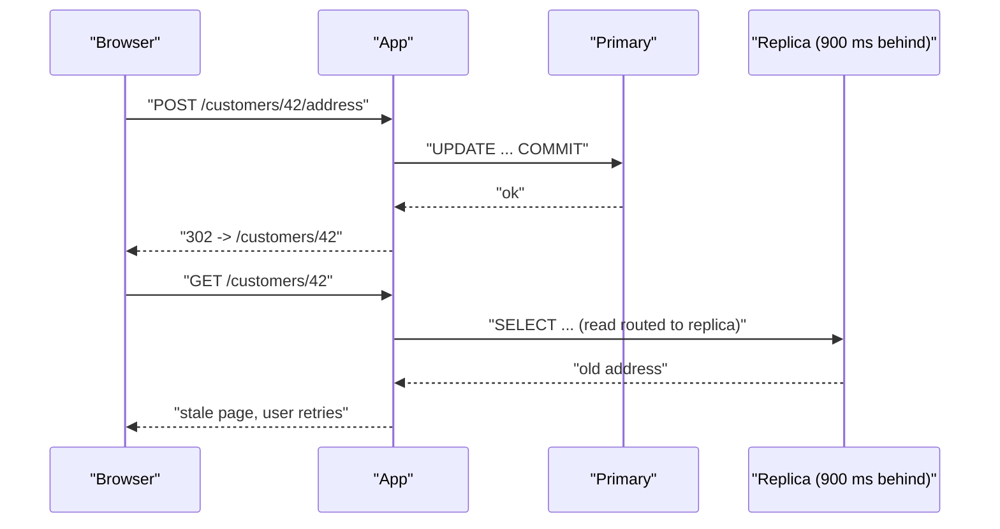
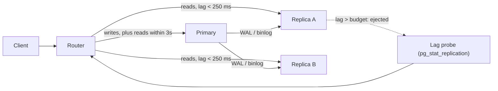

> **Scenario** - Support agent একজন customer-এর shipping address আপডেট করে, UI detail page-এ redirect করে, কিন্তু পুরনো address-ই দেখায়। Write গেছে primary-তে; read গেছে ৯০০ ms পিছিয়ে থাকা replica-তে। Support data-loss ticket খোলে, engineering reproduce করতে পারে না।

## কেন গুরুত্বপূর্ণ

- "আমার পরিবর্তন হারিয়ে গেছে" - user-visible bug-এর সবচেয়ে দামি শ্রেণি: user retry করে, duplicate record তৈরি হয়, product-এর উপর আস্থা কমে।
- Read replica সাধারণত load *কমাতে* যোগ করা হয়, আর চুপচাপ একটা নতুন consistency model আনে যেটা কেউ লিখে রাখে না।
- Lag স্থির নয়। রাত ৩টায় প্রায় শূন্য, bulk import-এর সময় কয়েক সেকেন্ড - তাই চাইলেই bug reproduce হয় না।
- Cross-service read আরও খারাপ: service A লেখে, event publish করে, service B নিজের replica পড়ে pre-write state দেখে।
- Asynchronous replication-এ lagging replica-তে failover হলে committed transaction হারায় - এটা latency নয়, correctness সমস্যা।

## লক্ষণ

| Signal | যা দেখবেন |
| --- | --- |
| Postgres `pg_stat_replication` | Batch job-এর সময় `replay_lag` ১–১০ সেকেন্ডে লাফায় |
| MySQL `SHOW REPLICA STATUS` | `Seconds_Behind_Source` বাড়ছে, `Replica_SQL_Running_State` একটা বড় transaction apply করছে |
| App log | মিলিসেকেন্ড আগে তৈরি resource-এ `404 Not Found` |
| User report | "দুবার save করেছি, এখন দুটো হয়ে গেছে" |
| Metrics | Duplicate-create rate traffic-এর সাথে নয়, replica lag-এর সাথে correlate করে |
| Failover-এর পর | পুরনো primary ও promoted replica-তে row count আলাদা |

## কীভাবে ভাঙে

Asynchronous replication মানে primary-তে `COMMIT` ফিরে আসে replica পরিবর্তন apply করার আগেই। lag window-এর ভেতরে replica-তে যাওয়া যেকোনো read pre-write state দেখে। বাস্তবে এই window মিলিসেকেন্ড নয়: একটা বড় transaction (২০ লাখ row backfill, `VACUUM FULL`, schema change) replica-তে *serially* apply হয়, তাই primary-তে ৪০ সেকেন্ড নেওয়া write replica-কে ৪০ সেকেন্ড পিছিয়ে রাখে - আপনার নিজের transaction যত ছোটই হোক।

Redirect-after-POST pattern race-টা প্রায় নিশ্চিত করে: read হয় write-এর কয়েক দশ মিলিসেকেন্ড পরেই, অর্থাৎ lag window-এর ভেতরে।



## মূল কারণ

1. Read/write splitting connection layer-এ globally প্রয়োগ, "এই session সদ্য লিখেছে" ধারণা ছাড়া।
2. Primary-তে দীর্ঘ transaction বা bulk DML যা replica-কে single-threaded replay করতে হয়।
3. Lag-aware routing নেই: load balancer ৮ সেকেন্ড পিছিয়ে থাকা replica-তেও read পাঠায়।
4. Event-এর সাথে সাথেই cross-service read, event payload-এ version বা timestamp ছাড়া।
5. Replica থেকে cache warm করা, ফলে stale value পুরো TTL-এর জন্য Redis-এ বসে যায়।
6. যেখানে committed write-এর durability ব্যবসায়িকভাবে দরকার (payment, ledger) সেখানেও asynchronous replication।

## কীভাবে সমাধান করবেন

### ১. write-এর পর session primary-তে pin করুন

সবচেয়ে সস্তা সঠিক সমাধান: যেকোনো write-এর পর অল্প সময়ের জন্য ওই user-এর read primary-তে পাঠান।

```ts
// Express/TypeScript middleware - write-এর পর ৩ সেকেন্ড sticky primary
const WRITE_TTL_MS = 3_000

export function readsAfterWrites(req: Req, res: Res, next: Next) {
  const key = `rw:${req.session.id}`
  const until = Number(req.cookies[key] ?? 0)

  req.db = Date.now() < until ? pool.primary : pool.replica

  res.on('finish', () => {
    if (req.method !== 'GET' && res.statusCode < 400) {
      res.cookie(key, String(Date.now() + WRITE_TTL_MS), { httpOnly: true })
    }
  })

  next()
}
```

Laravel-এ read/write connection-এর `sticky` option এটা নিজেই করে: request একবার লিখলে ওই request-এর পরের read গুলো write connection ব্যবহার করে।

### ২. correctness জরুরি হলে replication position token

Sticky session device ও service-এর মধ্যে ভাঙে। commit-এর সময় primary-র log position নিন এবং replica সেখানে পৌঁছেছে কিনা যাচাই করুন।

```sql
-- PostgreSQL: write position নিন, reader-কে পাঠান
SELECT pg_current_wal_lsn();            -- যেমন 0/2FA3C918

-- Replica-তে: ওই LSN ছাড়িয়েছে কি?
SELECT pg_last_wal_replay_lsn() >= '0/2FA3C918'::pg_lsn AS fresh_enough;
```

```sql
-- GTID সহ MySQL 8.0: replica write apply করা পর্যন্ত অপেক্ষা
SELECT @@gtid_executed;                  -- COMMIT-এর পর primary-তে ধরা
-- Replica-তে সর্বোচ্চ ১ সেকেন্ড অপেক্ষা:
SELECT WAIT_FOR_EXECUTED_GTID_SET('3ea1...:1-90421', 1);
```

Wait timeout ফেরত দিলে stale data না দিয়ে primary-তে fallback করুন।

### ৩. আশা নয়, মাপা lag দিয়ে routing

```sql
-- Postgres: freshness budget ছাড়ানো replica read pool থেকে বাদ
SELECT client_addr,
       EXTRACT(EPOCH FROM replay_lag) AS replay_lag_s,
       sent_lsn, replay_lsn
FROM pg_stat_replication
ORDER BY replay_lag DESC;
```

এটা gauge হিসেবে export করুন, আর router যেন ২৫০ ms-এর বেশি `replay_lag`-এর replica বাদ দেয়। শুধু TCP reachability নয়, lag-এও health-check করুন।

### ৪. প্রতিটি read path সচেতনভাবে classify করুন

| Read | Consistency দরকার | Route |
| --- | --- | --- |
| Checkout total, balance | Read-your-writes | Primary |
| Edit-এর পরপর detail page | Read-your-writes | Primary (বা LSN-gated replica) |
| Search, listing, dashboard | Bounded staleness (সেকেন্ড) | Replica |
| Analytics, export | মিনিট | আলাদা analytics replica |

এই table query annotation হিসেবে codebase-এ লিখে রাখুন, যাতে কাউকে অনুমান করতে না হয়।

### ৫. দীর্ঘ transaction দিয়ে replica অভুক্ত রাখবেন না

Bulk DML chunk করুন ([large table archival](/systems/data-storage/large-table-archival-strategy) দেখুন), আর MySQL-এ parallel replication চালু করুন যাতে স্বাধীন transaction একসাথে apply হয়:

```ini
# replica-র my.cnf
replica_parallel_workers        = 8
replica_parallel_type           = LOGICAL_CLOCK
replica_preserve_commit_order   = ON
```

Postgres design-গতভাবে WAL serially replay করে, তাই সেখানে সমাধান হলো writer-এ ছোট transaction।

### ৬. একেবারে দরকার হলেই synchronous replication

```sql
-- PostgreSQL: ledger schema-র connection-এর জন্য quorum-durable commit
ALTER SYSTEM SET synchronous_standby_names = 'ANY 1 (replica_a, replica_b)';
ALTER SYSTEM SET synchronous_commit = 'remote_apply';
SELECT pg_reload_conf();
```

`remote_apply` নিশ্চিত করে পরের replica read write দেখবে, বিনিময়ে প্রতিটি commit-এ একটা network round trip। globally নয়, per-connection scope করুন (কম গুরুত্বের write-এ `SET synchronous_commit = 'local'`)।

## Target design



## Tradeoff

| Option | সুবিধা | খরচ | কখন বাছবেন |
| --- | --- | --- | --- |
| সব read primary-তে | সহজেই সঠিক | Read scaling নেই, primary bottleneck | ছোট system, ledger |
| Write-এর পর sticky primary | সহজ, ৯৫% report ঠিক করে | Device/service-এর মধ্যে ভাঙে, TTL অনুমান | সাধারণ web app |
| LSN / GTID token | সঠিক ও scalable | API layer-এ plumbing, fallback দরকার | Multi-service read, mobile client |
| Lag-aware routing | সস্তা, সব read রক্ষা করে | Budget-এর ভেতরেও stale | যেকোনো replica fleet |
| Synchronous `remote_apply` | সর্বত্র read-your-writes | Commit latency + availability coupling | Money movement, compliance |

## যাচাই checklist

- [ ] Test public API দিয়ে লিখে সাথে সাথে পড়ে নতুন value assert করে, কৃত্রিম ২ সেকেন্ড replica delay inject করে।
- [ ] `replay_lag` / `Seconds_Behind_Source` dashboard panel, routing budget-এর সাথে বাঁধা alert threshold সহ।
- [ ] Replica health check lag-এ fail করে, আর lagging replica pool থেকে বাদ পড়তে দেখেছেন।
- [ ] প্রতিটি read path-এ consistency class লেখা; grep-এ unclassified replica read পাওয়া যায় না।
- [ ] Bulk job chunked; সবচেয়ে বড়টির সময় replica lag মেপেছেন।
- [ ] Lagging replica-তে failover drill করা: কত transaction হারিয়েছে জানেন ও শনাক্ত করতে পারেন।
- [ ] Cache write কোন node থেকে পড়া হয়েছে record করে; write-এর পর stale replica read থেকে কোনো cache ভরে না।

## Anti-pattern

- Write ও redirect-এর মাঝে `sleep(500)`।
- "performance-এর জন্য" সব read replica-তে পাঠিয়ে support ticket থেকে consistency model শেখা।
- `Seconds_Behind_Source`-কে নিখুঁত ঘড়ি ধরা - replica idle থাকলেও ০, relay-log fetch-এ আটকে থাকলেও ০।
- Write সফল হয়েছে "confirm" করতে replica থেকে সেটাই পড়া।
- এক page ঠিক করতে সব commit synchronous করে দেওয়া, ফলে system-জুড়ে write latency দ্বিগুণ।
- শুধু ID দিয়ে event publish করা, ফলে consumer নিজের সম্ভাব্য stale replica থেকে fetch করতে বাধ্য।
- Incident-এর সময় lag রেকর্ড না করেই lagging replica promote করা।

## সম্পর্কিত

- [Production-এ transaction isolation anomaly](/systems/data-storage/transaction-isolation-anomalies)
- [Connection pool শেষ হয়ে যাওয়া](/systems/data-storage/connection-pool-exhaustion)
- [যে shard key নিয়ে বাঁচা যায়](/systems/data-storage/sharding-key-selection)
- [Zero-downtime schema migration](/systems/data-storage/zero-downtime-schema-migrations)
