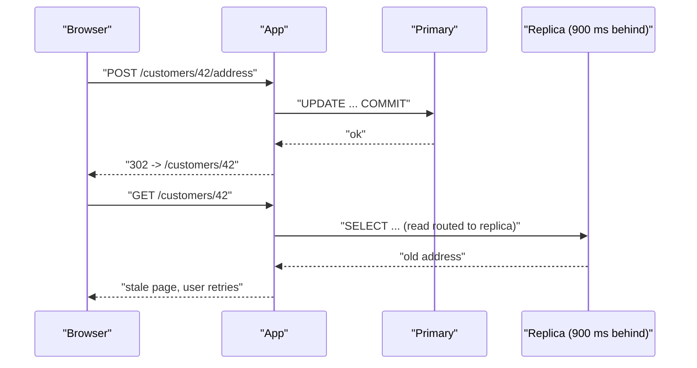
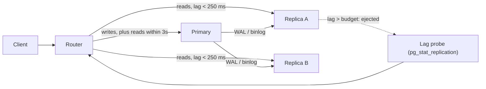

> **Scenario** - A support agent updates a customer's shipping address, the UI redirects to the detail page, and the old address is still there. The write went to the primary; the read went to a replica 900 ms behind. Support files a data-loss ticket that engineering cannot reproduce.

## Why it matters

- "My change disappeared" is the single most expensive class of user-visible bug: users retry, duplicate records appear, and trust in the product erodes.
- Read replicas are usually added to *reduce* load, and they silently introduce a new consistency model that no one wrote down.
- Lag is not constant. It is near zero at 03:00 and seconds long during a bulk import, so the bug is unreproducible on demand.
- Cross-service reads make it worse: service A writes, publishes an event, service B reads its own replica and sees pre-write state.
- Failover on a lagging replica loses committed transactions if replication is asynchronous - a correctness problem, not a latency one.

## Symptoms

| Signal | What you observe |
| --- | --- |
| Postgres `pg_stat_replication` | `replay_lag` spikes to 1–10 s during batch jobs |
| MySQL `SHOW REPLICA STATUS` | `Seconds_Behind_Source` climbing, `Replica_SQL_Running_State` applying one big transaction |
| App logs | `404 Not Found` on a resource created milliseconds earlier |
| User reports | "I saved it twice and now there are two" |
| Metrics | Duplicate-create rate correlates with replica lag, not traffic |
| After failover | Row counts differ between old primary and promoted replica |

## How it breaks

Asynchronous replication means `COMMIT` on the primary returns before the replica has applied the change. Any read routed to a replica within the lag window observes the pre-write state. In practice the lag window is not milliseconds: a single large transaction (a 2 M-row backfill, a `VACUUM FULL`, a schema change) applies on the replica *serially*, so a write that took 40 s on the primary can hold the replica behind for 40 s regardless of how small your own transaction was.

The redirect-after-POST pattern makes the race almost certain: the read happens tens of milliseconds after the write, well inside the lag window.



## Root causes

1. Read/write splitting applied globally at the connection layer with no notion of "this session just wrote".
2. Long transactions or bulk DML on the primary that the replica must replay single-threaded.
3. No lag-aware routing: the load balancer keeps sending reads to a replica that is 8 s behind.
4. Cross-service reads immediately after an event, with no version or timestamp in the event payload.
5. Cache warmed from a replica, so a stale value is persisted into Redis for the full TTL.
6. Asynchronous replication used where the business requires durability of committed writes (payments, ledgers).

## How to solve it

### 1. Pin the session to the primary after a write

The cheapest correct fix: for a short window after any write, route that user's reads to the primary.

```ts
// Express/TypeScript middleware - sticky primary for 3 s after a write
const WRITE_TTL_MS = 3_000

export function readsAfterWrites(req: Req, res: Res, next: Next) {
  const key = `rw:${req.session.id}`
  const until = Number(req.cookies[key] ?? 0)

  req.db = Date.now() < until ? pool.primary : pool.replica

  res.on('finish', () => {
    if (req.method !== 'GET' && res.statusCode < 400) {
      res.cookie(key, String(Date.now() + WRITE_TTL_MS), { httpOnly: true })
    }
  })

  next()
}
```

Laravel does this natively with the `sticky` option on a read/write connection: once the request writes, subsequent reads in the same request use the write connection.

### 2. Use a replication position token when correctness matters

Sticky sessions break across devices and services. Capture the primary's log position at commit and require the replica to have reached it.

```sql
-- PostgreSQL: get the write position, pass it to the reader
SELECT pg_current_wal_lsn();            -- e.g. 0/2FA3C918

-- On the replica: has it caught up past that LSN?
SELECT pg_last_wal_replay_lsn() >= '0/2FA3C918'::pg_lsn AS fresh_enough;
```

```sql
-- MySQL 8.0 with GTIDs: block until the replica has applied the write
SELECT @@gtid_executed;                  -- captured on the primary after COMMIT
-- On the replica, wait up to 1 second:
SELECT WAIT_FOR_EXECUTED_GTID_SET('3ea1...:1-90421', 1);
```

If the wait returns a timeout, fall back to the primary rather than serving stale data.

### 3. Route by measured lag, not by hope

```sql
-- Postgres: exclude replicas over the freshness budget from the read pool
SELECT client_addr,
       EXTRACT(EPOCH FROM replay_lag) AS replay_lag_s,
       sent_lsn, replay_lsn
FROM pg_stat_replication
ORDER BY replay_lag DESC;
```

Export that as a gauge, and have the connection router drop any replica whose `replay_lag` exceeds, say, 250 ms. Health-check on lag, not just on TCP reachability.

### 4. Classify every read path deliberately

| Read | Consistency need | Route |
| --- | --- | --- |
| Checkout total, balance | Read-your-writes | Primary |
| Detail page right after edit | Read-your-writes | Primary (or LSN-gated replica) |
| Search, listing, dashboards | Bounded staleness (seconds) | Replica |
| Analytics, exports | Minutes | Dedicated analytics replica |

Write this table into the codebase as a query annotation so nobody has to guess.

### 5. Stop long transactions from starving the replica

Chunk bulk DML (see [large table archival](/systems/data-storage/large-table-archival-strategy)), and on MySQL enable parallel replication so independent transactions apply concurrently:

```ini
# my.cnf on replicas
replica_parallel_workers        = 8
replica_parallel_type           = LOGICAL_CLOCK
replica_preserve_commit_order   = ON
```

Postgres replays WAL serially by design, so the fix there is smaller transactions on the writer.

### 6. Use synchronous replication only where you must

```sql
-- PostgreSQL: quorum-durable commits for the ledger schema's connections
ALTER SYSTEM SET synchronous_standby_names = 'ANY 1 (replica_a, replica_b)';
ALTER SYSTEM SET synchronous_commit = 'remote_apply';
SELECT pg_reload_conf();
```

`remote_apply` guarantees a subsequent replica read sees the write, at the cost of adding a network round trip to every commit. Scope it per-connection (`SET synchronous_commit = 'local'` for low-value writes) instead of globally.

## Target design



## Tradeoffs

| Option | Pros | Cons | Choose when |
| --- | --- | --- | --- |
| All reads on primary | Trivially correct | No read scaling, primary becomes bottleneck | Small systems, ledgers |
| Sticky-primary after write | Simple, fixes 95% of reports | Breaks across devices/services, guessed TTL | General web apps |
| LSN / GTID tokens | Correct and scalable | Plumbing through API layers, needs fallback | Multi-service reads, mobile clients |
| Lag-aware routing | Cheap, protects all reads | Still stale within the budget | Any replica fleet |
| Synchronous `remote_apply` | Read-your-writes everywhere | Commit latency + availability coupling | Money movement, compliance |

## Verification checklist

- [ ] A test writes then immediately reads through the public API and asserts the new value, with an artificial 2 s replica delay injected.
- [ ] `replay_lag` / `Seconds_Behind_Source` is a dashboard panel with an alert threshold tied to your routing budget.
- [ ] Replica health checks fail on lag, and you have watched a lagging replica get ejected from the pool.
- [ ] Every read path is annotated with its consistency class; grep finds no unclassified replica reads.
- [ ] Bulk jobs are chunked; you have measured replica lag during the largest one.
- [ ] Failover drill run on a lagging replica: you know how many transactions were lost and can detect it.
- [ ] Cache writes record which node they were read from; no cache is populated from a stale replica read after a write.

## Anti-patterns

- `sleep(500)` between the write and the redirect.
- Sending all reads to replicas "for performance" and discovering the consistency model in a support ticket.
- Using `Seconds_Behind_Source` as an exact clock - it is 0 when the replica is idle *and* when it is stuck waiting on a relay-log fetch.
- Reading the write's own result from a replica to "confirm" it succeeded.
- Making every commit synchronous to fix one page, doubling write latency system-wide.
- Publishing an event with only an ID, forcing the consumer to fetch from its own possibly-stale replica.
- Promoting a lagging replica during an incident without recording the lag first.

## Related

- [Transaction isolation anomalies in production](/systems/data-storage/transaction-isolation-anomalies)
- [Connection pool exhaustion](/systems/data-storage/connection-pool-exhaustion)
- [Choosing a shard key you can live with](/systems/data-storage/sharding-key-selection)
- [Zero-downtime schema migrations](/systems/data-storage/zero-downtime-schema-migrations)
