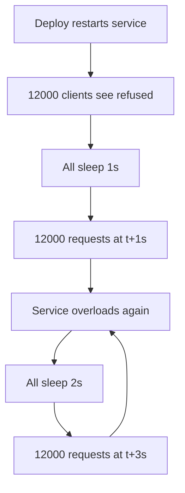
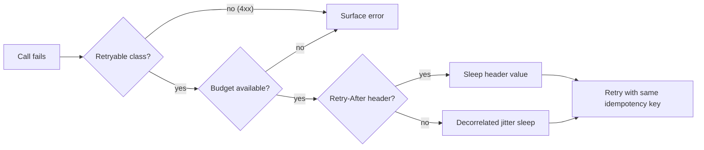

> **Scenario** - রুটিন deploy-এর জন্য search service restart হলো। ১২,০০০ client connection refused পেল, সবাই ঠিক ১s, তারপর ২s, তারপর ৪s-এ retry করল। Service উঠতেই ১২,০০০ synchronised request এসে আবার ফেলে দিল, আর এই চক্র এগারো মিনিট চলল। Deploy লেগেছিল ২০ সেকেন্ড।

## Why it matters

- Retry হলো একমাত্র failure amplifier যা আপনি নিজে ইচ্ছে করে বসান। তিনটি retry ১০% error rate-কে traffic-এর ৪০% retry-তে পরিণত করে।
- Jitter ছাড়া exponential backoff client-দের lockstep-এ রাখে, ফলে recover করা service ramp নয়, দেয়াল পায়।
- Non-idempotent write retry করলে টাকা, email ও inventory reservation duplicate হয়।
- Retry storm নিজেকেই টিকিয়ে রাখে: বাড়তি load-ই সেই error তৈরি করে যা retry ঘটায়।
- বেশিরভাগ retry code এমন shared HTTP client-এ থাকে যার মালিক কেউ নয় এবং যেটি কেউ load-test করেনি।

## Symptoms

| Signal | What you observe |
| --- | --- |
| Sawtooth traffic | incident শুরুর ১s, ২s, ৪s, ৮s পরে request rate spike |
| Amplification | degradation-এ upstream RPS downstream RPS-এর ৩–৪ গুণ |
| Slow recovery | আলাদাভাবে service সুস্থ, traffic ফেরানোমাত্র পড়ে যায় |
| Duplicate side effect | একই order ID-তে দুটি confirmation email |
| Retried 4xx | outage-এ `400`/`422` count বাড়ে - এগুলো কখনো retry হওয়া উচিত নয় |

## How it breaks

সরল loop হলো `sleep(2 ** attempt)`। ১২,০০০ client একই মুহূর্তে fail করলে সবাই একই মুহূর্তে জাগে। Backoff *সময়ে* load ছড়ায়, কিন্তু *client জুড়ে* নয় - তাই এক spike-এর বদলে আপনি চারটি তীক্ষ্ণ spike পান।

দ্বিতীয় failure হলো error classification। যে loop সব exception ধরে সে `422 Unprocessable Entity` অনন্তকাল retry করবে - payload অবৈধ, ৪৭তম attempt-এও অবৈধ থাকবে। অন্যদিকে `Retry-After: 30` সহ আসল `503 Service Unavailable` ১s পরেই retry হয়, কারণ header কেউ পড়েনি।



## Root causes

1. Jitter ছাড়া backoff স্বাধীন client-দের sync করে ফেলে।
2. স্থায়ী 4xx সহ সব error-কে retryable ধরা হয়।
3. `429`/`503`-এর `Retry-After` উপেক্ষা করা হয়।
4. Client, SDK, gateway ও mesh - একাধিক layer-এ retry হয় এবং গুণ হয়।
5. Retry budget নেই, তাই retry অসীম capacity খেতে পারে।
6. Idempotency key ছাড়াই non-idempotent write retry হয়।
7. Retry attempt caller-এর timeout budget-এ গোনা হয় না।

## How to solve it

### 1. Loop লেখার আগে error শ্রেণিবিভাগ করুন

| Class | Examples | Retry? |
| --- | --- | --- |
| Transient network | connection reset, DNS timeout | হ্যাঁ |
| Server transient | `500`, `502`, `503`, `504` | হ্যাঁ |
| Throttling | `429` | হ্যাঁ, `Retry-After` মেনে |
| Conflict | `409` | কেবল একই idempotency key-তে |
| Client error | `400`, `401`, `403`, `404`, `422` | না |

### 2. সাধারণ exponential নয়, decorrelated jitter

Full jitter `[0, backoff]`-এ uniform random বাছে। AWS-এর architecture guidance থেকে আসা decorrelated jitter sleep-কে উপরে হাঁটায় অথচ ছড়ানো রাখে:

```ts
const BASE_MS = 100
const CAP_MS = 20_000

export function decorrelatedJitter(previousSleepMs: number): number {
  const next = Math.random() * (previousSleepMs * 3 - BASE_MS) + BASE_MS
  return Math.min(CAP_MS, Math.max(BASE_MS, next))
}
```

### 3. ভদ্র TypeScript client

```ts
type RetryOptions = {
  maxAttempts?: number
  budgetMs?: number
  idempotencyKey?: string
}

const RETRYABLE_STATUS = new Set([408, 429, 500, 502, 503, 504])

export async function requestWithRetry(
  url: string,
  init: RequestInit,
  opts: RetryOptions = {},
): Promise<Response> {
  const maxAttempts = opts.maxAttempts ?? 4
  const deadline = Date.now() + (opts.budgetMs ?? 5_000)
  let sleepMs = 100
  let lastError: unknown

  for (let attempt = 1; attempt <= maxAttempts; attempt++) {
    const remaining = deadline - Date.now()
    if (remaining <= 0) break

    const controller = new AbortController()
    const timer = setTimeout(() => controller.abort(), remaining)

    try {
      const res = await fetch(url, {
        ...init,
        signal: controller.signal,
        headers: {
          ...init.headers,
          ...(opts.idempotencyKey ? { 'Idempotency-Key': opts.idempotencyKey } : {}),
          'X-Retry-Attempt': String(attempt),
        },
      })

      if (!RETRYABLE_STATUS.has(res.status)) return res
      if (attempt === maxAttempts) return res

      const retryAfter = Number(res.headers.get('Retry-After'))
      sleepMs = Number.isFinite(retryAfter) && retryAfter > 0
        ? retryAfter * 1000
        : decorrelatedJitter(sleepMs)
    } catch (err) {
      lastError = err
      if (attempt === maxAttempts) throw err
      sleepMs = decorrelatedJitter(sleepMs)
    } finally {
      clearTimeout(timer)
    }

    await new Promise((r) => setTimeout(r, Math.min(sleepMs, deadline - Date.now())))
  }

  throw lastError ?? new Error('retry budget exhausted')
}
```

### 4. শুধু count নয়, budget দিয়ে cap করুন

Retry budget সফল request-এর *অনুপাত* হিসেবে retry সীমিত করে - সাধারণত ১০%। অনুপাত ছাড়িয়ে গেলে retry drop হয় যতক্ষণ না অনুপাত ফেরে। এটাই storm থামায়, কারণ count-based cap তখনো প্রতিটি client-কে তিনটি বাড়তি request দেয়।

```php
<?php

namespace App\Support;

use Illuminate\Support\Facades\Redis;

class RetryBudget
{
    public function __construct(
        private string $upstream,
        private float $ratio = 0.1,
    ) {}

    public function tryAcquire(): bool
    {
        $window = (int) floor(time() / 10);
        $successes = (int) Redis::get("rb:{$this->upstream}:ok:{$window}");
        $retries = (int) Redis::get("rb:{$this->upstream}:retry:{$window}");

        if ($retries >= max(10, $successes * $this->ratio)) {
            return false;
        }

        Redis::incr("rb:{$this->upstream}:retry:{$window}");
        Redis::expire("rb:{$this->upstream}:retry:{$window}", 30);

        return true;
    }
}
```

### 5. একটিমাত্র layer-এ retry করুন

Caller-এর সবচেয়ে কাছের যে layer-এ যথেষ্ট context আছে সেটি বাছুন - সাধারণত service client। nginx (non-idempotent route-এ `proxy_next_upstream off`), mesh ও vendor SDK-তে retry বন্ধ করুন, নয়তো দ্বিতীয় layer কেন আছে তা স্পষ্ট লিখে রাখুন।

## Target design



## Tradeoffs

| Option | Pros | Cons | Choose when |
| --- | --- | --- | --- |
| Exponential, jitter নেই | সরল, অনুমেয় | client sync করে, spike তৈরি করে | একক client batch job |
| Full jitter | চমৎকার spread, বোঝা সহজ | খুব আগেই retry হতে পারে | অনেক স্বাধীন client |
| Decorrelated jitter | ভালো spread, mean বাড়ে | ব্যাখ্যা করা একটু কঠিন | বড় fleet, recover করা upstream |
| Retry budget | amplification-এ কড়া সীমা | shared state (Redis) লাগে | shared upstream, বহু caller |
| Retry নেই | শূন্য amplification | প্রতিটি blip user দেখে | সস্তা refresh-যোগ্য read |

## Verification checklist

- [ ] ৫,০০০ rps load-এ upstream restart করে recovery curve ramp কিনা (দেয়াল নয়) দেখুন।
- [ ] Integration test-এ `422` ঠিক একবার চেষ্টা হয় - assert করুন।
- [ ] Stub থেকে `Retry-After: 30` সহ `429` ফেরত দিয়ে client ৩০s অপেক্ষা করে কিনা যাচাই করুন।
- [ ] Chaos test-এ প্রতিটি layer-এর retry গুনুন; মোট এক layer-এর সমান হতে হবে।
- [ ] সব attempt caller-এর timeout budget-এর ভেতরে থাকে কিনা নিশ্চিত করুন।
- [ ] Error rate ১০% ছাড়ালে retry budget retry drop করছে কিনা দেখুন।

## Anti-patterns

- Background worker-এ `while (true) { try ... catch { sleep(1) } }` - ceiling ছাড়া অনন্ত storm।
- "মাঝে মাঝে দ্বিতীয়বার কাজ করে" ভেবে `400` retry করা (করে না; অন্য কিছু বদলেছিল)।
- "resilient" হতে `maxAttempts` ১০ করা, যা মূলত ১০x amplification নিশ্চিত করে।
- শুধু প্রথম sleep-এ jitter যোগ করা।
- Idempotency key ছাড়া `POST` retry করে সেটাকে resilience বলা।
- nginx, SDK ও app প্রত্যেকে তিনবার retry করলে কার্যত ২৭ attempt।

## Related

- [Idempotency keys for payment APIs](/systems/api-integration/idempotency-keys-for-payments)
- [Timeout budget propagation across hops](/systems/api-integration/timeout-budget-propagation)
- [Circuit breaker cascades across services](/systems/api-integration/circuit-breaker-cascades)
