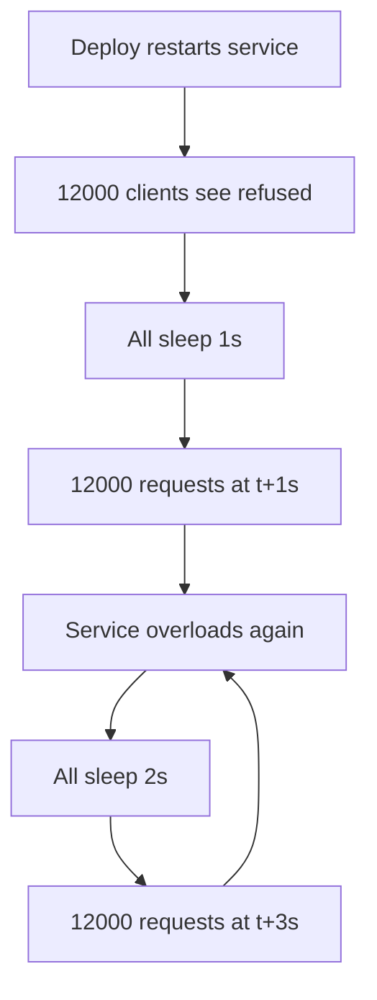
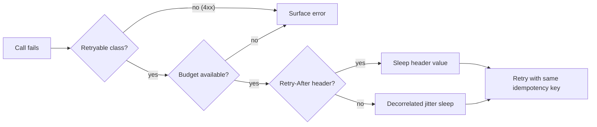

> **Scenario** - A search service restarts for a routine deploy. 12,000 clients get connection refused, all retry at exactly 1s, then 2s, then 4s. The service comes back up, is immediately hit by 12,000 synchronised requests, falls over again, and the cycle repeats for eleven minutes. The deploy took 20 seconds.

## Why it matters

- Retries are the only failure amplifier you deliberately install. Three retries turn a 10% error rate into 40% of your traffic being retries.
- Exponential backoff without jitter keeps clients in lockstep, so the recovering service is hit by a wall instead of a ramp.
- Retrying a non-idempotent write duplicates money, emails, and inventory reservations.
- Retry storms are self-sustaining: the extra load causes the errors that cause the retries.
- Most retry code lives in a shared HTTP client that nobody owns and nobody has load-tested.

## Symptoms

| Signal | What you observe |
| --- | --- |
| Sawtooth traffic | Request rate spikes at 1s, 2s, 4s, 8s after an incident starts |
| Amplification | Upstream RPS is 3–4x downstream RPS during degradation |
| Slow recovery | Service is healthy in isolation but falls over the moment traffic is restored |
| Duplicate side effects | Two order confirmation emails, same order ID |
| Retried 4xx | `400` and `422` counts climb during an outage - those should never be retried |

## How it breaks

The naive loop is `sleep(2 ** attempt)`. If 12,000 clients fail at the same instant, they all wake at the same instant. The backoff spreads load in *time* but not across *clients*, so instead of one spike you get four sharper spikes.

The second failure is error classification. A retry loop that catches every exception will retry a `422 Unprocessable Entity` forever - the payload is invalid, and it will be invalid on attempt 47 too. Meanwhile a genuine `503 Service Unavailable` with a `Retry-After: 30` header is retried after 1s because nobody read the header.



## Root causes

1. Backoff without jitter synchronises independent clients.
2. All errors are treated as retryable, including permanent 4xx.
3. `Retry-After` on `429` and `503` is ignored.
4. Retries happen at multiple layers - client, SDK, gateway, and mesh - and multiply.
5. There is no retry budget, so retries can consume unlimited capacity.
6. Non-idempotent writes are retried without an idempotency key.
7. Retry attempts are not counted in the caller's timeout budget.

## How to solve it

### 1. Classify errors before writing any loop

| Class | Examples | Retry? |
| --- | --- | --- |
| Transient network | connection reset, DNS timeout | Yes |
| Server transient | `500`, `502`, `503`, `504` | Yes |
| Throttling | `429` | Yes, honour `Retry-After` |
| Conflict | `409` | Only with the same idempotency key |
| Client error | `400`, `401`, `403`, `404`, `422` | No |

### 2. Use decorrelated jitter, not plain exponential

Full jitter picks a uniform random value in `[0, backoff]`. Decorrelated jitter, from AWS's architecture guidance, walks the sleep upward while staying spread out:

```ts
const BASE_MS = 100
const CAP_MS = 20_000

export function decorrelatedJitter(previousSleepMs: number): number {
  const next = Math.random() * (previousSleepMs * 3 - BASE_MS) + BASE_MS
  return Math.min(CAP_MS, Math.max(BASE_MS, next))
}
```

### 3. A TypeScript client that behaves

```ts
type RetryOptions = {
  maxAttempts?: number
  budgetMs?: number
  idempotencyKey?: string
}

const RETRYABLE_STATUS = new Set([408, 429, 500, 502, 503, 504])

export async function requestWithRetry(
  url: string,
  init: RequestInit,
  opts: RetryOptions = {},
): Promise<Response> {
  const maxAttempts = opts.maxAttempts ?? 4
  const deadline = Date.now() + (opts.budgetMs ?? 5_000)
  let sleepMs = 100
  let lastError: unknown

  for (let attempt = 1; attempt <= maxAttempts; attempt++) {
    const remaining = deadline - Date.now()
    if (remaining <= 0) break

    const controller = new AbortController()
    const timer = setTimeout(() => controller.abort(), remaining)

    try {
      const res = await fetch(url, {
        ...init,
        signal: controller.signal,
        headers: {
          ...init.headers,
          ...(opts.idempotencyKey ? { 'Idempotency-Key': opts.idempotencyKey } : {}),
          'X-Retry-Attempt': String(attempt),
        },
      })

      if (!RETRYABLE_STATUS.has(res.status)) return res
      if (attempt === maxAttempts) return res

      const retryAfter = Number(res.headers.get('Retry-After'))
      sleepMs = Number.isFinite(retryAfter) && retryAfter > 0
        ? retryAfter * 1000
        : decorrelatedJitter(sleepMs)
    } catch (err) {
      lastError = err
      if (attempt === maxAttempts) throw err
      sleepMs = decorrelatedJitter(sleepMs)
    } finally {
      clearTimeout(timer)
    }

    await new Promise((r) => setTimeout(r, Math.min(sleepMs, deadline - Date.now())))
  }

  throw lastError ?? new Error('retry budget exhausted')
}
```

### 4. Cap retries with a budget, not just a count

A retry budget limits retries as a *fraction* of successful requests - typically 10%. Once the ratio is exceeded, retries are dropped until the ratio recovers. This is what stops the storm, because a count-based cap still allows every client three extra requests.

```php
<?php

namespace App\Support;

use Illuminate\Support\Facades\Redis;

class RetryBudget
{
    public function __construct(
        private string $upstream,
        private float $ratio = 0.1,
    ) {}

    public function tryAcquire(): bool
    {
        $window = (int) floor(time() / 10);
        $successes = (int) Redis::get("rb:{$this->upstream}:ok:{$window}");
        $retries = (int) Redis::get("rb:{$this->upstream}:retry:{$window}");

        if ($retries >= max(10, $successes * $this->ratio)) {
            return false;
        }

        Redis::incr("rb:{$this->upstream}:retry:{$window}");
        Redis::expire("rb:{$this->upstream}:retry:{$window}", 30);

        return true;
    }
}
```

### 5. Retry at one layer only

Pick the layer closest to the caller that has enough context - usually the service client. Turn off retries in nginx (`proxy_next_upstream off` for non-idempotent routes), the mesh, and the vendor SDK, or document explicitly why a second layer exists.

## Target design



## Tradeoffs

| Option | Pros | Cons | Choose when |
| --- | --- | --- | --- |
| Exponential, no jitter | Simple, predictable | Synchronises clients, causes spikes | Single-client batch jobs |
| Full jitter | Excellent spread, easy to reason about | Can retry very early | Many independent clients |
| Decorrelated jitter | Good spread, grows the mean | Slightly harder to explain | Large fleets, recovering upstream |
| Retry budget | Hard cap on amplification | Needs shared state (Redis) | Shared upstream, many callers |
| No retries | Zero amplification | Every blip is user visible | Cheap-to-refresh reads |

## Verification checklist

- [ ] Restart the upstream under 5,000 rps of load and confirm the recovery curve is a ramp, not a wall.
- [ ] Assert `422` responses are attempted exactly once in an integration test.
- [ ] Return `429` with `Retry-After: 30` from a stub and verify the client waits 30s, not 1s.
- [ ] Count retries at each layer during a chaos test; the total must be one layer's worth.
- [ ] Confirm total attempts fit inside the caller's timeout budget.
- [ ] Verify the retry budget sheds retries when the error rate exceeds 10%.

## Anti-patterns

- `while (true) { try ... catch { sleep(1) } }` in a background worker - an infinite storm with no ceiling.
- Retrying on `400` because "sometimes it works the second time" (it does not; something else changed).
- Setting `maxAttempts` to 10 to "be resilient", which mostly guarantees a 10x amplification.
- Adding jitter to only the first sleep.
- Retrying a `POST` without an idempotency key and calling it resilience.
- Letting each of nginx, the SDK, and the app retry three times, for 27 effective attempts.

## Related

- [Idempotency keys for payment APIs](/systems/api-integration/idempotency-keys-for-payments)
- [Timeout budget propagation across hops](/systems/api-integration/timeout-budget-propagation)
- [Circuit breaker cascades across services](/systems/api-integration/circuit-breaker-cascades)
