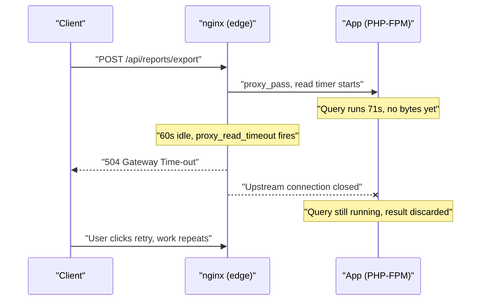
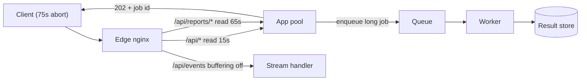

> **Scenario** — যে report export আগে ৪০ সেকেন্ডে শেষ হতো, সেটি এখন ঠিক ৬০ সেকেন্ডে `504 Gateway Time-out` ফেরত দিচ্ছে। application log বলছে একই request ৭১ সেকেন্ডে সফলভাবে শেষ হয়েছে। কোনো application deploy হয়নি; শুধু service-টিকে নতুন একটি nginx tier-এর পিছনে সরানো হয়েছে।

## Why it matters

- user কী দেখবে সেটা app নয়, proxy ঠিক করে। backend ৭১s-এ উত্তর দিলেও `proxy_read_timeout` ৬০s হলে প্রত্যেক customer 504 পাবে।
- timeout budget nested না হলে duplicate work হয়: original backend request চলতেই client retry করে, incident-এর সময় database load দ্বিগুণ হয়।
- response buffering নীরবে disk-এ লেখে। ব্যস্ত edge node-এ `proxy_max_temp_file_size` একটি CPU-bound tier-কে IO-bound বানায়, আর রাত ৩টায় `/var/cache` ভরে যায়।
- streaming endpoint (SSE, log tail, chunked JSON) ভাঙা মনে হয়, আসলে প্রথম byte পাঠানোর আগেই পুরোটা buffer হচ্ছে।
- dashboard-এ error application-level 504 হিসেবে দেখায় বলে on-call এক ঘণ্টা application trace-এ নষ্ট করে।

## Symptoms

| Signal | What you observe |
| --- | --- |
| Latency histogram | ঠিক 60.0s বা 30.0s-এ শক্ত দেয়াল — tail নয়, cliff |
| nginx `error.log` | `upstream timed out (110: Connection timed out) while reading response header from upstream` |
| `$upstream_response_time` | `$request_time`-এর চেয়ে বড়, বা connection কাটলে `-` |
| Backend access log | user যেটাকে fail দেখেছে, সেটির জন্য ৭১s-এ `200 OK` |
| Disk | `an upstream response is buffered to a temporary file /var/cache/nginx/proxy_temp/3/07/...` |
| SSE endpoint | stream শেষ হলেই প্রথম byte আসে |
| Backend traffic | এক click থেকে ৬০s ব্যবধানে দুটি একই POST |

## How it breaks

nginx একটি proxied request-এ চারটি আলাদা timer চালায়: `proxy_connect_timeout` (upstream-এ TCP handshake, default 60s), `proxy_send_timeout` (upstream-এ পরপর write-এর ফাঁক), `proxy_read_timeout` (upstream থেকে পরপর **read**-এর ফাঁক, default 60s) এবং `send_timeout` (client-এ write-এর ফাঁক)। কামড় দেয় `proxy_read_timeout`, আর ফাঁদটা হলো — এটি total-request budget নয়, idle-gap budget। প্রতি ১০s-এ একটি keepalive byte পাঠানো backend এক ঘণ্টা চলতে পারে; ৬১s নীরবে ভেবে তারপর উত্তর দেওয়া backend মারা পড়ে।

buffering সমস্যাটা বাড়ায়। `proxy_buffering on` (default) থাকলে nginx পুরো response `proxy_buffers`-এ পড়ে, তার বেশি হলে temp file-এ spill করে, তারপর client-কে লেখে। এতে slow client থেকে backend বাঁচে ঠিকই, কিন্তু streaming ধ্বংস হয় এবং disk request path-এ ঢুকে যায়।



## Root causes

1. backend-এর work budget ১২০s, অথচ `proxy_read_timeout` default ৬০s-এই পড়ে আছে।
2. budget nested নয় — client 30s, edge 60s, app 120s — তাই কে আগে হাল ছাড়বে তা নিয়ে layer-গুলো একমত নয়।
3. যে endpoint-এ stream করা দরকার সেখানেও `proxy_buffering on`, ফলে TTFB = total time।
4. `proxy_buffers` p95 response-এর চেয়ে ছোট, তাই প্রতিটি বড় response disk-এর `proxy_temp` দিয়ে যায়।
5. বড় upload-এ `proxy_request_buffering on`, ফলে পুরো upload proxy disk-এ নামার পরই backend body দেখে।
6. `proxy_next_upstream_timeout` cap নেই, তাই upstream retry কার্যকর wall clock গুণ করে।
7. HTTP request-এর ভিতরে দীর্ঘ synchronous কাজ, যেটির জায়গা job queue।

## How to solve it

### 1. config ছোঁয়ার আগে timeout budget লিখে ফেলুন

```
browser AbortController  : 75s
CDN / LB idle            : 70s
nginx proxy_read_timeout : 65s
app request budget       : 60s
DB statement_timeout     : 45s
```

বাইরের layer হাল ছাড়ার আগেই ভিতরের layer শেষ হতে হবে, নাহলে একসাথে 504 *এবং* সম্পূর্ণ হওয়া backend write দুটোই পাবেন।

### 2. লম্বা timeout শুধু একটি endpoint-এ দিন

```nginx
location = /api/reports/export {
    proxy_pass                  http://app_upstream;
    proxy_connect_timeout       3s;
    proxy_send_timeout          65s;
    proxy_read_timeout          65s;
    proxy_next_upstream         error timeout;
    proxy_next_upstream_tries   2;
    proxy_next_upstream_timeout 70s;
}

location /api/ {
    proxy_pass            http://app_upstream;
    proxy_connect_timeout 3s;
    proxy_read_timeout    15s;
}
```

`proxy_connect_timeout` ১–৩s রাখুন। সুস্থ pod-এ handshake single-digit millisecond-এ হয়; সেখানে ৬০s মানে একটি মৃত backend এক মিনিট ধরে worker আটকে রাখবে।

### 3. যেখানে streaming দরকার ঠিক সেখানেই buffering বন্ধ করুন

```nginx
location /api/events {
    proxy_pass         http://app_upstream;
    proxy_buffering    off;
    proxy_cache        off;
    proxy_read_timeout 1h;
    chunked_transfer_encoding on;
}
```

application per-response `X-Accel-Buffering: no` পাঠাতে পারে — shared location-এ ঢালাও `proxy_buffering off`-এর চেয়ে সেটি নিরাপদ।

### 4. buffer এমন size দিন যাতে সাধারণ response disk ছোঁয় না

```nginx
proxy_buffer_size        16k;
proxy_buffers            8 32k;
proxy_busy_buffers_size  64k;
proxy_max_temp_file_size 0;
```

`proxy_max_temp_file_size 0` দিলে nginx IO লুকানোর বদলে unbuffered-এ নামে। আগে বাস্তব data দেখে size ঠিক করুন:

```bash
awk '{s+=$10; n++} END {printf "avg body %.0f bytes\n", s/n}' /var/log/nginx/access.log
```

### 5. পরিবর্তন wire-এ যাচাই করুন

```bash
curl -v -o /dev/null -s -w \
  'connect=%{time_connect} ttfb=%{time_starttransfer} total=%{time_total}\n' \
  https://api.example.com/api/reports/export
# connect=0.021 ttfb=0.128 total=64.902   <- streaming
# connect=0.019 ttfb=60.001 total=60.001  <- buffered, and timing out
```

### 6. proxy-র নিজের time-view log করুন

```nginx
log_format upstreamlog '$remote_addr $status rt=$request_time '
                       'uct=$upstream_connect_time uht=$upstream_header_time '
                       'urt=$upstream_response_time addr=$upstream_addr';
access_log /var/log/nginx/access.log upstreamlog;
```

`$upstream_header_time` "backend ভাবছে" আর "backend ধীরে stream করছে" আলাদা করে — এই শ্রেণির incident-এ সবচেয়ে কাজের পার্থক্য।

### 7. সত্যিকারের লম্বা কাজ request path থেকে সরান

~৩০s-এর বেশি হলে job id সহ `202 Accepted` দিন, তারপর polling বা webhook। customer data-র সাথে বাড়তে থাকা report কোনো timeout tuning-এ টিকবে না।

## Target design



## Tradeoffs

| Option | Pros | Cons | Choose when |
| --- | --- | --- | --- |
| Buffering on (default) | slow client থেকে backend worker মুক্ত | streaming মরে, disk-এ spill হতে পারে | সাধারণ JSON/HTML response |
| Buffering off | সত্যিকারের streaming, কম TTFB | slow client upstream worker আটকে রাখে | SSE, log tail, বড় download |
| লম্বা `proxy_read_timeout` | ধীর endpoint টিকে যায় | মৃত backend বেশিক্ষণ connection ধরে | পরিচিত-ধীর, কম-volume endpoint |
| Async job + 202 | HTTP time bounded, retry-যোগ্য | job store, status API, UI কাজ লাগে | customer data-র সাথে বাড়া কাজ |

## Verification checklist

- [ ] `nginx -T | grep -E 'proxy_(read|connect|send)_timeout'` প্রতিটি proxying location-এ explicit মান দেখায়।
- [ ] timeout ladder লেখা আছে, প্রতিটি hop বাইরেরটির চেয়ে কড়া ছোট।
- [ ] SSE endpoint-এ `curl -w 'ttfb=%{time_starttransfer}'` ৫০০ms-এর নিচে TTFB দেয়।
- [ ] ২৪ ঘণ্টায় `grep -c 'buffered to a temporary file' /var/log/nginx/error.log` শূন্য।
- [ ] latency histogram-এ কোনো round number-এ খাড়া cliff নেই।
- [ ] staging-এ জোর করে 504 ঘটালে backend-এ ঠিক একটি request যায়, দুটি নয়।
- [ ] শুধু 5xx rate নয়, `upstream timed out` rate-এও alert আছে।

## Anti-patterns

- global `proxy_read_timeout 3600s` দিয়ে "কিছুই timeout হবে না" বানানো — তখন মৃত upstream এক ঘণ্টা connection ধরে রাখে।
- client timeout না বাড়িয়ে শুধু proxy timeout বাড়ানো, ফলে user abort করে already-loaded backend-এ retry করে।
- একটি SSE endpoint ঠিক করতে গোটা server-এ `proxy_buffering off` দেওয়া।
- proxy-তে timeout হওয়া non-idempotent POST-এ client retry যোগ করা।
- শুধু APM-এ debug করা; ground truth হলো proxy-র `$upstream_header_time`।
- 504-কে backend bug ধরে pod scale করা, যখন আসল bug হলো timer।

## Related

- [Keepalive and upstream connection reuse](/systems/networking-edge/keepalive-and-connection-reuse)
- [WebSockets through reverse proxies](/systems/networking-edge/websockets-through-proxies)
- [An nginx config debugging playbook](/systems/networking-edge/nginx-config-debugging-playbook)
- [Backpressure in queue-heavy architectures](/systems/messaging-async/backpressure-queue-design)
