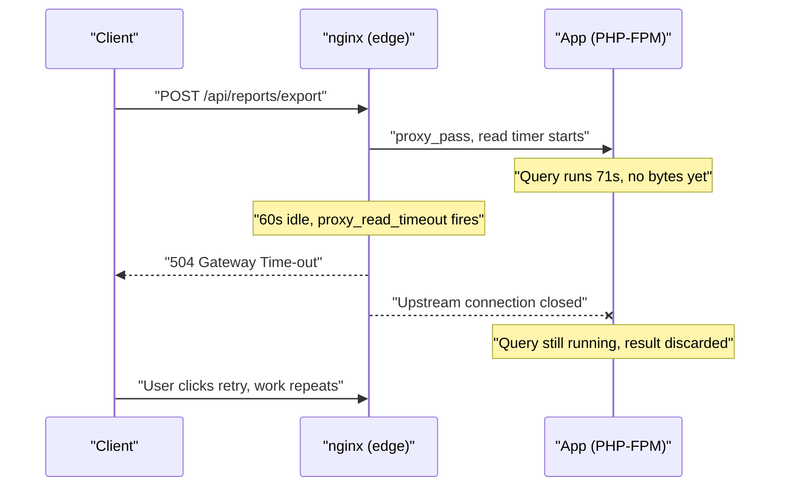
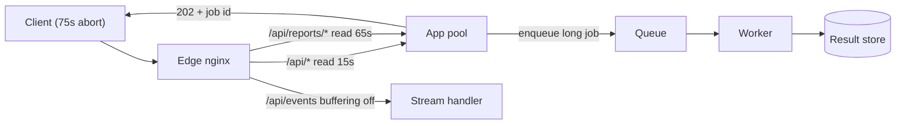

> **Scenario** - A report export that used to finish in 40 seconds starts returning `504 Gateway Time-out` at exactly 60 seconds. The application log shows the same request completing successfully in 71 seconds. Nobody deployed application code; someone moved the service behind a new nginx tier.

## Why it matters

- The proxy, not the app, decides what the user experiences. A backend that answers in 71s is a 504 for every customer when `proxy_read_timeout` is 60s.
- Timeout budgets that do not nest produce duplicate work: the client retries while the original backend request is still running, doubling database load during an incident.
- Response buffering silently writes to disk. On a busy edge node `proxy_max_temp_file_size` turns a CPU-bound tier into an IO-bound one, and `/var/cache` fills at 03:00.
- Streaming endpoints (SSE, log tails, chunked JSON) look broken when they are simply buffered to completion before the first byte ships.
- On-call burns an hour in application traces because the failure surfaced as an application-level 504 on the dashboard.

## Symptoms

| Signal | What you observe |
| --- | --- |
| Latency histogram | A hard wall at exactly 60.0s or 30.0s - a cliff, not a tail |
| nginx `error.log` | `upstream timed out (110: Connection timed out) while reading response header from upstream` |
| `$upstream_response_time` | Larger than `$request_time`, or `-` when the connection was cut |
| Backend access log | `200 OK` in 71s for a request the user saw fail |
| Disk | `an upstream response is buffered to a temporary file /var/cache/nginx/proxy_temp/3/07/...` |
| SSE endpoint | First byte arrives only when the stream ends |
| Backend traffic | Two identical POSTs, 60s apart, from one user click |

## How it breaks

nginx applies four independent timers to a proxied request: `proxy_connect_timeout` (TCP handshake to upstream, default 60s), `proxy_send_timeout` (gap between successive writes to upstream), `proxy_read_timeout` (gap between successive **reads** from upstream, default 60s) and `send_timeout` (gap between writes to the client). The one that bites is `proxy_read_timeout`, and the trap is that it is not a total-request budget - it is an idle-gap budget. A backend that emits a keepalive byte every 10s can run for an hour. A backend that thinks silently for 61s and then answers is killed.

Buffering compounds it. With `proxy_buffering on` (the default) nginx reads the whole response into `proxy_buffers`, spills past that into a temp file, and only then writes to the client. That protects the backend from slow clients, but it destroys streaming and puts the disk on the request path.



## Root causes

1. `proxy_read_timeout` left at the 60s default while the backend has a 120s work budget.
2. Budgets not nested - client 30s, edge 60s, app 120s - so layers disagree on who gives up first.
3. `proxy_buffering on` for endpoints that must stream, making TTFB equal total time.
4. `proxy_buffers` sized below the p95 response, pushing every large response through `proxy_temp` on disk.
5. `proxy_request_buffering on` with large uploads, so the backend only sees a body after the full upload lands on proxy disk.
6. No `proxy_next_upstream_timeout` cap, so upstream retries multiply the effective wall clock.
7. Long synchronous work in an HTTP request that belongs in a job queue.

## How to solve it

### 1. Write the timeout budget down before touching config

```
browser AbortController  : 75s
CDN / LB idle            : 70s
nginx proxy_read_timeout : 65s
app request budget       : 60s
DB statement_timeout     : 45s
```

Each inner layer must finish before the outer one gives up, otherwise you get a 504 *and* a completed backend write.

### 2. Scope the long timeout to one endpoint

```nginx
location = /api/reports/export {
    proxy_pass                  http://app_upstream;
    proxy_connect_timeout       3s;
    proxy_send_timeout          65s;
    proxy_read_timeout          65s;
    proxy_next_upstream         error timeout;
    proxy_next_upstream_tries   2;
    proxy_next_upstream_timeout 70s;
}

location /api/ {
    proxy_pass            http://app_upstream;
    proxy_connect_timeout 3s;
    proxy_read_timeout    15s;
}
```

Keep `proxy_connect_timeout` at 1–3s. A handshake to a healthy pod completes in single-digit milliseconds; 60s there only means a dead backend pins a worker for a minute.

### 3. Disable buffering exactly where streaming is required

```nginx
location /api/events {
    proxy_pass         http://app_upstream;
    proxy_buffering    off;
    proxy_cache        off;
    proxy_read_timeout 1h;
    chunked_transfer_encoding on;
}
```

The application can also send `X-Accel-Buffering: no` per response, which is safer than a blanket `proxy_buffering off` on a shared location.

### 4. Size buffers so normal responses never touch disk

```nginx
proxy_buffer_size        16k;
proxy_buffers            8 32k;
proxy_busy_buffers_size  64k;
proxy_max_temp_file_size 0;
```

`proxy_max_temp_file_size 0` makes nginx fall back to unbuffered rather than hide IO. Size `proxy_buffers` from real data first:

```bash
awk '{s+=$10; n++} END {printf "avg body %.0f bytes\n", s/n}' /var/log/nginx/access.log
```

### 5. Confirm the change on the wire

```bash
curl -v -o /dev/null -s -w \
  'connect=%{time_connect} ttfb=%{time_starttransfer} total=%{time_total}\n' \
  https://api.example.com/api/reports/export
# connect=0.021 ttfb=0.128 total=64.902   <- streaming
# connect=0.019 ttfb=60.001 total=60.001  <- buffered, and timing out
```

### 6. Log the proxy's own view of time

```nginx
log_format upstreamlog '$remote_addr $status rt=$request_time '
                       'uct=$upstream_connect_time uht=$upstream_header_time '
                       'urt=$upstream_response_time addr=$upstream_addr';
access_log /var/log/nginx/access.log upstreamlog;
```

`$upstream_header_time` separates "backend is thinking" from "backend is streaming slowly" - the most useful distinction in this class of incident.

### 7. Move genuinely long work off the request path

Anything past ~30s should return `202 Accepted` with a job id plus polling or a webhook. No timeout tuning survives a report whose size grows with the customer.

## Target design



## Tradeoffs

| Option | Pros | Cons | Choose when |
| --- | --- | --- | --- |
| Buffering on (default) | Frees backend workers from slow clients | Kills streaming, can spill to disk | Ordinary JSON and HTML responses |
| Buffering off | True streaming, low TTFB | A slow client pins an upstream worker | SSE, log tails, large downloads |
| Long `proxy_read_timeout` | Slow endpoints survive | Dead backends hold connections longer | Known-slow, low-volume endpoints |
| Async job + 202 | Bounded HTTP time, retryable | Needs job store, status API, UI work | Work that scales with customer data |

## Verification checklist

- [ ] `nginx -T | grep -E 'proxy_(read|connect|send)_timeout'` shows an explicit value in every proxying location.
- [ ] Timeout ladder documented, each hop strictly smaller than the one outside it.
- [ ] `curl -w 'ttfb=%{time_starttransfer}'` against the SSE endpoint returns TTFB under 500ms.
- [ ] `grep -c 'buffered to a temporary file' /var/log/nginx/error.log` is 0 over 24h.
- [ ] Latency histogram has no vertical cliff at a round number.
- [ ] A forced 504 in staging produces exactly one backend request, not two.
- [ ] Alert exists on `upstream timed out` rate, not only on 5xx rate.

## Anti-patterns

- Setting `proxy_read_timeout 3600s` globally so nothing ever times out - dead upstreams then hold connections for an hour.
- Raising the proxy timeout without raising the client timeout, so users abort and retry into an already-loaded backend.
- Turning `proxy_buffering off` server-wide to fix one SSE endpoint.
- Adding client retries for a non-idempotent POST that timed out at the proxy.
- Debugging in APM only; the proxy's `$upstream_header_time` is the ground truth.
- Treating 504 as a backend bug and scaling pods, when the timer is the bug.

## Related

- [Keepalive and upstream connection reuse](/systems/networking-edge/keepalive-and-connection-reuse)
- [WebSockets through reverse proxies](/systems/networking-edge/websockets-through-proxies)
- [An nginx config debugging playbook](/systems/networking-edge/nginx-config-debugging-playbook)
- [Backpressure in queue-heavy architectures](/systems/messaging-async/backpressure-queue-design)
