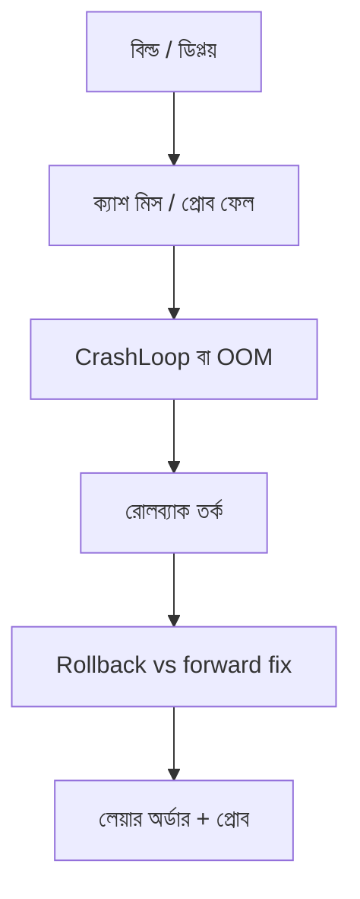

> **পাঠ 85 · মাঝারি ধাপ** - রাত ২টার সিদ্ধান্তের নিয়ম: আগের image কখন নিরাপদ, কখন নয়, আর rollback-কে default বানানোর উপায়।

## কেন এটা জরুরি

- লকফাইলের আগে `node_modules` কপি করলে CI-এর প্রতি মিনিট দামি।
- কুবারনেটিস রোলআউট আস্তে ভাঙে: প্রোব, OOM, স্টার্টআপ অর্ডার — “YAML ভুল” নয়।
- আগের ইমেজ রেজিস্ট্রিতে থাকলে রোলব্যাক সস্তা।
- এই পাঠটা ঠিক **Rollback vs forward fix** নিয়ে। ট্যাগ: incident-response, rollback, deploy, runbook, kubernetes।

## কী দেখে বুঝবেন সমস্যা আছে

| সংকেত | যা দেখা যায় |
| --- | --- |
| মোটা ইমেজ | প্রতি JS চেঞ্জে apt, বিল্ড ১২ মিনিট |
| CrashLoop | MySQL-এর আগে অ্যাপ, প্রোব রেডি হয় না |
| OOM | FPM ওয়ার্কার × মেমোরি লিমিট পিক ট্রাফিকের নিচে |
| আটকে রোলআউট | পুরনো-নতুন পড অসামঞ্জস্য API সার্ভ করছে |

## কীভাবে ভাঙে



ভাঙে প্রযুক্তির নামে নয়, চুক্তির অভাবে। Vue/Quasar স্ক্রিন আর Laravel রাইট যদি উল্টো উত্তর ধরে, প্রোডাকশন সেই রেসটা খুঁজে বের করে। এই টপিকের চুক্তিটা হলো: রাত ২টার সিদ্ধান্তের নিয়ম: আগের image কখন নিরাপদ, কখন নয়, আর rollback-কে default বানানোর উপায়।

## মূল কারণ

1. Dockerfile অর্ডার ক্যাশের বিরুদ্ধে।
2. init / wait-for-db নেই; Laravel খালি স্কিমায় বুট।
3. লিমিট টিউটোরিয়ালের, প্রোডাকশন RSS-এর নয়।
4. রেডিনেস “পোর্ট খোলা”, “মাইগ্রেশন শেষ” নয়।

## কীভাবে সমাধান করবেন

### ১. ইনভেরিয়েন্ট এক বাক্যে লিখুন

রাত ২টার সিদ্ধান্তের নিয়ম: আগের image কখন নিরাপদ, কখন নয়, আর rollback-কে default বানানোর উপায়। এই বাক্য পিআর, Pinia অ্যাকশন, আর Laravel ক্লাসে রাখুন।

### ২. কোডে কিনারা আটকে দিন

```ts
// vite.config.ts — production image should serve the built dist, not a dev server
export default defineConfig({ build: { sourcemap: false } })
```

```php
# Dockerfile (PHP-FPM)
COPY composer.lock composer.json /app/
RUN composer install --no-dev --no-scripts
COPY . /app
```

### ৩. যে চার্ট সত্যি দেখবেন, সেটাই রাখুন

ইমেজ সাইজ, রোলআউট সময়, রিস্টার্ট সংখ্যা, আর রেডি হতে কতক্ষণ। **Rollback vs forward fix**-এর রিগ্রেশন এই চার্টে না ধরা পড়লে পাঠ শেষ হয়নি।

## কাজের উদাহরণ

Vue SPA ইমেজে `npm run dev` বান্ডিল ছিল। প্রোডাকশন CPU কম্পাইলে ১০০%। মাল্টি-স্টেজ বিল্ডে `dist/` nginx-এ কপি করলে কনটেইনার কয়েক MB স্ট্যাটিক ফাইল হয়।

এই টপিকে নিজের শেষ ইনসিডেন্টের লক্ষণ টেবিলে মিলিয়ে নিন, তারপর ডায়াগ্রাম ধরে এগোন যতক্ষণ না উপরের গার্ড আগুন ধরত।

## শিপ করার আগে

- [ ] **Rollback vs forward fix**-এর ইনভেরিয়েন্ট এক বাক্যে লেখা।
- [ ] খালি, ডুপ্লিকেট, টাইমআউট বা পারমিশন পাথের টেস্ট বা রিহার্সাল আছে।
- [ ] এক ডিপ্লয়ের মধ্যে রিগ্রেশন ধরার লগ বা চার্ট আছে।
- [ ] আত্মীয় পাঠ এখনও মিলছে: migrations-in-the-deploy-pipeline, blue-green-vs-canary-releases।

## যা করবেন না

- অনন্ত রিট্রাই বা এররকে সাকসেস হিসেবে ক্যাশ করা ব্লগ স্নিপেট কপি করবেন না।
- Laravel সারির সত্য Pinia-কে বলে দেবেন না।
- ঘন মনে হলে আগের নম্বরের পাঠ আগে শেষ করুন। পথটা ইচ্ছা করেই শুরু → মাঝারি → উন্নত।
