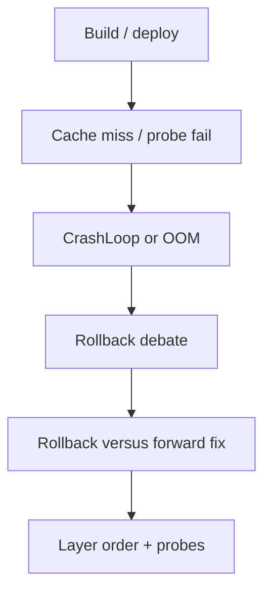

> **Lesson 85 · intermediate** - A decision rule for 2am: when the previous image is safe, when it is not, and how to make rollback the default.

## Why it matters

- A Docker layer that copies `node_modules` before the lockfile makes every CI minute expensive.
- Kubernetes rollouts fail in slow motion: probes, OOM, and startup order — not “the YAML is wrong”.
- Rollback vs forward-fix is cheaper when the previous image is still in the registry.
- This lesson is specifically about **Rollback versus forward fix**. Tags: incident-response, rollback, deploy, runbook, kubernetes.

## Symptoms

| Signal | What you observe |
| --- | --- |
| Fat image | Build 12 minutes because apt ran on every JS change |
| CrashLoop | App starts before MySQL; probes never turn ready |
| OOM | PHP-FPM workers × memory limit < peak traffic |
| Stuck rollout | Old and new pods both serving incompatible APIs |

## How it breaks



The named technology is rarely the villain. Two code paths (often a Vue/Quasar screen and a Laravel write) assume opposite contracts. Production finds the race. For this topic that contract is: A decision rule for 2am: when the previous image is safe, when it is not, and how to make rollback the default.

## Root causes

1. Dockerfile order fought the cache.
2. No init container / wait-for-db; Laravel booted into a missing schema.
3. Limits copied from a tutorial, not from RSS in production.
4. Readiness matched “port open”, not “migrations done”.

## How to solve it

### 1. Write the invariant in one sentence

A decision rule for 2am: when the previous image is safe, when it is not, and how to make rollback the default. Put that sentence in the PR, the Pinia action, and the Laravel class.

### 2. Guard the edge in code

```ts
// vite.config.ts — production image should serve the built dist, not a dev server
export default defineConfig({ build: { sourcemap: false } })
```

```php
# Dockerfile (PHP-FPM)
COPY composer.lock composer.json /app/
RUN composer install --no-dev --no-scripts
COPY . /app
```

### 3. Keep a chart you will actually look at

Image size, rollout duration, restart count, and time-to-ready. If the chart cannot catch a regression in **Rollback versus forward fix**, the lesson is not done.

## Worked example

A Vue SPA image bundled `npm run dev`. Production CPU sat at 100% compiling. A multi-stage build that copies `dist/` into nginx dropped the container to a few MB of static files.

On this topic, start from the symptom in the table that matches your last incident, then walk the diagram until the guard above would have fired.

## Check before you ship

- [ ] The invariant for **Rollback versus forward fix** is written in one sentence.
- [ ] Empty, duplicate, timeout, or permission paths have a test or a staged rehearsal.
- [ ] A dashboard or log query would catch a regression within one deploy.
- [ ] Related reading still makes sense: migrations-in-the-deploy-pipeline, blue-green-vs-canary-releases.

## What not to do

- Copy a blog snippet that retries forever or caches the error as success.
- Treat Pinia as the source of truth for a Laravel row.
- Skip the previous numbered lesson if this one feels dense — the path is beginner → intermediate → advanced on purpose.
