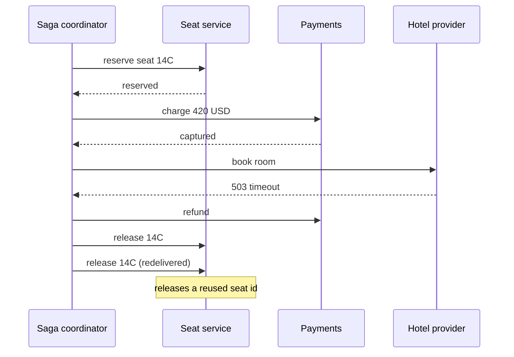
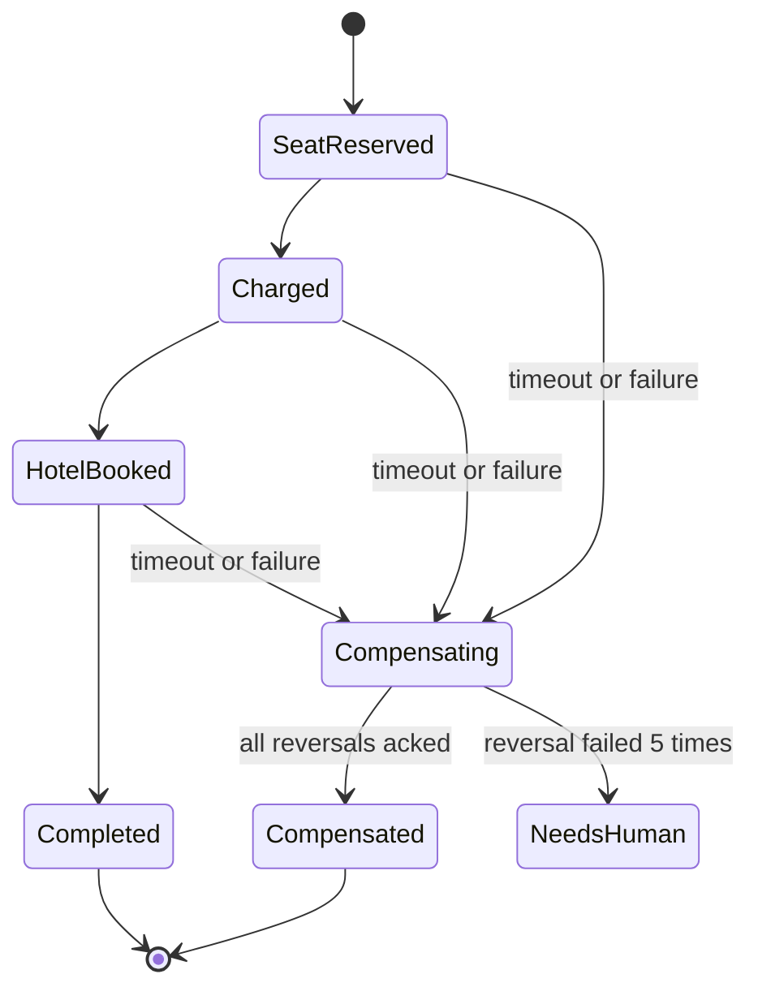

> **Scenario** - একটা travel booking saga প্রথমে seat reserve করে, তারপর card charge করে, শেষে hotel book করে। Hotel provider এগারো মিনিট ধরে 503 দিচ্ছে। Saga compensation চালায়: card refund, seat release। Refund সফল, কিন্তু seat release message দুবার consume হয় এবং *অন্য* একটা booking-এর seat release হয়ে যায় যেটা একই seat ID পুনর্ব্যবহার করেছিল। Support দুজন রাগী customer পায়, আর saga log-এ লেখা `COMPLETED`।

## Why it matters

- Compensation মানে rollback নয়। কোনো undo log নেই; প্রতিটি reversal একটা নতুন business operation, তার নিজস্ব failure mode ও নিজস্ব টাকার নড়াচড়া সহ।
- অর্ধেক-compensate হওয়া saga এমন state রেখে যায় যা কোনো একক service বর্ণনা করতে পারে না, ফলে incident response-কে চারটা service-এর log থেকে intent পুনর্গঠন করতে হয়।
- আটকে থাকা saga আসল resource ধরে রাখে - inventory, seat, credit hold - এবং নীরবে sellable capacity কমায়।
- Compensation code প্রায়ই system-এর সবচেয়ে কম-tested path, শুধু incident-এর সময়ই চলে।
- Financial reversal-এর regulatory timing থাকে; ৬ ঘণ্টা দেরিতে চলা compensation শুধু bug নয়, compliance সমস্যা।

## Symptoms

| Signal | What you observe |
|---|---|
| Saga state table | কোনো timeout ছাড়াই ঘণ্টার পর ঘণ্টা `AWAITING_HOTEL`-এ আটকে থাকা row |
| Compensation duplicates | একই payment intent-এ দুটো refund |
| Inventory drift | Reserved count আসল hold-এর চেয়ে ক্রমশ বেশি |
| Orphaned holds | ৭ দিন পর uncaptured অবস্থায় expire হওয়া card authorisation |
| Log ordering | step 4 fail হওয়ার আগেই step 3-এর compensation log |
| Alerting | কিছুই fire করে না; প্রতিটি service আলাদাভাবে success রিপোর্ট করে |

## How it breaks

Saga coordinator forward step চালায়, failure পায়, উল্টো ক্রমে compensation পাঠায়। বাস্তবে তিনটা জিনিস ভাঙে। এক, compensation fire-and-forget message হিসেবে যায় - শুধু transport delivery-র ack থাকে, *business* completion-এর নয়। দুই, compensation idempotent নয়, তাই at-least-once redelivery দুবার refund বা release করে। তিন, saga-র কোনো timeout নেই, তাই যে step কখনো উত্তর দেয় না সেটা saga-কে অনন্তকাল pending রেখে resource আটকে রাখে।



## Root causes

1. Compensation-কে durable, tracked business step না ধরে transport-level message ধরা।
2. saga instance-scoped idempotency key নেই, তাই redelivery reversal পুনরাবৃত্তি করে।
3. per-step timeout নেই, তাই নীরব upstream saga-কে অনির্দিষ্টকাল pending রাখে।
4. booking-এর মধ্যে resource identifier পুনর্ব্যবহার, ফলে "release seat 14C" অস্পষ্ট।
5. persisted saga state machine নেই - state থাকে in-memory coordinator object-এ, restart-এ উবে যায়।
6. compensation ordering কঠোরভাবে উল্টো ধরে নেওয়া, যদিও কিছু step স্বাধীন আর কিছু নয়।

## How to solve it

### 1. Persist the saga as an explicit state machine

```sql
CREATE TABLE saga_instances (
  id            UUID PRIMARY KEY,
  saga_type     TEXT        NOT NULL,
  state         TEXT        NOT NULL,
  payload       JSONB       NOT NULL,
  deadline_at   TIMESTAMPTZ NOT NULL,
  updated_at    TIMESTAMPTZ NOT NULL DEFAULT now()
);

CREATE TABLE saga_steps (
  saga_id       UUID        NOT NULL REFERENCES saga_instances(id),
  step          TEXT        NOT NULL,
  status        TEXT        NOT NULL,
  idem_key      TEXT        NOT NULL,
  result        JSONB,
  compensated_at TIMESTAMPTZ,
  PRIMARY KEY (saga_id, step),
  UNIQUE (idem_key)
);
```

`UNIQUE (idem_key)` constraint-টাই পুরো duplicate-compensation প্রতিরক্ষা। key deterministically বানান: `sha256(saga_id + step + 'compensate')`।

### 2. Make every compensation idempotent at the target service

```php
public function releaseSeat(string $idemKey, string $holdId): void
{
    DB::transaction(function () use ($idemKey, $holdId) {
        $claimed = DB::table('seat_operations')->insertOrIgnore([
            'idem_key'   => $idemKey,
            'hold_id'    => $holdId,
            'created_at' => now(),
        ]);

        if ($claimed === 0) {
            return; // already applied, nothing to do
        }

        SeatHold::where('id', $holdId)
            ->where('status', 'held')
            ->update(['status' => 'released']);
    });
}
```

লক্ষ্য করুন operation-টা **hold ID** ধরে চলে, seat number ধরে নয়। Hold প্রতি saga-তে unique; seat number পুনর্ব্যবহৃত হয়।

### 3. Give every step a deadline and a timeout compensation

```ts
type Step = {
  name: string
  invoke: (ctx: SagaCtx) => Promise<StepResult>
  compensate: (ctx: SagaCtx) => Promise<void>
  timeoutMs: number
}

const bookHotel: Step = {
  name: 'book_hotel',
  timeoutMs: 30_000,
  invoke: (ctx) => hotel.book(ctx.itinerary, { idemKey: key(ctx, 'book_hotel') }),
  compensate: (ctx) => hotel.cancel(ctx.bookingRef, { idemKey: key(ctx, 'book_hotel:comp') }),
}
```

একটা sweeper job প্রতি ৩০ সেকেন্ডে `saga_instances WHERE deadline_at < now() AND state NOT IN ('COMPLETED','COMPENSATED')` scan করে ওগুলোকে compensation-এ ঠেলে দেয়। sweeper না থাকলে হারিয়ে যাওয়া reply saga-কে আটকে রাখে।

### 4. Compensate in reverse, but only what actually succeeded

শুধু `status = 'succeeded'` step-গুলোর reversal দরকার। যে step timeout করেছে সেটা *অস্পষ্ট* - হয়তো apply হয়ে গেছে। অস্পষ্ট step-ও compensate করতে হবে, তাই compensation-কে "undo করার কিছু নেই" অবস্থাও সহ্য করতে হবে।

### 5. Choose orchestration over choreography for money

Choreography-তে (প্রতিটি service event-এ react করে) state machine service জুড়ে ছড়িয়ে যায় এবং "booking 8815-এর current state কী?" প্রশ্নের উত্তর মেলে না। টাকা বা inventory ছোঁয়া flow-এ একটাই orchestrator রাখুন যে saga table-এর মালিক।

## Target design



## Tradeoffs

| Option | Pros | Cons | Choose when |
|---|---|---|---|
| Orchestrated saga | একক source of truth, query করা সহজ | coordinator একটা dependency ও bottleneck | টাকা, inventory, regulated flow |
| Choreographed saga | central component নেই, loose coupling | state emergent, debugging মানে খোঁড়াখুঁড়ি | সরল ২-step flow, কম মূল্য |
| Distributed transaction (2PC) | সত্যিকারের atomicity | blocking, দুর্বল availability, বিরল support | একক database, HTTP-র ওপারে কখনো নয় |
| Optimistic no-compensation | লেখা তুচ্ছ সহজ | মানুষকে হাতে cleanup করতে হয় | internal tooling, হাতে reversible |
| Reserve-then-confirm holds | compensation মানে শুধু expiry | provider-এ hold support লাগে | payments, seat inventory, warehouse |

## Verification checklist

- [ ] saga-র মাঝপথে orchestrator kill করে দেখুন sweeper এক deadline window-এর মধ্যে সেটা resume বা compensate করে।
- [ ] একই compensation message দুবার deliver করে দেখুন শুধু একটাই reversal row লেখা হয়।
- [ ] upstream-এ সফল হওয়া সত্ত্বেও একটা step timeout করান; compensation সেটা পরিষ্কার করে কিনা দেখুন।
- [ ] ২৪ ঘণ্টার বেশি পুরনো non-terminal saga query করুন; count শূন্য হওয়া উচিত।
- [ ] প্রতিটি compensation-এ saga-scoped idempotency key আছে এবং target service-এর log-এ দেখা যায় কিনা যাচাই করুন।
- [ ] game day চালান যেখানে hotel provider ১০ মিনিট 503 দেয়, আর মাপুন কতগুলো hold leak করে।

## Anti-patterns

- code ও doc-এ compensation-কে "rollback" বলা; এতে সবার প্রত্যাশা ভুল দিকে যায়।
- reversal row না লিখে row delete করে compensate করা, যা audit trail ধ্বংস করে।
- fail হওয়া compensation অনন্তকাল retry করা, মানুষের queue-তে escalate না করে।
- পুনর্ব্যবহৃত business identifier (seat number, SKU, email) দিয়ে compensation key করা।
- "সম্ভবত চলেনি" ভেবে অস্পষ্ট timed-out step-এর compensation বাদ দেওয়া।
- saga step-এর remote call জুড়ে database transaction খোলা রাখা।

## Related

- [Implementing the transactional outbox](/systems/messaging-async/outbox-pattern-implementation)
- [At-least-once delivery meets real side effects](/systems/messaging-async/at-least-once-side-effects)
- [Building idempotent consumers](/systems/messaging-async/idempotent-consumers)
