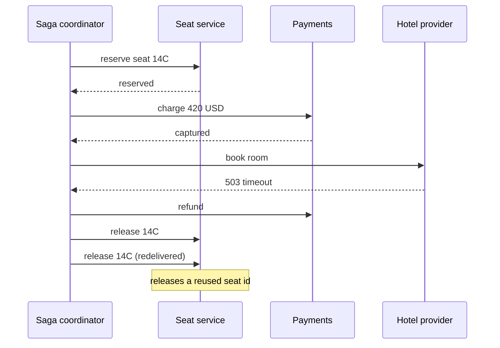
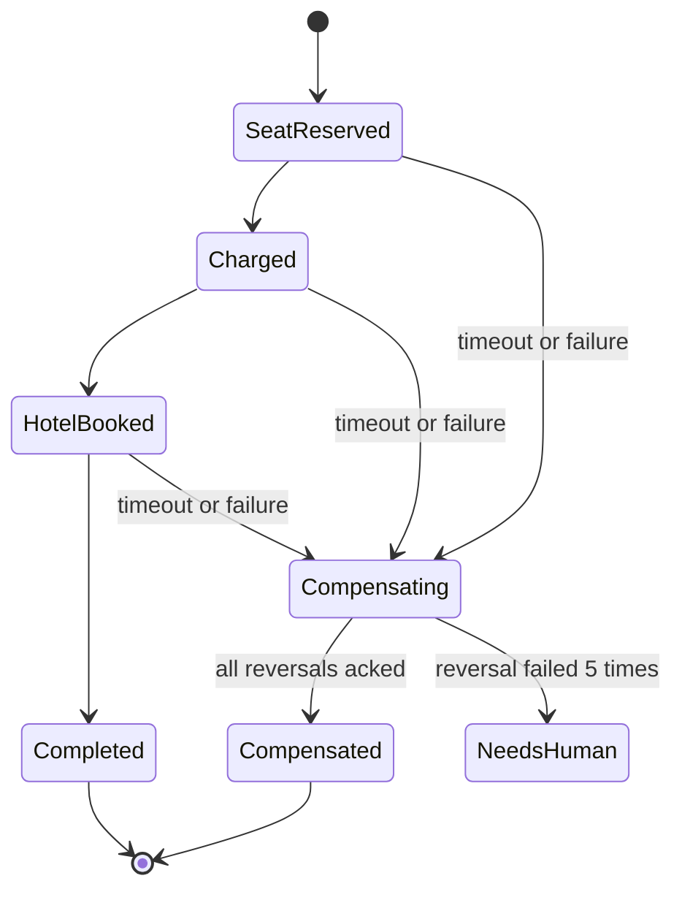

> **Scenario** — A travel booking saga reserves a seat, charges a card, then books a hotel. The hotel provider returns 503 for eleven minutes. The saga fires compensations: refund the card, release the seat. The refund succeeds, but the seat release message is consumed twice and the seat is released for a *different* booking that had reused the same seat ID. Support gets two angry customers and the saga log shows `COMPLETED`.

## Why it matters

- Compensation is not rollback. There is no undo log; every reversal is a new business operation with its own failure modes and its own money movement.
- Half-compensated sagas leave the system in a state no single service can describe, so incident response has to reconstruct intent from logs across four services.
- Stuck sagas hold real resources — inventory, seats, credit holds — and silently reduce sellable capacity.
- Compensation actions are often the least-tested code path in the system, executed only during incidents.
- Financial reversals have regulatory timing requirements; a compensation that runs 6 hours late is a compliance issue, not just a bug.

## Symptoms

| Signal | What you observe |
|---|---|
| Saga state table | Rows stuck in `AWAITING_HOTEL` for hours with no timeout |
| Compensation duplicates | Two refunds for the same payment intent |
| Inventory drift | Reserved count exceeds actual holds by a growing number |
| Orphaned holds | Card authorisations expiring uncaptured after 7 days |
| Log ordering | Compensation for step 3 logged before the failure of step 4 |
| Alerting | Nothing fires; every individual service reports success |

## How it breaks

The saga coordinator issues forward steps, hits a failure, and issues compensations in reverse order. Three things go wrong in practice. First, compensations are sent as fire-and-forget messages with no acknowledgement of *business* completion, only transport delivery. Second, compensations are not idempotent, so at-least-once redelivery double-refunds or double-releases. Third, the saga has no timeout, so a step that never answers leaves the saga pending forever with resources held.



## Root causes

1. Compensations treated as transport-level messages rather than durable, tracked business steps.
2. No idempotency key scoped to the saga instance, so redelivery repeats the reversal.
3. Missing per-step timeouts, so a silent upstream leaves the saga pending indefinitely.
4. Resource identifiers reused across bookings, making "release seat 14C" ambiguous.
5. No persisted saga state machine — state lives in in-memory coordinator objects that vanish on restart.
6. Compensation ordering assumed to be strict reverse when some steps are independent and some are not.

## How to solve it

### 1. Persist the saga as an explicit state machine

```sql
CREATE TABLE saga_instances (
  id            UUID PRIMARY KEY,
  saga_type     TEXT        NOT NULL,
  state         TEXT        NOT NULL,
  payload       JSONB       NOT NULL,
  deadline_at   TIMESTAMPTZ NOT NULL,
  updated_at    TIMESTAMPTZ NOT NULL DEFAULT now()
);

CREATE TABLE saga_steps (
  saga_id       UUID        NOT NULL REFERENCES saga_instances(id),
  step          TEXT        NOT NULL,
  status        TEXT        NOT NULL,
  idem_key      TEXT        NOT NULL,
  result        JSONB,
  compensated_at TIMESTAMPTZ,
  PRIMARY KEY (saga_id, step),
  UNIQUE (idem_key)
);
```

The `UNIQUE (idem_key)` constraint is the entire duplicate-compensation defence. Derive the key deterministically: `sha256(saga_id + step + 'compensate')`.

### 2. Make every compensation idempotent at the target service

```php
public function releaseSeat(string $idemKey, string $holdId): void
{
    DB::transaction(function () use ($idemKey, $holdId) {
        $claimed = DB::table('seat_operations')->insertOrIgnore([
            'idem_key'   => $idemKey,
            'hold_id'    => $holdId,
            'created_at' => now(),
        ]);

        if ($claimed === 0) {
            return; // already applied, nothing to do
        }

        SeatHold::where('id', $holdId)
            ->where('status', 'held')
            ->update(['status' => 'released']);
    });
}
```

Note the operation targets a **hold ID**, not a seat number. Holds are unique per saga; seat numbers are reused.

### 3. Give every step a deadline and a timeout compensation

```ts
type Step = {
  name: string
  invoke: (ctx: SagaCtx) => Promise<StepResult>
  compensate: (ctx: SagaCtx) => Promise<void>
  timeoutMs: number
}

const bookHotel: Step = {
  name: 'book_hotel',
  timeoutMs: 30_000,
  invoke: (ctx) => hotel.book(ctx.itinerary, { idemKey: key(ctx, 'book_hotel') }),
  compensate: (ctx) => hotel.cancel(ctx.bookingRef, { idemKey: key(ctx, 'book_hotel:comp') }),
}
```

A sweeper job scans `saga_instances WHERE deadline_at < now() AND state NOT IN ('COMPLETED','COMPENSATED')` every 30 seconds and drives them into compensation. Without the sweeper, a lost reply strands the saga.

### 4. Compensate in reverse, but only what actually succeeded

Only steps with `status = 'succeeded'` need reversal. A step that timed out is *ambiguous* — it may have applied. Ambiguous steps must be compensated too, which is why compensations must tolerate "nothing to undo".

### 5. Choose orchestration over choreography for money

Choreography (each service reacts to events) spreads the state machine across services and makes "what is the current state of booking 8815?" unanswerable. For flows touching money or inventory, run a single orchestrator that owns the saga table.

## Target design



## Tradeoffs

| Option | Pros | Cons | Choose when |
|---|---|---|---|
| Orchestrated saga | Single source of truth, easy to query | Coordinator is a dependency and a bottleneck | Money, inventory, regulated flows |
| Choreographed saga | No central component, loose coupling | State is emergent, debugging is archaeology | Simple 2-step flows, low value |
| Distributed transaction (2PC) | Real atomicity | Blocking, poor availability, rare support | Single database, never across HTTP |
| Optimistic no-compensation | Trivial to write | Manual cleanup by humans | Internal tooling, reversible by hand |
| Reserve-then-confirm holds | Compensation is just expiry | Requires provider support for holds | Payments, seat inventory, warehouses |

## Verification checklist

- [ ] Kill the orchestrator mid-saga and confirm the sweeper resumes or compensates it within one deadline window.
- [ ] Deliver the same compensation message twice and assert only one reversal row is written.
- [ ] Force a step to time out while it actually succeeds upstream; confirm the compensation cleans it up.
- [ ] Query for sagas older than 24 hours in a non-terminal state; the count should be zero.
- [ ] Confirm every compensation carries a saga-scoped idempotency key visible in the target service's logs.
- [ ] Run a game day where the hotel provider returns 503 for 10 minutes and measure how many holds leak.

## Anti-patterns

- Calling compensation "rollback" in code and docs; it sets the wrong expectations for everyone reading it.
- Compensating by deleting rows instead of writing reversal rows, which destroys the audit trail.
- Retrying a failed compensation forever with no escalation to a human queue.
- Keying compensations on business identifiers that are reused (seat number, SKU, email).
- Skipping compensation for "ambiguous" timed-out steps because they "probably did not run".
- Holding a database transaction open across the remote calls of a saga step.

## Related

- [Implementing the transactional outbox](/systems/messaging-async/outbox-pattern-implementation)
- [At-least-once delivery meets real side effects](/systems/messaging-async/at-least-once-side-effects)
- [Building idempotent consumers](/systems/messaging-async/idempotent-consumers)
