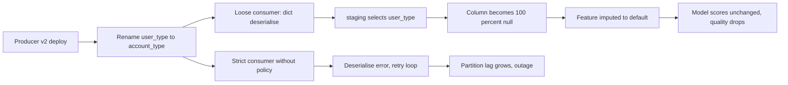
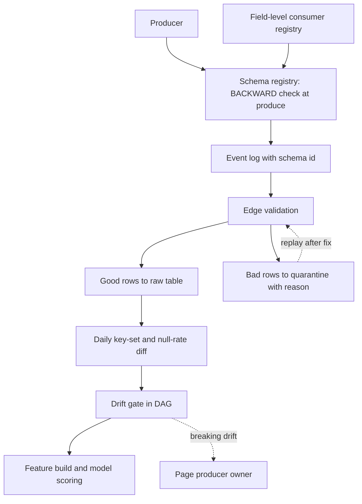

> **Scenario** — মঙ্গলবার একটি producer `user_type`-কে `account_type` নাম দিল এবং একটি nested `preferences` object যোগ করল। Kafka consumer চলতেই থাকল কারণ সে dict-এ deserialise করে। শুক্রবারে churn model-এর `user_type` feature ১০০% null, model তবু score দিচ্ছে, আর retention dashboard সন্দেহজনকভাবে সমান রেখা দেখাচ্ছে।

## Why it matters

- Schema পরিবর্তন producer-এর গতিতে ship হয়, pipeline-এর গতিতে নয়। একটি service team সপ্তাহে ২০ বার deploy করতে পারে; আপনার consumer একবার লেখা হয়েছিল।
- Rename removal-এর চেয়ে খারাপ। Removal সাধারণত error দেয়; rename একটি পুরো column null বানিয়ে feature, label ও dashboard-এ নীরবে বইয়ে দেয়।
- একটি খারাপ message একটি partition চিরকাল আটকে দিতে পারে। Quarantine না থাকলে poison record schema issue-কে availability incident বানায়।
- ML drift-কে বড় করে। Null feature impute হয়, model score দিতে থাকে, offline metric ধরার আগেই এক সপ্তাহের degraded decision হয়ে যায়।
- Registry ছাড়া debug মানে নির্দিষ্ট দিনে schema *কী ছিল* তা log ও স্মৃতি থেকে পুনর্গঠন।

## Symptoms

| Signal | What you observe |
| --- | --- |
| Null-এর column | নির্দিষ্ট deploy timestamp থেকে `account_type` null rate ১০০% |
| নতুন অপ্রত্যাশিত key | Raw payload JSON-এ `preferences.locale` আছে যা কোনো model রেফার করে না |
| Consumer আটকে | এক partition-এ Kafka consumer lag রৈখিকভাবে বাড়ে; একই offset বারবার retry |
| Type coercion warning | কিছু row-তে string আসায় `pandas` column-কে `int64`-র বদলে `object` পড়ে |
| Downstream cast failure | Producer `"12.50 USD"` পাঠাতে শুরু করলে `CAST(payload->>'amount' AS NUMERIC)` fail |
| Silent enum growth | আপনার দিকে কোনো code change ছাড়াই `status`-এর distinct count ৫ থেকে ৪৩ |

## How it breaks

Loosely-typed ingestion সুবিধাজনক — যতক্ষণ সেটাই failure না হয়। Pipeline `dict`-এ deserialise করলে বা raw JSON land করলে field যোগ, rename বা retype সব বিনা আপত্তিতে গৃহীত হয়। Downstream-এ staging model `payload->>'user_type'` select করে `NULL` পায় এবং nullable column-এ cast করে। কিছুই error দেয় না।

অন্য প্রান্ত ভিন্নভাবে fail করে। Compatibility policy ছাড়া strictly typed consumer প্রথম অপ্রত্যাশিত field-এ throw করে, message retry হয়, আবার throw করে, আর partition এগোয় না। এখন schema change একটি outage।



## Root causes

1. Schema registry নেই, তাই নির্দিষ্ট দিনে payload কেমন হওয়া উচিত তার authoritative record নেই।
2. Compatibility policy নেই, তাই producer জানতে পারে না কোন পরিবর্তন নিরাপদ।
3. Consumer নাম ধরে field select করে, field আছে ও populated কি না তা assert করে না।
4. Quarantine path নেই, তাই unparseable record হয় নীরবে skip, নয় partition block।
5. Null-rate ও cardinality baseline track হয় না, তাই ০% → ১০০% null shift কোনো signal দেয় না।
6. Field-level lineage নেই, তাই rename ship করার আগে "`user_type` কোন model পড়ে?" জানা যায় না।

## How to solve it

### 1. Schema register করুন ও compatibility enforce করুন

Default হিসেবে `BACKWARD` compatibility সহ registry ব্যবহার করুন। `BACKWARD`-এ নতুন schema পুরনো schema-র consumer পড়তে পারবে: optional field যোগ ঠিক আছে, required field rename বা removal produce-time-এ reject হয়।

```json
{
  "type": "record",
  "name": "UserProfileChanged",
  "namespace": "com.example.identity",
  "fields": [
    { "name": "user_id", "type": "string" },
    { "name": "occurred_at", "type": { "type": "long", "logicalType": "timestamp-micros" } },
    { "name": "account_type", "type": { "type": "enum", "name": "AccountType",
        "symbols": ["FREE", "PRO", "ENTERPRISE"] }, "default": "FREE" },
    { "name": "user_type", "type": ["null", "string"], "default": null,
      "doc": "DEPRECATED 2026-05-12: use account_type. Removal after 2026-08-12." },
    { "name": "preferences", "type": ["null", { "type": "map", "values": "string" }],
      "default": null }
  ]
}
```

Rename তখন হয়: default সহ নতুন field যোগ, deprecation window-এ দুটোতেই dual-write, তারপর আলাদা release-এ পুরনো field সরানো। একটি breaking change-এর বদলে তিনটি নিরাপদ change।

### 2. Edge-এ structure validate করুন ও failure quarantine করুন

```python
import json
import logging
from dataclasses import dataclass

import pandas as pd

logger = logging.getLogger(__name__)

EXPECTED = {
    "user_id": "object",
    "occurred_at": "datetime64[ns, UTC]",
    "account_type": "object",
}
ALLOWED_ENUM = {"FREE", "PRO", "ENTERPRISE"}


@dataclass
class SplitResult:
    good: pd.DataFrame
    quarantined: pd.DataFrame


def validate_batch(frame: pd.DataFrame) -> SplitResult:
    reasons = pd.Series("", index=frame.index)

    missing = [c for c in EXPECTED if c not in frame.columns]
    if missing:
        raise RuntimeError(f"structural drift: missing required columns {missing}")

    reasons = reasons.mask(frame["user_id"].isna(), "null_user_id")
    reasons = reasons.mask(
        ~frame["account_type"].isin(ALLOWED_ENUM) & (reasons == ""),
        "unknown_account_type",
    )
    reasons = reasons.mask(frame["occurred_at"].isna() & (reasons == ""), "unparsable_ts")

    bad = reasons != ""
    if bad.any():
        logger.warning("quarantining %d of %d rows: %s",
                       int(bad.sum()), len(frame),
                       reasons[bad].value_counts().to_dict())
    return SplitResult(
        good=frame.loc[~bad].copy(),
        quarantined=frame.loc[bad].assign(quarantine_reason=reasons[bad]),
    )
```

দুটি ভিন্ন প্রতিক্রিয়া ইচ্ছাকৃত: *required column missing* হলো structural drift, pipeline থামানো উচিত; *এক row-তে খারাপ value* হলো data issue, quarantine-এ যাবে।

### 3. প্রতি run-এ observed schema diff করুন

```sql
-- Observed key set per day, from landed JSON
WITH keys AS (
  SELECT DATE_TRUNC('day', ingested_at)::DATE AS day,
         jsonb_object_keys(payload)           AS key_name
  FROM raw.user_profile_changed
  WHERE ingested_at >= NOW() - INTERVAL '8 days'
),
daily AS (
  SELECT day, key_name, COUNT(*) AS occurrences
  FROM keys GROUP BY 1, 2
)
SELECT
  d.key_name,
  MAX(CASE WHEN d.day = CURRENT_DATE     THEN d.occurrences END) AS today,
  MAX(CASE WHEN d.day = CURRENT_DATE - 7 THEN d.occurrences END) AS week_ago
FROM daily d
GROUP BY 1
HAVING MAX(CASE WHEN d.day = CURRENT_DATE THEN d.occurrences END) IS NULL
    OR MAX(CASE WHEN d.day = CURRENT_DATE - 7 THEN d.occurrences END) IS NULL
ORDER BY 1;
```

যে key শুধু আজ আছে (নতুন field) বা শুধু সপ্তাহ আগে ছিল (হারানো field) — সেটাই মানুষের নজর দেওয়ার মতো drift।

### 4. Null rate ও cardinality time series হিসেবে track করুন

```python
import pandas as pd


def drift_report(today: pd.DataFrame, baseline: pd.DataFrame) -> pd.DataFrame:
    rows = []
    for column in sorted(set(today.columns) | set(baseline.columns)):
        t = today[column] if column in today else pd.Series(dtype="object")
        b = baseline[column] if column in baseline else pd.Series(dtype="object")
        rows.append(
            {
                "column": column,
                "present_today": column in today.columns,
                "present_baseline": column in baseline.columns,
                "null_rate_today": float(t.isna().mean()) if len(t) else 1.0,
                "null_rate_baseline": float(b.isna().mean()) if len(b) else 1.0,
                "distinct_today": int(t.nunique(dropna=True)),
                "distinct_baseline": int(b.nunique(dropna=True)),
                "dtype_today": str(t.dtype),
                "dtype_baseline": str(b.dtype),
            }
        )
    report = pd.DataFrame(rows)
    report["null_rate_delta"] = report["null_rate_today"] - report["null_rate_baseline"]
    report["breaking"] = (
        (~report["present_today"] & report["present_baseline"])
        | (report["null_rate_delta"] > 0.2)
        | (report["dtype_today"] != report["dtype_baseline"])
    )
    return report.sort_values("breaking", ascending=False)
```

Model যে feature ব্যবহার করে, তার null-rate delta ০.২-এর উপরে হলে সেটা page, ticket নয়।

### 5. Drift check-কে DAG-এ gate হিসেবে বসান

```python
from datetime import datetime

from airflow.decorators import dag, task
from airflow.exceptions import AirflowFailException


@dag(dag_id="user_profile_drift_gate", schedule="@hourly",
     start_date=datetime(2026, 1, 1), catchup=False)
def user_profile_drift_gate():
    @task
    def check_drift():
        report = build_drift_report()          # returns the frame above
        breaking = report[report["breaking"]]
        if not breaking.empty:
            raise AirflowFailException(
                "schema drift: " + breaking["column"].tolist().__str__()
            )

    @task
    def build_features():
        ...

    check_drift() >> build_features()


user_profile_drift_gate()
```

### 6. Field-level consumer publish করুন

প্রতিটি field কোন feature, model ও dashboard পড়ে — তার machine-readable তালিকা রাখুন। `user_type` সরানোর আগে producer দেখতে পাবে কোন তিনটি consumer ভাঙবে।

## Target design



## Tradeoffs

| Option | Pros | Cons | Choose when |
| --- | --- | --- | --- |
| `BACKWARD` সহ strict registry | ship করার আগেই breaking change reject | producer-কে adopt করতে হয়; release friction বাড়ে | একাধিক team একই event log share করে |
| Loose JSON + drift detection | producer coordination লাগে না; কিছুই block হয় না | drift পরে ধরা পড়ে, কখনও কয়েক দিন পরে | producer-দের উপর কোনো leverage নেই |
| খারাপ row quarantine | availability টেকে; triage-এর জন্য row থাকে | aggregate সামান্য অসম্পূর্ণ; replay path লাগে | high-volume event, ছোট খারাপ অংশ |
| যেকোনো unknown field-এ fail closed | পরিবর্তন নীরবে উপেক্ষা করা অসম্ভব | additive change-ও outage করে | regulated data, প্রতিটি field classify করতে হয় |

## Verification checklist

- [ ] Required field সরায় এমন schema register করার চেষ্টা করুন; registry reject করে।
- [ ] অতিরিক্ত unknown field সহ message publish করুন; consumer process করে ও field name log করে।
- [ ] Invalid enum value সহ message publish করুন; reason সহ quarantine-এ যায় ও partition এগোতে থাকে।
- [ ] Staging producer-এ একটি field rename করুন; feature build task চলার আগেই drift gate fail করে।
- [ ] প্রতি column-এ null-rate ও distinct-count metric অন্তত ৩০ দিনের history সহ আছে তা নিশ্চিত করুন।
- [ ] Consumer registry-তে একটি field query করে দেখুন সেটি পড়া model গুলো তালিকাবদ্ধ।
- [ ] Fix-এর পরে quarantined batch replay করুন; raw table-এ duplicate নেই।

## Anti-patterns

- Staging থেকে mart-এ `SELECT *`, ফলে upstream column যোগ হলে downstream schema নীরবে বদলায় ও view ভাঙে।
- Deserialisation exception ধরে `continue` — quarantine record ছাড়া নীরব data loss।
- Additive change সবসময় নিরাপদ ভাবা; computed feature-এর সঙ্গে নাম মেলা field সেটাকে shadow করে।
- Consumer-কে নির্দিষ্ট schema version-এ pin করে কখনও upgrade না করা, ফলে drift জমে migration একটি project হয়ে যায়।
- "আমার consumer যে field-এ নির্ভর করে তা বদলেছে" নয়, "schema বদলেছে"-তে alert দেওয়া।
- Null rate নিজেই বদলেছে কি না না দেখে feature-এর null impute করা।

## Related

- [Data quality contracts between producers and consumers](/systems/data-pipelines-ml/data-quality-contracts)
- [Pipeline orchestration retries that do not amplify](/systems/data-pipelines-ml/pipeline-orchestration-retries)
- [Feature store consistency: offline vs online](/systems/data-pipelines-ml/feature-store-consistency)
- [Batch vs streaming: picking the cheaper correctness](/systems/data-pipelines-ml/batch-vs-streaming-pipelines)
