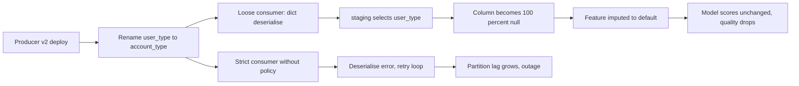
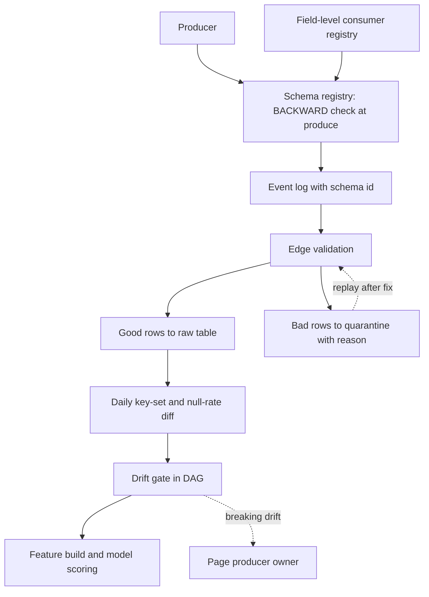

> **Scenario** - On Tuesday a producer renames `user_type` to `account_type` and adds a nested `preferences` object. The Kafka consumer keeps running because it deserialises to a dict. On Friday the churn model's `user_type` feature is 100% null, the model still returns scores, and the retention dashboard shows a suspiciously flat line.

## Why it matters

- Schema changes ship at producer velocity, not pipeline velocity. A single service team can deploy 20 times a week; your consumer was written once.
- A rename is worse than a removal. A removal usually errors; a rename produces a full column of nulls that flows into features, labels, and dashboards without complaint.
- One bad message can stop a partition forever. Without quarantine, a poison record turns a schema issue into an availability incident.
- ML amplifies drift. A null feature is imputed, the model keeps scoring, and by the time offline metrics catch it you have a week of degraded decisions.
- Debugging without a registry means reconstructing what the schema *was* on a given day from logs and memory.

## Symptoms

| Signal | What you observe |
| --- | --- |
| Column of nulls | `account_type` null rate jumps to 100% starting exactly at a deploy timestamp |
| New unexpected keys | Raw payload JSON contains `preferences.locale` that no model references |
| Consumer stuck | Kafka consumer lag on one partition grows linearly; the same offset retries forever |
| Type coercion warnings | `pandas` reads a column as `object` instead of `int64` because some rows now carry strings |
| Downstream cast failures | `CAST(payload->>'amount' AS NUMERIC)` fails when a producer starts sending `"12.50 USD"` |
| Silent enum growth | `status` distinct count goes from 5 to 43 without any code change on your side |

## How it breaks

Loosely-typed ingestion is convenient until it is the failure. When the pipeline deserialises to `dict` or lands raw JSON, adding, renaming, or retyping a field is accepted without complaint. Downstream, the staging model selects `payload->>'user_type'`, gets `NULL`, and casts it to a nullable column. Nothing errors.

The other extreme fails differently. A strictly typed consumer with no compatibility policy throws on the first unexpected field, the message is retried, it throws again, and the partition stops advancing. Now the schema change is an outage.



## Root causes

1. No schema registry, so there is no authoritative record of what the payload should look like on any given date.
2. No compatibility policy, so producers cannot know which changes are safe.
3. Consumers select fields by name with no assertion that the field exists and is populated.
4. No quarantine path, so an unparseable record must either be skipped silently or block the partition.
5. Null-rate and cardinality baselines are not tracked, so a 0% → 100% null shift produces no signal.
6. Field-level lineage is absent, so nobody can answer "which models read `user_type`?" before the rename ships.

## How to solve it

### 1. Register the schema and enforce compatibility

Use a registry with `BACKWARD` compatibility as the default. Under `BACKWARD`, a new schema must be readable by consumers using the previous schema: adding optional fields is fine, renaming or removing a required field is rejected at produce time.

```json
{
  "type": "record",
  "name": "UserProfileChanged",
  "namespace": "com.example.identity",
  "fields": [
    { "name": "user_id", "type": "string" },
    { "name": "occurred_at", "type": { "type": "long", "logicalType": "timestamp-micros" } },
    { "name": "account_type", "type": { "type": "enum", "name": "AccountType",
        "symbols": ["FREE", "PRO", "ENTERPRISE"] }, "default": "FREE" },
    { "name": "user_type", "type": ["null", "string"], "default": null,
      "doc": "DEPRECATED 2026-05-12: use account_type. Removal after 2026-08-12." },
    { "name": "preferences", "type": ["null", { "type": "map", "values": "string" }],
      "default": null }
  ]
}
```

A rename becomes: add the new field with a default, dual-write both for a deprecation window, then remove the old field in a separate release. That is three safe changes instead of one breaking one.

### 2. Validate structure at the edge and quarantine failures

```python
import json
import logging
from dataclasses import dataclass

import pandas as pd

logger = logging.getLogger(__name__)

EXPECTED = {
    "user_id": "object",
    "occurred_at": "datetime64[ns, UTC]",
    "account_type": "object",
}
ALLOWED_ENUM = {"FREE", "PRO", "ENTERPRISE"}


@dataclass
class SplitResult:
    good: pd.DataFrame
    quarantined: pd.DataFrame


def validate_batch(frame: pd.DataFrame) -> SplitResult:
    reasons = pd.Series("", index=frame.index)

    missing = [c for c in EXPECTED if c not in frame.columns]
    if missing:
        raise RuntimeError(f"structural drift: missing required columns {missing}")

    reasons = reasons.mask(frame["user_id"].isna(), "null_user_id")
    reasons = reasons.mask(
        ~frame["account_type"].isin(ALLOWED_ENUM) & (reasons == ""),
        "unknown_account_type",
    )
    reasons = reasons.mask(frame["occurred_at"].isna() & (reasons == ""), "unparsable_ts")

    bad = reasons != ""
    if bad.any():
        logger.warning("quarantining %d of %d rows: %s",
                       int(bad.sum()), len(frame),
                       reasons[bad].value_counts().to_dict())
    return SplitResult(
        good=frame.loc[~bad].copy(),
        quarantined=frame.loc[bad].assign(quarantine_reason=reasons[bad]),
    )
```

Two different responses on purpose: a *missing required column* is structural drift and should stop the pipeline; a *bad value in one row* is a data issue and belongs in quarantine.

### 3. Diff the observed schema every run

```sql
-- Observed key set per day, from landed JSON
WITH keys AS (
  SELECT DATE_TRUNC('day', ingested_at)::DATE AS day,
         jsonb_object_keys(payload)           AS key_name
  FROM raw.user_profile_changed
  WHERE ingested_at >= NOW() - INTERVAL '8 days'
),
daily AS (
  SELECT day, key_name, COUNT(*) AS occurrences
  FROM keys GROUP BY 1, 2
)
SELECT
  d.key_name,
  MAX(CASE WHEN d.day = CURRENT_DATE     THEN d.occurrences END) AS today,
  MAX(CASE WHEN d.day = CURRENT_DATE - 7 THEN d.occurrences END) AS week_ago
FROM daily d
GROUP BY 1
HAVING MAX(CASE WHEN d.day = CURRENT_DATE THEN d.occurrences END) IS NULL
    OR MAX(CASE WHEN d.day = CURRENT_DATE - 7 THEN d.occurrences END) IS NULL
ORDER BY 1;
```

Any key that appears only today (new field) or only a week ago (disappeared field) is drift worth a human glance.

### 4. Track null rate and cardinality as time series

```python
import pandas as pd


def drift_report(today: pd.DataFrame, baseline: pd.DataFrame) -> pd.DataFrame:
    rows = []
    for column in sorted(set(today.columns) | set(baseline.columns)):
        t = today[column] if column in today else pd.Series(dtype="object")
        b = baseline[column] if column in baseline else pd.Series(dtype="object")
        rows.append(
            {
                "column": column,
                "present_today": column in today.columns,
                "present_baseline": column in baseline.columns,
                "null_rate_today": float(t.isna().mean()) if len(t) else 1.0,
                "null_rate_baseline": float(b.isna().mean()) if len(b) else 1.0,
                "distinct_today": int(t.nunique(dropna=True)),
                "distinct_baseline": int(b.nunique(dropna=True)),
                "dtype_today": str(t.dtype),
                "dtype_baseline": str(b.dtype),
            }
        )
    report = pd.DataFrame(rows)
    report["null_rate_delta"] = report["null_rate_today"] - report["null_rate_baseline"]
    report["breaking"] = (
        (~report["present_today"] & report["present_baseline"])
        | (report["null_rate_delta"] > 0.2)
        | (report["dtype_today"] != report["dtype_baseline"])
    )
    return report.sort_values("breaking", ascending=False)
```

A null-rate delta above 0.2 on a feature the model uses is a page, not a ticket.

### 5. Wire the drift check into the DAG as a gate

```python
from datetime import datetime

from airflow.decorators import dag, task
from airflow.exceptions import AirflowFailException


@dag(dag_id="user_profile_drift_gate", schedule="@hourly",
     start_date=datetime(2026, 1, 1), catchup=False)
def user_profile_drift_gate():
    @task
    def check_drift():
        report = build_drift_report()          # returns the frame above
        breaking = report[report["breaking"]]
        if not breaking.empty:
            raise AirflowFailException(
                "schema drift: " + breaking["column"].tolist().__str__()
            )

    @task
    def build_features():
        ...

    check_drift() >> build_features()


user_profile_drift_gate()
```

### 6. Publish field-level consumers

Keep a machine-readable list of which features, models, and dashboards read each field. Before a producer removes `user_type`, they can see the three consumers that break.

## Target design



## Tradeoffs

| Option | Pros | Cons | Choose when |
| --- | --- | --- | --- |
| Strict registry with `BACKWARD` | Breaking changes rejected before they ship | Producers must adopt it; adds release friction | Multiple teams share an event log |
| Loose JSON + drift detection | No producer coordination needed; nothing blocks | Drift found after the fact, sometimes days later | You have no leverage over producers |
| Quarantine bad rows | Availability preserved; bad rows kept for triage | Aggregates slightly incomplete; needs a replay path | High-volume events, small bad fraction |
| Fail closed on any unknown field | Impossible to silently ignore a change | Additive changes cause outages | Regulated data where every field must be classified |

## Verification checklist

- [ ] Attempt to register a schema that removes a required field; the registry rejects it.
- [ ] Publish a message with an extra unknown field; the consumer processes it and logs the field name.
- [ ] Publish a message with an invalid enum value; it lands in quarantine with a reason and the partition keeps moving.
- [ ] Rename a field in a staging producer; the drift gate fails before the feature build task runs.
- [ ] Confirm null-rate and distinct-count metrics exist per column with at least 30 days of history.
- [ ] Query the consumer registry for a field and confirm it lists the models that read it.
- [ ] Replay a quarantined batch after a fix and confirm no duplicates in the raw table.

## Anti-patterns

- `SELECT *` from staging into marts, so an added upstream column silently changes downstream schemas and breaks views.
- Catching the deserialisation exception and `continue` - silent data loss with no quarantine record.
- Treating additive changes as always safe; adding a field that shares a name with a computed feature will shadow it.
- Pinning the consumer to an exact schema version and never upgrading, so drift accumulates until the migration is a project.
- Alerting on "schema changed" rather than "a field my consumers depend on changed".
- Imputing nulls for a feature before checking whether the null rate itself changed.

## Related

- [Data quality contracts between producers and consumers](/systems/data-pipelines-ml/data-quality-contracts)
- [Pipeline orchestration retries that do not amplify](/systems/data-pipelines-ml/pipeline-orchestration-retries)
- [Feature store consistency: offline vs online](/systems/data-pipelines-ml/feature-store-consistency)
- [Batch vs streaming: picking the cheaper correctness](/systems/data-pipelines-ml/batch-vs-streaming-pipelines)
