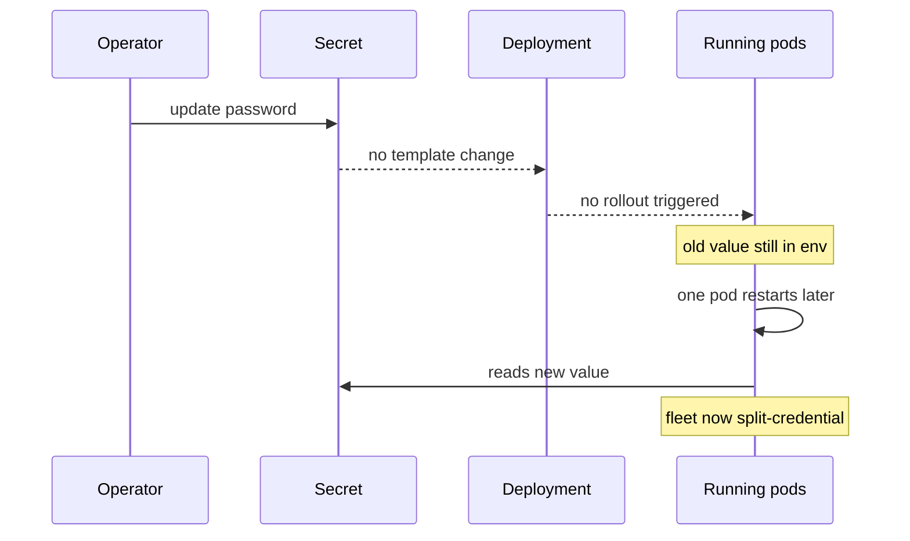
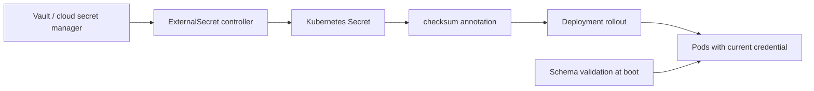

> **পরিস্থিতি** — Audit finding-এর পর security টিম database password rotate করল। Secret আপডেট হলো, ticket বন্ধ হলো, আর তিন দিন পর একটা pod restart হয়ে নতুন মান নিয়ে fail করল — কারণ অর্ধেক fleet কখনো restart হয়নি এবং পুরনো connection pool দিব্যি কাজ করছিল।

## কেন গুরুত্বপূর্ণ

- Environment variable হিসেবে নেওয়া secret container start-এ জমে যায়। Rollout না হলে Secret rotate করে কিছুই বদলায় না, তাই "rotated" আর "in use" নীরবে আলাদা হয়ে যায়।
- `kubectl get secret -o yaml` base64 দেয়, যা encoding — encryption নয়। Namespace-এ read RBAC থাকা যে কেউ plaintext পায়।
- পরিবেশভেদে config drift "staging-এ কাজ করে" ধরনের incident-এর বড় কারণ: unset variable প্রায়ই error না দিয়ে empty string হয়ে যায়।
- Git history-তে ঢোকা secret কার্যত স্থায়ী, commit revert করলেও।

## লক্ষণ

| Signal | যা দেখবেন |
|---|---|
| Rotation-এর পর | মিশ্র fleet: কিছু pod পুরনো credential, কিছু নতুন দিয়ে auth করছে |
| App log | শুধু নতুন তৈরি pod-এ `password authentication failed for user` |
| Config change | ConfigMap edit হলো, `kubectl rollout status` বলে কিছুই ঘটেনি |
| Audit | `kubectl auth can-i get secrets --as=...` অনেক বেশি subject-এর জন্য `yes` |
| Incident | Staging চলে, production এমন একটা variable-এ fail করে যা কেউ document করেনি |

## কীভাবে ভাঙে

দুটি ভিন্ন প্রক্রিয়া, দুই রকম failure।

Environment variable exec-এর সময় process-এ copy হয়। Secret বদলেছে বলে Kubernetes pod restart করবে না, কারণ Deployment-এর pod template hash অপরিবর্তিত — roll করার কিছু নেই। Mounted volume অবশ্য আপডেট হয় (kubelet সাধারণত এক মিনিটের মধ্যে refresh করে), কিন্তু তখনই কাজে লাগে যখন application file আবার পড়ে — বেশিরভাগ কেবল boot-এ একবার পড়ে।

অন্যদিকে validation ছাড়া config-এ key-নামের একটা typo `undefined` দেয়, যা `""` হয়, আর তা শেষে `localhost`-এ connection হয়ে দাঁড়ায়।



## মূল কারণ

1. Secret env var হিসেবে inject করা, যা process-এর আয়ুষ্কালজুড়ে immutable।
2. Pod template-কে Secret বা ConfigMap-এর content-এর সাথে বাঁধার কোনো annotation নেই।
3. Rotation পদ্ধতি store আপডেট করে কিন্তু কখনো rollout trigger করে না।
4. Dual-credential window নেই, তাই পুরনো ও নতুন একসাথে বৈধ থাকতে পারে না।
5. Config সরাসরি `process.env` থেকে পড়া হয়, startup-এ কোনো schema validation নেই।

## কীভাবে সমাধান করবেন

### ১. Config পরিবর্তনে rollout বাধ্য করুন

```yaml
apiVersion: apps/v1
kind: Deployment
spec:
  template:
    metadata:
      annotations:
        checksum/config: "{{ include (print $.Template.BasePath \"/configmap.yaml\") . | sha256sum }}"
        checksum/secret: "{{ .Values.dbPasswordSha }}"
    spec:
      containers:
        - name: api
          envFrom:
            - configMapRef: { name: api-config }
          env:
            - name: DB_PASSWORD
              valueFrom:
                secretKeyRef: { name: api-db, key: password }
```

Checksum বদলালেই pod template hash বদলায়, আর Kubernetes নিজে থেকেই Deployment roll করে।

### ২. External store থেকে secret আনুন

```yaml
apiVersion: external-secrets.io/v1beta1
kind: ExternalSecret
metadata:
  name: api-db
spec:
  refreshInterval: 1h
  secretStoreRef: { name: vault-backend, kind: ClusterSecretStore }
  target:
    name: api-db
    creationPolicy: Owner
  data:
    - secretKey: password
      remoteRef: { key: prod/api/db, property: password }
```

Source of truth হয় Vault বা cloud secret manager; Kubernetes Secret কেবল derived cache।

### ৩. Boot-এ config validate করে জোরে fail করুন

```ts
import { z } from 'zod'

const Env = z.object({
  DB_HOST: z.string().min(1),
  DB_PASSWORD: z.string().min(12),
  CACHE_TTL_SECONDS: z.coerce.number().int().positive().default(300),
})

export const env = Env.parse(process.env) // crash at boot, not at first request
```

### ৪. Overlap window সহ rotate করুন

```bash
# 1. add the new credential alongside the old at the provider
# 2. update the secret, then force every pod to adopt it
kubectl create secret generic api-db --from-literal=password="$NEW" \
  --dry-run=client -o yaml | kubectl apply -f -
kubectl rollout restart deploy/api -n prod
kubectl rollout status deploy/api -n prod --timeout=10m
# 3. only after 100% adoption, revoke the old credential
```

### ৫. Access সীমিত করুন

```bash
kubectl auth can-i get secrets --as=system:serviceaccount:prod:api -n prod
kubectl get rolebindings -n prod -o wide
```

## কাঙ্ক্ষিত ডিজাইন



## Tradeoff

| Option | সুবিধা | খরচ | কখন বেছে নেবেন |
|---|---|---|---|
| Secret থেকে env var | সহজ, সব জায়গায় চলে | restart ছাড়া জমে থাকে, describe/dump path-এ দৃশ্যমান | rotation runbook সহ static credential |
| Mounted volume | restart ছাড়াই kubelet refresh করে | app-কে file watch ও reload করতে হয় | hot-reload সমর্থনকারী দীর্ঘায়ু pod |
| External secret operator | কেন্দ্রীয় rotation ও audit trail | বাড়তি controller চালানো ও monitor করা | একাধিক cluster বা compliance প্রয়োজন |
| Sidecar agent injection | স্বল্পায়ু dynamic credential | sidecar lifecycle জটিলতা, pod-প্রতি বাড়তি memory | মাসের বদলে মিনিটের আয়ু চাই এমন DB credential |

## যাচাই checklist

- [ ] একটা ConfigMap key বদলালে rollout হয়, `kubectl rollout history` দিয়ে নিশ্চিত।
- [ ] Rotation-এর পর `kubectl get pods -o jsonpath` দেখায় প্রতিটি pod পরিবর্তনের পরে তৈরি।
- [ ] Required variable না থাকলে container boot-এই পরিষ্কার বার্তা দিয়ে crash করে।
- [ ] Production-এ developer ও CI service account-এর জন্য `kubectl auth can-i get secrets` denied।
- [ ] API server-এ secret encryption at rest (`EncryptionConfiguration`) চালু।
- [ ] পূর্ণ history-তে repository scan (`gitleaks detect`) শূন্য finding দেয়।

## Anti-pattern

- Repository private বলে আসল credential সহ `values-prod.yaml` commit করা।
- Rollout ছাড়াই Secret rotate করে ticket done চিহ্নিত করা।
- "debugging-এর জন্য" startup-এ পুরো config object log করা।
- Namespace-এর সব service-এর জন্য একটাই Secret, ফলে যেকোনো compromise সর্বাত্মক।
- "app একইভাবে পড়ে" যুক্তিতে ConfigMap-এ secret রাখা।

## সম্পর্কিত

- [CI/CD pipeline safety gates](/systems/devops-containers/ci-cd-pipeline-safety-gates)
- [Database migrations in the deploy pipeline](/systems/devops-containers/migrations-in-the-deploy-pipeline)
- [OAuth token lifecycle and tenant isolation](/systems/auth-security/oauth-token-lifecycle)
