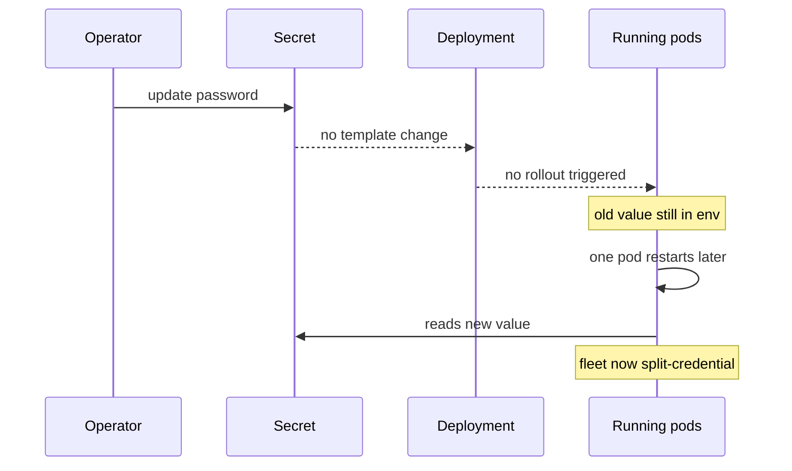
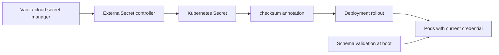

> **Scenario** — Security rotates the database password after an audit finding. The Secret is updated, the ticket is closed, and three days later a pod restarts, picks up the new value, and fails — because half the fleet never restarted and the old connection pool was still working fine.

## Why it matters

- Secrets consumed as environment variables are frozen at container start. Rotating the Secret changes nothing until a rollout happens, so "rotated" and "in use" drift apart silently.
- `kubectl get secret -o yaml` returns base64, which is encoding, not encryption. Anyone with read RBAC on the namespace has the plaintext.
- Config drift between environments is a leading cause of "works in staging" incidents: an unset variable often reads as an empty string rather than an error.
- Secrets in Git history are effectively permanent, even after the commit is reverted.

## Symptoms

| Signal | What you observe |
|---|---|
| Post-rotation | Mixed fleet: some pods authenticating with the old credential, some with the new |
| App logs | `password authentication failed for user` only on newly created pods |
| Config change | ConfigMap edited, `kubectl rollout status` shows nothing happened |
| Audit | `kubectl auth can-i get secrets --as=...` returns `yes` for far too many subjects |
| Incidents | Staging works, production fails on a variable nobody documented |

## How it breaks

Two mechanisms, two different failure shapes.

Environment variables are copied into the process at exec time. Kubernetes will not restart a pod because a Secret changed, so the Deployment's pod template hash is unchanged and there is nothing to roll. Mounted volumes do update (kubelet refreshes them, typically within a minute), but only if the application re-reads the file — most read once at boot.

Meanwhile, an unvalidated config means a typo in a key name produces `undefined`, which becomes `""`, which becomes a connection to `localhost`.



## Root causes

1. Secrets injected as env vars, which are immutable for the life of the process.
2. No annotation tying the pod template to the content of the Secret or ConfigMap.
3. Rotation procedure updates the store but never triggers a rollout.
4. No dual-credential window, so old and new cannot be valid simultaneously.
5. Config read directly from `process.env` with no schema validation at startup.

## How to solve it

### 1. Make config changes force a rollout

```yaml
apiVersion: apps/v1
kind: Deployment
spec:
  template:
    metadata:
      annotations:
        checksum/config: "{{ include (print $.Template.BasePath \"/configmap.yaml\") . | sha256sum }}"
        checksum/secret: "{{ .Values.dbPasswordSha }}"
    spec:
      containers:
        - name: api
          envFrom:
            - configMapRef: { name: api-config }
          env:
            - name: DB_PASSWORD
              valueFrom:
                secretKeyRef: { name: api-db, key: password }
```

Any change to the checksum changes the pod template hash, and Kubernetes rolls the Deployment automatically.

### 2. Source secrets from an external store

```yaml
apiVersion: external-secrets.io/v1beta1
kind: ExternalSecret
metadata:
  name: api-db
spec:
  refreshInterval: 1h
  secretStoreRef: { name: vault-backend, kind: ClusterSecretStore }
  target:
    name: api-db
    creationPolicy: Owner
  data:
    - secretKey: password
      remoteRef: { key: prod/api/db, property: password }
```

The source of truth becomes Vault or a cloud secret manager; the Kubernetes Secret is a derived cache.

### 3. Validate config at boot and fail loudly

```ts
import { z } from 'zod'

const Env = z.object({
  DB_HOST: z.string().min(1),
  DB_PASSWORD: z.string().min(12),
  CACHE_TTL_SECONDS: z.coerce.number().int().positive().default(300),
})

export const env = Env.parse(process.env) // crash at boot, not at first request
```

### 4. Rotate with an overlap window

```bash
# 1. add the new credential alongside the old at the provider
# 2. update the secret, then force every pod to adopt it
kubectl create secret generic api-db --from-literal=password="$NEW" \
  --dry-run=client -o yaml | kubectl apply -f -
kubectl rollout restart deploy/api -n prod
kubectl rollout status deploy/api -n prod --timeout=10m
# 3. only after 100% adoption, revoke the old credential
```

### 5. Lock down access

```bash
kubectl auth can-i get secrets --as=system:serviceaccount:prod:api -n prod
kubectl get rolebindings -n prod -o wide
```

## Target design



## Tradeoffs

| Option | Pros | Cons | Choose when |
|---|---|---|---|
| Env vars from Secret | Simple, works everywhere | Frozen until restart, visible in `kubectl describe pod` output paths | Static credentials with a rotation runbook |
| Mounted volume | Kubelet refreshes without restart | App must watch and reload the file | Long-lived pods with hot-reload support |
| External secret operator | Central rotation and audit trail | Extra controller to run and monitor | More than one cluster or compliance requirements |
| Sidecar agent injection | Short-lived dynamic credentials | Sidecar lifecycle complexity, extra memory per pod | Database credentials that should live minutes, not months |

## Verification checklist

- [ ] Changing one ConfigMap key triggers a rollout, confirmed with `kubectl rollout history`.
- [ ] After rotation, `kubectl get pods -o jsonpath` shows every pod created after the change.
- [ ] A missing required variable crashes the container at boot with a clear message.
- [ ] `kubectl auth can-i get secrets` is denied for developer and CI service accounts in production.
- [ ] Secret encryption at rest (`EncryptionConfiguration`) is enabled on the API server.
- [ ] A repository scan (`gitleaks detect`) reports zero findings on the full history.

## Anti-patterns

- Committing `values-prod.yaml` with real credentials because the repository is private.
- Rotating a Secret without a rollout and marking the ticket done.
- Logging the whole config object at startup "for debugging".
- Using one Secret for every service in the namespace, so any compromise is total.
- Storing secrets in ConfigMaps because "the app reads them the same way".

## Related

- [CI/CD pipeline safety gates](/systems/devops-containers/ci-cd-pipeline-safety-gates)
- [Database migrations in the deploy pipeline](/systems/devops-containers/migrations-in-the-deploy-pipeline)
- [OAuth token lifecycle and tenant isolation](/systems/auth-security/oauth-token-lifecycle)
