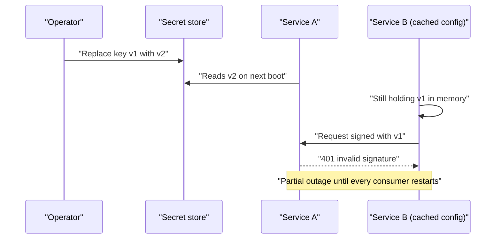
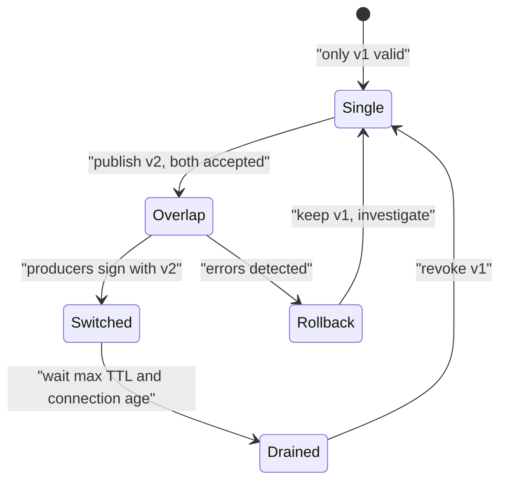

> **Scenario** - একজন contractor-এর laptop চুরি হলো। Team ঠিক করল database password, payment provider key ও JWT signing key rotate করবে। ৩১টা service-এর কোনটা কোনটা পড়ে কেউ জানে না, আর মার্চে শেষ rotation-এ ৪০ মিনিটের outage হয়েছিল। Rotation "release-এর পরে" পিছিয়ে দেওয়া হলো।

## Why it matters

- Rotation করার সক্ষমতাই আপনার incident containment। Key rotate করতে maintenance window লাগলে exposed key দিনের পর দিন valid থাকে।
- Secret সাদামাটা পথে leak হয়: CI log, শুরুর দিকের commit-এ `.env`, error page, Docker image layer, Slack paste।
- Service জুড়ে একটাই shared credential মানে এক compromise-এ সবকিছুর access revoke - fix নিজেই outage।
- Compliance framework rotation-এর প্রমাণ চায়, ইচ্ছা নয়। tested runbook ছাড়া "আমরা rotate করতে পারি" audit-এ fail।

## Symptoms

| Signal | What you observe |
| --- | --- |
| Consumer অজানা | কোন credential কোন service পড়ে তার inventory নেই; rotation-এ chat-এ জিজ্ঞেস করতে হয় |
| Rotation-এ outage | প্রতিটি অতীত rotation-এর সাথে incident ticket যুক্ত |
| দীর্ঘায়ু key | API key-এর `created_at` সবচেয়ে পুরনো employee-এর চেয়েও পুরনো |
| git history-তে secret | `git log -p -- .env` এখনো কাজ করা value দেয় |
| Build log exposure | `set -x` চালানো script-এর কারণে CI output-এ token |
| Shared identity | একটাই database user API, worker ও analytics-এর জন্য |

## How it breaks

Rotation fail করে যখন একটা secret-এর একসাথে কেবল একটাই valid value থাকে। তখন বদলানো মানে প্রতিটি consumer-এ atomic cut - যা অসম্ভব যখন consumer স্বাধীনভাবে deploy করে, configuration cache করে, বা দীর্ঘায়ু connection ধরে রাখে। Team শেখে rotation কষ্ট দেয়, তাই বন্ধ করে দেয়, আর key-এর বয়স বাড়ে যতক্ষণ exposure ওই কষ্টের পথেই ঠেলে দেয়।



## Root causes

1. Single-valued secret, overlap window নেই, তাই atomic cutover বাধ্যতামূলক।
2. কোন secret কে ব্যবহার করে ও কার মালিকানা - এমন inventory নেই।
3. Secret runtime-এ inject না হয়ে image বা committed file-এ bake করা।
4. একটা credential অনেক service share করে, তাই blast radius = পুরো platform।
5. Config শুধু boot-এ পড়া হয়, reload path নেই।
6. Rotation drill নেই, তাই প্রথম আসল rotation-ই প্রথম rehearsal।

## How to solve it

### 1. প্রতিটি secret দুটো valid value নিতে পারবে এভাবে ডিজাইন করুন

Signing key-এর জন্য `kid` সহ key set publish করুন, সব active key দিয়ে verify করুন, sign করুন নতুনটা দিয়ে:

```php
// config/jwt.php
'keys' => [
    'current' => env('JWT_KID_CURRENT', 'k2'),
    'set' => [
        'k1' => ['pem' => env('JWT_PUBLIC_K1'), 'retire_after' => '2026-09-01'],
        'k2' => ['pem' => env('JWT_PUBLIC_K2'), 'retire_after' => null],
    ],
],
```

```php
$kid = $header['kid'] ?? null;
$key = config("jwt.keys.set.{$kid}.pem");

abort_if($key === null, 401, 'unknown_kid');
```

Rotation দাঁড়ায়: `k2` যোগ করুন, verifier deploy করুন, signing `k2`-তে সরান, এক max token TTL অপেক্ষা করুন, `k1` সরান। Synchronised restart লাগে না।

Database ও provider credential-এর ক্ষেত্রে আগে নতুন credential বানান, একই privilege দিন, consumer roll করুন, তারপর পুরনোটা revoke করুন।

### 2. Runtime-এ inject করুন, কখনো bake নয়

```yaml
# k8s/deployment.yaml
apiVersion: apps/v1
kind: Deployment
spec:
  template:
    spec:
      containers:
        - name: api
          image: registry.example.com/api:2026.08.3
          env:
            - name: DB_PASSWORD
              valueFrom:
                secretKeyRef:
                  name: api-db
                  key: password
          volumeMounts:
            - name: signing-keys
              mountPath: /run/secrets/jwt
              readOnly: true
      volumes:
        - name: signing-keys
          secret:
            secretName: jwt-keys
            defaultMode: 0400
```

Mounted secret জায়গায় বসেই update ও reload করা যায়, image rebuild ছাড়া।

### 3. প্রতিটি service-কে নিজের identity দিন

Service-প্রতি আলাদা database user, least-privilege grant সহ:

```sql
CREATE ROLE api_svc LOGIN PASSWORD :'new_password';
GRANT SELECT, INSERT, UPDATE ON invoices, invoice_lines TO api_svc;

CREATE ROLE analytics_svc LOGIN PASSWORD :'analytics_password';
GRANT SELECT ON invoices TO analytics_svc;
```

এখন leak হওয়া analytics credential লিখতে পারে না, আর সেটা rotate করলে একটা service-ই ছোঁয়া লাগে।

### 4. Reload সস্তা করুন

Mounted file watch করে restart ছাড়া reload করুন, বা signal দিন:

```bash
#!/usr/bin/env bash
set -euo pipefail

# Reload nginx and PHP-FPM after a secret file changes, without dropping connections.
inotifywait -m -e close_write /run/secrets/jwt/current.pem | while read -r _; do
  nginx -t && nginx -s reload
  kill -USR2 "$(cat /run/php-fpm.pid)"
done
```

### 5. CI-তে leak বন্ধ করুন

```yaml
# .github/workflows/deploy.yml (excerpt)
jobs:
  deploy:
    steps:
      - name: Deploy
        env:
          DEPLOY_TOKEN: ${{ secrets.DEPLOY_TOKEN }}
        run: |
          set +x            # never trace commands that carry secrets
          ./bin/deploy.sh   # reads DEPLOY_TOKEN from env, not argv
```

Secret environment বা stdin দিয়ে দিন, কখনো command-line argument হিসেবে নয় (ওটা `ps`-এ ও build log-এ দেখা যায়)। pre-commit secret scanner যোগ করুন, history একবার scan করুন, আর যেকোনো historical hit-কে ইতিমধ্যেই compromised ধরুন।

### 6. Schedule ও rehearse করুন

Incident দেখে নয়, calendar দেখে rotate করুন। ত্রৈমাসিক game-day-তে production-এ একটা non-critical credential rotate করলে runbook কাজ করে কিনা প্রমাণ হয় আর overlap window সৎ থাকে।

## Target design



## Tradeoffs

| Option | Pros | Cons | Choose when |
| --- | --- | --- | --- |
| Host-এ `.env` file | সরল; dependency নেই | manual distribution; drift; সহজে leak | single server, ছোট team |
| Cloud secret manager | versioning, IAM, audit trail | vendor coupling; cold-start latency | অধিকাংশ cloud deployment |
| Vault + dynamic credential | স্বল্পায়ু cred; rotation স্বয়ংক্রিয় | operational complexity; নতুন critical dependency | অনেক service, কঠোর audit |
| git-এ sealed secret | GitOps-বান্ধব; reviewable | rotation-এ commit ও deploy লাগে | GitOps discipline সহ Kubernetes |
| Workload identity, static key নেই | চুরি বা rotate করার কিছু নেই | শুধু supported cloud service-এ চলে | cloud-native service-to-service auth |

## Verification checklist

- [ ] প্রতিটি secret-এর owner, consumer list ও rotation procedure documented।
- [ ] দুটো value valid রেখে rotation শেষ করা যায় - staging-এ যাচাই করা।
- [ ] `git log -p` ও image layer-এ কাজ করা কোনো credential নেই।
- [ ] Debug চালু করে job re-run করলেও CI log-এ কোনো secret আসে না।
- [ ] প্রতিটি service নিজের identity ও least-privilege grant দিয়ে authenticate করে।
- [ ] Key age monitor হয় এবং policy limit-এর আগেই alert দেয়।
- [ ] শেষ তিন মাসে production-এ একটি rotation drill হয়েছে।

## Anti-patterns

- Business hour-এ config edit করে সব একসাথে restart দিয়ে rotate করা।
- "integration কাজ করে" বলে staging-এ production key পুনঃব্যবহার।
- Secret শুধু CI provider-এ রাখা, provider down হলে কোনো export path নেই।
- Team-কে নতুন key email করে সেটাকেই distribution বলা।
- "repo private" বলে leak হওয়া key-কে নিরাপদ ভাবা।

## Related

- [The JWT revocation problem](/systems/auth-security/jwt-revocation-problem)
- [Audit logging that survives compliance review](/systems/auth-security/audit-logging-for-compliance)
- [SSRF and internal metadata exposure](/systems/auth-security/ssrf-and-internal-metadata)
