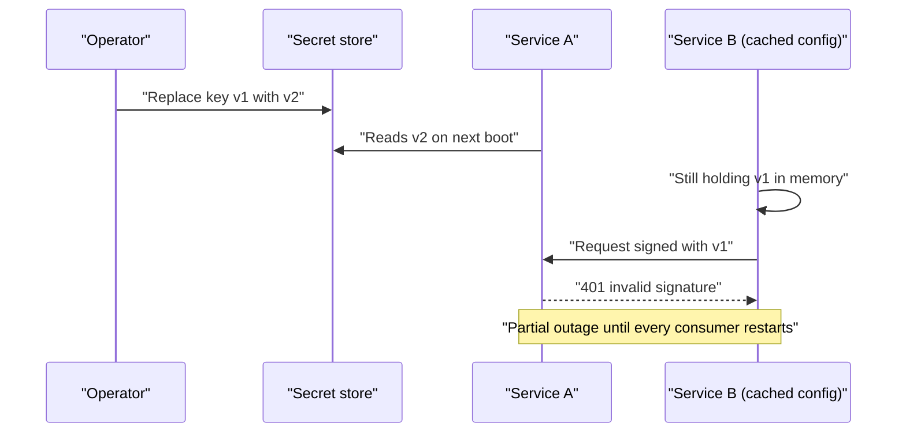
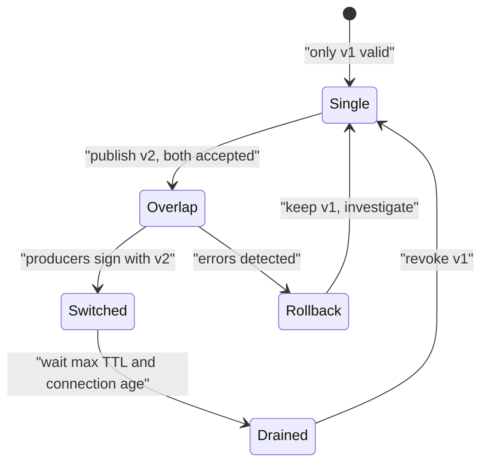

> **Scenario** - A contractor's laptop is stolen. The team decides to rotate the database password, the payment provider key, and the JWT signing key. Nobody knows which of the 31 services read each one, and the last rotation attempt in March caused a 40-minute outage. The rotation is postponed "until after the release".

## Why it matters

- Rotation capability *is* your incident containment. If rotating a key takes a maintenance window, an exposed key stays valid for days.
- Secrets leak through boring paths: CI logs, `.env` committed in an early commit, error pages, Docker image layers, Slack pastes.
- A single shared credential across services means one compromise revokes access for everything at once - the fix becomes an outage.
- Compliance frameworks ask for rotation evidence, not intent. "We can rotate" without a tested runbook fails the audit.

## Symptoms

| Signal | What you observe |
| --- | --- |
| Unknown consumers | No inventory maps credential to services; rotation requires asking in chat |
| Rotation causes outages | Every past rotation has an incident ticket attached |
| Long-lived keys | `created_at` on API keys is older than the oldest employee |
| Secrets in git history | `git log -p -- .env` returns values that still work |
| Build log exposure | CI output contains a token because a script ran with `set -x` |
| Shared identities | One database user serves API, workers, and analytics |

## How it breaks

Rotation fails when a secret has exactly one valid value at a time. Replacing it is then an atomic cut across every consumer - impossible when consumers deploy independently, cache configuration, or hold long-lived connections. Teams learn that rotation hurts, so they stop, and key age grows until an exposure forces the painful path anyway.



## Root causes

1. Single-valued secrets with no overlap window, forcing atomic cutovers.
2. No inventory linking each secret to its consumers and owners.
3. Secrets baked into images or committed files instead of injected at runtime.
4. One credential shared by many services, so blast radius equals the whole platform.
5. Config read once at boot with no reload path.
6. No rotation drill, so the first real rotation is also the first rehearsal.

## How to solve it

### 1. Design every secret to accept two valid values

For signing keys, publish a key set with a `kid` and verify against all active keys while signing with the newest:

```php
// config/jwt.php
'keys' => [
    'current' => env('JWT_KID_CURRENT', 'k2'),
    'set' => [
        'k1' => ['pem' => env('JWT_PUBLIC_K1'), 'retire_after' => '2026-09-01'],
        'k2' => ['pem' => env('JWT_PUBLIC_K2'), 'retire_after' => null],
    ],
],
```

```php
$kid = $header['kid'] ?? null;
$key = config("jwt.keys.set.{$kid}.pem");

abort_if($key === null, 401, 'unknown_kid');
```

Rotation becomes: add `k2`, deploy verifiers, switch signing to `k2`, wait one max token TTL, remove `k1`. No synchronised restart.

For database and provider credentials, create the new credential first, grant identical privileges, roll consumers, then revoke the old one.

### 2. Inject at runtime, never bake

```yaml
# k8s/deployment.yaml
apiVersion: apps/v1
kind: Deployment
spec:
  template:
    spec:
      containers:
        - name: api
          image: registry.example.com/api:2026.08.3
          env:
            - name: DB_PASSWORD
              valueFrom:
                secretKeyRef:
                  name: api-db
                  key: password
          volumeMounts:
            - name: signing-keys
              mountPath: /run/secrets/jwt
              readOnly: true
      volumes:
        - name: signing-keys
          secret:
            secretName: jwt-keys
            defaultMode: 0400
```

A mounted secret can be updated in place and reloaded without rebuilding an image.

### 3. Give every service its own identity

Separate database users per service with least-privilege grants:

```sql
CREATE ROLE api_svc LOGIN PASSWORD :'new_password';
GRANT SELECT, INSERT, UPDATE ON invoices, invoice_lines TO api_svc;

CREATE ROLE analytics_svc LOGIN PASSWORD :'analytics_password';
GRANT SELECT ON invoices TO analytics_svc;
```

Now a leaked analytics credential cannot write, and rotating it touches one service.

### 4. Make reload cheap

Watch the mounted file and reload without a restart, or expose a signal:

```bash
#!/usr/bin/env bash
set -euo pipefail

# Reload nginx and PHP-FPM after a secret file changes, without dropping connections.
inotifywait -m -e close_write /run/secrets/jwt/current.pem | while read -r _; do
  nginx -t && nginx -s reload
  kill -USR2 "$(cat /run/php-fpm.pid)"
done
```

### 5. Stop leaking in CI

```yaml
# .github/workflows/deploy.yml (excerpt)
jobs:
  deploy:
    steps:
      - name: Deploy
        env:
          DEPLOY_TOKEN: ${{ secrets.DEPLOY_TOKEN }}
        run: |
          set +x            # never trace commands that carry secrets
          ./bin/deploy.sh   # reads DEPLOY_TOKEN from env, not argv
```

Pass secrets by environment or stdin, never as command-line arguments (they appear in `ps` and in build logs). Add a pre-commit secret scanner and scan history once, treating any historical hit as already compromised.

### 6. Schedule and rehearse

Rotate on a calendar, not on incidents. A quarterly game-day that rotates a non-critical credential in production proves the runbook works and keeps the overlap window honest.

## Target design



## Tradeoffs

| Option | Pros | Cons | Choose when |
| --- | --- | --- | --- |
| `.env` files on hosts | Simple; no dependency | Manual distribution; drift; easy to leak | Single server, small team |
| Cloud secret manager | Versioning, IAM, audit trail | Vendor coupling; cold-start latency | Most cloud deployments |
| Vault with dynamic credentials | Short-lived creds; rotation is automatic | Operational complexity; new critical dependency | Many services, strict audit needs |
| Sealed secrets in git | GitOps friendly; reviewable | Rotation requires a commit and deploy | Kubernetes with GitOps discipline |
| Workload identity, no static keys | Nothing to steal or rotate | Only works for supported cloud services | Cloud-native service-to-service auth |

## Verification checklist

- [ ] Every secret has a documented owner, consumer list, and rotation procedure.
- [ ] A rotation can complete with both values valid, verified in staging.
- [ ] `git log -p` and image layers contain no working credentials.
- [ ] No secret appears in CI logs when a job is re-run with debug enabled.
- [ ] Each service authenticates with its own identity and least-privilege grants.
- [ ] Key age is monitored and alerts before the policy limit.
- [ ] A rotation drill has been executed in production within the last quarter.

## Anti-patterns

- Rotating by editing config and restarting everything at once during business hours.
- Reusing the production key in staging so "the integration works".
- Storing secrets in the CI provider only, with no export path if the provider is unavailable.
- Emailing a new key to the team and calling that distribution.
- Treating a leaked key as safe because "the repo is private".

## Related

- [The JWT revocation problem](/systems/auth-security/jwt-revocation-problem)
- [Audit logging that survives compliance review](/systems/auth-security/audit-logging-for-compliance)
- [SSRF and internal metadata exposure](/systems/auth-security/ssrf-and-internal-metadata)
