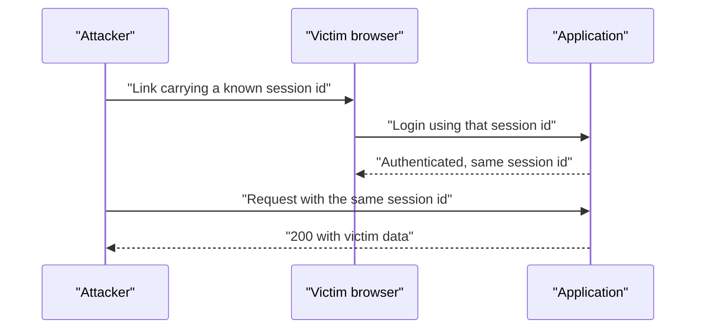
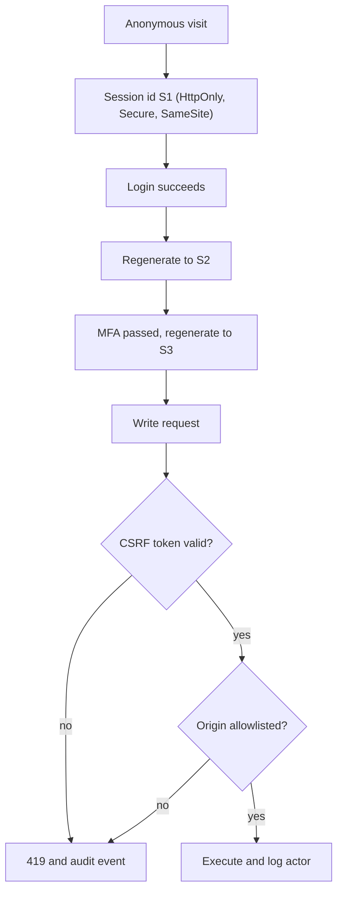

> **Scenario** — একজন support agent customer-কে "সহায়ক" একটা link পাঠাল। ওই link-এ agent-এর machine ইতিমধ্যে জানা একটা session identifier আছে। Customer login করার পর agent-এর browser customer-এর account-এর authenticated session ধরে বসে আছে — আর log-এ কিছুই অস্বাভাবিক দেখায় না।

## Why it matters

- Session fixation ও CSRF দুটোই attacker-কে password চুরি ছাড়াই বৈধ user হিসেবে কাজ করতে দেয়, তাই credential-strength control কোনো কাজে আসে না।
- Blast radius = victim যা করতে পারে: fund transfer, email বদল, নতুন admin invite। একটা state-changing request-ই যথেষ্ট।
- এই বাগ redesign-এও টিকে যায়, কারণ session layer সাধারণত framework default থেকে আসে আর কেউ আর দেখে না।
- Mitigation সস্তা (কয়েকটা cookie flag, একটা rotation call), তাই post-incident review-তে ব্যাখ্যা করা লজ্জার।

## Symptoms

| Signal | What you observe |
| --- | --- |
| Login-এর পরেও একই session ID | authentication-এর আগে ও পরে cookie value অভিন্ন |
| URL-এ ID | access log-এ `?PHPSESSID=` বা `;jsessionid=` query string |
| Write-এ token নেই | কোনো anti-CSRF token বা header check ছাড়াই `POST` সফল |
| ঢিলে cookie flag | `Set-Cookie`-তে `HttpOnly`, `Secure` বা `SameSite` নেই |
| Cross-origin write | সফল `POST`-এর Referer/Origin header অসম্পর্কিত domain দেখায় |
| অব্যাখ্যাত profile edit | user বলে email বা 2FA device সে বদলায়নি |

## How it breaks

Fixation একটা *pre-authentication* attack: attacker একটা session identifier বসিয়ে দেয়, victim সেটাতেই authenticate করে, আর attacker এখন authenticated session share করছে। CSRF একটা *post-authentication* attack: browser নিজেই cookie জুড়ে দেয়, তাই অসম্পর্কিত page থেকে submit করা form-ও victim-এর session বহন করে। দুটোই এই সত্য ব্যবহার করে যে cookie হলো ambient authority — কে request শুরু করেছে তা নির্বিশেষে সেটা সঙ্গে যায়।



## Root causes

1. Authentication বা privilege elevation-এ session identifier regenerate হয় না।
2. User-controlled input (query string, unvalidated cookie value) থেকে session শুরু করা যায়।
3. State-changing endpoint same-site intent প্রমাণ ছাড়াই request নেয়।
4. Cookie `HttpOnly`, `Secure`, `SameSite` ছাড়া issue হয়, তাই script ও cross-site page সেটা ব্যবহার করতে পারে।
5. `GET` endpoint write করে, যেটা কোনো CSRF token scheme default-এ রক্ষা করে না।
6. CORS ঢিলে করে reflected origin-এর সাথে `Access-Control-Allow-Credentials: true` দেওয়া।

## How to solve it

### 1. প্রতিটি trust change-এ session rotate করুন

```php
// app/Http/Controllers/Auth/LoginController.php
public function store(LoginRequest $request)
{
    $request->authenticate();

    // New identifier, same session data: kills fixation.
    $request->session()->regenerate();

    // Also rotate after MFA completion, password change, and role elevation.
    return redirect()->intended('/dashboard');
}
```

Logout-এও `$request->session()->invalidate()` ও `regenerateToken()` করুন যাতে CSRF token পুনঃব্যবহারযোগ্য না থাকে।

### 2. Cookie flag স্পষ্টভাবে সেট করুন

```php
// config/session.php
'secure' => true,          // HTTPS only
'http_only' => true,       // no document.cookie access
'same_site' => 'lax',      // 'strict' for admin surfaces
'partitioned' => false,
'lifetime' => 120,
'expire_on_close' => false,
```

ফলাফল header:

```
Set-Cookie: app_session=…; Path=/; HttpOnly; Secure; SameSite=Lax
```

`Lax` top-level navigation `GET` allow করে (সাধারণ link কাজ করে) কিন্তু cross-site `POST` আটকায়। Banking-ধরনের বা admin-only app-এ `Strict` সঠিক, যেখানে inbound link-এ authenticated session লাগে না।

### 3. প্রতিটি write-এ synchroniser token লাগবে

Laravel-এর `VerifyCsrfToken` middleware web route cover করে; কাজ হলো জিনিস *exclude না করা*:

```php
// bootstrap/app.php
->withMiddleware(function (Middleware $middleware) {
    $middleware->validateCsrfTokens(except: [
        'webhooks/stripe', // signature-verified, no cookie auth
    ]);
})
```

SPA-তে token header হিসেবে পাঠান:

```ts
const token = document.querySelector<HTMLMetaElement>('meta[name="csrf-token"]')?.content ?? ''

await fetch('/api/invoices/9182/approve', {
  method: 'POST',
  credentials: 'same-origin',
  headers: {
    'X-CSRF-TOKEN': token,
    'Content-Type': 'application/json',
  },
  body: JSON.stringify({ note: 'approved' }),
})
```

### 4. দ্বিতীয় স্তর হিসেবে origin যাচাই করুন

`SameSite` browser behaviour, server guarantee নয় — পুরনো client ও non-browser caller এটা মানে না। Cookie-authenticated write-এ server-side `Origin` header দেখুন:

```php
$origin = $request->headers->get('Origin');

if ($request->isMethod('POST') && $origin && ! in_array($origin, config('app.allowed_origins'), true)) {
    abort(403, 'origin_not_allowed');
}
```

### 5. URL থেকে session id কখনো নেবেন না

```ini
; php.ini
session.use_only_cookies = 1
session.use_strict_mode = 1
session.use_trans_sid = 0
```

`use_strict_mode` PHP-কে নিজে issue না করা identifier reject করায়, যা fixation-এর plant ধাপ সরিয়ে দেয়।

### 6. `GET`-এ write রাখবেন না

Idempotent read `GET`-এ, বাকি সব `POST`/`PATCH`/`DELETE`-এ token সহ। `GET /account/delete` একটা `` tag থেকেই exploit করা যায়।

## Target design



## Tradeoffs

| Option | Pros | Cons | Choose when |
| --- | --- | --- | --- |
| `SameSite=Lax` | inbound link-এ session থাকে; cross-site POST আটকায় | top-level `GET`-এ cookie যায় | external link সহ consumer app |
| `SameSite=Strict` | সবচেয়ে শক্ত default | email থেকে আসা user logged out দেখায় | admin console, financial flow |
| Synchroniser token | browser support নির্বিশেষে কাজ করে | server session state লাগে; SPA-তে plumbing | cookie-authenticated app |
| Double-submit cookie | server-এ stateless | কোনো subdomain attacker-নিয়ন্ত্রিত হলে দুর্বল | একই cookie domain-এর stateless API |
| Header-এ bearer token | নির্মাণগতভাবে CSRF-immune | token storage নতুন ঝুঁকি | native ও third-party API client |

## Verification checklist

- [ ] Login-এর আগে ও পরে session cookie capture করে value বদলেছে কিনা দেখুন।
- [ ] `Set-Cookie`-তে `HttpOnly`, `Secure` ও স্পষ্ট `SameSite` আছে।
- [ ] বৈধ session cookie কিন্তু CSRF token ছাড়া `curl -X POST` করে 419/403 নিশ্চিত করুন।
- [ ] `Origin: https://evil.example` দিয়ে write replay করে reject হওয়া দেখুন।
- [ ] state বদলায় এমন `Route::get` handler grep করে দেখুন।
- [ ] Logout শুধু cookie clear নয়, server-side session invalidate করে।
- [ ] CORS config credentials সহ যেকোনো origin reflect করে না।

## Anti-patterns

- "SPA ঝামেলা করে" বলে পুরো route group CSRF verification থেকে বাদ দেওয়া।
- শুধু `SameSite`-এর উপর ভরসা করে token তুলে দেওয়া।
- `Referer` check-কে যথেষ্ট ভাবা (এটা strip করা যায়, প্রায়ই থাকে না)।
- প্রথম visit থেকে logout পর্যন্ত একটাই দীর্ঘায়ু session id ব্যবহার।
- শুধু `POST` verb রক্ষা করে `PUT`/`DELETE` অরক্ষিত রাখা।

## Related

- [The JWT revocation problem](/systems/auth-security/jwt-revocation-problem)
- [OAuth token lifecycle and tenant isolation](/systems/auth-security/oauth-token-lifecycle)
- [Password reset flow attacks](/systems/auth-security/password-reset-flow-attacks)
