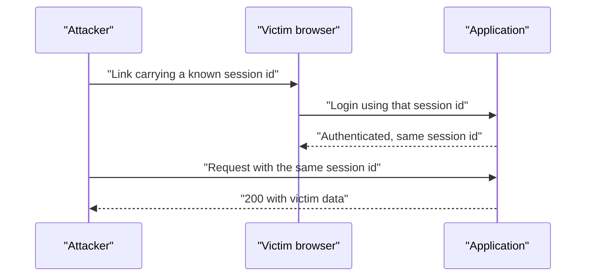
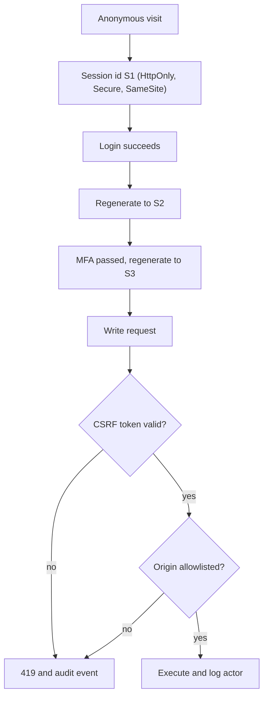

> **Scenario** — A support agent forwards a "helpful" link to a customer. The link carries a session identifier the agent's machine already knows. After the customer logs in, the agent's browser is holding an authenticated session for the customer's account — and nothing in the logs looks abnormal.

## Why it matters

- Session fixation and CSRF both let an attacker act as a legitimate user without ever stealing a password, so credential-strength controls do nothing.
- The blast radius is whatever the victim can do: transfer funds, change an email, invite a new admin. One state-changing request is enough.
- These bugs survive redesigns because the session layer is usually inherited from a framework default and never revisited.
- Mitigations are cheap (a few cookie flags, one rotation call), which makes them embarrassing to explain in a post-incident review.

## Symptoms

| Signal | What you observe |
| --- | --- |
| Session ID stable across login | The cookie value before and after authentication is identical |
| ID in URLs | Access logs contain `?PHPSESSID=` or `;jsessionid=` query strings |
| Missing token on writes | `POST` handlers succeed without any anti-CSRF token or header check |
| Permissive cookie flags | `Set-Cookie` lacks `HttpOnly`, `Secure`, or `SameSite` |
| Cross-origin writes | Referer/Origin headers on successful `POST` requests point at unrelated domains |
| Unexplained profile edits | Users report an email or 2FA device they did not change |

## How it breaks

Fixation is a *pre-authentication* attack: the attacker plants a session identifier, the victim authenticates into it, and the attacker now shares an authenticated session. CSRF is a *post-authentication* attack: the browser attaches cookies automatically, so a form submitted from an unrelated page carries the victim's session. Both exploit the fact that a cookie is ambient authority — it travels with the request regardless of who initiated it.



## Root causes

1. The session identifier is not regenerated at authentication or at any privilege elevation.
2. Sessions can be initialised from user-controlled input (query string, unvalidated cookie value).
3. State-changing endpoints accept requests without proving same-site intent.
4. Cookies are issued without `HttpOnly`, `Secure`, or `SameSite`, so scripts and cross-site pages can use them.
5. `GET` endpoints perform writes, which no CSRF token scheme protects by default.
6. CORS is relaxed to `Access-Control-Allow-Credentials: true` with a reflected origin.

## How to solve it

### 1. Rotate the session at every trust change

```php
// app/Http/Controllers/Auth/LoginController.php
public function store(LoginRequest $request)
{
    $request->authenticate();

    // New identifier, same session data: kills fixation.
    $request->session()->regenerate();

    // Also rotate after MFA completion, password change, and role elevation.
    return redirect()->intended('/dashboard');
}
```

Do the same on logout with `$request->session()->invalidate()` plus `regenerateToken()` so the CSRF token is not reusable.

### 2. Set the cookie flags explicitly

```php
// config/session.php
'secure' => true,          // HTTPS only
'http_only' => true,       // no document.cookie access
'same_site' => 'lax',      // 'strict' for admin surfaces
'partitioned' => false,
'lifetime' => 120,
'expire_on_close' => false,
```

The resulting header:

```
Set-Cookie: app_session=…; Path=/; HttpOnly; Secure; SameSite=Lax
```

`Lax` allows top-level navigation `GET`s (so normal links keep working) while blocking cross-site `POST`s. `Strict` is correct for banking-style or admin-only apps where inbound links never need an authenticated session.

### 3. Require a synchroniser token on every write

Laravel's `VerifyCsrfToken` middleware covers web routes; the work is to *not* exclude things:

```php
// bootstrap/app.php
->withMiddleware(function (Middleware $middleware) {
    $middleware->validateCsrfTokens(except: [
        'webhooks/stripe', // signature-verified, no cookie auth
    ]);
})
```

For the SPA, send the token as a header:

```ts
const token = document.querySelector<HTMLMetaElement>('meta[name="csrf-token"]')?.content ?? ''

await fetch('/api/invoices/9182/approve', {
  method: 'POST',
  credentials: 'same-origin',
  headers: {
    'X-CSRF-TOKEN': token,
    'Content-Type': 'application/json',
  },
  body: JSON.stringify({ note: 'approved' }),
})
```

### 4. Verify origin as a second layer

`SameSite` is a browser behaviour, not a server guarantee — older clients and non-browser callers ignore it. Check the `Origin` header server-side for cookie-authenticated writes:

```php
$origin = $request->headers->get('Origin');

if ($request->isMethod('POST') && $origin && ! in_array($origin, config('app.allowed_origins'), true)) {
    abort(403, 'origin_not_allowed');
}
```

### 5. Never accept a session id from the URL

```ini
; php.ini
session.use_only_cookies = 1
session.use_strict_mode = 1
session.use_trans_sid = 0
```

`use_strict_mode` makes PHP reject identifiers it did not issue, which removes the plant step of fixation.

### 6. Keep writes out of `GET`

Idempotent reads on `GET`, everything else on `POST`/`PATCH`/`DELETE` with a token. A `GET /account/delete` link is exploitable from an `` tag.

## Target design



## Tradeoffs

| Option | Pros | Cons | Choose when |
| --- | --- | --- | --- |
| `SameSite=Lax` | Inbound links keep sessions; blocks cross-site POST | Top-level `GET` still carries the cookie | Consumer apps with external links |
| `SameSite=Strict` | Strongest default | Users arriving from email appear logged out | Admin consoles, financial flows |
| Synchroniser token | Works regardless of browser support | Needs server session state; token plumbing in SPAs | Cookie-authenticated apps |
| Double-submit cookie | Stateless on the server | Weaker if any subdomain is attacker-controlled | Stateless APIs sharing a cookie domain |
| Bearer token in header | CSRF-immune by construction | Token storage becomes the new risk | Native and third-party API clients |

## Verification checklist

- [ ] Capture the session cookie before and after login and confirm the value changed.
- [ ] Confirm `Set-Cookie` includes `HttpOnly`, `Secure`, and an explicit `SameSite`.
- [ ] `curl -X POST` a write endpoint with a valid session cookie but no CSRF token and confirm 419/403.
- [ ] Replay a write with `Origin: https://evil.example` and confirm rejection.
- [ ] Grep routes for `Route::get` handlers that mutate state.
- [ ] Confirm logout invalidates the session server-side, not just clears the cookie.
- [ ] Confirm CORS config does not reflect arbitrary origins with credentials enabled.

## Anti-patterns

- Excluding whole route groups from CSRF verification "because the SPA is annoying".
- Relying on `SameSite` alone and removing tokens.
- Treating a `Referer` check as sufficient (it is strippable and often absent).
- Reusing one long-lived session id from first visit through logout.
- Blocking only the `POST` verb while `PUT`/`DELETE` remain unprotected.

## Related

- [The JWT revocation problem](/systems/auth-security/jwt-revocation-problem)
- [OAuth token lifecycle and tenant isolation](/systems/auth-security/oauth-token-lifecycle)
- [Password reset flow attacks](/systems/auth-security/password-reset-flow-attacks)
