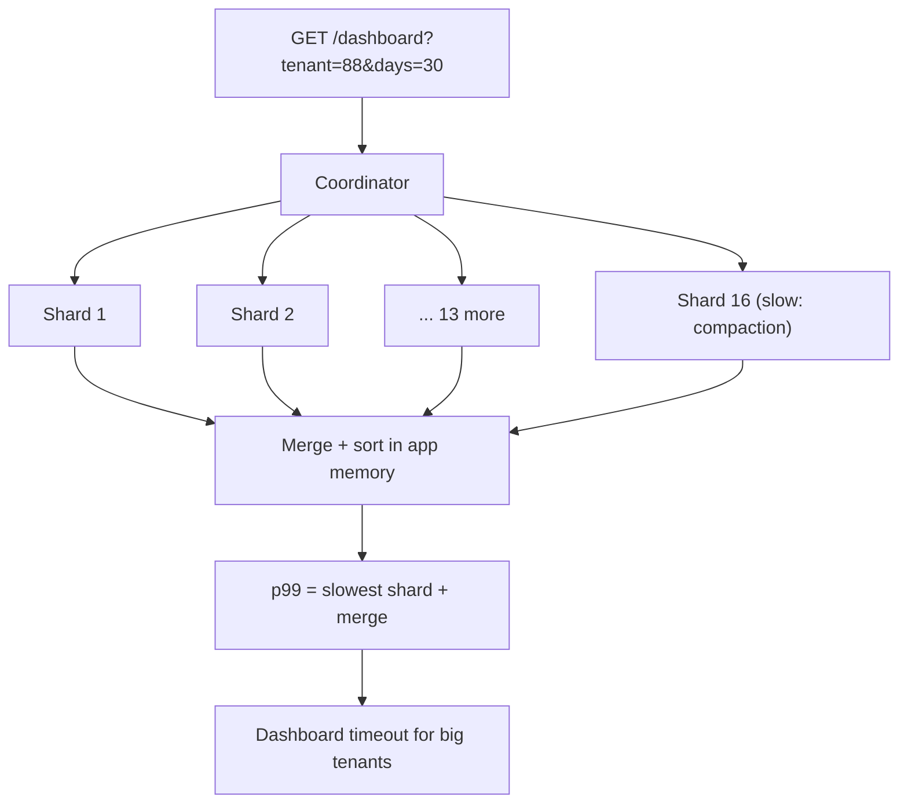
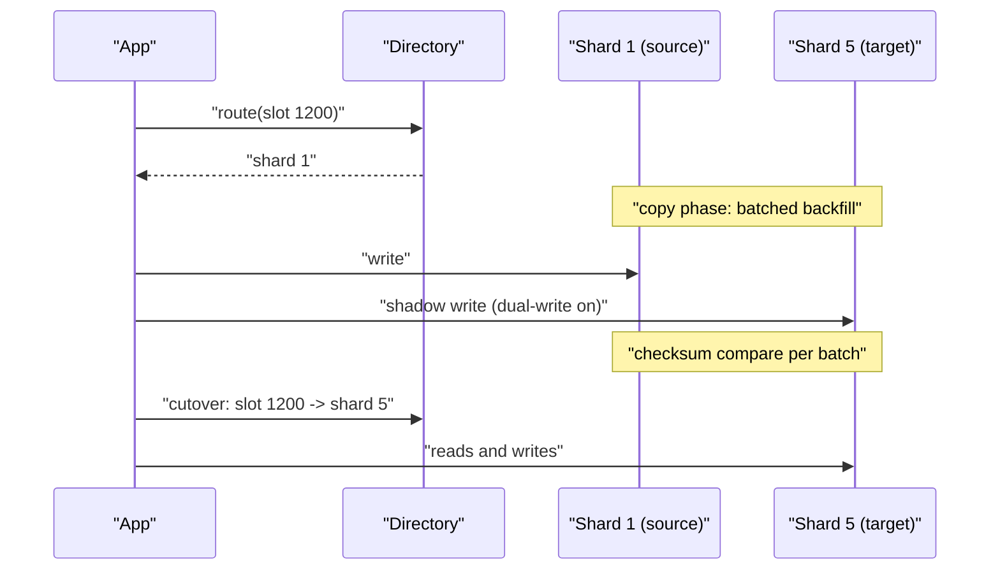
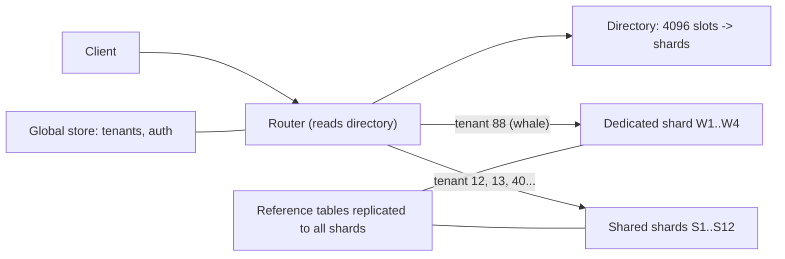

> **Scenario** - একটি B2B analytics product সমান distribution-এর জন্য `events` table `event_id` hash দিয়ে shard করেছিল। আঠারো মাস পরে প্রতিটি customer-facing query `tenant_id` ও date দিয়ে filter করে, ফলে প্রতিটি dashboard load ১৬টি shard-এ fan out করে, আর p99 = সবচেয়ে ধীর shard + network। এখন `tenant_id` দিয়ে reshard করা দুই quarter-এর প্রকল্প।

## কেন গুরুত্বপূর্ণ

- Shard key সবচেয়ে কঠিন উল্টানো সিদ্ধান্ত: এটা প্রতিটি query, প্রতিটি index ও প্রতিটি backfill job-এ গেঁথে যায়।
- ভুল key single-shard lookup-কে scatter-gather বানায়, তাই p99 হয়ে যায় N shard-এর *সর্বোচ্চ*, একটার median নয়।
- Cross-shard join ও cross-shard transaction হয় অসম্ভব, নয় এত ধীর যে product feature বাতিল হয়।
- Distribution ও locality বিপরীত দিকে টানে: hash load ছড়ায় কিন্তু range scan নষ্ট করে; range locality রাখে কিন্তু hot shard বানায়।
- Live reshard-এ dual-write, backfill ও verification tooling লাগে, যার budget কেউ আগে রাখে না।

## লক্ষণ

| Signal | যা দেখবেন |
| --- | --- |
| Query fan-out metric | Median request ১৬-র মধ্যে ১২+ shard ছোঁয় |
| Latency-র আকার | p99 ≈ সবচেয়ে ধীর shard-এর p99; shard বাড়ালে আরও খারাপ |
| Shard size | একটি shard ৩.১ TB, বাকিগুলো ৪০০ GB |
| Write throughput | কর্মঘণ্টায় ৮০% write দুটি shard-এ পড়ে |
| App code | "সব shard-এর result merge করো" helper-এর ক্রমবর্ধমান library |
| ব্যর্থ feature | "এই tenant-এর শেষ ৩০ দিন দেখাও" বড় tenant-এ timeout |

## কীভাবে ভাঙে

একটি সিদ্ধান্ত থেকে দুই ধরনের ব্যর্থতা আসে। Key যদি query predicate-এর সাথে সম্পর্কহীন হয়, প্রতিটি read scatter-gather হয়: coordinator সব shard-এ query করে, সবচেয়ে ধীরটির জন্য অপেক্ষা করে, তারপর application memory-তে merge করে। Tail latency জমা হয় - ১৬টি shard-এর প্রতিটির যদি ২০০ ms hiccup-এর সম্ভাবনা ১%, তবে প্রায় ১৫% request অন্তত একটি slow shard পায়।

Key যদি load-এর সাথে অতিরিক্ত correlate করে - যেমন `tenant_id` যেখানে এক tenant-ই ৪০% traffic, বা timestamp যেখানে সব write "আজ"-এ যায় - উল্টো সমস্যা: এক shard saturate, বাকিরা idle, আর shard যোগ করে capacity বাড়ানো যায় না।



## মূল কারণ

1. শুধু *সমান distribution* দেখে key বাছা, প্রধান query predicate উপেক্ষা করে।
2. Monotonic key (auto-increment id, `created_at`) বাছা, ফলে সব write সর্বশেষ shard-এ যায়।
3. কম cardinality-র key (`country`, `status`, `plan`) যা হাতেগোনা কয়েকটি মানের বাইরে ছড়াতে পারে না।
4. Mutable key - এমন value দিয়ে shard করা যা পরে user বদলাতে পারে, ফলে cross-shard row move।
5. Launch-এর আগে per-tenant size analysis নেই, তাই whale tenant কখনও model করা হয়নি।
6. Modulo-ভিত্তিক routing (`hash % 16`), যেখানে shard count বদলালেই পুরো rebalance লাগে।

## কীভাবে সমাধান করবেন

### ১. বাছার আগে query mix মাপুন

আসল query predicate গুলোকে volume ও latency budget অনুযায়ী rank করুন। যে query গুলো user-facing latency নিয়ন্ত্রণ করে, shard key তাদের `WHERE`-এ থাকতে হবে।

```sql
-- PostgreSQL: আমরা আসলে কী দিয়ে query করি?
SELECT calls,
       round(mean_exec_time::numeric, 2) AS mean_ms,
       round(total_exec_time::numeric / 1000, 1) AS total_s,
       left(query, 90) AS q
FROM pg_stat_statements
WHERE query ILIKE '%FROM events%'
ORDER BY total_exec_time DESC
LIMIT 20;
```

মোট সময়ের ৮৫% যদি `tenant_id` filter-করা query-তে যায়, key হলো `tenant_id` - এমনকি যদি তার মানে হয় অসম shard, যা আলাদাভাবে সামলাতে হবে।

### ২. Composite key ভালো: locality + spread

Tenant দিয়ে shard করুন, তারপর tenant-এর *ভেতরে* range বা hash - যাতে single-tenant query এক shard-এ থাকে আর whale tenant তবুও ভাগ করা যায়।

```sql
-- প্রতিটি row-এ routing value, insert-এ একবার হিসাব
ALTER TABLE events ADD COLUMN shard_key text;

-- tenant:bucket - ছোট tenant এক bucket, whale বহু bucket
UPDATE events
SET shard_key = tenant_id || ':' ||
                (abs(hashtext(event_id::text)) % CASE
                   WHEN tenant_id IN (SELECT tenant_id FROM tenant_whales) THEN 64
                   ELSE 1 END)::text
WHERE shard_key IS NULL;

CREATE INDEX CONCURRENTLY idx_events_shard_tenant_time
  ON events (shard_key, created_at DESC);
```

### ৩. Modulo নয়, lookup table দিয়ে routing

একটি directory service key range থেকে physical shard-এ map করে, তাই এক range সরালে সবকিছু rebalance হয় না।

```ts
type ShardRange = { lo: number; hi: number; shard: string }

// Directory table থেকে লোড, ছোট TTL ও version number সহ cache
const ranges: ShardRange[] = await loadShardMap()

export function routeFor(shardKey: string): string {
  const slot = crc32(shardKey) % 4096      // নির্দিষ্ট virtual slot space
  const range = ranges.find((r) => slot >= r.lo && slot <= r.hi)
  if (!range) throw new Error(`no shard for slot ${slot}`)
  return range.shard
}
```

৪০৯৬টি নির্দিষ্ট virtual slot পরিবর্তনশীল সংখ্যক physical shard-এ map করা হলো standard কৌশল: shard split মানে slot range পুনর্বণ্টন, row rehash নয়।

### ৪. Dual-write ও verify দিয়ে online range move



Cutover-এর আগে per-range checksum দিয়ে যাচাই:

```sql
-- দুই shard-এ চালান; directory flip করার আগে hash মিলতে হবে
SELECT md5(string_agg(id::text || ':' || updated_at::text, ',' ORDER BY id))
FROM events
WHERE shard_key >= 'tenant_0088:0' AND shard_key < 'tenant_0089:0';
```

### ৫. অল্প কিছু global table রাখুন

Reference data (plan, feature flag, currency rate) shard-এর মধ্যে join না করে প্রতিটি shard-এ replicate করুন। যা সত্যিই global - tenant directory, auth - আলাদা unsharded store-এ থাকুক, নিজের scaling গল্প নিয়ে।

### ৬. Whale-দের প্রতিবেশীর ক্ষতি করার আগেই আলাদা করুন

Per-tenant volume track করুন, শীর্ষ কয়েকটি tenant-কে dedicated shard দিন। নিখুঁত uniformity design করার চেয়ে এটা সস্তা এবং billing-এর সাথেও মেলে।

## Target design



## Tradeoff

| Option | সুবিধা | খরচ | কখন বাছবেন |
| --- | --- | --- | --- |
| Entity id-তে hash | সমান distribution, সহজ | প্রতিটি filtered query scatter-gather | শুধু id দিয়ে key-value access |
| Tenant id-তে hash | Single-shard tenant query | Whale tenant hot shard বানায় | B2B SaaS, per-tenant workload |
| Time-এ range | সস্তা retention (পুরনো partition drop) | সব write নতুন partition-এ | Time-bounded read সহ append-only telemetry |
| Composite `tenant:bucket` | Locality + whale split | Routing logic ও directory maintain | মিশ্র tenant size |
| এখনই shard নয় - partition | Reversible, এক operational surface | এক machine-এর write capacity-তে সীমিত | ~২ TB বা ~২০ হাজার write/s-এর নিচে |

## যাচাই checklist

- [ ] মোট সময়ে শীর্ষ ২০ query-র সবগুলোর predicate-এ shard key আছে।
- [ ] Fan-out metric (per request `shards_touched`) export করা, user-facing read-এ p50 = 1।
- [ ] Commit করার আগে এক সপ্তাহের production query log-এ simulated shard map replay করা।
- [ ] Per-shard size, write rate ও CPU এক dashboard-এ; median-এর ২× হলে skew alert।
- [ ] Staging-এ এক shard split end-to-end rehearse করা, checksum verification ও rollback সহ।
- [ ] Whale detection job কোনো tenant shard-এর ৫% write ছাড়ালে flag করে।
- [ ] Cross-shard transaction path তালিকাভুক্ত; প্রতিটির documented saga আছে বা review-তে নিষিদ্ধ।

## Anti-pattern

- `hash(id) % shard_count` দিয়ে shard করে পরে `shard_count` বদলানোর দরকার হওয়া।
- Composite index দিয়ে ঠিক হতো এমন query ঠিক করতে shard করা।
- Mutable column-এ shard করে incident-এর চাপে "tenant shard-এর মাঝে সরাও" script লেখা।
- Application code-এ unbounded page size নিয়ে shard জুড়ে join করা।
- একই logical entity-র জন্য প্রতিটি service নিজের shard key বাছতে দেওয়া।
- `SELECT ... LIMIT 20 ORDER BY created_at`-কে সস্তা ভাবা, যখন এটা ১৬ shard থেকে merge করতে হয়।
- Incident-এর সময় shard যোগ করা: rebalance ঠিক সেই IO খায় যেটার ঘাটতি চলছে।

## সম্পর্কিত

- [Hot partition ও hot row সামলানো](/systems/data-storage/hot-partition-mitigation)
- [Storage layer-এ multi-tenant data isolation](/systems/data-storage/multi-tenant-data-isolation)
- [Replication lag ও read-your-writes](/systems/data-storage/replication-lag-read-your-writes)
- [Index design ও query plan পড়া](/systems/data-storage/index-design-and-query-plans)
