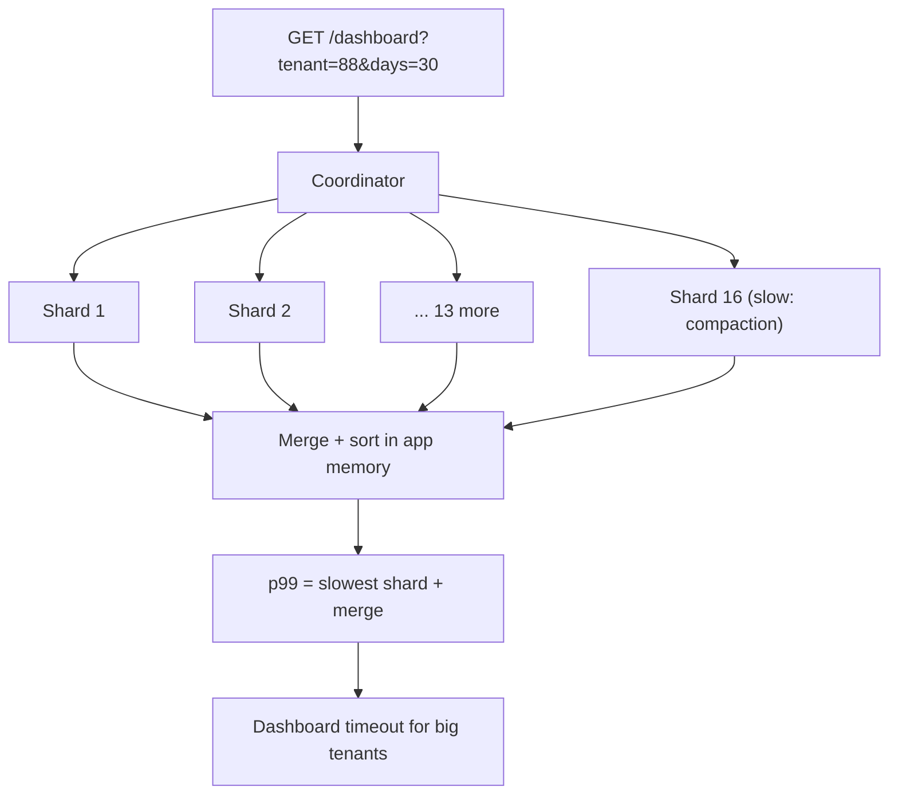
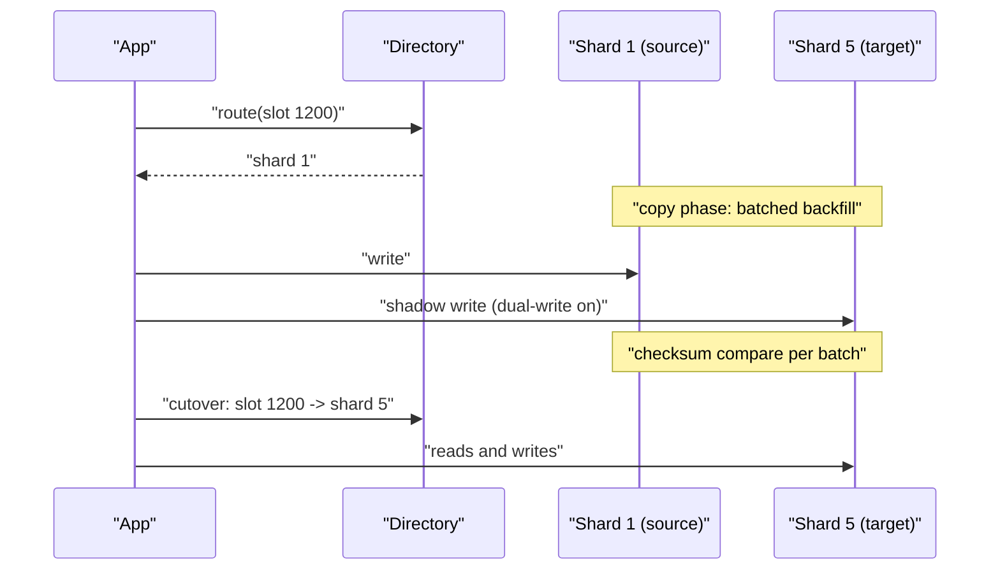
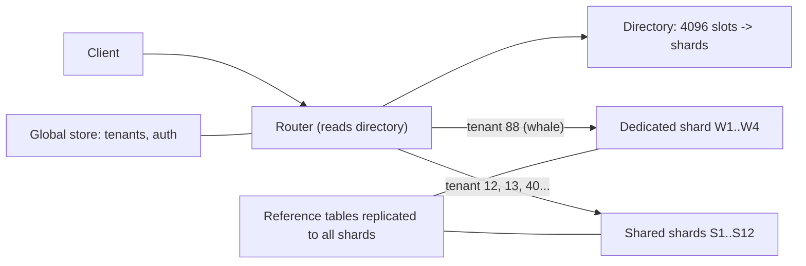

> **Scenario** - A B2B analytics product sharded `events` by `event_id` hash for even distribution. Eighteen months later every customer-facing query filters by `tenant_id` and date, so each dashboard load fans out to all 16 shards, and p99 is the slowest shard plus network. Resharding by `tenant_id` is now a two-quarter project.

## Why it matters

- The shard key is the hardest decision to reverse: it is embedded in every query, every index, and every backfill job.
- A wrong key turns single-shard lookups into scatter-gather, so p99 becomes the *maximum* of N shards instead of the median of one.
- Cross-shard joins and cross-shard transactions are either impossible or slow enough that product features get cancelled.
- Distribution and locality pull in opposite directions: hashing spreads load but destroys range scans; ranging preserves locality but creates hot shards.
- Resharding while live requires dual-write, backfill, and verification tooling that nobody budgets for up front.

## Symptoms

| Signal | What you observe |
| --- | --- |
| Query fan-out metric | Median request touches 12+ of 16 shards |
| Latency shape | p99 ≈ slowest shard's p99; adding shards makes it worse |
| Shard size | One shard at 3.1 TB, others at 400 GB |
| Write throughput | 80% of writes land on 2 shards during business hours |
| App code | Growing library of "merge results from all shards" helpers |
| Failed features | "Show me this tenant's last 30 days" times out for large tenants |

## How it breaks

Two distinct failures follow from one decision. If the key has no correlation with the query predicate, every read becomes scatter-gather: the coordinator queries all shards, waits for the slowest, and merges in application memory. Tail latency compounds - with 16 shards each having a 1% chance of a 200 ms hiccup, roughly 15% of requests hit at least one slow shard.

If the key correlates too strongly with load - `tenant_id` where one tenant is 40% of traffic, or a timestamp where all writes go to "today" - you get the opposite problem: one shard saturates while the rest idle, and you cannot add capacity by adding shards.



## Root causes

1. Choosing the key for *even distribution* alone, ignoring the dominant query predicate.
2. Choosing a monotonic key (auto-increment id, `created_at`) so all writes target the newest shard.
3. Low-cardinality keys (`country`, `status`, `plan`) that cannot spread beyond a handful of values.
4. Mutable keys - sharding by a value the product later allows users to change, forcing cross-shard row moves.
5. No tenant-size analysis before launch, so whale tenants were never modelled.
6. Modulo-based routing (`hash % 16`) which forces a full rebalance every time the shard count changes.

## How to solve it

### 1. Measure the query mix before choosing

Rank your actual query predicates by volume and latency budget. The shard key should be present in the `WHERE` clause of the queries that dominate user-facing latency.

```sql
-- PostgreSQL: what do we actually query by?
SELECT calls,
       round(mean_exec_time::numeric, 2) AS mean_ms,
       round(total_exec_time::numeric / 1000, 1) AS total_s,
       left(query, 90) AS q
FROM pg_stat_statements
WHERE query ILIKE '%FROM events%'
ORDER BY total_exec_time DESC
LIMIT 20;
```

If 85% of the time is spent on queries filtered by `tenant_id`, the key is `tenant_id` - even if that means uneven shards you must manage separately.

### 2. Prefer a composite key: locality plus spread

Shard by tenant, then range or hash *within* the tenant, so single-tenant queries stay on one shard while a whale tenant can still be split.

```sql
-- Routing value stored on every row, computed once at insert
ALTER TABLE events ADD COLUMN shard_key text;

-- tenant:bucket - small tenants get one bucket, whales get many
UPDATE events
SET shard_key = tenant_id || ':' ||
                (abs(hashtext(event_id::text)) % CASE
                   WHEN tenant_id IN (SELECT tenant_id FROM tenant_whales) THEN 64
                   ELSE 1 END)::text
WHERE shard_key IS NULL;

CREATE INDEX CONCURRENTLY idx_events_shard_tenant_time
  ON events (shard_key, created_at DESC);
```

### 3. Route with a lookup table, not modulo

A directory service maps key ranges to physical shards, so moving one range does not rebalance everything.

```ts
type ShardRange = { lo: number; hi: number; shard: string }

// Loaded from the directory table, cached with a short TTL and a version number
const ranges: ShardRange[] = await loadShardMap()

export function routeFor(shardKey: string): string {
  const slot = crc32(shardKey) % 4096      // fixed virtual slot space
  const range = ranges.find((r) => slot >= r.lo && slot <= r.hi)
  if (!range) throw new Error(`no shard for slot ${slot}`)
  return range.shard
}
```

4096 fixed virtual slots mapped to a variable number of physical shards is the standard trick: splitting a shard means reassigning slot ranges, not rehashing rows.

### 4. Move a range online with dual-write and verify



Verify with per-range checksums before cutover:

```sql
-- Run on both shards; the hashes must match before you flip the directory
SELECT md5(string_agg(id::text || ':' || updated_at::text, ',' ORDER BY id))
FROM events
WHERE shard_key >= 'tenant_0088:0' AND shard_key < 'tenant_0089:0';
```

### 5. Keep a small set of global tables

Reference data (plans, feature flags, currency rates) is replicated to every shard rather than joined across them. Anything genuinely global - the tenant directory, auth - lives in a separate unsharded store with its own scaling story.

### 6. Isolate whales before they hurt neighbours

Track per-tenant volume, and give the top few tenants dedicated shards. This is cheaper than designing for perfect uniformity, and it aligns with billing.

## Target design



## Tradeoffs

| Option | Pros | Cons | Choose when |
| --- | --- | --- | --- |
| Hash on entity id | Even distribution, simple | Every filtered query is scatter-gather | Key-value access by id only |
| Hash on tenant id | Single-shard tenant queries | Whale tenants create hot shards | B2B SaaS, per-tenant workloads |
| Range on time | Cheap retention (drop old partitions) | All writes hit the newest partition | Append-only telemetry with time-bounded reads |
| Composite `tenant:bucket` | Locality plus whale splitting | Routing logic and a directory to maintain | Mixed tenant sizes |
| Don't shard yet - partition | Reversible, one operational surface | Bounded by one machine's write capacity | Below ~2 TB or ~20 k writes/s |

## Verification checklist

- [ ] Top 20 queries by total time all contain the shard key in their predicate.
- [ ] Fan-out metric (`shards_touched` per request) exported and p50 = 1 for user-facing reads.
- [ ] Simulated shard map replayed against a week of production query logs before committing.
- [ ] Per-shard size, write rate, and CPU on one dashboard; skew alert at 2× median.
- [ ] Split of one shard rehearsed end-to-end in staging, including checksum verification and rollback.
- [ ] Whale detection job flags any tenant exceeding 5% of a shard's writes.
- [ ] Cross-shard transaction paths enumerated; each has a documented saga or is forbidden in review.

## Anti-patterns

- Sharding by `hash(id) % shard_count` and then needing to change `shard_count`.
- Sharding to fix a query that a composite index would have fixed.
- Sharding on a mutable column and writing a "move tenant between shards" script under incident pressure.
- Joining across shards in application code with unbounded page sizes.
- Letting each service pick its own shard key for the same logical entity.
- Treating `SELECT ... LIMIT 20 ORDER BY created_at` as cheap when it must be merged from 16 shards.
- Adding shards during an incident: rebalancing consumes exactly the IO you are short of.

## Related

- [Hot partition and hot row mitigation](/systems/data-storage/hot-partition-mitigation)
- [Multi-tenant data isolation at the storage layer](/systems/data-storage/multi-tenant-data-isolation)
- [Replication lag and read-your-writes](/systems/data-storage/replication-lag-read-your-writes)
- [Index design and reading query plans](/systems/data-storage/index-design-and-query-plans)
