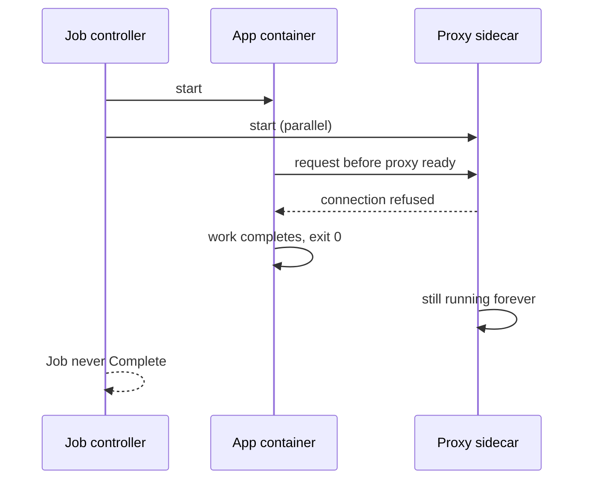
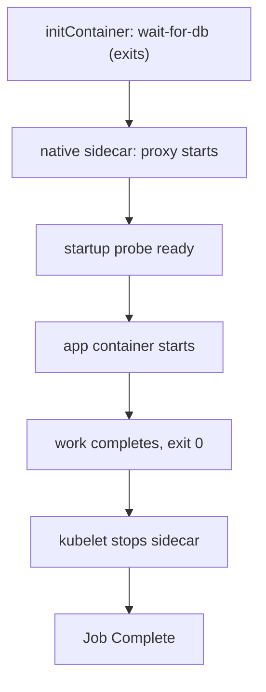

> **Scenario** - A nightly billing Job finishes its work in 90 seconds and then sits in `Running` forever. The service-mesh proxy sidecar never exits, so the Job never reaches `Complete`, and the next night's Job refuses to start.

## Why it matters

- A Job that cannot complete blocks every downstream schedule and quietly stops producing data nobody notices until month end.
- Ordinary sidecars start in parallel with the app container, so the app can make network calls before the proxy is ready - a burst of connection refused errors on every pod start.
- Sidecars multiply resource usage: 200 pods with a 150 MB proxy is 30 GB of RAM that never appears in application dashboards.
- Init containers run before anything else and block the pod on failure, which is exactly what you want for setup - and a self-inflicted outage when used for optional work.

## Symptoms

| Signal | What you observe |
|---|---|
| Jobs | `1/2` containers ready, Job `Running` for hours after work finished |
| Startup logs | `connection refused` or `upstream connect error` in the first 2-5 seconds of every pod |
| Shutdown | App exits cleanly, pod lingers until the grace period, then SIGKILL |
| Resources | Namespace memory usage roughly double the sum of app limits |
| Init | Pod stuck `Init:0/1` with `CrashLoopBackOff` on the init container |

## How it breaks

A pod is Complete only when *all* its containers exit. A classic sidecar is designed to run forever, so a Job containing one can never finish. The same asymmetry appears at both ends of the lifecycle: on start, container order is not guaranteed, and on stop, the sidecar may exit before the app finishes flushing telemetry.

Native sidecars (init containers with `restartPolicy: Always`, generally available since Kubernetes 1.29) fix the ordering: they start before app containers, stay running alongside them, and - importantly - are not counted when deciding whether a Job is complete.



## Root causes

1. A long-running sidecar declared as a regular container inside a Job.
2. No startup ordering, so the app races the proxy on the first outbound request.
3. Init container used for optional work (cache warming, metrics registration) that can fail.
4. Shutdown ordering unspecified, so the sidecar dies before the app drains.
5. Sidecar resource requests omitted, so the scheduler under-counts real pod cost.

## How to solve it

### 1. Use native sidecars for ordering and Job completion

```yaml
apiVersion: batch/v1
kind: Job
metadata:
  name: billing-nightly
spec:
  backoffLimit: 1
  template:
    spec:
      restartPolicy: Never
      initContainers:
        - name: wait-for-db          # classic init: runs and exits
          image: busybox:1.36
          command:
            ["sh", "-c", "until nc -z postgres 5432; do sleep 1; done"]
        - name: proxy                # native sidecar: starts first, stays up
          image: envoyproxy/envoy:v1.31-latest
          restartPolicy: Always
          resources:
            requests: { cpu: 50m, memory: 128Mi }
            limits: { memory: 192Mi }
          startupProbe:
            httpGet: { path: /ready, port: 15021 }
            periodSeconds: 1
            failureThreshold: 30
      containers:
        - name: billing
          image: ghcr.io/acme/billing@sha256:4c1a...
          command: ["php", "artisan", "billing:run"]
```

Because `proxy` is an init container with `restartPolicy: Always`, Kubernetes waits for its startup probe before starting `billing`, keeps it alive during the run, and terminates it once `billing` exits - so the Job completes.

### 2. Keep init containers for hard prerequisites only

Migrations, waiting on a dependency, and fetching required config belong in init containers. Optional warm-ups do not: a failed init container is `CrashLoopBackOff` for the whole pod.

### 3. Verify ordering and completion

```bash
kubectl get pods -l job-name=billing-nightly -o \
  custom-columns='NAME:.metadata.name,INIT:.status.initContainerStatuses[*].ready,APP:.status.containerStatuses[*].ready'
kubectl logs job/billing-nightly -c proxy --tail=20
kubectl get job billing-nightly -o jsonpath='{.status.conditions[*].type}{"\n"}'
```

### 4. Budget for the sidecar

```bash
kubectl get pods -n prod -o json \
  | jq '[.items[].spec.containers[].resources.requests.memory] | length'
```

Count the proxy in capacity planning; at 200 replicas it is a node pool decision, not a rounding error.

## Target design



## Tradeoffs

| Option | Pros | Cons | Choose when |
|---|---|---|---|
| Regular container sidecar | Works on every Kubernetes version | Breaks Jobs, no ordering guarantee | Long-running Deployments on old clusters |
| Native sidecar (`restartPolicy: Always`) | Ordered start, Jobs complete, clean shutdown | Requires Kubernetes 1.29+ | Any cluster that supports it |
| Init container | Hard guarantee before app start | Failure blocks the pod entirely | Migrations and required prerequisites |
| Library instead of sidecar | No extra container or memory | Language-specific, coupled to app releases | Single-language fleets with strong platform ownership |

## Verification checklist

- [ ] A Job with a proxy sidecar reaches `Complete` and its pod is garbage collected.
- [ ] The app's first outbound request in pod logs occurs after the proxy reports ready.
- [ ] Sidecar CPU and memory requests are set and included in capacity planning.
- [ ] Killing the sidecar mid-run restarts it without restarting the app container.
- [ ] Init containers only perform work whose failure should genuinely block the pod.
- [ ] During shutdown, the app finishes draining before the sidecar terminates.

## Anti-patterns

- Adding `sleep 5` to the app entrypoint to "wait for the proxy" instead of a startup probe.
- Curling the proxy's quit endpoint at the end of a Job as a workaround for completion.
- Putting cache warming in an init container, so a cold cache dependency becomes a pod-start outage.
- Running six sidecars (logs, metrics, proxy, secrets, config, backup) and wondering where node memory went.
- Omitting sidecar resource requests so the scheduler believes pods are half their real size.

## Related

- [Kubernetes probes done right](/systems/devops-containers/kubernetes-probes-done-right)
- [Docker image layer optimization](/systems/devops-containers/docker-image-layer-optimization)
- [OOMKilled and resource limits](/systems/devops-containers/oom-and-resource-limits)
