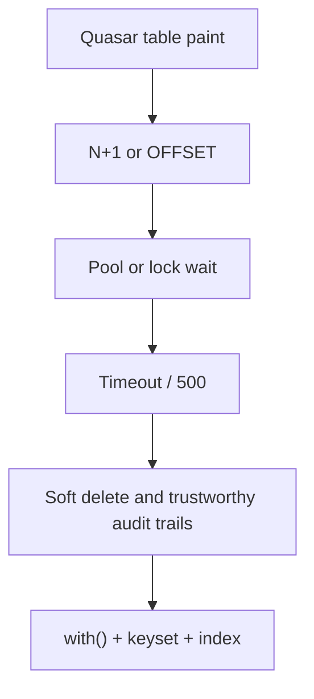

> **Lesson 19 · beginner** - deleted_at looks free until unique constraints, GDPR erasure, and every query filter disagree. Append-only history plus real deletion beats a tombstone column.

## Why it matters

- Eloquent looks like one line and becomes forty queries the moment a Quasar table renders relations.
- An index that does not match the WHERE + ORDER BY is decoration. EXPLAIN ANALYZE is the witness.
- Soft delete without a unique constraint on the live row is how “deleted” emails get reused and collide.
- This lesson is specifically about **Soft delete and trustworthy audit trails**. Tags: soft-delete, audit-log, gdpr, data-modeling.

## Symptoms

| Signal | What you observe |
| --- | --- |
| N+1 | Toolbar spinner 4s; query log shows 1 + n tickets |
| Pool empty | FPM workers wait on MySQL while idle connections sit in another pod |
| Pagination lie | OFFSET 200000 takes longer than the user will wait |
| Ghost unique | Re-registering a soft-deleted email 500s on unique index |

## How it breaks



The named technology is rarely the villain. Two code paths (often a Vue/Quasar screen and a Laravel write) assume opposite contracts. Production finds the race. For this topic that contract is: deleted_at looks free until unique constraints, GDPR erasure, and every query filter disagree. Append-only history plus real deletion beats a tombstone column.

## Root causes

1. Missing with() / join, so serializers lazy-load in a loop.
2. Connection pool sized for local Docker, not production workers × services.
3. Page-by-offset instead of keyset pagination on a hot list.
4. No partial unique index for (email) WHERE deleted_at IS NULL.

## How to solve it

### 1. Write the invariant in one sentence

deleted_at looks free until unique constraints, GDPR erasure, and every query filter disagree. Append-only history plus real deletion beats a tombstone column. Put that sentence in the PR, the Pinia action, and the Laravel class.

### 2. Guard the edge in code

```ts
// stores/ticket.ts — ask for the page you show, not the world
export async function loadPage(cursor: string | null) {
  const { data } = await api.get('/api/tickets', { params: { cursor, limit: 50 } })
  return data as { items: Ticket[]; next: string | null }
}
```

```php
Ticket::query()
    ->with(['assignee:id,name', 'tags:id,name'])
    ->when($cursor, fn ($q) => $q->where('id', '<', $cursor))
    ->orderByDesc('id')
    ->limit(50)
    ->get();
```

### 3. Keep a chart you will actually look at

Query count per request, p99 of the list endpoint, and pool wait time. If the chart cannot catch a regression in **Soft delete and trustworthy audit trails**, the lesson is not done.

## Worked example

The ticket index loaded comments in a Vue `v-for`. Laravel logged 1 + 50 queries. `with()` plus keyset pagination dropped the page from 4.2s to 80ms.

On this topic, start from the symptom in the table that matches your last incident, then walk the diagram until the guard above would have fired.

## Check before you ship

- [ ] The invariant for **Soft delete and trustworthy audit trails** is written in one sentence.
- [ ] Empty, duplicate, timeout, or permission paths have a test or a staged rehearsal.
- [ ] A dashboard or log query would catch a regression within one deploy.
- [ ] Related reading still makes sense: large-table-archival-strategy, multi-tenant-data-isolation, index-design-and-query-plans.

## What not to do

- Copy a blog snippet that retries forever or caches the error as success.
- Treat Pinia as the source of truth for a Laravel row.
- Skip the previous numbered lesson if this one feels dense — the path is beginner → intermediate → advanced on purpose.
