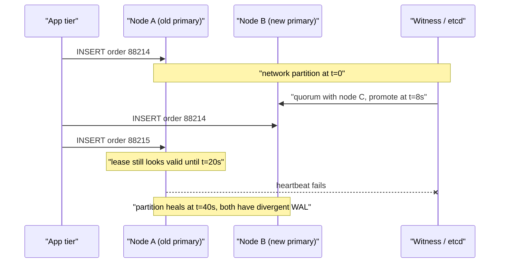
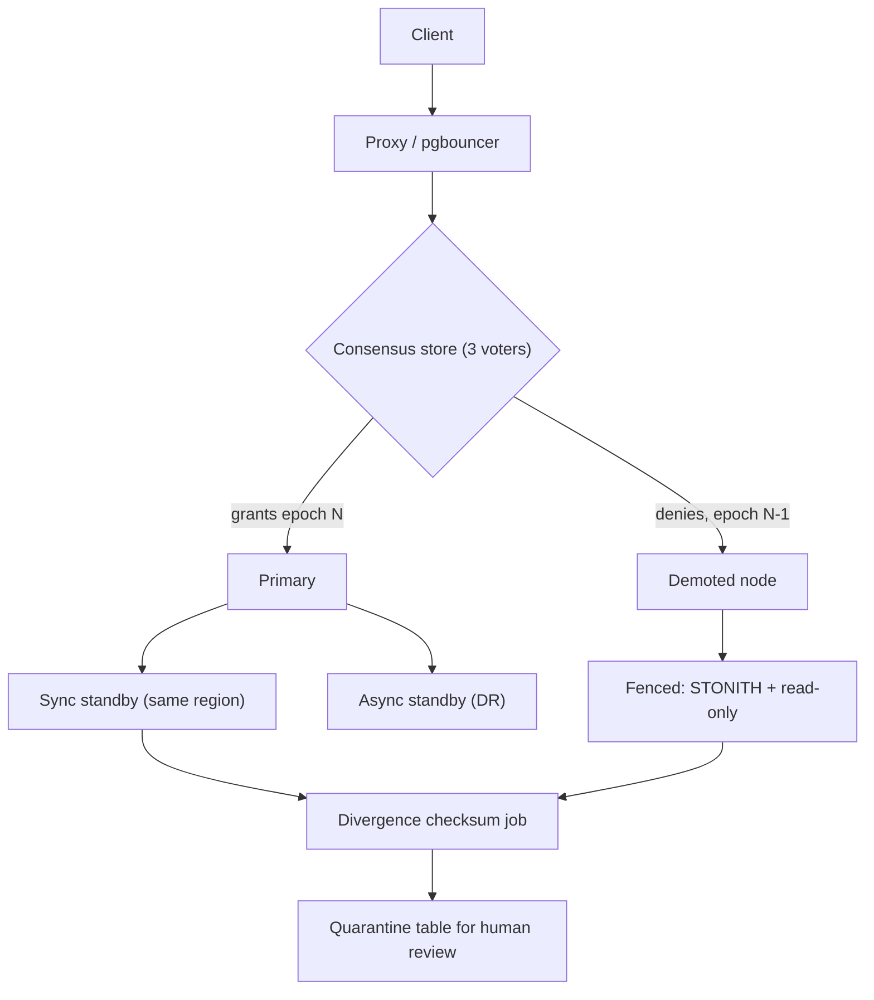

> **Scenario** - ৪০ সেকেন্ডের network blip একটি availability zone বিচ্ছিন্ন করে দেয়। ফিরে আসার পর Postgres cluster-এ দুটি node primary হিসেবে write নিয়েছে, আর `orders.id` sequence দুবার একই মান দিয়েছে। দুজন customer এখন order `88214`-এর মালিক।

## Why it matters

- Split brain-এ outage-টাই সবচেয়ে খারাপ অংশ নয়। Cluster কয়েক মিনিটে ফিরে আসে, কিন্তু diverge হওয়া write reconcile করতে দিনের পর দিন manual কাজ লাগে এবং প্রায়ই data হারায়।
- দুই দিকই locally healthy দেখায়। প্রতিটি node বলে "আমি primary, আমার replica unreachable" - তাই automated remediation আত্মবিশ্বাসের সাথে অবস্থা আরও খারাপ করে।
- Stale connection ধরে থাকা client হেরে যাওয়া দিকেই write করতে থাকে। 30s TCP keepalive ও 60s DNS TTL হলে নতুন primary নির্বাচিত হওয়ার পরেও পুরো এক মিনিট doomed primary-তে write যায়।
- Recovery মানে প্রায় সবসময় এক দিকের data ফেলে দেওয়া। Audit trail না থাকলে customer-কে বলতেও পারবেন না কোন order হারিয়েছে।

## Symptoms

| Signal | What you observe |
|---|---|
| Cluster state | একই replica set-এ দুটি node ১০-৬০s ধরে `role=primary` |
| Primary key collision | Partition heal-এর পর `duplicate key value violates unique constraint` |
| Replication | দুই দিকই বলে "replica unreachable", কেউ বলে না "আমি পিছিয়ে আছি" |
| Write volume | মোট writes/sec প্রায় অপরিবর্তিত, দুই node-এ অসমভাবে ভাগ |
| Application log | একই idempotency key দুবার সফল, ভিন্ন row ID সহ |
| Lock service | দুই worker একই distributed lock ধরে আছে, দুজনেরই lease valid দেখাচ্ছে |
| Post-heal | এক node crash করে `requested WAL segment has already been removed` দিয়ে |

## How it breaks

মেকানিজম সবসময় একই আকারের: node "আমার peer মারা গেছে" আর "আমি peer-এ পৌঁছাতে পারছি না" - এই দুটোর পার্থক্য করতে পারে না। Majority-quorum system টিকে যায় কারণ শুধু এক দিকই `⌊N/2⌋ + 1` vote পেতে পারে। কিন্তু voter সংখ্যা জোড় হলে, বা failover controller vote-এর বদলে timeout দেখে promote করলে, সেই guarantee থাকে না।

বিপজ্জনক window partition নিজে নয় - বিপদ হলো *পুরোনো primary-র quorum হারানো* আর *পুরোনো primary-র সেটা টের পাওয়া*-র মধ্যবর্তী সময়। 15s lease renewal ও 5s heartbeat interval-এর node নতুন primary নির্বাচিত হওয়ার পরেও ২০s পর্যন্ত write নিতে থাকে। Wall-clock time-এ ভরসা করলে এটা আরও খারাপ: paused VM বা 2-সেকেন্ডের GC stop থেকে ফিরে node ভাবে তার lease এখনও valid।



## Root causes

1. Voting member সংখ্যা জোড়, ফলে 2/2 split-এ কোনো দিকেই majority থাকে না।
2. Consensus decision-এর বদলে health-check timeout দিয়ে failover trigger।
3. Fencing নেই: demoted primary-কে জোর করে write নেওয়া থেকে থামানো হয় না।
4. Lease local wall-clock time দিয়ে validate করা হয়, যা pause করে, jump করে, skew করে।
5. Client connection pool-এ primary address cache করে রাখে, error-এ re-resolve করে না।
6. Incident চলাকালে engineer manual promotion করে, যে নিজেও অন্য অর্ধেকে পৌঁছাতে পারেনি।

## How to solve it

### 1. Cluster-কে বিজোড় সংখ্যক voter দিন

তিনটি failure domain-এ তিনটি voting member ন্যূনতম। মাত্র দুটি data centre থাকলে তৃতীয় জায়গায় একটি হালকা witness (arbiter বা $5 instance-এ etcd member) যোগ করুন - vote দেয়, data রাখে না।

```yaml
# Patroni: never promote without a real majority.
bootstrap:
  dcs:
    ttl: 30
    loop_wait: 10
    retry_timeout: 10
    maximum_lag_on_failover: 1048576   # 1 MiB - refuse to promote a stale replica
    synchronous_mode: true
    synchronous_mode_strict: true      # refuse writes rather than drop to async
```

`synchronous_mode_strict: true` লাইনটাই মূল। এর মানে synchronous standby না থাকলে write *থেমে যায়*, চুপচাপ single-node write হয়ে যায় না যা পরে হারাতে পারে।

### 2. হেরে যাওয়া node ফেন্স করুন, শুধু demote নয়

Fencing token একমাত্র নির্ভরযোগ্য প্রতিরক্ষা, কারণ এটি demoted node-এর সহযোগিতার উপর নির্ভর করে না। প্রতিটি write একটি monotonically increasing epoch বহন করে; storage layer পুরোনো epoch reject করে।

```ts
// The lock service hands out a monotonically increasing epoch on every election.
type Lease = { epoch: number; holder: string; expiresAt: number }

class FencedStore {
  private highestEpoch = 0

  write(lease: Lease, mutation: Mutation): void {
    if (lease.epoch < this.highestEpoch) {
      // A resurrected primary lands here. It cannot corrupt anything.
      throw new StaleEpochError(lease.epoch, this.highestEpoch)
    }
    this.highestEpoch = lease.epoch
    this.apply(mutation)
  }
}
```

Infrastructure স্তরে এর সমতুল্য হলো STONITH: নতুন primary প্রথম write নেওয়ার *আগে* cloud API দিয়ে পুরোনো instance বন্ধ করে বা তার storage attachment কেড়ে নেয়।

### 3. Lease expiry monotonic করুন, wall-clock নয়

```python
import time

class Lease:
    def __init__(self, ttl_s: float, safety_margin_s: float = 2.0):
        # monotonic() does not jump when NTP steps the clock or the VM pauses.
        self.expires_at = time.monotonic() + ttl_s - safety_margin_s

    def valid(self) -> bool:
        return time.monotonic() < self.expires_at
```

Safety margin আপনার সবচেয়ে খারাপ observed GC pause বা VM steal time-এর চেয়ে বড় হতে হবে। মাপুন, অনুমান করবেন না।

### 4. প্রতিটি failover-এর পর divergence স্বয়ংক্রিয়ভাবে ধরুন

Customer duplicate report করার জন্য অপেক্ষা করবেন না। পুরোনো primary re-attach করার আগে দুই timeline-এর শেষ N মিনিটের write-এর checksum মিলিয়ে দেখুন।

```sql
-- Compare the tail of both timelines before rejoining a node.
SELECT date_trunc('minute', created_at) AS minute,
       count(*)                          AS rows,
       md5(string_agg(id::text || ':' || total_cents::text, ',' ORDER BY id)) AS fingerprint
FROM   orders
WHERE  created_at > now() - interval '30 minutes'
GROUP  BY 1
ORDER  BY 1;
```

যে মিনিটে fingerprint আলাদা, সেখানে এমন write আছে যা শুধু এক দিকে বিদ্যমান। ওই row গুলো automatic merge নয়, human review-এর জন্য quarantine table-এ যায়।

### 5. Recovery path মহড়া দিন

Runbook প্রতি quarter-এ চালাতে হবে: firewall rule দিয়ে zone partition করুন, নিশ্চিত করুন ঠিক একটি primary হয়, lease TTL-এর মধ্যে হেরে যাওয়া node fenced হয়, এবং divergence report খালি থাকে।

## Target design



## Tradeoffs

| Option | Pros | Cons | Choose when |
|---|---|---|---|
| Witness সহ majority quorum | এক primary নিশ্চিত; manual arbitration লাগে না | তৃতীয় failure domain দরকার; quorum হারালে write থামে | যেকোনো stateful cluster-এর ডিফল্ট |
| Storage layer-এ fencing token | পুরোনো primary ফিরে এলেও সঠিক | Storage support ও app পরিবর্তন দরকার | Uptime-এর চেয়ে correctness বেশি জরুরি |
| Cloud API দিয়ে STONITH | কঠিন guarantee, সহযোগিতা লাগে না | Control plane reachable থাকতে হবে | নির্ভরযোগ্য API সহ managed infrastructure |
| শুধু manual promotion | কোনো automation অবস্থা খারাপ করতে পারে না | মিনিট থেকে ঘণ্টার downtime | খুব কম write, খুব বড় blast radius |
| CRDT সহ multi-primary | দুই দিকই writable থাকে | শুধু commutative data-তে চলে; uniqueness constraint নেই | Counter, presence, collaborative text |

## Verification checklist

- [ ] Voting member সংখ্যা বিজোড় এবং সদস্যরা আলাদা failure domain-এ।
- [ ] Firewall-ভিত্তিক partition drill-এ ঠিক একটি primary আসে, তৃতীয় vantage point থেকে যাচাই করা।
- [ ] Demoted node এক lease TTL-এর মধ্যে write reject করে, তার নিজের log থেকে প্রমাণিত।
- [ ] Lease expiry monotonic clock ব্যবহার করে; safety margin p99.9 GC pause-এর চেয়ে বড়।
- [ ] Failover-এর পর divergence checksum স্বয়ংক্রিয়ভাবে চলে ও তার output-এ alert আছে।
- [ ] Connection pool error-এ primary re-resolve করে, process lifetime ধরে IP pin করে না।
- [ ] Runbook-এ লেখা আছে কোন timeline জিতবে সেটা কে ঠিক করবে - incident-এর আগেই।

## Anti-patterns

- "Redundancy-র জন্য" চতুর্থ node যোগ করা, যা 3-node majority-কে 2/2 tie-তে পরিণত করে।
- Consensus store না দেখে health-check failure-এ promote করা, কারণ "৩০ সেকেন্ড ধরে check fail করছিল"।
- Divergent WAL-এর diff নেওয়ার আগেই `pg_rewind` দিয়ে পুরোনো primary reattach করা - repair-ই প্রমাণ মুছে দেয়।
- Event order করতে যেকোনো node-এর `NOW()`-এ ভরসা করা; 200ms clock skew স্বাভাবিক আর 2s বিরল নয়।
- "দুই দিক merge করে দাও" জাতীয় automatic job বানানো। Business rule ছাড়া divergent write merge করলে বিশ্বাসযোগ্য কিন্তু ভুল data তৈরি হয়।

## Related

- [CAP theorem tradeoffs in real outages](/systems/distributed-systems/cap-theorem-tradeoffs)
- [Leader election failure modes](/systems/distributed-systems/leader-election-failure-modes)
- [Distributed locks and correctness](/systems/distributed-systems/distributed-locks-correctness)
- [Tuning quorum reads and writes](/systems/distributed-systems/quorum-read-write-tuning)
