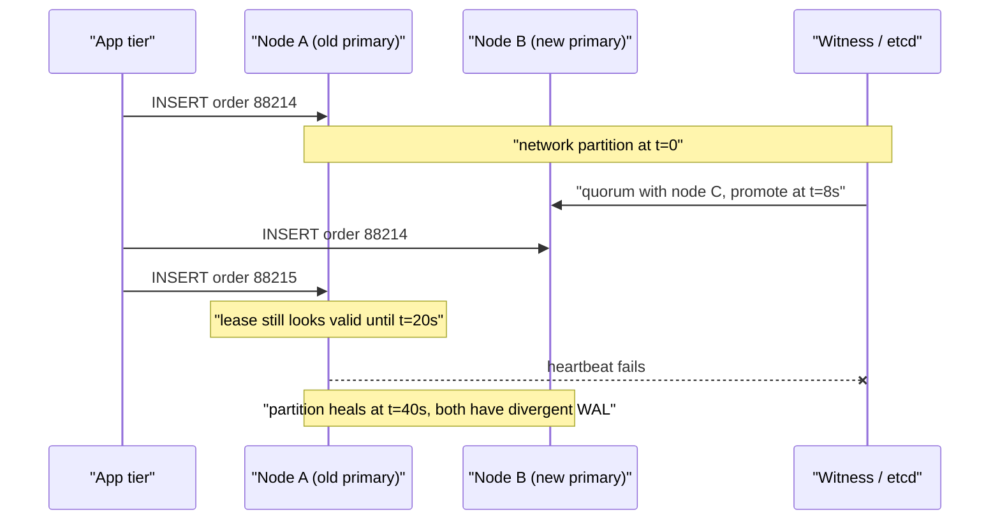
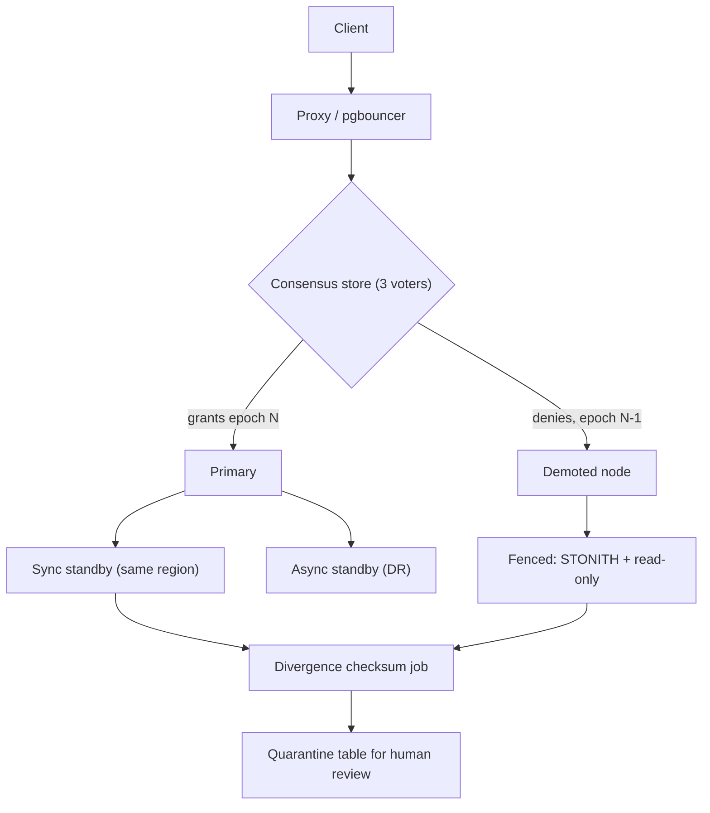

> **Scenario** - A 40-second network blip isolates one availability zone. When it clears, the Postgres cluster has two nodes that both accepted writes as primary, and the sequence for `orders.id` has been handed out twice. Two customers now own order `88214`.

## Why it matters

- Split brain is the one failure class where the outage is not the worst part. The cluster recovers in minutes; reconciling divergent writes takes days of manual work and often loses data that a human has to apologise for.
- Both halves look healthy locally. Every node reports "I am primary, my replicas are unreachable", so automated remediation confidently makes it worse.
- Any client holding a stale connection keeps writing to the losing side. With a 30s TCP keepalive and a 60s DNS TTL, writes land on the doomed primary for a full minute after the winner is elected.
- Recovery almost always means throwing one side's data away. Without an audit trail you cannot even tell the customer which orders were lost.

## Symptoms

| Signal | What you observe |
|---|---|
| Cluster state | Two nodes reporting `role=primary` in the same replica set for 10-60s |
| Primary key collisions | `duplicate key value violates unique constraint` after the partition heals |
| Replication | Both sides report "replica unreachable", neither reports "I am behind" |
| Write volume | Total writes/sec roughly unchanged, split unevenly between two nodes |
| Application logs | Same idempotency key succeeding twice with different resulting row IDs |
| Lock service | Two workers holding the "same" distributed lock, each with a valid-looking lease |
| Post-heal | One node crashes with `requested WAL segment has already been removed` |

## How it breaks

The mechanism is always the same shape: a node cannot distinguish "my peers are dead" from "I cannot reach my peers." A majority-quorum system survives this because only one side can hold `⌊N/2⌋ + 1` votes. A cluster with an even number of voters, or with a failover controller that promotes on a timeout rather than a vote, has no such guarantee.

The dangerous window is not the partition itself - it is the interval between *the old primary losing quorum* and *the old primary noticing*. A node with a 15s lease renewal and a 5s heartbeat interval keeps serving writes for up to 20s after the new primary is elected. Anything that trusts wall-clock time makes this worse: a paused VM or a 2-second GC stop can resume believing its lease is still valid.



## Root causes

1. An even number of voting members, so a 2/2 split leaves neither side with a majority - or worse, both sides with "half".
2. Failover triggered by a health-check timeout instead of a consensus decision.
3. No fencing: the demoted primary is never forcibly stopped from accepting writes.
4. Leases validated against local wall-clock time, which pauses, jumps, or skews.
5. Clients caching the primary address in a connection pool with no re-resolution on error.
6. Manual promotion during an incident by an engineer who could not reach the other half either.

## How to solve it

### 1. Give the cluster an odd number of voters

Three voting members across three failure domains is the minimum. If you only have two data centres, add a lightweight witness (an arbiter, or an etcd member on a $5 instance in a third location) that votes but stores no data.

```yaml
# Patroni: never promote without a real majority.
bootstrap:
  dcs:
    ttl: 30
    loop_wait: 10
    retry_timeout: 10
    maximum_lag_on_failover: 1048576   # 1 MiB - refuse to promote a stale replica
    synchronous_mode: true
    synchronous_mode_strict: true      # refuse writes rather than drop to async
```

`synchronous_mode_strict: true` is the important line. It means that if the synchronous standby is gone, writes *stop* instead of quietly becoming single-node writes that can be lost.

### 2. Fence the loser, do not just demote it

Fencing tokens are the only reliable defence, because they do not depend on the demoted node cooperating. Every write carries a monotonically increasing epoch; the storage layer rejects anything older than what it has already seen.

```ts
// The lock service hands out a monotonically increasing epoch on every election.
type Lease = { epoch: number; holder: string; expiresAt: number }

class FencedStore {
  private highestEpoch = 0

  write(lease: Lease, mutation: Mutation): void {
    if (lease.epoch < this.highestEpoch) {
      // A resurrected primary lands here. It cannot corrupt anything.
      throw new StaleEpochError(lease.epoch, this.highestEpoch)
    }
    this.highestEpoch = lease.epoch
    this.apply(mutation)
  }
}
```

At the infrastructure level the equivalent is STONITH: the new primary calls the cloud API to stop the old instance, or revokes its storage attachment, *before* accepting the first write.

### 3. Make lease expiry monotonic, not wall-clock

```python
import time

class Lease:
    def __init__(self, ttl_s: float, safety_margin_s: float = 2.0):
        # monotonic() does not jump when NTP steps the clock or the VM pauses.
        self.expires_at = time.monotonic() + ttl_s - safety_margin_s

    def valid(self) -> bool:
        return time.monotonic() < self.expires_at
```

The safety margin must exceed your worst observed GC pause or VM steal time. Measure it; do not guess.

### 4. Detect divergence automatically after every failover

Do not wait for a customer to report a duplicate. Run a checksum comparison of the last N minutes of writes on both timelines before you re-attach the old primary.

```sql
-- Compare the tail of both timelines before rejoining a node.
SELECT date_trunc('minute', created_at) AS minute,
       count(*)                          AS rows,
       md5(string_agg(id::text || ':' || total_cents::text, ',' ORDER BY id)) AS fingerprint
FROM   orders
WHERE  created_at > now() - interval '30 minutes'
GROUP  BY 1
ORDER  BY 1;
```

Any minute where the fingerprints differ contains writes that exist on only one side. Those rows go to a quarantine table for human review, not into an automatic merge.

### 5. Rehearse the recovery path

The runbook must be exercised quarterly: partition a zone with a firewall rule, confirm exactly one primary emerges, confirm the loser is fenced within the lease TTL, and confirm the divergence report is empty.

## Target design



## Tradeoffs

| Option | Pros | Cons | Choose when |
|---|---|---|---|
| Majority quorum with witness | One primary guaranteed; no manual arbitration | Needs a third failure domain; writes stop on quorum loss | Default for any stateful cluster |
| Fencing tokens at the storage layer | Correct even if the old primary resurrects | Requires storage-layer support and app changes | Correctness matters more than uptime |
| STONITH via cloud API | Hard guarantee, no cooperation needed | Depends on the control plane being reachable | Managed infrastructure with a reliable API |
| Manual promotion only | No automated system can make it worse | Minutes to hours of downtime; needs a reachable human | Very low write volume, very high blast radius |
| Multi-primary with CRDTs | Both sides stay writable | Only works for commutative data; no uniqueness constraints | Counters, presence, collaborative text |

## Verification checklist

- [ ] Voting member count is odd and members sit in distinct failure domains.
- [ ] A firewall-based partition drill produces exactly one primary, verified from a third vantage point.
- [ ] The demoted node rejects writes within one lease TTL, proven from its own logs.
- [ ] Lease expiry uses a monotonic clock; the safety margin exceeds the p99.9 GC pause.
- [ ] A post-failover divergence checksum runs automatically and its output is alerted on.
- [ ] Connection pools re-resolve the primary on error rather than pinning an IP for the process lifetime.
- [ ] The runbook names who decides which timeline wins, before the incident.

## Anti-patterns

- Adding a fourth node "for redundancy", which turns a 3-node majority into a 2/2 tie.
- Promoting on health-check failure without consulting the consensus store, because "the checks were failing for 30 seconds".
- Reattaching the old primary with `pg_rewind` before capturing a diff of the divergent WAL - the evidence is destroyed by the repair.
- Trusting `NOW()` on either node to order events; clock skew of 200ms is normal and 2s is not rare.
- Building an automatic "merge both sides" job. Merging divergent writes without business rules produces plausible, wrong data.

## Related

- [CAP theorem tradeoffs in real outages](/systems/distributed-systems/cap-theorem-tradeoffs)
- [Leader election failure modes](/systems/distributed-systems/leader-election-failure-modes)
- [Distributed locks and correctness](/systems/distributed-systems/distributed-locks-correctness)
- [Tuning quorum reads and writes](/systems/distributed-systems/quorum-read-write-tuning)
