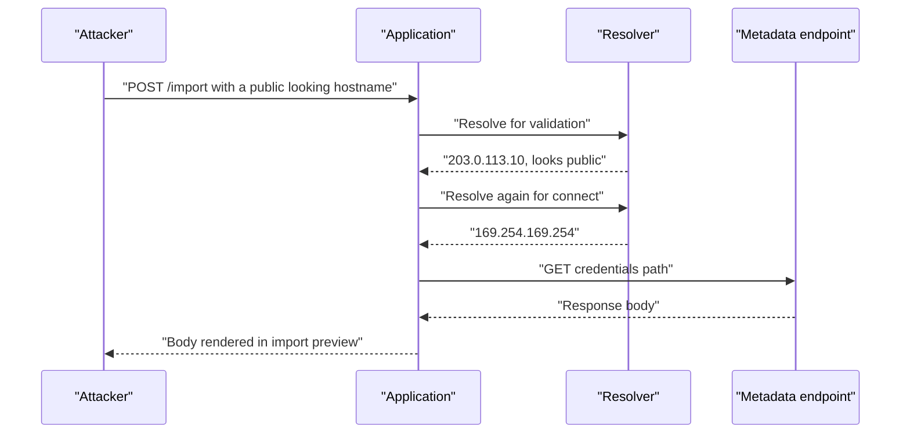
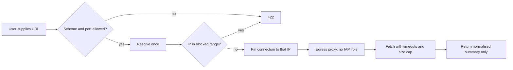

> **Scenario** — একটা "import from URL" feature customer-কে নিজের server-এর CSV দেখাতে দেয়। কেউ সেটা `http://169.254.169.254/latest/meta-data/iam/…`-এ তাক করল, আর response body import preview-তে render হয়ে গেল। Application-এর নিজের code-এ কোনো vulnerability ছিল না — সে কেবল যা বলা হয়েছিল তা fetch করেছে।

## Why it matters

- Server-side request forgery আপনার application-কে এমন proxy বানায় যেটা network perimeter-এর *ভেতরে* বসে, workload-এর IAM identity নিয়ে।
- Cloud metadata endpoint, internal admin panel, unauthenticated Redis, Kubernetes API — সবই এমন pod থেকে reachable যা "exposed নয়"।
- যে feature এটা ঘটায় তা সাধারণত নিরীহ দেখায়: avatar-by-URL, webhook delivery, PDF rendering, link preview, RSS import, OIDC discovery।
- Blind SSRF-ও কাজ করে। Attacker internal state change ঘটাতে বা timing মাপতে পারলে response body দরকার হয় না।

## Symptoms

| Signal | What you observe |
| --- | --- |
| User-দেওয়া URL fetch হয় | `url`, `callback`, `webhook`, `image_src` নামের parameter HTTP client-এ যাচ্ছে |
| Link-local-এ egress | app pod থেকে `169.254.169.254`, `127.0.0.1`, `10.0.0.0/8`-এ outbound |
| Redirect follow | client-এ `allow_redirects => true`, per-hop validation নেই |
| Error content echo | fetch ব্যর্থ হলে upstream response body user-কে ফেরত যায় |
| অদ্ভুত scheme | HTTP client `file://`, `gopher://`, `dict://` মেনে নেয় |
| DNS অসঙ্গতি | hostname private range-এ resolve করে, বা দুইবার ভিন্ন উত্তর দেয় |

## How it breaks

Validation সাধারণত *string*-এ হয়, আর connection হয় *resolved address*-এ। Attacker এমন hostname দেয় যা string check pass করে কিন্তু private address-এ resolve করে — বা প্রথম lookup-এ (validation) public এবং দ্বিতীয়টায় (connection) private-এ resolve করে। Redirect দ্বিতীয় সুযোগ দেয়: প্রথম URL ঠিক, আর দ্বিতীয় hop attacker-এর ইচ্ছেমতো জায়গায় যায়।



## Root causes

1. Socket যে IP-তে connect করে তা নয়, URL string-এ validation।
2. DNS resolution ও connection-এর মধ্যে time-of-check থেকে time-of-use gap (DNS rebinding)।
3. প্রতি hop আবার validate না করে redirect follow করা।
4. Egress restriction নেই, তাই workload প্রতিটি internal range-এ পৌঁছাতে পারে।
5. Instance metadata session token ছাড়াই reachable (IMDSv1-ধরনের)।
6. Upstream response body ও error হুবহু requester-কে ফেরত দেওয়া।
7. Client library-তে non-HTTP scheme চালু রেখে দেওয়া।

## How to solve it

### 1. Connect-time-এ resolved address validate করুন

```php
use Illuminate\Support\Facades\Http;

final class SafeFetcher
{
    private const BLOCKED = [
        '0.0.0.0/8', '10.0.0.0/8', '127.0.0.0/8', '169.254.0.0/16',
        '172.16.0.0/12', '192.168.0.0/16', '100.64.0.0/10',
        '::1/128', 'fc00::/7', 'fe80::/10',
    ];

    public function get(string $url): string
    {
        $parts = parse_url($url);

        abort_unless(in_array($parts['scheme'] ?? '', ['http', 'https'], true), 422, 'scheme_not_allowed');
        abort_if(isset($parts['port']) && ! in_array($parts['port'], [80, 443], true), 422, 'port_not_allowed');

        return Http::withOptions([
                'allow_redirects' => false,   // handle hops explicitly
                'timeout' => 5,
                'connect_timeout' => 2,
                // Resolve once, then pin: the socket connects to the checked IP.
                'curl' => [CURLOPT_RESOLVE => $this->pin($parts['host'], $parts['scheme'])],
            ])
            ->withHeaders(['Accept' => 'text/csv, application/json'])
            ->get($url)
            ->throw()
            ->body();
    }
}
```

গুরুত্বপূর্ণ property হলো *pinning*: একবার resolve করুন, ওই address blocked range-এর সাথে মেলান, তারপর connection ওই একই address-এ বাধ্য করুন। এতে rebinding window বন্ধ হয়।

### 2. Redirect নিজে সামলান

Automatic redirect বন্ধ করুন, প্রতিটি `Location` header-এ একই validation চালান, hop limit দুই-তিন। তখন private address-এ redirect সরাসরি request-এর মতোই fail করে।

### 3. Domain জানা থাকলে allowlist ব্যবহার করুন

Webhook destination, OIDC issuer ও partner API সাধারণত আগেই জানা। Hostname allowlist পুরো শ্রেণিটা সরিয়ে দেয়:

```php
$host = strtolower(parse_url($url, PHP_URL_HOST) ?: '');

abort_unless(in_array($host, config('integrations.allowed_hosts'), true), 422, 'host_not_allowed');
```

### 4. Network layer-এ egress সীমিত করুন

Application-level check একটা bug দূরে fail করে। Network policy হলো backstop:

```yaml
apiVersion: networking.k8s.io/v1
kind: NetworkPolicy
metadata:
  name: api-egress
spec:
  podSelector:
    matchLabels:
      app: api
  policyTypes: ["Egress"]
  egress:
    - to:
        - ipBlock:
            cidr: 0.0.0.0/0
            except:
              - 169.254.0.0/16
              - 10.0.0.0/8
              - 172.16.0.0/12
              - 192.168.0.0/16
    - to:
        - namespaceSelector:
            matchLabels:
              kubernetes.io/metadata.name: data
      ports:
        - protocol: TCP
          port: 5432
```

আরও ভালো: user-triggered সব fetch আলাদা network segment-এর একটা dedicated egress proxy দিয়ে পাঠান, যার কোনো IAM role নেই ও internal service-এ route নেই।

### 5. Metadata service hardening

AWS-এ IMDSv2 (session token) বাধ্যতামূলক করুন আর hop limit 1 দিন, যাতে containerised process পৌঁছাতে না পারে:

```bash
aws ec2 modify-instance-metadata-options \
  --instance-id i-0abc123 \
  --http-tokens required \
  --http-put-response-hop-limit 1
```

### 6. Upstream response echo করবেন না

Raw body নয়, একটা normalised ফল দিন — row count, detected column, validation summary। Upstream detail server-side log করুন। Reflected SSRF-এর চেয়ে blind SSRF অনেক কম উপকারী।

### 7. Signal-এ alert দিন

App pod থেকে link-local বা private range-এ outbound connection চেষ্টা কখনোই বৈধ নয়। এটাকে dashboard tile নয়, page-worthy alert বানান।

## Target design



## Tradeoffs

| Option | Pros | Cons | Choose when |
| --- | --- | --- | --- |
| Hostname allowlist | সবচেয়ে শক্ত ও সরল | যেকোনো customer URL সাপোর্ট করে না | webhook, partner integration |
| IP blocklist + pinning | যেকোনো URL সাপোর্ট করে | হালনাগাদ রাখতে হয়; IPv6 বাদ পড়ে | user-দেওয়া import ও preview |
| Dedicated egress proxy | central policy ও audit; path-এ IAM নেই | বাড়তি hop ও component | অনেক service user URL fetch করে |
| শুধু network policy | app bug নির্বিশেষে enforce হয় | coarse; public-target abuse আটকায় না | Kubernetes estate |
| Feature বন্ধ করা | ঝুঁকি শূন্য | product cost | কম ব্যবহার, উচ্চ ঝুঁকির feature |

## Verification checklist

- [ ] `http://169.254.169.254/` জমা দিয়ে fetch নয়, validation error নিশ্চিত করুন।
- [ ] `127.0.0.1`-এ resolve করা hostname দিয়ে reject হওয়া দেখুন।
- [ ] Private address-এ redirect করা URL দিয়ে hop blocked হওয়া দেখুন।
- [ ] `file://` ও অন্য non-HTTP scheme reject হয় তা নিশ্চিত করুন।
- [ ] App pod থেকে metadata endpoint-এ `curl` করে unreachable নিশ্চিত করুন।
- [ ] Response upstream body নয়, summary দেয় তা নিশ্চিত করুন।
- [ ] Private range-এ যেকোনো egress চেষ্টায় alert fire করে।

## Anti-patterns

- URL-এ `169.254.169.254` literal string regex-এ খোঁজা।
- Hostname validate করে মূল URL এমন client-কে দেওয়া যা আবার resolve করে।
- Library default-এ redirect follow করে শুধু প্রথম URL validate করা।
- বড় IAM role ধরে রাখা pod-এই fetcher চালানো।
- "ভালো debugging-এর জন্য" upstream error body ফেরত দেওয়া।

## Related

- [File upload security boundaries](/systems/auth-security/file-upload-security)
- [Secrets management and zero-downtime rotation](/systems/auth-security/secrets-management-and-rotation)
- [Injection through ORM escape hatches](/systems/auth-security/injection-and-orm-escapes)
