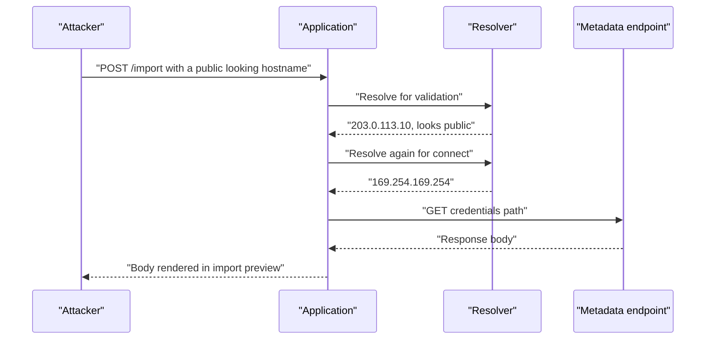
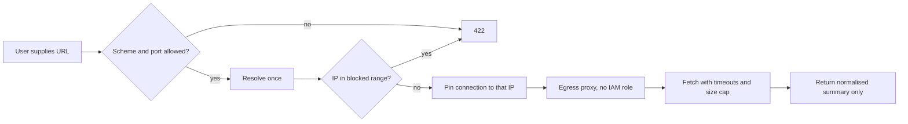

> **Scenario** — A "import from URL" feature lets customers point at a CSV on their own server. Someone points it at `http://169.254.169.254/latest/meta-data/iam/…` and the response body is rendered back into the import preview. The application had no vulnerability in its own code — it just fetched what it was told.

## Why it matters

- Server-side request forgery converts your application into a proxy that sits *inside* the network perimeter, with whatever IAM identity the workload holds.
- Cloud metadata endpoints, internal admin panels, unauthenticated Redis, and Kubernetes APIs are all reachable from a pod that is otherwise "not exposed".
- The feature causing it is usually benign-looking: avatar-by-URL, webhook delivery, PDF rendering, link previews, RSS import, OIDC discovery.
- Blind SSRF still works. The attacker does not need the response body if they can trigger an internal state change or measure timing.

## Symptoms

| Signal | What you observe |
| --- | --- |
| User-supplied URLs fetched | Any parameter named `url`, `callback`, `webhook`, `image_src` reaching an HTTP client |
| Egress to link-local | Outbound connections to `169.254.169.254`, `127.0.0.1`, `10.0.0.0/8` from app pods |
| Redirect following | Client configured with `allow_redirects => true` and no per-hop validation |
| Error content echoed | Fetch failures return upstream response bodies to the user |
| Odd schemes | `file://`, `gopher://`, `dict://` accepted by the HTTP client |
| DNS oddities | Hostnames resolving to private ranges, or resolving twice with different answers |

## How it breaks

Validation typically happens on the *string*, while the connection happens against the *resolved address*. An attacker supplies a hostname that passes the string check and resolves to a private address — or resolves to a public address on the first lookup (validation) and a private one on the second (connection). Redirects add a second chance: the initial URL is fine, and hop two goes wherever the attacker wants.



## Root causes

1. Validation on the URL string rather than on the IP the socket actually connects to.
2. A time-of-check to time-of-use gap between DNS resolution and connection (DNS rebinding).
3. Redirects followed without re-validating each hop.
4. No egress restrictions, so the workload can reach every internal range.
5. Instance metadata reachable without a session token (IMDSv1-style).
6. Upstream response bodies and errors returned verbatim to the requester.
7. Non-HTTP schemes left enabled in the client library.

## How to solve it

### 1. Validate the resolved address, at connect time

```php
use Illuminate\Support\Facades\Http;

final class SafeFetcher
{
    private const BLOCKED = [
        '0.0.0.0/8', '10.0.0.0/8', '127.0.0.0/8', '169.254.0.0/16',
        '172.16.0.0/12', '192.168.0.0/16', '100.64.0.0/10',
        '::1/128', 'fc00::/7', 'fe80::/10',
    ];

    public function get(string $url): string
    {
        $parts = parse_url($url);

        abort_unless(in_array($parts['scheme'] ?? '', ['http', 'https'], true), 422, 'scheme_not_allowed');
        abort_if(isset($parts['port']) && ! in_array($parts['port'], [80, 443], true), 422, 'port_not_allowed');

        return Http::withOptions([
                'allow_redirects' => false,   // handle hops explicitly
                'timeout' => 5,
                'connect_timeout' => 2,
                // Resolve once, then pin: the socket connects to the checked IP.
                'curl' => [CURLOPT_RESOLVE => $this->pin($parts['host'], $parts['scheme'])],
            ])
            ->withHeaders(['Accept' => 'text/csv, application/json'])
            ->get($url)
            ->throw()
            ->body();
    }
}
```

The important property is *pinning*: resolve once, check that address against the blocked ranges, then force the connection to that same address. That closes the rebinding window.

### 2. Handle redirects yourself

Disable automatic redirects and re-run the same validation for every `Location` header, with a hop limit of two or three. A redirect to a private address then fails the same check as a direct request.

### 3. Prefer an allowlist when the domain permits it

Webhook destinations, OIDC issuers, and partner APIs are usually known in advance. An allowlist of hostnames removes the entire class:

```php
$host = strtolower(parse_url($url, PHP_URL_HOST) ?: '');

abort_unless(in_array($host, config('integrations.allowed_hosts'), true), 422, 'host_not_allowed');
```

### 4. Restrict egress at the network layer

Application-level checks are one bug away from failing. Network policy is the backstop:

```yaml
apiVersion: networking.k8s.io/v1
kind: NetworkPolicy
metadata:
  name: api-egress
spec:
  podSelector:
    matchLabels:
      app: api
  policyTypes: ["Egress"]
  egress:
    - to:
        - ipBlock:
            cidr: 0.0.0.0/0
            except:
              - 169.254.0.0/16
              - 10.0.0.0/8
              - 172.16.0.0/12
              - 192.168.0.0/16
    - to:
        - namespaceSelector:
            matchLabels:
              kubernetes.io/metadata.name: data
      ports:
        - protocol: TCP
          port: 5432
```

Better still, route all user-triggered fetches through a dedicated egress proxy in a separate network segment that has no IAM role and no route to internal services.

### 5. Harden the metadata service

On AWS, require IMDSv2 (session tokens) and set the hop limit to 1 so a containerised process cannot reach it:

```bash
aws ec2 modify-instance-metadata-options \
  --instance-id i-0abc123 \
  --http-tokens required \
  --http-put-response-hop-limit 1
```

### 6. Do not echo upstream responses

Return a normalised result — row count, detected columns, a validation summary — rather than the raw body. Log the upstream detail server-side. Blind SSRF is much less useful than reflected SSRF.

### 7. Alert on the signal

An outbound connection attempt to a link-local or private range from an application pod is never legitimate. Make it a page-worthy alert, not a dashboard tile.

## Target design



## Tradeoffs

| Option | Pros | Cons | Choose when |
| --- | --- | --- | --- |
| Hostname allowlist | Strongest and simplest | Cannot support arbitrary customer URLs | Webhooks, partner integrations |
| IP blocklist plus pinning | Supports arbitrary URLs | Must be kept current; IPv6 easy to miss | User-supplied imports and previews |
| Dedicated egress proxy | Central policy and audit; no IAM in path | Extra hop and component to run | Many services fetch user URLs |
| Network policy only | Enforced regardless of app bugs | Coarse; does not stop public-target abuse | Kubernetes estates |
| Disable the feature | Zero risk | Product cost | Feature has low usage and high risk |

## Verification checklist

- [ ] Submit `http://169.254.169.254/` and confirm a validation error, not a fetch.
- [ ] Submit a hostname that resolves to `127.0.0.1` and confirm rejection.
- [ ] Submit a URL that redirects to a private address and confirm the hop is blocked.
- [ ] Confirm `file://` and other non-HTTP schemes are rejected.
- [ ] From an app pod, `curl` the metadata endpoint and confirm it is unreachable.
- [ ] Confirm responses expose a summary, not the upstream body.
- [ ] Confirm an alert fires on any egress attempt to a private range.

## Anti-patterns

- Regex-matching the URL for the literal string `169.254.169.254`.
- Validating the hostname then passing the original URL to a client that resolves again.
- Following redirects with the library default and validating only the first URL.
- Running the fetcher in the same pod that holds a broad IAM role.
- Returning the upstream error body "for better debugging".

## Related

- [File upload security boundaries](/systems/auth-security/file-upload-security)
- [Secrets management and zero-downtime rotation](/systems/auth-security/secrets-management-and-rotation)
- [Injection through ORM escape hatches](/systems/auth-security/injection-and-orm-escapes)
