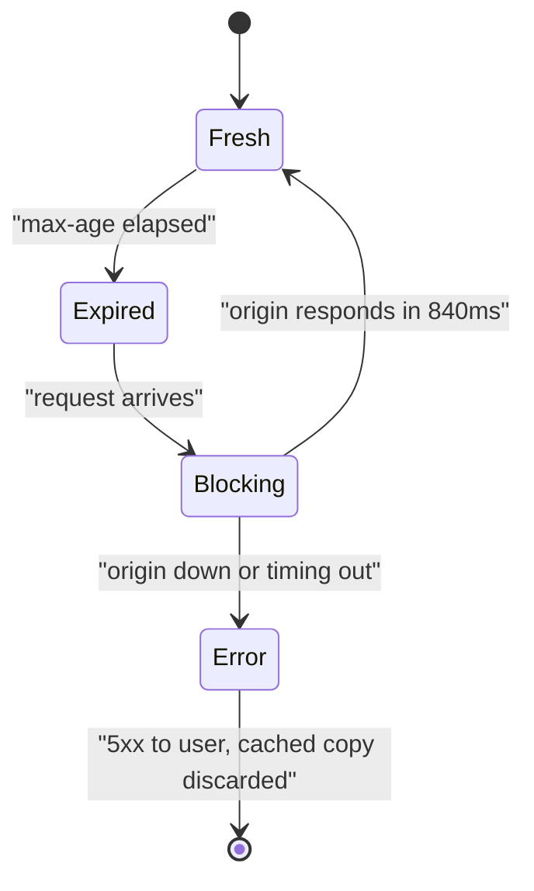
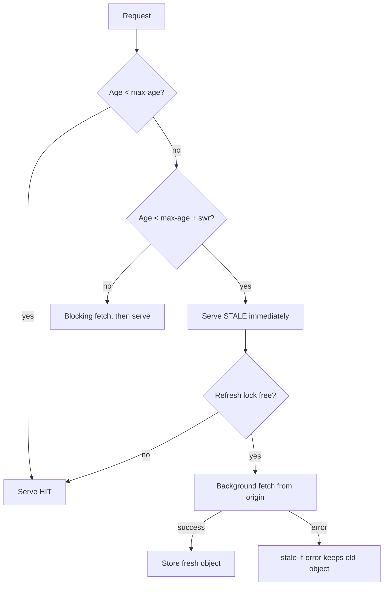

> **Scenario** - category API edge-এ `max-age=60` দিয়ে cache করা। প্রতি মিনিটে ওই endpoint-এর p99 12 ms থেকে 840 ms-এ লাফায়, কারণ edge অন্য region-এর origin-এ revalidate করে। 4 মিনিটের origin deploy-এর সময় edge-এর কাছে দেওয়ার কিছু থাকে না, প্রতিটি visitor খালি catalog দেখে।

## Why it matters

- Hard expiry প্রতি TTL-এ একবার user-facing latency-কে origin latency-র সাথে বেঁধে ফেলে - ভুল মুহূর্তে আসা দুর্ভাগা request-দের জন্য।
- একই ব্যবস্থা origin outage-কে user-visible outage বানায়। edge-এর হাতে একদম ভালো copy আছে, শুধু timer শেষ হয়েছে বলে সে তা ফেলে দিচ্ছে।
- ধীর revalidation-এর জবাবে product দল `max-age` বাড়ায়, latency-র জন্য freshness বিক্রি করে - অথচ দুটোই পাওয়া যেত।
- যে content-এ "60 সেকেন্ড পুরনো" আর "এখনকার" আলাদা করা যায় না - catalog, article body, config blob - সেখানে freshness-এর জন্য পুরো origin latency দেওয়া নিছক অপচয়।
- এখানে availability উন্নতি সস্তা: header-এ দুটি directive, application পরিবর্তন নেই।

## Symptoms

| Signal | What you observe |
|--------|------------------|
| p99 latency | TTL boundary-তে periodic spike, p50 সমতল |
| Origin traffic | user demand নয়, TTL-এর সাথে মিলে revalidation burst |
| Deploy windows | প্রতিটি origin restart জুড়ে error rate বাড়ে |
| `X-Cache-Status` | `HIT` ও `MISS` পালা করে, কখনো `STALE` বা `UPDATING` নয় |
| User reports | পরিচিত origin maintenance-এ "page এক মিনিট ফাঁকা ছিল" |
| Response headers | শুধু `Cache-Control: public, max-age=60`, আর কিছু নেই |

## How it breaks

`max-age` একটি খাড়া প্রান্ত সংজ্ঞায়িত করে। তার আগে cached object origin স্পর্শ ছাড়াই serve হয়; এক সেকেন্ড পরে সেই object *অব্যবহারযোগ্য* এবং request পুরো origin fetch-এ আটকে যায়। "এটা একটু পুরনো কিন্তু চলবে, refresh করার সময় ব্যবহার করো" - এমন মধ্যবর্তী অবস্থা নেই।

আরও খারাপ, সব client একসাথে ওই প্রান্তে পৌঁছায়, তাই revalidation একটি নয় - origin round trip-এর সময় যত request আসে ততগুলো। আর ওই মুহূর্তে origin down থাকলে proxy-র কাছে object আছে কিন্তু serve করার অনুমতি নেই, তাই সে 5xx ফেরায়।



## Root causes

1. `Cache-Control`-এ শুধু `max-age`, `stale-while-revalidate` বা `stale-if-error` নেই।
2. "fresh হতেই হবে" আর "শিগগিরই refresh হওয়া উচিত" - এ দুইয়ের পার্থক্য নেই।
3. Revalidation background-এ নয়, request path-এ ঘটে।
4. upstream error-এ stale serve করার জন্য proxy configure করা নেই।
5. request collapsing নেই, তাই পুরো revalidation wave origin-এ পৌঁছায়।
6. origin deploy ধরে নেয় edge ঢেকে দেবে, অথচ edge-কে কখনো সেভাবে configure করা হয়নি।

## How to solve it

### 1. Add the two directives

`stale-while-revalidate` cache-কে অনুমতি দেয় expired object সাথে সাথে ফেরত দিয়ে asynchronously refresh করতে। `stale-if-error` সেই অনুমতি refresh ব্যর্থ হওয়ার ক্ষেত্রেও বাড়ায়।

```
Cache-Control: public, max-age=60, stale-while-revalidate=300, stale-if-error=86400
Surrogate-Control: max-age=60, stale-while-revalidate=600, stale-if-error=86400
```

তিনটি window হিসেবে পড়ুন: 60 s fresh, পরের 300 s refresh-চলাকালীন-serve-যোগ্য, এবং 24 ঘণ্টা outage-চলাকালীন-serve-যোগ্য। `Surrogate-Control` শুধু CDN-এ প্রযোজ্য এবং browser-এ পৌঁছানোর আগেই বাদ যায়, তাই edge-এ browser-এর চেয়ে বেশি আগ্রাসী হতে পারেন।

```php
return response()->json($categories)
    ->header('Cache-Control', 'public, max-age=60, stale-while-revalidate=300, stale-if-error=86400')
    ->header('Surrogate-Control', 'max-age=60, stale-while-revalidate=600, stale-if-error=86400')
    ->header('Surrogate-Key', 'categories catalog');
```

### 2. Configure the proxy to actually honour it

nginx একই semantics দেয় `proxy_cache_use_stale` ও background update দিয়ে।

```nginx
proxy_cache_path /var/cache/nginx levels=1:2 keys_zone=api_cache:64m
                 max_size=10g inactive=7d use_temp_path=off;

location /api/categories {
    proxy_cache api_cache;
    proxy_cache_valid 200 60s;

    # Serve the stale object while a single background request refreshes it.
    proxy_cache_background_update on;
    proxy_cache_use_stale updating error timeout invalid_header
                          http_500 http_502 http_503 http_504;

    # Collapse the revalidation wave into one upstream request.
    proxy_cache_lock on;
    proxy_cache_lock_timeout 5s;
    proxy_cache_lock_age 10s;

    # Keep the object available long after max-age for stale-if-error.
    proxy_cache_valid any 1m;
    proxy_read_timeout 3s;

    add_header X-Cache-Status $upstream_cache_status always;
    add_header Age $upstream_http_age always;
}
```

`proxy_cache_lock_age` গুরুত্বপূর্ণ: এটি ছাড়া ধীর refresh-এ lock timeout-এর পর দ্বিতীয় request চলে যায়, আর herd ফিরে আসে।

### 3. Mirror the pattern in the application cache

একই তিন-window মডেল Redis-এও চলে। physical TTL logical freshness deadline-এর অনেক বাইরে রাখুন, যাতে origin failure-এ value টিকে থাকে।

```ts
type Entry<T> = { value: T; freshUntil: number; staleUntil: number }

export async function swr<T>(key: string, load: () => Promise<T>): Promise<T> {
  const raw = await redis.get(key)
  const entry = raw ? (JSON.parse(raw) as Entry<T>) : null
  const now = Date.now()

  if (entry && now < entry.freshUntil) return entry.value

  if (entry && now < entry.staleUntil) {
    if (await redis.set(`lock:${key}`, '1', 'NX', 'PX', 5_000)) {
      void load()
        .then((value) => write(key, value))
        .catch(() => {
          /* keep serving stale: stale-if-error */
        })
        .finally(() => redis.del(`lock:${key}`))
    }
    return entry.value
  }

  return write(key, await load())
}
```

### 4. Expose freshness to the client

`Age` ও একটি নরম freshness hint পাঠান, যাতে UI "40 সেকেন্ড আগে হালনাগাদ" দেখাতে পারে, data live ভান না করে। অদৃশ্য staleness-এর চেয়ে দৃশ্যমান staleness user অনেক বেশি সহ্য করে।

## Target design



## Tradeoffs

| Option | Pros | Cons | Choose when |
|--------|------|------|-------------|
| `max-age` only | সহজ, কঠোর freshness bound | প্রতি TTL-এ latency cliff; outage মানে error | সামান্য staleness-ও correctness bug এমন data |
| `max-age` + `stale-while-revalidate` | সমতল p99, window-প্রতি origin একটি request দেখে | user সর্বোচ্চ `max-age + swr` পুরনো data দেখতে পারে | catalog, listing, config, বেশিরভাগ read API |
| Add `stale-if-error` | origin outage অদৃশ্য হয়ে যায় | দীর্ঘ outage-এ খুব পুরনো data serve হতে পারে | absolute freshness-এর চেয়ে availability গুরুত্বপূর্ণ |
| Long `max-age` instead | revalidation traffic একেবারেই নেই | freshness খারাপ, cliff তবু থাকে | immutable, content-hashed asset |
| `no-cache` with revalidation | সবসময় fresh, সস্তা 304 | প্রতিটি request-এ round trip | ছোট, latency-অসংবেদনশীল response |

## Verification checklist

- [ ] `curl -sI "$HOST/api/categories"`-এর `Cache-Control`-এ `stale-while-revalidate` ও `stale-if-error` আছে।
- [ ] TTL পেরিয়ে বারবার `curl -sI` করলে `X-Cache-Status: STALE` বা `UPDATING` আসে, ধীর `MISS` নয়।
- [ ] origin থামিয়ে (`docker stop api`) দেখুন endpoint এখনো 200 ও বাড়তে থাকা `Age` দেয়।
- [ ] 6 ঘণ্টার window-এ endpoint-এর p99-তে TTL-সংলগ্ন periodic spike নেই।
- [ ] path-এর origin request rate edge POP-প্রতি প্রায় `1 / max-age`, user traffic-এর সমানুপাতিক নয়।
- [ ] `stale-if-error` window আপনার সবচেয়ে খারাপ বাস্তব deploy বা incident সময়ের চেয়ে বড়।
- [ ] staleness user-visible এমন content-এ UI কোথাও `Age` দেখায়।

## Anti-patterns

- proxy-তে `proxy_cache_background_update on` না রেখে `stale-while-revalidate` সেট করা - directive উপেক্ষিত হয়, কিছুই বদলায় না।
- write response বা user-specific কিছুতে `stale-if-error` ব্যবহার।
- `proxy_cache_lock` বাদ দেওয়া, ফলে background revalidation আসলে 3,000 concurrent origin request।
- `stale-while-revalidate` যোগ না করে revalidation latency লুকাতে `max-age` বাড়ানো।
- আইনি বা আর্থিক freshness প্রয়োজন আছে এমন data-তে সীমাহীন `stale-if-error`।
- browser-রা `stale-while-revalidate` হুবহু মানে ধরে নেওয়া; CDN আচরণকে contract ধরুন, browser-কে best-effort।

## Related

- [TTL and jitter design for cache fleets](/systems/caching-cdn/ttl-and-jitter-design)
- [Cache stampede prevention with locks and early refresh](/systems/caching-cdn/cache-stampede-prevention)
- [CDN cache key normalization and hit ratio](/systems/caching-cdn/cdn-cache-key-normalization)
- [Cache invalidation strategies that survive deploys](/systems/caching-cdn/cache-invalidation-strategies)
