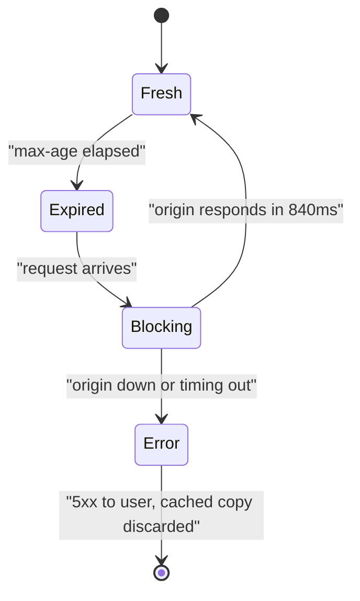
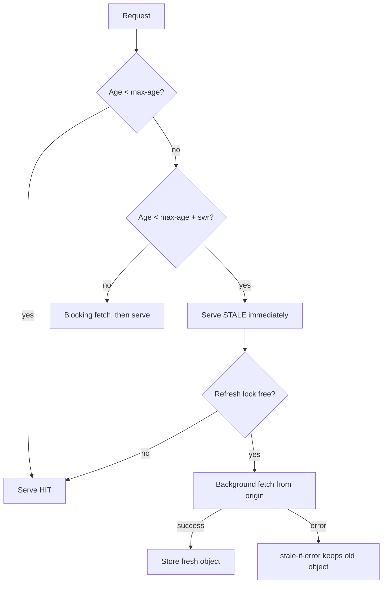

> **Scenario** - The category API is cached at the edge with `max-age=60`. Every minute, p99 for that endpoint jumps from 12 ms to 840 ms as the edge revalidates against an origin in another region. During a 4-minute origin deploy, the edge has nothing to serve and the storefront shows an empty catalog to every visitor.

## Why it matters

- Hard expiry couples user-facing latency to origin latency once per TTL, for the unlucky requests that arrive at the wrong moment.
- The same mechanism turns an origin outage into a user-visible outage. The edge is holding a perfectly good copy and throwing it away because a timer expired.
- Product teams respond to slow revalidation by raising `max-age`, trading freshness for latency when they could have had both.
- For content where "60 seconds old" is indistinguishable from "current" - catalogs, article bodies, config blobs - paying full origin latency for freshness is pure waste.
- Availability improvements here are cheap: two directives in a header, no application change.

## Symptoms

| Signal | What you observe |
|--------|------------------|
| p99 latency | Periodic spikes at the TTL boundary while p50 stays flat |
| Origin traffic | Revalidation bursts aligned to the TTL, not to user demand |
| Deploy windows | Error rate rises for the duration of every origin restart |
| `X-Cache-Status` | Alternating `HIT` and `MISS`, never `STALE` or `UPDATING` |
| User reports | "The page was blank for a minute" during known origin maintenance |
| Response headers | `Cache-Control: public, max-age=60` and nothing else |

## How it breaks

`max-age` defines a cliff. Before it, the cached object is served with no origin contact; one second after, the object is *unusable* and the request blocks on a full origin fetch. There is no middle state where the cache says "this is slightly old but fine, use it while I refresh".

Worse, all clients hit the cliff together, so the revalidation is not one request but as many as arrive during the origin round trip. And if the origin is down at that moment, the proxy has an object it is not allowed to serve, so it returns 5xx instead.



## Root causes

1. `Cache-Control` carries only `max-age`, with no `stale-while-revalidate` or `stale-if-error`.
2. No distinction between "must be fresh" and "should be refreshed soon".
3. Revalidation happens on the request path instead of in the background.
4. The proxy is not configured to serve stale on upstream errors.
5. No request collapsing, so the whole revalidation wave reaches the origin.
6. Origin deploys assume the edge will cover them, without ever configuring the edge to do so.

## How to solve it

### 1. Add the two directives

`stale-while-revalidate` gives the cache permission to return an expired object immediately and refresh asynchronously. `stale-if-error` extends that permission to the case where the refresh fails.

```
Cache-Control: public, max-age=60, stale-while-revalidate=300, stale-if-error=86400
Surrogate-Control: max-age=60, stale-while-revalidate=600, stale-if-error=86400
```

Read it as three windows: fresh for 60 s, servable-while-refreshing for the next 300 s, and servable-during-an-outage for 24 hours. `Surrogate-Control` applies at the CDN only and is stripped before reaching browsers, so you can be more aggressive at the edge than in the browser.

```php
return response()->json($categories)
    ->header('Cache-Control', 'public, max-age=60, stale-while-revalidate=300, stale-if-error=86400')
    ->header('Surrogate-Control', 'max-age=60, stale-while-revalidate=600, stale-if-error=86400')
    ->header('Surrogate-Key', 'categories catalog');
```

### 2. Configure the proxy to actually honour it

nginx implements the same semantics through `proxy_cache_use_stale` plus background updates.

```nginx
proxy_cache_path /var/cache/nginx levels=1:2 keys_zone=api_cache:64m
                 max_size=10g inactive=7d use_temp_path=off;

location /api/categories {
    proxy_cache api_cache;
    proxy_cache_valid 200 60s;

    # Serve the stale object while a single background request refreshes it.
    proxy_cache_background_update on;
    proxy_cache_use_stale updating error timeout invalid_header
                          http_500 http_502 http_503 http_504;

    # Collapse the revalidation wave into one upstream request.
    proxy_cache_lock on;
    proxy_cache_lock_timeout 5s;
    proxy_cache_lock_age 10s;

    # Keep the object available long after max-age for stale-if-error.
    proxy_cache_valid any 1m;
    proxy_read_timeout 3s;

    add_header X-Cache-Status $upstream_cache_status always;
    add_header Age $upstream_http_age always;
}
```

`proxy_cache_lock_age` matters: without it, a slow refresh lets a second request through after the lock timeout, which reintroduces the herd.

### 3. Mirror the pattern in the application cache

The same three-window model works in Redis. Keep the physical TTL far beyond the logical freshness deadline so the value survives an origin failure.

```ts
type Entry<T> = { value: T; freshUntil: number; staleUntil: number }

export async function swr<T>(key: string, load: () => Promise<T>): Promise<T> {
  const raw = await redis.get(key)
  const entry = raw ? (JSON.parse(raw) as Entry<T>) : null
  const now = Date.now()

  if (entry && now < entry.freshUntil) return entry.value

  if (entry && now < entry.staleUntil) {
    if (await redis.set(`lock:${key}`, '1', 'NX', 'PX', 5_000)) {
      void load()
        .then((value) => write(key, value))
        .catch(() => {
          /* keep serving stale: stale-if-error */
        })
        .finally(() => redis.del(`lock:${key}`))
    }
    return entry.value
  }

  return write(key, await load())
}
```

### 4. Expose freshness to the client

Send `Age` and a soft freshness hint so the UI can show "updated 40 seconds ago" instead of pretending the data is live. Users tolerate visible staleness far better than invisible staleness.

## Target design



## Tradeoffs

| Option | Pros | Cons | Choose when |
|--------|------|------|-------------|
| `max-age` only | Simple, strict freshness bound | Latency cliff every TTL; outage means errors | Data where any staleness is a correctness bug |
| `max-age` + `stale-while-revalidate` | Flat p99, origin sees one request per window | Users may see data up to `max-age + swr` old | Catalogs, listings, config, most read APIs |
| Add `stale-if-error` | Origin outages become invisible | Very old data can be served during long outages | Availability matters more than absolute freshness |
| Long `max-age` instead | No revalidation traffic at all | Freshness is worse, and you still get the cliff | Immutable, content-hashed assets |
| `no-cache` with revalidation | Always fresh, cheap 304s | Round trip on every request | Small, latency-insensitive responses |

## Verification checklist

- [ ] `curl -sI "$HOST/api/categories"` shows `stale-while-revalidate` and `stale-if-error` in `Cache-Control`.
- [ ] Repeated `curl -sI` past the TTL returns `X-Cache-Status: STALE` or `UPDATING`, never a slow `MISS`.
- [ ] Stop the origin (`docker stop api`) and confirm the endpoint still returns 200 with a growing `Age`.
- [ ] p99 for the endpoint has no periodic spike aligned to the TTL over a 6-hour window.
- [ ] Origin request rate for the path is approximately `1 / max-age` per edge POP, not proportional to user traffic.
- [ ] `stale-if-error` window is longer than your worst realistic deploy or incident duration.
- [ ] The UI surfaces `Age` somewhere for content where staleness is user-visible.

## Anti-patterns

- Setting `stale-while-revalidate` while the proxy lacks `proxy_cache_background_update on` - the directive is ignored and nothing changes.
- Using `stale-if-error` on write responses or anything user-specific.
- Omitting `proxy_cache_lock`, so the background revalidation is actually 3,000 concurrent origin requests.
- Raising `max-age` to hide revalidation latency rather than adding `stale-while-revalidate`.
- An unbounded `stale-if-error` on data with legal or financial freshness requirements.
- Assuming browsers honour `stale-while-revalidate` identically; treat CDN behaviour as the contract and browsers as best-effort.

## Related

- [TTL and jitter design for cache fleets](/systems/caching-cdn/ttl-and-jitter-design)
- [Cache stampede prevention with locks and early refresh](/systems/caching-cdn/cache-stampede-prevention)
- [CDN cache key normalization and hit ratio](/systems/caching-cdn/cdn-cache-key-normalization)
- [Cache invalidation strategies that survive deploys](/systems/caching-cdn/cache-invalidation-strategies)
