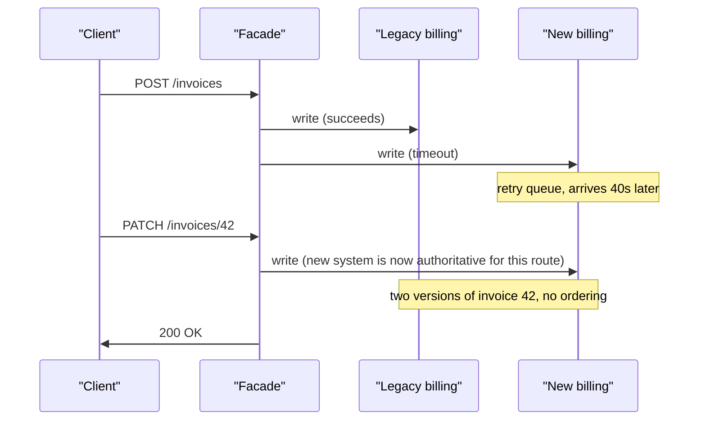
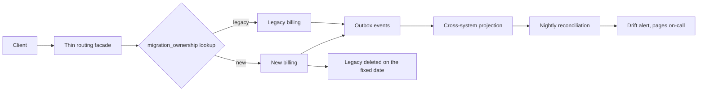

> **Scenario** - Two years into replacing a legacy billing system, 62% of traffic goes to the new service, the routing facade has grown 3,000 lines of conditionals, both systems write to the `invoices` table, and last month's reconciliation found 214 invoices that exist in one system and not the other. Nobody can name the date the old system gets deleted.

## Why it matters

- An unfinished strangler migration is more expensive than either system alone: two codebases, two on-call surfaces, two sets of bugs, and a routing layer that is now its own legacy system.
- Dual writes without a single source of truth produce silent divergence. You find it in a reconciliation report or in a customer complaint, weeks after the data split.
- Every month the migration runs, the legacy system keeps accumulating features, so the target moves. Migrations that lack a feature freeze never converge.
- For founders: a migration with no deletion date is an indefinite tax on every feature, because every change must be made twice.
- The rollback story is what makes incremental migration safe. Without per-route rollback, you have a big-bang cutover executed slowly.

## Symptoms

| Signal | What you observe |
|---|---|
| Facade complexity | The routing layer has more branches than either system's business logic |
| Reconciliation drift | Nightly comparison finds records present in one store and not the other |
| Double implementation | New features are built twice, in both old and new, "until the migration finishes" |
| Stalled percentage | Traffic share has been at 60-70% for several months |
| No end date | The deletion of the legacy system is not on any roadmap |
| Ownership | The legacy system has no owner; the new one has three |

## How it breaks

The strangler fig pattern works because the facade lets you move one capability at a time. It fails when the facade becomes the place where decisions live. Every unmigrated edge case gets a conditional, and after 18 months the conditionals encode business rules that exist nowhere else. At that point removing the facade is a third migration.

The deeper failure is write ownership. As soon as both systems can write the same entity, you need conflict resolution, and almost nobody builds it. Teams instead do "dual write": write to both, hope both succeed. When the second write fails - timeouts, deploys, validation differences - the systems diverge, and there is no ordering information to reconstruct which one is right.



## Root causes

1. Both systems allowed to write the same entity, with no single source of truth per record.
2. No feature freeze on the legacy system, so the migration target keeps moving.
3. Routing decisions accumulate in the facade instead of being resolved and removed.
4. Migration sequenced by ease rather than by dependency, leaving the hardest coupling for last.
5. No deletion deadline, so the migration has no forcing function.
6. Verification limited to "the new system returns 200" rather than "the new system returns the same answer".

## How to solve it

### 1. Sequence by dependency, and write the order down

Migrate reads before writes, leaves before roots, and low-risk before high-risk - but never move a capability whose dependencies still live in the legacy system.

```md
## Migration sequence (billing)

1. Read-only invoice PDF rendering        - no writes, no dependencies      [done]
2. Invoice list and detail reads          - shadow-read verified 30 days    [done]
3. Invoice creation                       - new system authoritative        [in progress]
4. Payment application                    - depends on 3                    [blocked on 3]
5. Credit notes                           - depends on 3, 4
6. Dunning and retries                    - depends on 4
7. Legacy deletion                        - hard date: 2026-11-30
```

### 2. Shadow-read before you cut over

Run both systems for reads, serve the legacy answer, and compare asynchronously. This is the cheapest verification available and it catches the differences that unit tests do not.

```ts
export async function getInvoice(id: string, ctx: Ctx): Promise<Invoice> {
  const legacy = await legacyClient.getInvoice(id)

  if (flags.shadowReadInvoices) {
    // Never on the request path: compare out of band, never throw.
    void (async () => {
      try {
        const candidate = await newClient.getInvoice(id)
        const diff = diffInvoice(legacy, candidate)
        if (diff.length) {
          metrics.increment('migration.invoice.mismatch', { fields: diff.join(',') })
          log.warn({ id, diff }, 'shadow read mismatch')
        } else {
          metrics.increment('migration.invoice.match')
        }
      } catch (err) {
        metrics.increment('migration.invoice.shadow_error')
      }
    })()
  }

  return legacy
}
```

Cut over a route when the mismatch rate has been below your threshold - 0.01% is a reasonable bar for financial data - for a full business cycle, including month-end.

### 3. Give every entity exactly one writer at a time

Never dual-write. Move write ownership atomically per entity type, and have the non-owning system read through to the owner or receive events.

```php
// Write ownership is data, not code. One row per entity type, flipped deliberately.
$owner = DB::table('migration_ownership')
    ->where('entity', 'invoice')
    ->value('owner');           // 'legacy' | 'new'

if ($owner === 'new') {
    $invoice = $this->newBilling->create($payload);
    // Legacy stays consistent by consuming the event, not by being written to.
    Outbox::publish('invoice.created', $invoice->toArray());
} else {
    $invoice = $this->legacyBilling->create($payload);
    Outbox::publish('invoice.created', $invoice->toArray());
}
```

The ownership table gives you a rollback that takes one `UPDATE` rather than a deploy.

### 4. Keep the facade thin and delete branches as you go

The facade should route, not decide. A branch that has served 0% of traffic for 30 days is deleted, not kept "just in case".

```nginx
# Routing lives in configuration, not in application conditionals.
location /api/invoices {
    set $backend "legacy_billing";
    if ($http_x_migration_cohort = "new") { set $backend "new_billing"; }
    proxy_pass http://$backend;
}
```

### 5. Reconcile continuously and alert on drift

```sql
-- Nightly: entities present in one system and not the other, or with divergent totals.
SELECT COALESCE(l.id, n.id)      AS invoice_id,
       l.total_cents             AS legacy_total,
       n.total_cents             AS new_total,
       CASE
         WHEN l.id IS NULL THEN 'missing_in_legacy'
         WHEN n.id IS NULL THEN 'missing_in_new'
         ELSE 'total_mismatch'
       END                       AS drift
  FROM legacy.invoices l
  FULL OUTER JOIN newbilling.invoices n ON n.id = l.id
 WHERE l.id IS NULL
    OR n.id IS NULL
    OR l.total_cents <> n.total_cents;
```

Page on any non-zero result for financial entities. A reconciliation report nobody reads is not verification.

### 6. Set the deletion date first, and freeze the legacy system

Pick the date before the migration starts and put it in the ADR. Freeze the legacy system to bug fixes only: every new feature goes into the new system, even if that means the new system must handle a capability earlier than planned. Without the freeze, the finish line moves faster than you do.

## Target design



## Tradeoffs

| Option | Pros | Cons | Choose when |
|---|---|---|---|
| Strangler fig with per-route cutover | Incremental risk, rollback per route, keeps shipping | Long dual-run period; facade must be disciplined | Large legacy system that cannot stop |
| Big-bang rewrite and cutover | One switch, no dual-run tax, clean end state | Enormous blast radius; rollback is a restore | Small system with a frozen feature set |
| Parallel run with dual writes | Both systems always current | Divergence without conflict resolution; double failure modes | Almost never; prefer event-driven sync |
| Wrap and leave | Cheapest; no migration at all | Legacy stays forever; the wrapper becomes legacy too | The system is stable and genuinely done |

## Verification checklist

- [ ] A written migration sequence exists with dependencies and a hard deletion date.
- [ ] Shadow reads run for each route with a mismatch metric, and cutover requires 30 days under threshold.
- [ ] `migration_ownership` (or equivalent) has exactly one owner per entity type and rollback is a single update.
- [ ] Nightly reconciliation runs and its non-zero result pages someone.
- [ ] The legacy system is under a documented feature freeze that engineers actually follow.
- [ ] Facade branches serving 0% of traffic for 30 days have been deleted; count them this month.
- [ ] A per-route rollback has been executed at least once in a drill.

## Anti-patterns

- Dual writes as a migration strategy - you have created a distributed consistency problem to avoid a sequencing problem.
- Letting business logic accumulate in the facade, creating a third system nobody plans to delete.
- Migrating the easy capabilities first and leaving the tightly coupled core for a mythical final phase.
- Declaring success at "traffic is on the new system" while the legacy system is still deployed and still costing money.
- Running the migration without a feature freeze, so the legacy system grows faster than you can replace it.

## Related

- [Modular monolith versus microservices](/systems/product-platform/modular-monolith-vs-microservices)
- [Feature flags and kill switches that stay clean](/systems/product-platform/feature-flags-and-kill-switches)
- [Public API contract stability](/systems/product-platform/public-api-contract-stability)
