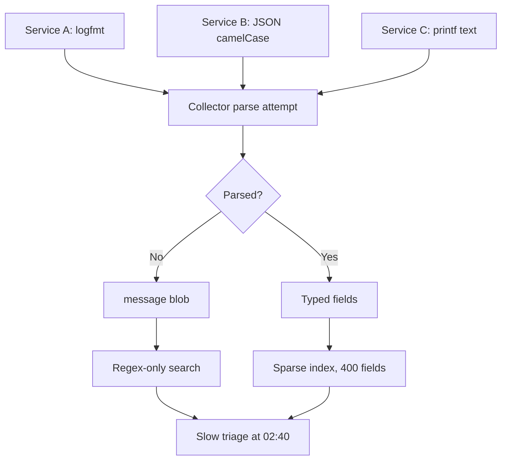
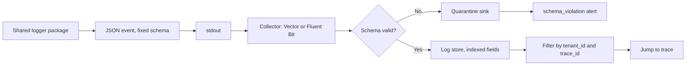

> **Scenario** - রাত 02:40, আপনার দরকার tenant 4471-এর শেষ বিশ মিনিটের প্রতিটি failed payment। Log সব free text: তিনটি service লেখে `Payment failed for user`, একটি লেখে `ERR pay`, আর PHP worker কোনো request identifier ছাড়াই 90 লাইনের stack trace মিশিয়ে দেয়। Incident চলতে থাকে, আপনি দুই pod-এ raw file grep করছেন।

## Why it matters

- Unstructured log filter করা যায় না, তাই triage time log volume-এর সাথে বাড়ে, স্থির থাকে না।
- Structure ছাড়া multi-line stack trace collector-এ ভাঙে - একটি event 90টি অসম্পর্কিত entry হয়ে cost বাড়ায়।
- Level অসংগত হলে `ERROR`-এ একসাথে থাকে "customer টাকা হারিয়েছে" আর "retryable DNS blip", ফলে `ERROR`-এ alert করা অসম্ভব।
- Log-ই একমাত্র signal যা arbitrary context বহন করে; `tenant_id` field না হয়ে বাক্যের ভেতরে থাকলে per-tenant blast-radius প্রশ্নের উত্তর নেই।
- যেকোনো API-র চেয়ে log দিয়ে secret বেশি leak হয়। Redaction reviewer-এর মাথায় নয়, encoder-এ থাকা উচিত।

## Symptoms

| Signal | What you observe |
| --- | --- |
| Query | message text-এ regex ছাড়া filter হয় না; অর্ধেক লাইনে JSON parse fail |
| Volume | একটি exception ডজনখানেক entry; deploy-এ ingest cost spike |
| Levels | ঘণ্টায় হাজারবার `ERROR`, কোনো action যুক্ত নেই |
| Correlation | দুই service একই request-কে `req_id`, `requestId` ও `X-Request-ID` দিয়ে লেখে |
| Compliance | Log search-এ card BIN, email ও bearer token পাওয়া যায় |
| Timestamps | local time ও UTC মিশ্রিত; service জুড়ে ordering অনুমান |

## How it breaks

প্রতিটি service নিজের logger default বেছে নেয়। একটি `logfmt`, একটি camelCase JSON, একটি `printf`। Log pipeline (Fluent Bit, Vector বা Promtail) যা পারে parse করে, বাকিটা একটি `message` blob-এ ফেলে। Shared schema না থাকায় index-এ শত শত sparsely populated field জমে - label-based storage engine ধীর হয়, per-GB engine দামি হয়। এরপর একজন developer "শুধু debug-এর জন্য" পুরো request object log করে, object-এ থাকে `Authorization` header, আর সেই secret তিন region-এ 30 দিন retained থাকে।



## Root causes

1. Repository-জুড়ে logging schema নেই, তাই প্রতিটি team নিজের field name বানায়।
2. Logger shared library হিসেবে default নিয়ে না এসে per-service configure করা।
3. Multi-line exception structured `stack` field ছাড়া emit করা।
4. Log level-এর semantics অনির্ধারিত: কী `ERROR` প্রাপ্য তার নিয়ম নেই।
5. Context (tenant, request, user) structured attribute নয়, string interpolation হিসেবে যায়।
6. Redaction encoder hook নয়, code review discipline হিসেবে কার্যকর।

## How to solve it

### 1. একটি minimal required schema ঠিক করুন

দশটি field প্রায় প্রতিটি incident cover করে। এগুলো mandatory, বাকি সব optional।

```ts
export type LogEvent = {
  timestamp: string   // RFC3339 with milliseconds, always UTC
  level: 'debug' | 'info' | 'warn' | 'error' | 'fatal'
  message: string     // short, static; no interpolated values
  service: string
  version: string     // git sha or semver, for "did the deploy do it"
  env: 'dev' | 'staging' | 'prod'
  trace_id?: string   // 32 hex chars, from the active span
  span_id?: string
  request_id?: string
  tenant_id?: string
  error?: { type: string; message: string; stack?: string }
  duration_ms?: number
}
```

আসল নিয়ম: `message` একটি *constant string*। মান যায় field-এ। `Payment declined` + `{ tenant_id: 4471, code: 'insufficient_funds' }` queryable; `Payment declined for tenant 4471` নয়।

### 2. প্রতি service-এ নয়, একটিই logger ship করুন

```ts
import pino from 'pino'

const REDACT = [
  'req.headers.authorization',
  'req.headers.cookie',
  '*.password',
  '*.card_number',
  '*.access_token',
]

export const logger = pino({
  level: process.env.LOG_LEVEL ?? 'info',
  base: {
    service: process.env.SERVICE_NAME,
    version: process.env.GIT_SHA,
    env: process.env.APP_ENV,
  },
  timestamp: pino.stdTimeFunctions.isoTime,
  redact: { paths: REDACT, censor: '[redacted]' },
  formatters: {
    level: (label) => ({ level: label }),
  },
})
```

### 3. Request-এ একবার context bind করে তারপর নির্ভাবনায় log করুন

```ts
import { context, trace } from '@opentelemetry/api'

export function requestLogger(req, res, next) {
  const span = trace.getSpan(context.active())
  const ctx = span?.spanContext()
  req.log = logger.child({
    request_id: req.headers['x-request-id'] ?? crypto.randomUUID(),
    tenant_id: req.auth?.tenantId,
    trace_id: ctx?.traceId,
    span_id: ctx?.spanId,
  })
  next()
}
```

Laravel-এ একই ধারণা context processor:

```php
Log::withContext([
    'request_id' => $request->header('X-Request-ID') ?? (string) Str::uuid(),
    'tenant_id'  => $request->user()?->tenant_id,
    'trace_id'   => Context::currentTraceId(),
]);

Log::error('payment.declined', [
    'code'      => $response->declineCode(),
    'gateway'   => 'stripe',
    'amount_cents' => $order->total_cents,
]);
```

### 4. Level ঠিক করুন action দিয়ে, অনুভূতি দিয়ে নয়

| Level | Rule |
| --- | --- |
| `error` | user-visible প্রতিশ্রুতি ভেঙেছে, মানুষের action লাগতে পারে |
| `warn` | degraded কিন্তু self-healing (retry সফল, fallback ব্যবহৃত) |
| `info` | timeline পুনর্গঠনে দরকারি state transition |
| `debug` | production-এ বন্ধ; flag দিয়ে per-tenant চালু |

### 5. Pipeline-কে schema enforce করতে দিন

```yaml
# Vector: drop unparseable lines into a quarantine sink instead of the main index.
transforms:
  parse_json:
    type: remap
    inputs: [k8s_logs]
    source: |
      parsed, err = parse_json(.message)
      if err != null {
        .schema_violation = true
      } else {
        . = merge(., parsed)
      }
      if !exists(.trace_id) && exists(.request_id) {
        .trace_id = .request_id
      }
sinks:
  quarantine:
    type: loki
    inputs: [parse_json]
    labels: { stream: quarantine }
```

`schema_violation` rate-এ alert করুন। কোনো team `printf`-এ ফিরে গেলে এক ঘণ্টায় জানা যায়, পরের outage-এ নয়।

## Target design



## Tradeoffs

| Option | Pros | Cons | Choose when |
| --- | --- | --- | --- |
| সর্বত্র JSON log | queryable, machine-parseable | বড় payload; raw terminal-এ পড়া কষ্ট | production service-এর default |
| logfmt | compact, human-readable | দুর্বল nesting, array নেই | high-volume infra component |
| Text log + parser | code change লাগে না | message বদলালেই parser ভাঙে | যে legacy বদলানো যায় না |
| Label-indexed store (Loki) | সস্তা storage, high volume | label cardinality সীমা; full scan ধীর | log মূলত service/tenant দিয়ে filter |
| Full-text index | দ্রুত arbitrary search | volume-এর সাথে cost বাড়ে | security ও audit workload |

## Verification checklist

- [ ] প্রতিটি service-এ `kubectl logs deploy/api | head -1 | jq .` error ছাড়া parse হয়।
- [ ] শেষ একদিনের log-এ `Bearer ` ও card-আকৃতির digit run grep করুন; hit শূন্য হওয়া উচিত।
- [ ] Exception ট্রিগার করে দেখুন একটি log event-এ `error.stack` field আছে, 90 লাইন নেই।
- [ ] অন্তত 95% `error` event-এ `trace_id` আছে।
- [ ] Index-এ field count সীমিত ও reviewed; নতুন field-এ schema note লাগে।
- [ ] `schema_violation` rate graph করা এবং ছোট threshold-এর উপরে alert করে।

## Anti-patterns

- `message`-এ value interpolate করা, যা message ধরে aggregation নষ্ট করে।
- প্রতিটি layer-এ caught exception ও rethrow দুটোই log করা - এক failure-এ পাঁচ event।
- Log-কে metric হিসেবে ব্যবহার: counter export না করে `ERROR` লাইন গোনা।
- Production-এ "অস্থায়ীভাবে" `LOG_LEVEL=debug` দিয়ে retention budget উড়িয়ে দেওয়া।
- Call site-এ application code-এ redaction করা, যা প্রথমবার ভুলে গেলেই fail।

## Related

- [Correlation IDs across services and queues](/systems/observability-sli/correlation-ids-across-services)
- [Log sampling and observability cost control](/systems/observability-sli/log-sampling-and-cost-control)
- [Incident timeline reconstruction](/systems/observability-sli/incident-timeline-reconstruction)
- [Distributed tracing adoption](/systems/observability-sli/distributed-tracing-adoption)
