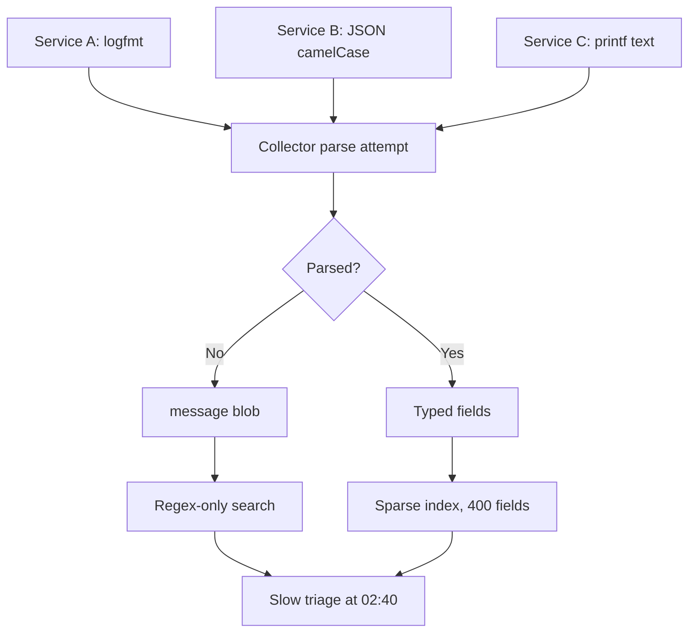
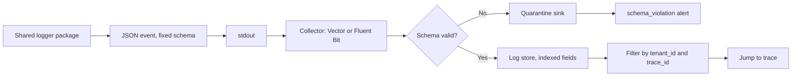

> **Scenario** — At 02:40 you need every failed payment for tenant 4471 in the last twenty minutes. The logs are free text: three services write `Payment failed for user`, one writes `ERR pay`, and the PHP worker interleaves a 90-line stack trace with no request identifier. You end up grepping raw files on two pods while the incident continues.

## Why it matters

- Unstructured logs cannot be filtered, so triage time scales with log volume instead of staying flat.
- Multi-line stack traces without a structure break at the collector, splitting one event into 90 unrelated entries and inflating cost.
- Inconsistent levels mean `ERROR` carries both "customer lost money" and "retryable DNS blip", so nobody can alert on `ERROR`.
- Logs are the one signal that carries arbitrary context; if `tenant_id` is inside a sentence rather than a field, per-tenant blast-radius questions are unanswerable.
- Secrets leak through logs more often than through any API. Redaction belongs in the encoder, not in reviewers' heads.

## Symptoms

| Signal | What you observe |
| --- | --- |
| Query | Filtering requires regex over message text; JSON parsing fails on half the lines |
| Volume | One exception produces dozens of log entries; ingest cost spikes on deploys |
| Levels | `ERROR` fires thousands of times per hour with no action attached |
| Correlation | Two services log the same request with `req_id`, `requestId`, and `X-Request-ID` |
| Compliance | Card BINs, emails, and bearer tokens found in log search results |
| Timestamps | Mixed local time and UTC; ordering across services is guesswork |

## How it breaks

Each service picks its own logger default. One emits `logfmt`, one emits JSON with camelCase, one emits `printf`. The log pipeline (Fluent Bit, Vector, or Promtail) parses what it can and dumps the rest into a single `message` blob. Because there is no shared schema, the index has hundreds of sparsely populated fields, which makes label-based storage engines slow and cost-per-GB engines expensive. Then a developer logs the whole request object "just for debugging", the object contains an `Authorization` header, and the secret is now retained for 30 days across three regions.



## Root causes

1. No repository-wide logging schema, so every team invents field names.
2. Loggers configured per service instead of shipped as a shared library with defaults baked in.
3. Multi-line exceptions emitted without a structured `stack` field.
4. Log level semantics undefined: no rule for what deserves `ERROR`.
5. Context (tenant, request, user) passed as string interpolation rather than structured attributes.
6. Redaction implemented as code review discipline instead of an encoder hook.

## How to solve it

### 1. Fix a minimal required schema

Ten fields cover almost every incident. Make them mandatory and everything else optional.

```ts
export type LogEvent = {
  timestamp: string   // RFC3339 with milliseconds, always UTC
  level: 'debug' | 'info' | 'warn' | 'error' | 'fatal'
  message: string     // short, static; no interpolated values
  service: string
  version: string     // git sha or semver, for "did the deploy do it"
  env: 'dev' | 'staging' | 'prod'
  trace_id?: string   // 32 hex chars, from the active span
  span_id?: string
  request_id?: string
  tenant_id?: string
  error?: { type: string; message: string; stack?: string }
  duration_ms?: number
}
```

The rule that matters: `message` is a *constant string*. Values go in fields. `Payment declined` plus `{ tenant_id: 4471, code: 'insufficient_funds' }` is queryable; `Payment declined for tenant 4471` is not.

### 2. Ship one logger, not one per service

```ts
import pino from 'pino'

const REDACT = [
  'req.headers.authorization',
  'req.headers.cookie',
  '*.password',
  '*.card_number',
  '*.access_token',
]

export const logger = pino({
  level: process.env.LOG_LEVEL ?? 'info',
  base: {
    service: process.env.SERVICE_NAME,
    version: process.env.GIT_SHA,
    env: process.env.APP_ENV,
  },
  timestamp: pino.stdTimeFunctions.isoTime,
  redact: { paths: REDACT, censor: '[redacted]' },
  formatters: {
    level: (label) => ({ level: label }),
  },
})
```

### 3. Bind context once per request, then log freely

```ts
import { context, trace } from '@opentelemetry/api'

export function requestLogger(req, res, next) {
  const span = trace.getSpan(context.active())
  const ctx = span?.spanContext()
  req.log = logger.child({
    request_id: req.headers['x-request-id'] ?? crypto.randomUUID(),
    tenant_id: req.auth?.tenantId,
    trace_id: ctx?.traceId,
    span_id: ctx?.spanId,
  })
  next()
}
```

In Laravel the same idea is a context processor:

```php
Log::withContext([
    'request_id' => $request->header('X-Request-ID') ?? (string) Str::uuid(),
    'tenant_id'  => $request->user()?->tenant_id,
    'trace_id'   => Context::currentTraceId(),
]);

Log::error('payment.declined', [
    'code'      => $response->declineCode(),
    'gateway'   => 'stripe',
    'amount_cents' => $order->total_cents,
]);
```

### 4. Define levels by action, not by feeling

| Level | Rule |
| --- | --- |
| `error` | A user-visible promise was broken and a human may need to act |
| `warn` | Degraded but self-healing (retry succeeded, fallback used) |
| `info` | State transitions worth reconstructing in a timeline |
| `debug` | Off in production; enabled per-tenant via a flag |

### 5. Make the pipeline enforce the schema

```yaml
# Vector: drop unparseable lines into a quarantine sink instead of the main index.
transforms:
  parse_json:
    type: remap
    inputs: [k8s_logs]
    source: |
      parsed, err = parse_json(.message)
      if err != null {
        .schema_violation = true
      } else {
        . = merge(., parsed)
      }
      if !exists(.trace_id) && exists(.request_id) {
        .trace_id = .request_id
      }
sinks:
  quarantine:
    type: loki
    inputs: [parse_json]
    labels: { stream: quarantine }
```

Alert on `schema_violation` rate. A team that regresses to `printf` finds out within an hour, not during the next outage.

## Target design



## Tradeoffs

| Option | Pros | Cons | Choose when |
| --- | --- | --- | --- |
| JSON logs everywhere | Queryable, machine-parseable | Larger payloads; unreadable in a raw terminal | Default for services in production |
| logfmt | Compact, human-readable | Weak nesting, no arrays | High-volume infra components |
| Text logs plus a parser | No code change needed | Parser breaks on every message tweak | Legacy systems you cannot modify |
| Label-indexed store (Loki) | Cheap storage, high volume | Label cardinality limits; slow full scans | Logs mostly filtered by service and tenant |
| Full-text index | Fast arbitrary search | Cost scales with volume | Security and audit workloads |

## Verification checklist

- [ ] `kubectl logs deploy/api | head -1 | jq .` parses without error on every service.
- [ ] Grep the last day of logs for `Bearer ` and card-shaped digit runs; expect zero hits.
- [ ] Trigger an exception and confirm one log event with a `error.stack` field, not 90 lines.
- [ ] Confirm `trace_id` is present on at least 95% of `error` events.
- [ ] Field count in the index is bounded and reviewed; new fields require a schema note.
- [ ] `schema_violation` rate is graphed and alerts above a small threshold.

## Anti-patterns

- Interpolating values into `message`, which defeats aggregation by message.
- Logging both a caught exception and a rethrow at each layer, producing five events per failure.
- Using logs as metrics: counting `ERROR` lines instead of exporting a counter.
- Setting `LOG_LEVEL=debug` in production "temporarily" and blowing the retention budget.
- Redacting in application code at the call site, which fails the first time someone forgets.

## Related

- [Correlation IDs across services and queues](/systems/observability-sli/correlation-ids-across-services)
- [Log sampling and observability cost control](/systems/observability-sli/log-sampling-and-cost-control)
- [Incident timeline reconstruction](/systems/observability-sli/incident-timeline-reconstruction)
- [Distributed tracing adoption](/systems/observability-sli/distributed-tracing-adoption)
