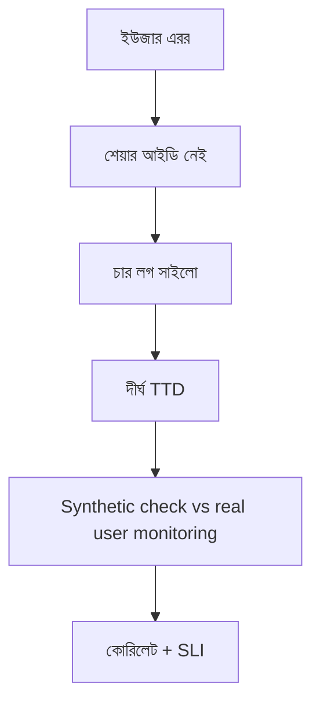

> **পাঠ 76 · মাঝারি ধাপ** - এক datacentre থেকে probe সবুজ, অথচ এক-তৃতীয়াংশ real user পায় 8 সেকেন্ডের load - synthetic availability ধরে, RUM ধরে experience।

## কেন এটা জরুরি

- ড্যাশবোর্ড যদি “টেন্যান্ট X-এ টিকিট তৈরি ভাঙা?”-র উত্তর না দেয়, সেটা অপস নয়, সাজসজ্জা।
- Vue সীমানায় correlation id মরলে Laravel লগ আরেক গ্রহ।
- গড় আর লাল/সবুজ আপটাইম এরর বাজেট পোড়ানো লুকায়।
- এই পাঠটা ঠিক **Synthetic check vs real user monitoring** নিয়ে। ট্যাগ: synthetic-monitoring, rum, web-vitals, blackbox, slo।

## কী দেখে বুঝবেন সমস্যা আছে

| সংকেত | যা দেখা যায় |
| --- | --- |
| অন্ধ পেজ | পেজার বাজে, রিকোয়েস্ট আইডি কারো কাছে নেই |
| কার্ডিনালিটি | user_id লেবেলে Grafana সিরিজ ফাটে |
| মিথ্যা শান্তি | আপটাইম ৯৯.৯%, টিকিট তৈরির p99 ৮ সেকেন্ড |
| ভাঙা লগ | ব্রাউজার কনসোল আর FPM লগ জোড়া যায় না |

## কীভাবে ভাঙে



ভাঙে প্রযুক্তির নামে নয়, চুক্তির অভাবে। Vue/Quasar স্ক্রিন আর Laravel রাইট যদি উল্টো উত্তর ধরে, প্রোডাকশন সেই রেসটা খুঁজে বের করে। এই টপিকের চুক্তিটা হলো: এক datacentre থেকে probe সবুজ, অথচ এক-তৃতীয়াংশ real user পায় 8 সেকেন্ডের load - synthetic availability ধরে, RUM ধরে experience।

## মূল কারণ

1. Quasar বুট থেকে Axios হয়ে Laravel লগ কনটেক্সটে `X-Request-Id` নেই।
2. প্রতি মেট্রিকে উচ্চ কার্ডিনালিটি লেবেল।
3. SLI “প্রসেস আপ”, “টিকিট তৈরি < ২ সেকেন্ড” নয়।
4. টেমপ্লেট ড্যাশবোর্ড, কখনও প্রশ্ন করেনি।

## কীভাবে সমাধান করবেন

### ১. ইনভেরিয়েন্ট এক বাক্যে লিখুন

এক datacentre থেকে probe সবুজ, অথচ এক-তৃতীয়াংশ real user পায় 8 সেকেন্ডের load - synthetic availability ধরে, RUM ধরে experience। এই বাক্য পিআর, Pinia অ্যাকশন, আর Laravel ক্লাসে রাখুন।

### ২. কোডে কিনারা আটকে দিন

```ts
api.interceptors.request.use((config) => {
  config.headers['X-Request-Id'] = crypto.randomUUID()
  return config
})
```

```php
Log::withContext(['request_id' => $request->header('X-Request-Id')]);
```

### ৩. যে চার্ট সত্যি দেখবেন, সেটাই রাখুন

SLI বার্ন, রিকোয়েস্ট-আইডি জোড়া, আর মালিক-ম্যাপ করা অ্যালার্ট। **Synthetic check vs real user monitoring**-এর রিগ্রেশন এই চার্টে না ধরা পড়লে পাঠ শেষ হয়নি।

## কাজের উদাহরণ

ইনসিডেন্ট রুম চারটা লগ ফাইলে “timeout” খুঁজেছে। Quasar বুট থেকে রিকোয়েস্ট আইডি দিলে পরের আউটেজে একই খোঁজ একটা Grafana ট্রেস।

এই টপিকে নিজের শেষ ইনসিডেন্টের লক্ষণ টেবিলে মিলিয়ে নিন, তারপর ডায়াগ্রাম ধরে এগোন যতক্ষণ না উপরের গার্ড আগুন ধরত।

## শিপ করার আগে

- [ ] **Synthetic check vs real user monitoring**-এর ইনভেরিয়েন্ট এক বাক্যে লেখা।
- [ ] খালি, ডুপ্লিকেট, টাইমআউট বা পারমিশন পাথের টেস্ট বা রিহার্সাল আছে।
- [ ] এক ডিপ্লয়ের মধ্যে রিগ্রেশন ধরার লগ বা চার্ট আছে।
- [ ] আত্মীয় পাঠ এখনও মিলছে: golden-signals-instrumentation, alert-design-and-noise-reduction, slo-error-budget-burn।

## যা করবেন না

- অনন্ত রিট্রাই বা এররকে সাকসেস হিসেবে ক্যাশ করা ব্লগ স্নিপেট কপি করবেন না।
- Laravel সারির সত্য Pinia-কে বলে দেবেন না।
- ঘন মনে হলে আগের নম্বরের পাঠ আগে শেষ করুন। পথটা ইচ্ছা করেই শুরু → মাঝারি → উন্নত।
