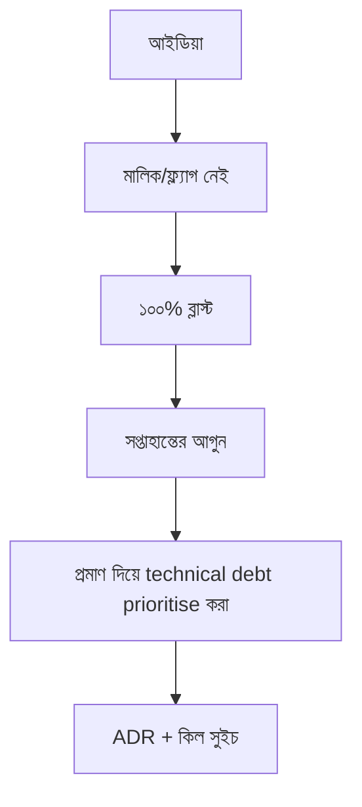

> **পাঠ 112 · মাঝারি ধাপ** - "আমাদের একটা refactor quarter দরকার" প্রতিটি planning meeting-এ হারে। Incident ঘণ্টা, change lead time আর touched-file churn-এ interest মাপা debt বাজেট পায়।

## কেন এটা জরুরি

- ইন্টারনাল প্ল্যাটফর্ম YAML-এর স্তূপ হলে ফেল করে; ইউজার আর কিল সুইচওয়ালা প্রোডাক্ট লাগে।
- ADR আর বিল্ড-ভস-বাই মানে বছর বছর টিকেটিং মডিউল না লেখা।
- মাল্টি-টেন্যান্ট আইসোলেশন আর খরচ শোব্যাক ইনফ্রার পোশাকে প্রোডাক্ট প্রশ্ন।
- এই পাঠটা ঠিক **প্রমাণ দিয়ে technical debt prioritise করা** নিয়ে। ট্যাগ: technical-debt, prioritization, metrics, planning, churn।

## কী দেখে বুঝবেন সমস্যা আছে

| সংকেত | যা দেখা যায় |
| --- | --- |
| শ্যাডো IT | প্রতি টিম স্টার্টার ফর্ক করে, আর টানে না |
| কিল সুইচ নেই | খারাপ ফ্ল্যাগ ১০০%-এ, মালিক নেই |
| রহস্য বিল | কোন টেন্যান্ট Redis পুড়িয়েছে কেউ জানে না |
| মাইগ্রেশন জমাট | স্ট্র্যাঙ্গলার ফিগ পুরনো মডিউল কাটে না |

## কীভাবে ভাঙে



ভাঙে প্রযুক্তির নামে নয়, চুক্তির অভাবে। Vue/Quasar স্ক্রিন আর Laravel রাইট যদি উল্টো উত্তর ধরে, প্রোডাকশন সেই রেসটা খুঁজে বের করে। এই টপিকের চুক্তিটা হলো: "আমাদের একটা refactor quarter দরকার" প্রতিটি planning meeting-এ হারে। Incident ঘণ্টা, change lead time আর touched-file churn-এ interest মাপা debt বাজেট পায়।

## মূল কারণ

1. প্ল্যাটফর্মে অফিস আওয়ার নেই, শুধু নিঃশব্দ Slack চ্যানেল।
2. ফ্ল্যাগে মালিক ও মেয়াদ নেই।
3. কিউ আর ডেটাবেসে কস্ট ট্যাগ নেই।
4. কাটোভার মানদণ্ড না লিখে চিরকাল ডুয়াল-রান।

## কীভাবে সমাধান করবেন

### ১. ইনভেরিয়েন্ট এক বাক্যে লিখুন

"আমাদের একটা refactor quarter দরকার" প্রতিটি planning meeting-এ হারে। Incident ঘণ্টা, change lead time আর touched-file churn-এ interest মাপা debt বাজেট পায়। এই বাক্য পিআর, Pinia অ্যাকশন, আর Laravel ক্লাসে রাখুন।

### ২. কোডে কিনারা আটকে দিন

```ts
if (!flags.ticketV2) return legacyTicketList()
return ticketListV2()
```

```php
if (!Feature::for($tenant)->active('ticket-v2')) {
    return app(LegacyTicketService::class)->index();
}
```

### ৩. যে চার্ট সত্যি দেখবেন, সেটাই রাখুন

ফ্ল্যাগ এক্সপোজার %, প্ল্যাটফর্ম অ্যাডপশন, আর টেন্যান্টপ্রতি খরচ। **প্রমাণ দিয়ে technical debt prioritise করা**-এর রিগ্রেশন এই চার্টে না ধরা পড়লে পাঠ শেষ হয়নি।

## কাজের উদাহরণ

শুক্রবার “নতুন টিকিট UI” ফ্ল্যাগ ১০০%। অন-কল মালিক নেই। ১০% ক্যানারি আর Quasar অ্যাডমিনে লেখা কিল সুইচ পরের খারাপ ফ্ল্যাগকে সপ্তাহান্ত না করে ১২ মিনিটের গল্প করে।

এই টপিকে নিজের শেষ ইনসিডেন্টের লক্ষণ টেবিলে মিলিয়ে নিন, তারপর ডায়াগ্রাম ধরে এগোন যতক্ষণ না উপরের গার্ড আগুন ধরত।

## শিপ করার আগে

- [ ] **প্রমাণ দিয়ে technical debt prioritise করা**-এর ইনভেরিয়েন্ট এক বাক্যে লেখা।
- [ ] খালি, ডুপ্লিকেট, টাইমআউট বা পারমিশন পাথের টেস্ট বা রিহার্সাল আছে।
- [ ] এক ডিপ্লয়ের মধ্যে রিগ্রেশন ধরার লগ বা চার্ট আছে।
- [ ] আত্মীয় পাঠ এখনও মিলছে: architecture-decision-records, on-call-and-ownership-models, build-vs-buy-decisions।

## যা করবেন না

- অনন্ত রিট্রাই বা এররকে সাকসেস হিসেবে ক্যাশ করা ব্লগ স্নিপেট কপি করবেন না।
- Laravel সারির সত্য Pinia-কে বলে দেবেন না।
- ঘন মনে হলে আগের নম্বরের পাঠ আগে শেষ করুন। পথটা ইচ্ছা করেই শুরু → মাঝারি → উন্নত।
