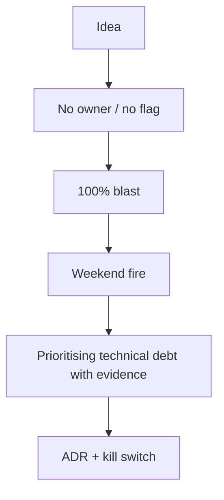

> **Lesson 112 · intermediate** - "We need a refactor quarter" loses every planning meeting. Debt that is tied to interest paid in incident hours, change lead time, and touched-file churn wins budget.

## Why it matters

- Internal platforms fail when they are a pile of YAML, not a product with users and a kill switch.
- ADRs and build-vs-buy are how you avoid rewriting the ticketing module every year.
- Multi-tenant isolation and cost showback are product questions wearing infrastructure clothes.
- This lesson is specifically about **Prioritising technical debt with evidence**. Tags: technical-debt, prioritization, metrics, planning, churn.

## Symptoms

| Signal | What you observe |
| --- | --- |
| Shadow IT | Every team forks the starter and never pulls |
| No kill switch | A bad flag rolls to 100% with no owner |
| Mystery bill | Nobody knows which tenant burned Redis |
| Migration freeze | Strangler fig never cuts the old module |

## How it breaks



The named technology is rarely the villain. Two code paths (often a Vue/Quasar screen and a Laravel write) assume opposite contracts. Production finds the race. For this topic that contract is: "We need a refactor quarter" loses every planning meeting. Debt that is tied to interest paid in incident hours, change lead time, and touched-file churn wins budget.

## Root causes

1. Platform had no office hours, only a Slack channel that went quiet.
2. Feature flags without an owner and an expiry.
3. Cost tags missing on queues and databases.
4. Dual-running forever because cutover criteria were never written.

## How to solve it

### 1. Write the invariant in one sentence

"We need a refactor quarter" loses every planning meeting. Debt that is tied to interest paid in incident hours, change lead time, and touched-file churn wins budget. Put that sentence in the PR, the Pinia action, and the Laravel class.

### 2. Guard the edge in code

```ts
if (!flags.ticketV2) return legacyTicketList()
return ticketListV2()
```

```php
if (!Feature::for($tenant)->active('ticket-v2')) {
    return app(LegacyTicketService::class)->index();
}
```

### 3. Keep a chart you will actually look at

Flag exposure %, platform adoption, and cost per tenant. If the chart cannot catch a regression in **Prioritising technical debt with evidence**, the lesson is not done.

## Worked example

A “new ticket UI” flag shipped at 100% on Friday. There was no owner on-call. A 10% canary plus a documented kill switch in the Quasar admin turned the next bad flag into a 12-minute story, not a weekend.

On this topic, start from the symptom in the table that matches your last incident, then walk the diagram until the guard above would have fired.

## Check before you ship

- [ ] The invariant for **Prioritising technical debt with evidence** is written in one sentence.
- [ ] Empty, duplicate, timeout, or permission paths have a test or a staged rehearsal.
- [ ] A dashboard or log query would catch a regression within one deploy.
- [ ] Related reading still makes sense: architecture-decision-records, on-call-and-ownership-models, build-vs-buy-decisions.

## What not to do

- Copy a blog snippet that retries forever or caches the error as success.
- Treat Pinia as the source of truth for a Laravel row.
- Skip the previous numbered lesson if this one feels dense — the path is beginner → intermediate → advanced on purpose.
