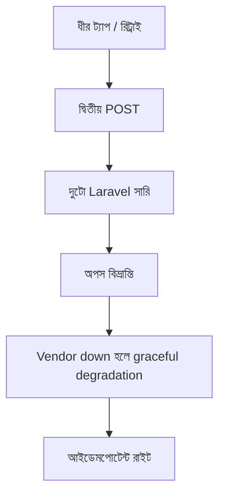

> **পাঠ 120 · উন্নত ধাপ** - dependency-কে critical/optional ভাগ করা, আর vendor status page কমলা হওয়ার আগেই fallback path ship করা।

## কেন এটা জরুরি

- Vue আর Laravel দুজনেই একই রাইটে রিট্রাই করলে দুটো টিকিট, দুটো চার্জ, বা ভুত ওয়েবহুক হয়।
- Axios-এর ডিফল্ট টাইমআউট পথে তিনটা সার্ভিস থাকলে পুরো বাজেট শেষ করে।
- ভাঙা ফিল্ড নাম বদলানোর চেয়ে ভার্সন করা URL সস্তা, কারণ বারোটা ক্লায়েন্ট আগেই ক্যাশ করেছে।
- এই পাঠটা ঠিক **Vendor down হলে graceful degradation** নিয়ে। ট্যাগ: degradation, vendors, fallbacks, circuit-breaker, slo।

## কী দেখে বুঝবেন সমস্যা আছে

| সংকেত | যা দেখা যায় |
| --- | --- |
| ডুপ্লিকেট রাইট | ধীর ৪জি Quasar ফর্মে এক ট্যাপে দুটো সারি |
| টাইমআউট | জব শেষ, তবু গেটওয়ে ৫০৪ |
| ওয়েবহুক স্টর্ম | পার্টনার ১০ সেকেন্ডে রিট্রাই, সিগনেচার চেক নেই |
| ভার্সন সংঘাত | মোবাইল অ্যাপ ২.১ এখনও পুরনো JSON পাঠায় |

## কীভাবে ভাঙে



ভাঙে প্রযুক্তির নামে নয়, চুক্তির অভাবে। Vue/Quasar স্ক্রিন আর Laravel রাইট যদি উল্টো উত্তর ধরে, প্রোডাকশন সেই রেসটা খুঁজে বের করে। এই টপিকের চুক্তিটা হলো: dependency-কে critical/optional ভাগ করা, আর vendor status page কমলা হওয়ার আগেই fallback path ship করা।

## মূল কারণ

1. ক্লায়েন্ট POST রিট্রাই করেছে, সার্ভার Idempotency-Key মানেনি।
2. প্রতি হপে ৩০ সেকেন্ড টাইমআউট, ইউজার ৯০ সেকেন্ড অপেক্ষা করে আবার ট্যাপ করেছে।
3. ওয়েবহুক হ্যান্ডলার ডেলিভারি আইডিতে আইডেমপোটেন্ট নয়।
4. /v2 বা সানসেট হেডার ছাড়াই ভাঙা JSON চেঞ্জ শিপ হয়েছে।

## কীভাবে সমাধান করবেন

### ১. ইনভেরিয়েন্ট এক বাক্যে লিখুন

dependency-কে critical/optional ভাগ করা, আর vendor status page কমলা হওয়ার আগেই fallback path ship করা। এই বাক্য পিআর, Pinia অ্যাকশন, আর Laravel ক্লাসে রাখুন।

### ২. কোডে কিনারা আটকে দিন

```ts
// Pinia: one key per human intent, not per HTTP attempt
export async function createTicket(payload: TicketDraft, key: string) {
  const hit = sessionStorage.getItem(key)
  if (hit) return JSON.parse(hit) as Ticket
  const ticket = await api.post('/api/tickets', payload, { headers: { 'Idempotency-Key': key } })
  sessionStorage.setItem(key, JSON.stringify(ticket))
  return ticket
}
```

```php
Route::post('/api/tickets', function (Request $request) {
    $key = $request->header('Idempotency-Key');
    abort_unless($key, 400, 'Idempotency-Key required');

    return Cache::lock("ticket:{$key}", 10)->block(5, function () use ($key, $request) {
        $existing = Ticket::query()->where('idempotency_key', $key)->first();
        if ($existing) return $existing;
        return Ticket::query()->create([...$request->validated(), 'idempotency_key' => $key]);
    });
});
```

### ৩. যে চার্ট সত্যি দেখবেন, সেটাই রাখুন

ডুপ্লিকেট ক্রিয়েট রেট, আইডেমপোটেন্সি কী ছাড়া ৪xx, আর রাইট পাথের p99। **Vendor down হলে graceful degradation**-এর রিগ্রেশন এই চার্টে না ধরা পড়লে পাঠ শেষ হয়নি।

## কাজের উদাহরণ

সাপোর্ট এজেন্ট ৪জিতে “টিকিট তৈরি” দুবার ট্যাপ করে। কী না থাকলে Laravel দুটো সারি ঢোকায়। উপরের স্নিপেট থাকলে দ্বিতীয় ট্যাপ প্রথম টিকিটই ফেরত দেয়, কিউ পরিষ্কার থাকে।

এই টপিকে নিজের শেষ ইনসিডেন্টের লক্ষণ টেবিলে মিলিয়ে নিন, তারপর ডায়াগ্রাম ধরে এগোন যতক্ষণ না উপরের গার্ড আগুন ধরত।

## শিপ করার আগে

- [ ] **Vendor down হলে graceful degradation**-এর ইনভেরিয়েন্ট এক বাক্যে লেখা।
- [ ] খালি, ডুপ্লিকেট, টাইমআউট বা পারমিশন পাথের টেস্ট বা রিহার্সাল আছে।
- [ ] এক ডিপ্লয়ের মধ্যে রিগ্রেশন ধরার লগ বা চার্ট আছে।
- [ ] আত্মীয় পাঠ এখনও মিলছে: circuit-breaker-cascades, timeout-budget-propagation।

## যা করবেন না

- অনন্ত রিট্রাই বা এররকে সাকসেস হিসেবে ক্যাশ করা ব্লগ স্নিপেট কপি করবেন না।
- Laravel সারির সত্য Pinia-কে বলে দেবেন না।
- ঘন মনে হলে আগের নম্বরের পাঠ আগে শেষ করুন। পথটা ইচ্ছা করেই শুরু → মাঝারি → উন্নত।
