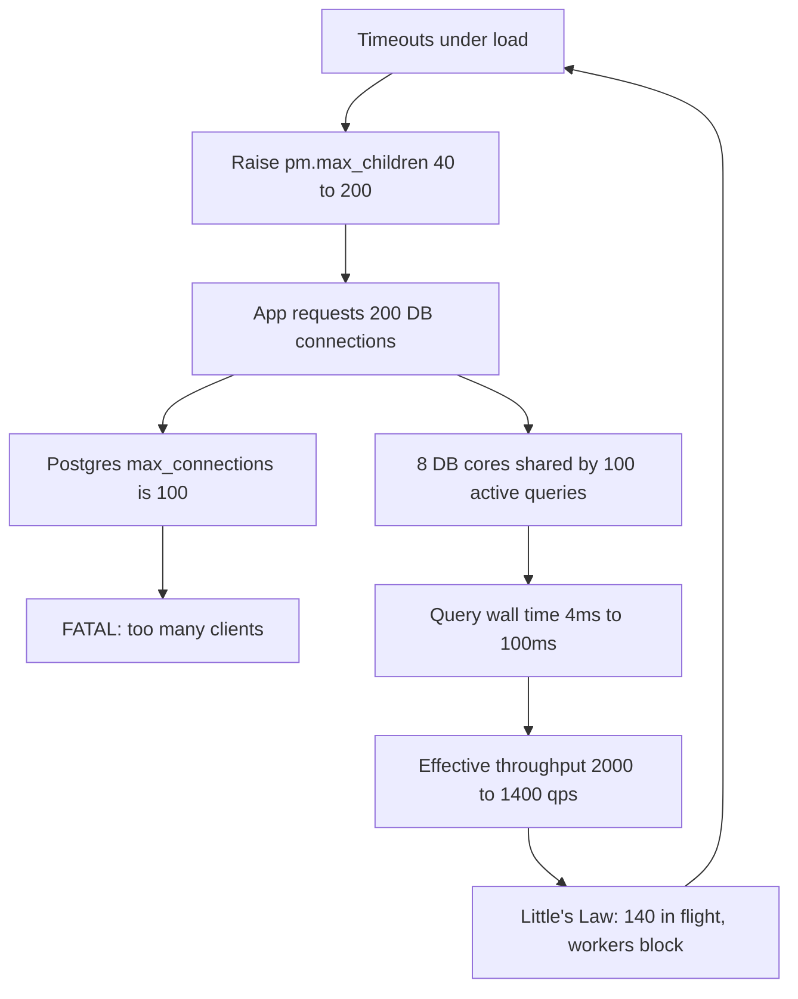
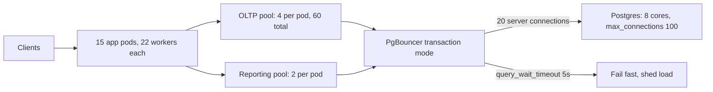

> **Scenario** - একটি Laravel API load-এ timeout করছে। কেউ `pm.max_children` 40 থেকে 200 আর database pool 20 থেকে 200 করল। Throughput 900 থেকে 340 req/s-এ নামল, p99 800 ms থেকে 9 s হল, আর Postgres `FATAL: sorry, too many clients already` log করতে শুরু করল। Pool বড় হল, সব খারাপ হল।

## Why it matters

- Pool হল bouncer-সহ একটা queue। বড় করা capacity যোগ করে না - শুধু একই CPU ও disk-এর জন্য বেশি কাজকে ভিতরে ঢুকতে দেয়।
- বিপরীত-অন্তর্দৃষ্টি ফলাফলটি সুপ্রমাণিত: একই hardware-এ 10-connection pool প্রায়ই 100-connection pool-কে প্রতিটি percentile-এ হারায়।
- বড় pool queueing-কে bounded, observable জায়গা থেকে database-এ ঠেলে দেয়, যেখানে তা দামি ও অদৃশ্য।
- Request path-এর প্রতিটি pool boundary গুণ হয়। 200 app worker × 5 connection = 1,000 connection, এমন database-এ যা 300 সামলাতে পারে।
- Right-sizing একটি config change, খরচ শূন্য, আর প্রায়ই p99 অর্ধেক করে।

## Symptoms

| Signal | What you observe |
|---|---|
| Throughput vs pool size | বাড়ে, peak করে, তারপর pool বাড়লে কমে |
| `pg_stat_activity` | শত শত row, বেশিরভাগ `idle in transaction` বা ছোট query-তে `active` |
| DB CPU | 100%, সাথে উঁচু context-switch rate |
| App thread dump | thread গুলো `getConnection()`-এ blocked |
| Latency | p50 ঠিক, p99 সেকেন্ডে - queueing, কাজ নয় |
| DB log | `too many clients`, deploy-এর পর connection storm |
| Memory | প্রতি connection-এ 5-10 MB work_mem + backend খরচ |

## How it breaks

8 core ও SSD-এর database server বাস্তবে মোটামুটি `cores` সংখ্যক query একসাথে চালাতে পারে, সাথে আরও কিছু যারা IO-তে অপেক্ষা করছে। ক্লাসিক HikariCP heuristic:

**connections = ((core_count × 2) + effective_spindle_count)**

8 core ও SSD (1-2 effective spindle ধরে): (8 × 2) + 1 = **17 connection**। 200 নয়।

200 ক্ষতি করে কেন? Context switching ও lock contention থেকে আসা service-time inflation-এর কারণে। ধরুন প্রতিটি query-র 4 ms খাঁটি CPU দরকার। 8 core-এ 17 connection হলে প্রতিটি query মোটামুটি 4 ms × (17/8) = 8.5 ms wall time-এ শেষ হয়, আর server করে 8/0.004 = **2,000 query/s**।

200 connection-এ server সেরা ক্ষেত্রেও 2,000 query/s *কাজ* করে - CPU বদলায়নি - কিন্তু প্রতিটি query এখন 200/8 = 25 জনের পিছনে অপেক্ষা করে: 4 ms × 25 = **100 ms** wall time। আরও খারাপ, context switching ও buffer-pool thrash effective throughput 1,400 query/s-এ নামায়। Little's Law ফলাফল নিশ্চিত করে: L = λW = 1,400 × 0.100 = **140 in flight**, তাই 200-এর মধ্যে 60 connection blocked বসে থাকে, আর app-এর নিজের worker pool তাদের পিছনে ভরে যায়।

এখন app side। Laravel-এ `pm.max_children = 200` আর প্রতি request একটি DB connection ধরলে app *চায়* 200 concurrent connection। Postgres-এ `max_connections = 100`। 101তম request পায় `FATAL: too many clients` - hard error, queue নয়। ফলে app latency সমস্যাকে error-rate সমস্যায় রূপান্তর করে।



## Root causes

1. Pool size-কে concurrency limit না ভেবে capacity dial ভাবা।
2. App worker, worker-প্রতি connection ও database `max_connections` জোড়া লাগানো কোনো হিসাব নেই।
3. Database connection ধরে রেখে request-এর ভিতরে blocking IO (HTTP call, S3 upload)।
4. দীর্ঘ transaction connection-কে `idle in transaction` রেখে দেয়।
5. বড় app fleet ও ছোট database-এর মাঝে connection multiplexer (PgBouncer / ProxySQL) নেই।
6. Wait-heavy ও CPU-heavy কাজ একই pool ভাগ করে, তাই ধীর কাজ দ্রুত কাজকে starve করে।
7. Connection total আবার হিসাব না করেই app tier autoscale করা।

## How to solve it

### 1. CPU-bound pool core ও wait ratio থেকে size করুন

মিশ্র কাজের thread pool-এ ক্লাসিক Brian Goetz formula:

**threads = cores × target_utilisation × (1 + wait_time / service_time)**

```python
# pool_sizing.py
def thread_pool(cores: int, util: float, wait_ms: float, cpu_ms: float) -> float:
    return cores * util * (1 + wait_ms / cpu_ms)

def db_pool(cores: int, spindles: int = 1) -> int:
    """HikariCP heuristic: (cores * 2) + effective spindles."""
    return cores * 2 + spindles

# App pod: 4 core. Request = 6 ms CPU + 34 ms DB/HTTP অপেক্ষা।
print(thread_pool(cores=4, util=0.85, wait_ms=34, cpu_ms=6))   # 22.6 -> 22 thread

# DB server: 8 core, SSD
print(db_pool(cores=8, spindles=1))                            # 17 connection

# Fleet হিসাব - এই check-টাই সবাই বাদ দেয়
pods, conns_per_pod, db_max = 15, 4, 100
print(f"fleet connections = {pods * conns_per_pod} (limit {db_max})")   # 100-এর মধ্যে 60
```

অসমতাটা খেয়াল করুন: pod-প্রতি 22 worker thread, কিন্তু মাত্র **4** database connection। Request-এর বেশিরভাগ সময় database ছাড়া অন্য কিছুর অপেক্ষা, তাই দুই pool একই আকারের হওয়া উচিত নয়।

### 2. Database-এর সামনে multiplexer বসান

Transaction-mode pooling 600 client connection-কে 20 server connection ভাগ করতে দেয়।

```ini
; pgbouncer.ini
[databases]
app = host=10.0.2.10 port=5432 dbname=app

[pgbouncer]
pool_mode = transaction        ; session নয় - session mode উদ্দেশ্যই নষ্ট করে
max_client_conn = 2000         ; app fleet যত খুলতে পারে
default_pool_size = 20         ; database আসলে যত দেখে
reserve_pool_size = 5
reserve_pool_timeout = 3
server_idle_timeout = 60
query_wait_timeout = 5         ; চিরকাল queue নয়, দ্রুত fail
```

`pool_mode = transaction`-এ session-level feature (statement জুড়ে ধরা advisory lock, transaction-এর বাইরে `SET`, named prepared statement) ভাঙে। বদলানোর আগে audit করুন।

### 3. App pool-কে চিরকাল queue নয়, দ্রুত fail করতে দিন

```php
<?php
// config/database.php - Laravel / PDO
return [
    'connections' => [
        'pgsql' => [
            'driver'   => 'pgsql',
            'host'     => env('DB_HOST', 'pgbouncer'),
            'port'     => 6432,
            'database' => env('DB_DATABASE'),
            'options'  => [
                // HTTP timeout-এর চেয়ে ছোট, যাতে hang নয় shed হয়।
                PDO::ATTR_TIMEOUT    => 2,
                PDO::ATTR_PERSISTENT => false,
            ],
            // Transaction-mode PgBouncer named prepared statement reuse করতে পারে না।
            'search_path' => 'public',
        ],
    ],
];
```

```ini
; php-fpm pool.d/app.conf - 22 worker, thread formula মিলিয়ে
pm = static
pm.max_children = 22
pm.max_requests = 500
request_terminate_timeout = 3s
```

### 4. Workload class অনুযায়ী pool আলাদা করুন

দ্রুত read-এর জন্য এক pool, ধীর report-এর জন্য আরেকটি। 12 সেকেন্ডের analytics query checkout path-এর slot খাবে না।

```ts
// src/db/pools.ts
import { Pool } from 'pg'

export const oltp = new Pool({
  max: 4,                        // per pod; 15 pod => 60 connection
  idleTimeoutMillis: 30_000,
  connectionTimeoutMillis: 2_000, // দ্রুত fail
  statement_timeout: 1_500,       // কোনো query request budget ছাড়ায় না
})

export const reporting = new Pool({
  max: 2,
  connectionTimeoutMillis: 10_000,
  statement_timeout: 60_000,
  application_name: 'reporting',  // pg_stat_activity-তে দেখা যায়
})
```

### 5. Pool size বাড়িয়ে নয়, কমিয়ে যাচাই করুন

```bash
# প্রতিটি pool size-এ স্থির 1200 rps open-model load test চালিয়ে p99 লিখুন।
for MAX in 64 32 16 8 4; do
  kubectl set env deploy/api DB_POOL_MAX="$MAX"
  kubectl rollout status deploy/api --timeout=120s
  sleep 60   # cache ও connection স্থির হতে দিন
  k6 run --quiet --out json=results-"$MAX".json load/checkout.js
  echo "pool=$MAX"; jq -r '.metrics.http_req_duration.values["p(99)"]' results-"$MAX".json
done
```

যারা এটা চালায় তারা প্রায় সবসময় দেখে pool *ছোট* হওয়ার সাথে p99 ভালো হচ্ছে, যতক্ষণ pool এত ছোট না হয় যে CPU starve করে। ওই inflection point-ই উত্তর।

## Target design



## Tradeoffs

| Option | Pros | Cons | Choose when |
|---|---|---|---|
| ছোট pool, দ্রুত fail | সেরা p99, DB রক্ষা | overload-এ দৃশ্যমান 503 | SLO ও load shedding আছে |
| বড় pool | মাঝারি load-এ rejection নেই | DB thrash, খারাপ tail, `too many clients` | প্রায় কখনো নয় |
| PgBouncer transaction mode | বিশাল fan-in, ছোট DB footprint | session state ও named prepare ভাঙে | app fleet DB-র চেয়ে অনেক বড় |
| PgBouncer session mode | সম্পূর্ণ transparent | DB connection সামান্যই কমায় | শুধু connection reuse দরকার |
| OLTP / reporting pool আলাদা | ধীর কাজ দ্রুত কাজকে starve করে না | দুই config, দুই dashboard | এক service-এ মিশ্র query duration |
| Async / non-blocking IO | thread আর wait-এর সাথে 1:1 নয় | বড় rewrite, নতুন failure mode | wait ratio ~10:1-এর বেশি |

## Verification checklist

- [ ] `pod × connection_per_pod` লিখিত আছে এবং `max_connections` minus admin headroom-এর নিচে।
- [ ] Peak-এ `SELECT count(*) FROM pg_stat_activity` হিসাব করা pool total-এর নিচে।
- [ ] কোনো connection 1 সেকেন্ডের বেশি `idle in transaction` থাকে না।
- [ ] `connectionTimeoutMillis` ও `statement_timeout` দুটোই HTTP request budget-এর চেয়ে ছোট।
- [ ] আসল load-এ pool size বনাম p99-এর একটি sweep আছে।
- [ ] Reporting query আলাদা `application_name`-এ দেখা যায়।
- [ ] `request_terminate_timeout` সেট, তাই কোনো worker চিরকাল আটকে থাকে না।
- [ ] App tier scale করলে connection total review হয় (alert বা CI check)।

## Anti-patterns

- Request timeout হচ্ছে বলে pool বাড়ানো - এই reflex-ই outage বানায়।
- Worker thread ও database connection-এ একই সংখ্যা ব্যবহার করা।
- "কিছু নষ্ট না হয়" বলে pool-কে `max_connections`-এ সেট করা।
- Outbound HTTP call করার সময় database connection ধরে রাখা।
- PgBouncer session mode-এ চালিয়ে connection pooled হয়েছে বলে রিপোর্ট করা।
- Unlimited connection wait, যা backpressure-কে অদৃশ্য queue বানায়।
- Single-user local benchmark থেকে pool size ঠিক করা, যেখানে contention-ই নেই।

## Related

- [Little's Law as a capacity planning tool](/systems/performance-capacity/littles-law-capacity-planning)
- [GC pauses and memory pressure in the tail](/systems/performance-capacity/gc-pauses-and-memory-pressure)
- [Hot-path query optimisation that survives growth](/systems/performance-capacity/hot-path-query-optimization)
