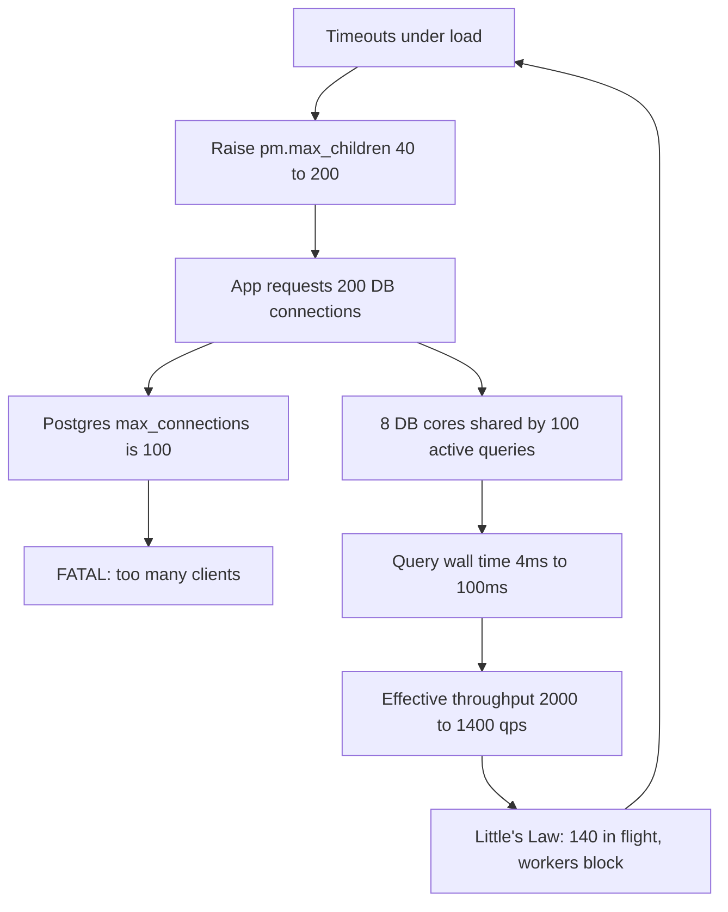
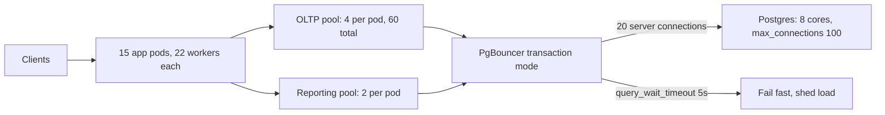

> **Scenario** — A Laravel API times out under load. Someone raises `pm.max_children` from 40 to 200 and the database pool from 20 to 200. Throughput drops from 900 to 340 req/s, p99 goes from 800 ms to 9 s, and Postgres starts logging `FATAL: sorry, too many clients already`. The pool got bigger and everything got worse.

## Why it matters

- A pool is a queue with a bouncer. Making it bigger does not add capacity — it just lets more work in to fight over the same CPU and disk.
- The counter-intuitive result is well documented: a 10-connection pool often beats a 100-connection pool on the same hardware, at every percentile.
- Oversized pools push queueing from a bounded, observable place into the database, where it is expensive and hard to see.
- Every pool boundary in the request path multiplies. 200 app workers × 5 connections each is 1,000 connections to a database that can serve 300.
- Right-sizing is one config change, costs nothing, and often halves p99.

## Symptoms

| Signal | What you observe |
|---|---|
| Throughput vs pool size | Rises, peaks, then falls as pool grows |
| `pg_stat_activity` | Hundreds of rows, most `idle in transaction` or `active` with tiny queries |
| DB CPU | 100% with high context-switch rate |
| App thread dump | Threads blocked in `getConnection()` |
| Latency | p50 fine, p99 seconds — queueing, not work |
| DB logs | `too many clients`, connection storms after deploys |
| Memory | Each connection costs 5-10 MB of DB work_mem plus backend |

## How it breaks

A database server with 8 cores and SSD storage can genuinely execute roughly `cores` queries at once, plus a few more while others wait on IO. The classic HikariCP heuristic:

**connections = ((core_count × 2) + effective_spindle_count)**

For 8 cores and SSD (treat as 1-2 effective spindles): (8 × 2) + 1 = **17 connections**. Not 200.

Why does 200 hurt? Because of the service-time inflation from context switching and lock contention. Suppose each query needs 4 ms of pure CPU. With 17 connections on 8 cores, each query completes in roughly 4 ms × (17/8) = 8.5 ms of wall time and the server does 8/0.004 = **2,000 queries/s**.

With 200 connections, the server still does 2,000 queries/s of *work* at best — the CPU did not change — but each query now waits behind 200/8 = 25 peers: 4 ms × 25 = **100 ms** wall time. Worse, context switching and buffer-pool thrash cut effective throughput to maybe 1,400 queries/s. Little's Law confirms the outcome: L = λW = 1,400 × 0.100 = **140 in flight**, so 60 of the 200 connections sit blocked, and the app's own worker pool fills behind them.

Now the app side. Laravel with `pm.max_children = 200` and each request holding one DB connection means the app *asks* for 200 concurrent connections. Postgres `max_connections = 100`. The 101st request gets `FATAL: too many clients` — a hard error, not a queue. So the app converts a latency problem into an error-rate problem.



## Root causes

1. Pool size treated as a capacity dial rather than a concurrency limit.
2. No arithmetic linking app workers, connections per worker, and database `max_connections`.
3. Blocking IO inside a request while holding a database connection (HTTP calls, S3 uploads).
4. Long-running transactions leaving connections `idle in transaction`.
5. No connection multiplexer (PgBouncer / ProxySQL) between a large app fleet and a small database.
6. Wait-heavy and CPU-heavy work sharing one pool, so slow work starves fast work.
7. Autoscaling the app tier without recomputing the connection total.

## How to solve it

### 1. Size the CPU-bound pool from cores and wait ratio

For thread pools serving mixed work, the classic Brian Goetz formula:

**threads = cores × target_utilisation × (1 + wait_time / service_time)**

```python
# pool_sizing.py
def thread_pool(cores: int, util: float, wait_ms: float, cpu_ms: float) -> float:
    return cores * util * (1 + wait_ms / cpu_ms)

def db_pool(cores: int, spindles: int = 1) -> int:
    """HikariCP heuristic: (cores * 2) + effective spindles."""
    return cores * 2 + spindles

# App pod: 4 cores. Request = 6 ms CPU + 34 ms waiting on DB/HTTP.
print(thread_pool(cores=4, util=0.85, wait_ms=34, cpu_ms=6))   # 22.6 -> 22 threads

# DB server: 8 cores, SSD
print(db_pool(cores=8, spindles=1))                            # 17 connections

# Fleet arithmetic — this is the check people skip
pods, conns_per_pod, db_max = 15, 4, 100
print(f"fleet connections = {pods * conns_per_pod} (limit {db_max})")   # 60 of 100
```

Note the asymmetry: 22 worker threads per pod but only **4** database connections per pod. Most of a request is waiting on things that are not the database, so the two pools should not be the same size.

### 2. Put a multiplexer in front of the database

Transaction-mode pooling lets 600 client connections share 20 server connections.

```ini
; pgbouncer.ini
[databases]
app = host=10.0.2.10 port=5432 dbname=app

[pgbouncer]
pool_mode = transaction        ; not session — session mode defeats the purpose
max_client_conn = 2000         ; what the app fleet may open
default_pool_size = 20         ; what the database actually sees
reserve_pool_size = 5
reserve_pool_timeout = 3
server_idle_timeout = 60
query_wait_timeout = 5         ; fail fast instead of queueing forever
```

With `pool_mode = transaction`, session-level features (advisory locks held across statements, `SET` outside a transaction, prepared statement names) break. Audit for those before switching.

### 3. Configure the app pool to fail fast, not queue forever

```php
<?php
// config/database.php — Laravel / PDO
return [
    'connections' => [
        'pgsql' => [
            'driver'   => 'pgsql',
            'host'     => env('DB_HOST', 'pgbouncer'),
            'port'     => 6432,
            'database' => env('DB_DATABASE'),
            'options'  => [
                // Shorter than the HTTP timeout, so we shed instead of hanging.
                PDO::ATTR_TIMEOUT    => 2,
                PDO::ATTR_PERSISTENT => false,
            ],
            // Transaction-mode PgBouncer cannot reuse named prepared statements.
            'search_path' => 'public',
        ],
    ],
];
```

```ini
; php-fpm pool.d/app.conf — 22 workers, matching the thread formula
pm = static
pm.max_children = 22
pm.max_requests = 500
request_terminate_timeout = 3s
```

### 4. Separate pools by workload class

One pool for fast reads, one for slow reports. A 12-second analytics query must not consume a slot the checkout path needs.

```ts
// src/db/pools.ts
import { Pool } from 'pg'

export const oltp = new Pool({
  max: 4,                        // per pod; 15 pods => 60 connections
  idleTimeoutMillis: 30_000,
  connectionTimeoutMillis: 2_000, // fail fast
  statement_timeout: 1_500,       // no query outlives the request budget
})

export const reporting = new Pool({
  max: 2,
  connectionTimeoutMillis: 10_000,
  statement_timeout: 60_000,
  application_name: 'reporting',  // shows up in pg_stat_activity
})
```

### 5. Verify by walking the pool size down, not up

```bash
# Run a fixed 1200 rps open-model load test at each pool size and record p99.
for MAX in 64 32 16 8 4; do
  kubectl set env deploy/api DB_POOL_MAX="$MAX"
  kubectl rollout status deploy/api --timeout=120s
  sleep 60   # let caches and connections settle
  k6 run --quiet --out json=results-"$MAX".json load/checkout.js
  echo "pool=$MAX"; jq -r '.metrics.http_req_duration.values["p(99)"]' results-"$MAX".json
done
```

Teams that run this almost always find p99 improving as the pool *shrinks*, until the pool is small enough to starve the CPU. That inflection point is your answer.

## Target design



## Tradeoffs

| Option | Pros | Cons | Choose when |
|---|---|---|---|
| Small pool, fail fast | Best p99, protects the DB | Visible 503s at overload | You have an SLO and load shedding |
| Large pool | No rejections at moderate load | DB thrash, worse tails, `too many clients` | Almost never |
| PgBouncer transaction mode | Huge fan-in, tiny DB footprint | Breaks session state and named prepares | App fleet is much larger than the DB |
| PgBouncer session mode | Fully transparent | Barely reduces DB connections | Only need connection reuse, not fan-in |
| Split OLTP / reporting pools | Slow work cannot starve fast work | Two configs, two dashboards | Mixed query durations in one service |
| Async / non-blocking IO | Threads no longer 1:1 with waits | Large rewrite, new failure modes | Wait ratio above ~10:1 |

## Verification checklist

- [ ] `pods × connections_per_pod` is written down and is below `max_connections` minus admin headroom.
- [ ] `SELECT count(*) FROM pg_stat_activity` at peak is under the computed pool total.
- [ ] No connection sits `idle in transaction` for more than 1 second.
- [ ] `connectionTimeoutMillis` and `statement_timeout` are both shorter than the HTTP request budget.
- [ ] A pool-size sweep exists showing p99 as a function of pool size, on real load.
- [ ] Reporting queries appear under a distinct `application_name`.
- [ ] `request_terminate_timeout` is set, so no worker is held forever.
- [ ] Scaling the app tier triggers a review of the connection total (alert or CI check).

## Anti-patterns

- Raising the pool because requests are timing out — this is the reflex that causes the outage.
- Using the same number for worker threads and database connections.
- Setting the pool to `max_connections` so "nothing is wasted".
- Holding a database connection while making an outbound HTTP call.
- Running PgBouncer in session mode and reporting that connections were pooled.
- Unlimited connection wait, which turns backpressure into an invisible queue.
- Sizing pools from a single-user local benchmark where contention does not exist.

## Related

- [Little's Law as a capacity planning tool](/systems/performance-capacity/littles-law-capacity-planning)
- [GC pauses and memory pressure in the tail](/systems/performance-capacity/gc-pauses-and-memory-pressure)
- [Hot-path query optimisation that survives growth](/systems/performance-capacity/hot-path-query-optimization)
