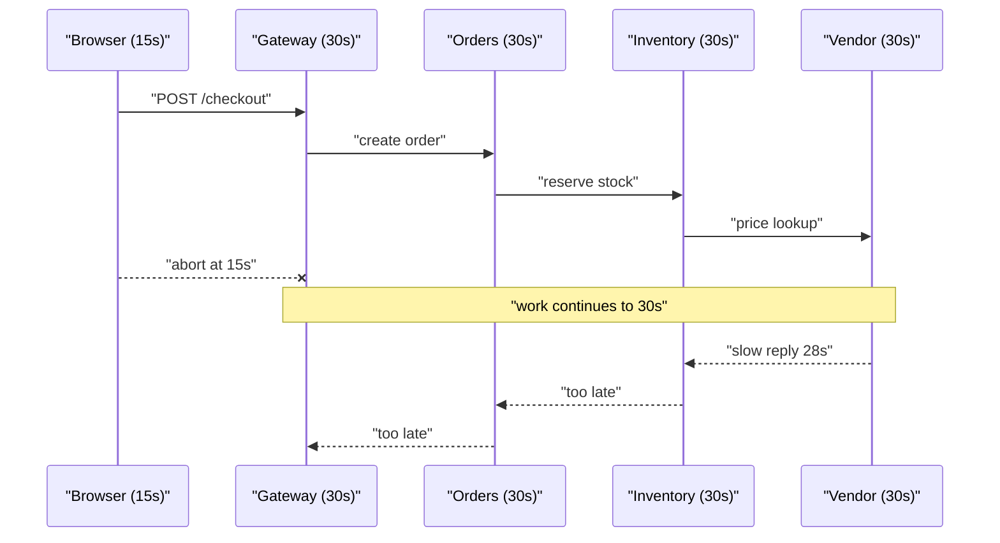
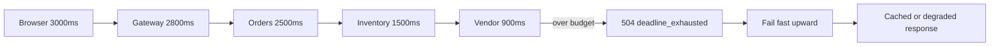

> **Scenario** — Checkout page ৩০ সেকেন্ড ঝুলে থেকে generic error দেখাল। Trace বলছে browser ১৫s-এ হাল ছেড়েছে, কিন্তু API gateway `orders`-এর জন্য ৩০s অপেক্ষা করেছে, `orders` `inventory`-র জন্য ৩০s, আর `inventory` vendor call-এর জন্য ৩০s। প্রতিটি hop framework default ব্যবহার করেছে। স্থানীয়ভাবে কেউ ভুল নয়; পুরো system-টাই ভুল।

## Why it matters

- User চলে যাওয়ার পরেও কাজ চলতে থাকে। কেউ পড়বে না এমন response বানাতে database connection ও worker slot পুড়ে।
- একটি ধীর dependency সব upstream pool ভরিয়ে দেয় — এক service degrade থেকে পুরো outage।
- লম্বা timeout-এর উপর retry জমে: ৩ retry সহ ৩০s timeout মানে ৯০s tail, যা কেউ বাজেট করেনি।
- Caller যদি না জানে কত সময় বাকি, load shedding কাজ করতে পারে না।
- প্রতিটি span-এ "timeout" দেখালেও কারও deadline সেটা বোঝা যায় না, ফলে triage দ্বিগুণ সময় নেয়।

## Symptoms

| Signal | What you observe |
| --- | --- |
| Latency cliff | p99 distribution নয়, ঠিক গোল সংখ্যায় (5000ms, 30000ms) আটকে |
| Pool exhaustion | CPU ২০%-এর নিচে অথচ `php-fpm`/worker queue পূর্ণ |
| Orphan work | upstream-এ `client disconnected`, downstream তখনো row লিখছে |
| Duplicated effort | vendor-এর log-এ একই trace ID তিনবার |
| Mismatched span | client span ১৫s, server span ৩০s, দুটোই timeout |

## How it breaks

প্রতিটি service আলাদাভাবে timeout সেট করে, সাধারণত framework default কপি করে। ফলে timeout call chain জুড়ে shared budget ভাগ না হয়ে *যোগ* হয়। সবচেয়ে গভীর hop পুরো request-এর সমান সময় পায়, তাই entry point সবসময় আগে হাল ছাড়ে — আর তখনো প্রতিটি downstream hop resource ধরে বসে আছে।

দ্বিতীয় প্রভাব আরও খারাপ। Gateway request ছেড়ে দিলে connection বন্ধ হয়, কিন্তু downstream request cancel হয় না। Inventory row lock ধরে রাখে, vendor call চলতে থাকে, আর client-এর নতুন retry ওই সব কাজের *দ্বিতীয়* কপি শুরু করে।



## Root causes

1. Timeout request-level budget থেকে না এসে per-service সেট হয়।
2. Hop-এর মধ্যে deadline পাঠানো হয় না, তাই downstream বাকি সময় জানে না।
3. Client disconnect cancellation signal হিসেবে propagate হয় না।
4. Retry যোগ করা হয় কিন্তু তার খরচ budget থেকে বাদ দেওয়া হয় না।
5. Connect, read ও total timeout একটি সংখ্যায় গুলিয়ে ফেলা হয়।
6. সবচেয়ে ধীর dependency-র SLO caller-এর SLO-র সাথে কখনো মেলানো হয়নি।

## How to solve it

### 1. Edge-এ budget ঠিক করুন

আগে user-facing SLO ঠিক করুন (ধরুন checkout ৩s), তারপর নিচে ভাগ করুন। প্রতিটি hop budget-এর অংশ খরচ করে বাকিটা পাস করে।

```
browser        3000ms
  gateway      2800ms  (200ms reserved for TLS + edge)
    orders     2500ms  (300ms for gateway routing + response)
      inventory 1500ms
        vendor   900ms  (600ms left for inventory's own work + one retry)
```

### 2. Deadline header হিসেবে পাঠান

```php
<?php

namespace App\Http\Middleware;

use Closure;
use Illuminate\Http\Request;
use Symfony\Component\HttpFoundation\Response;

class DeadlinePropagation
{
    private const FLOOR_MS = 50;
    private const OVERHEAD_MS = 25;

    public function handle(Request $request, Closure $next): Response
    {
        $remaining = (int) $request->header('X-Deadline-Ms', 2500);
        $remaining -= self::OVERHEAD_MS;

        if ($remaining < self::FLOOR_MS) {
            return response()->json([
                'error'  => 'deadline exceeded before work started',
                'code'   => 'deadline_exhausted',
            ], 504);
        }

        app()->instance('request.deadline_ms', $remaining);
        app()->instance('request.deadline_at', microtime(true) + $remaining / 1000);

        return $next($request);
    }
}
```

### 3. ধ্রুবক নয়, বাকি budget খরচ করুন

```php
<?php

namespace App\Clients;

use Illuminate\Support\Facades\Http;

class InventoryClient
{
    public function reserve(string $sku, int $qty): array
    {
        $deadlineAt = app('request.deadline_at');
        $remainingMs = (int) max(0, ($deadlineAt - microtime(true)) * 1000);

        // Reserve 20% of what is left for our own response serialisation.
        $callBudget = (int) ($remainingMs * 0.8);

        if ($callBudget < 100) {
            throw new \RuntimeException('no budget left for inventory call');
        }

        return Http::withHeaders(['X-Deadline-Ms' => (string) $callBudget])
            ->connectTimeout(0.25)
            ->timeout($callBudget / 1000)
            ->post(config('services.inventory.url').'/reserve', [
                'sku' => $sku,
                'qty' => $qty,
            ])
            ->throw()
            ->json();
    }
}
```

### 4. Client-এও cancel করুন

```ts
export async function fetchWithDeadline<T>(
  url: string,
  init: RequestInit,
  budgetMs: number,
): Promise<T> {
  const controller = new AbortController()
  const timer = setTimeout(() => controller.abort(), budgetMs)

  try {
    const res = await fetch(url, {
      ...init,
      signal: controller.signal,
      headers: { ...init.headers, 'X-Deadline-Ms': String(budgetMs) },
    })
    if (!res.ok) throw new Error(`HTTP ${res.status}`)
    return (await res.json()) as T
  } finally {
    clearTimeout(timer)
  }
}
```

### 5. Edge-এ enforce করুন

```nginx
location /api/ {
    proxy_connect_timeout   250ms;
    proxy_send_timeout      2s;
    proxy_read_timeout      2800ms;
    proxy_next_upstream     error timeout http_502 http_503;
    proxy_next_upstream_timeout 2800ms;
    proxy_set_header        X-Deadline-Ms 2800;
}
```

`proxy_next_upstream_timeout` অংশটাই দল ভুলে যায়: এটি ছাড়া nginx read timeout-এর *পরে* দ্বিতীয় upstream retry করে, tail দ্বিগুণ হয়।

## Target design



## Tradeoffs

| Option | Pros | Cons | Choose when |
| --- | --- | --- | --- |
| Deadline header (`X-Deadline-Ms`) | সাধারণ HTTP-তে চলে, debug সহজ | প্রতি hop-কে মানতে হয় | Polyglot HTTP service |
| gRPC deadline | built-in, cancellation propagate করে | end-to-end gRPC দরকার | internal mesh, একক RPC stack |
| Static per-service timeout | কনফিগ করা সহজ | timeout যোগ হয়, ভাগ হয় না | দুই বা কম hop |
| Absolute timestamp deadline | hop জুড়ে drift জমে না | synchronised clock দরকার | একই datacentre, NTP-disciplined |

## Verification checklist

- [ ] Vendor stub-এ ৫s delay দিয়ে দেখুন browser ৩s budget-এর মধ্যে `504` পায়, ৩০s-এ নয়।
- [ ] Trace sample-এ nested span duration-এর যোগফল entry-point budget ছাড়ায় না — assert করুন।
- [ ] Downstream log-এ ৪০ms বাকি নিয়ে কাজ শুরুর বদলে `deadline_exhausted` দেখাচ্ছে কিনা দেখুন।
- [ ] Client থেকে request abort করে নিশ্চিত করুন এরপর কোনো row লেখা হয় না।
- [ ] যেখানে `proxy_next_upstream` আছে সেখানে `proxy_next_upstream_timeout`-ও আছে কিনা দেখুন।
- [ ] ২x capacity-তে load test করে worker pool ভরার বদলে drain হচ্ছে কিনা যাচাই করুন।

## Anti-patterns

- Dependency ধীর হলে সব timeout বাড়ানো — queue লম্বা হয়, user তবু চলে যায়।
- health check, batch job ও interactive request-এ একই global `HTTP_TIMEOUT=30`।
- Connect ও read timeout-কে একই knob ভাবা; read ৩s হলেও connect ৩০০ms-এর নিচে থাকা উচিত।
- Budget থেকে বাদ না দিয়ে retry যোগ করা, ফলে worst case `timeout × (retries + 1)`।
- Budget ও elapsed মান ছাড়া শুধু "timeout" log করা, যা রাত ২টায় অপাঠ্য।

## Related

- [Retry with jitter, budgets, and honest error classes](/systems/api-integration/retry-with-jitter-strategy)
- [Graceful degradation when a vendor goes down](/systems/api-integration/third-party-outage-degradation)
- [Circuit breaker cascades across services](/systems/api-integration/circuit-breaker-cascades)
