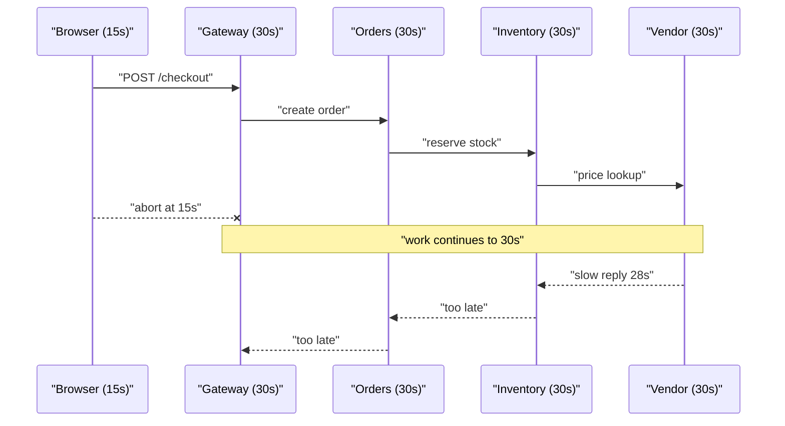

> **Scenario** — The checkout page hangs for 30 seconds and then shows a generic error. Tracing shows the browser gave up at 15s, but the API gateway waited 30s for `orders`, which waited 30s for `inventory`, which waited 30s for a vendor call. Every hop used the framework default. Nobody was wrong locally; the system was wrong globally.

## Why it matters

- Work continues after the user has left. You burn database connections and worker slots producing responses nobody will read.
- A single slow dependency saturates every upstream pool, turning one degraded service into a full outage.
- Retries stack on top of long timeouts: a 30s timeout with 3 retries is a 90s tail nobody budgeted for.
- Load shedding cannot work if callers do not know how much time is left.
- Incident triage takes twice as long when every span shows "timeout" and none of them shows *whose* deadline it was.

## Symptoms

| Signal | What you observe |
| --- | --- |
| Latency cliff | p99 pinned exactly at a round number (5000ms, 30000ms) rather than a distribution |
| Pool exhaustion | `php-fpm` or worker queue full while CPU sits under 20% |
| Orphan work | Upstream logs `client disconnected`, downstream still writes rows |
| Duplicated effort | Same trace ID appears three times in the vendor's logs |
| Mismatched spans | Client span 15s, server span 30s, both marked timeout |

## How it breaks

Each service configures its timeout in isolation, usually copying the framework default. Timeouts then *add* along the call chain instead of dividing a shared budget. The deepest hop is given as much time as the whole request, so the entry point always gives up first — and it gives up while every downstream hop is still holding resources.

The second-order effect is worse. When the gateway abandons the request, the connection is closed, but the downstream request is not cancelled. Inventory keeps holding its row lock, the vendor call keeps running, and the retry the client just issued starts a *second* copy of all that work.



## Root causes

1. Timeouts are configured per service instead of derived from a request-level budget.
2. No deadline is transmitted between hops, so downstream cannot know the remaining time.
3. Client disconnect is not propagated as a cancellation signal.
4. Retries are added without subtracting their cost from the budget.
5. Connect, read, and total timeouts are conflated into one number.
6. The slowest dependency's SLO was never checked against the caller's SLO.

## How to solve it

### 1. Set the budget at the edge

Pick the user-facing SLO first (say 3s for checkout), then allocate downward. Every hop spends part of the budget and passes the remainder on.

```
browser        3000ms
  gateway      2800ms  (200ms reserved for TLS + edge)
    orders     2500ms  (300ms for gateway routing + response)
      inventory 1500ms
        vendor   900ms  (600ms left for inventory's own work + one retry)
```

### 2. Propagate the deadline as a header

```php
<?php

namespace App\Http\Middleware;

use Closure;
use Illuminate\Http\Request;
use Symfony\Component\HttpFoundation\Response;

class DeadlinePropagation
{
    private const FLOOR_MS = 50;
    private const OVERHEAD_MS = 25;

    public function handle(Request $request, Closure $next): Response
    {
        $remaining = (int) $request->header('X-Deadline-Ms', 2500);
        $remaining -= self::OVERHEAD_MS;

        if ($remaining < self::FLOOR_MS) {
            return response()->json([
                'error'  => 'deadline exceeded before work started',
                'code'   => 'deadline_exhausted',
            ], 504);
        }

        app()->instance('request.deadline_ms', $remaining);
        app()->instance('request.deadline_at', microtime(true) + $remaining / 1000);

        return $next($request);
    }
}
```

### 3. Spend the remaining budget, never a constant

```php
<?php

namespace App\Clients;

use Illuminate\Support\Facades\Http;

class InventoryClient
{
    public function reserve(string $sku, int $qty): array
    {
        $deadlineAt = app('request.deadline_at');
        $remainingMs = (int) max(0, ($deadlineAt - microtime(true)) * 1000);

        // Reserve 20% of what is left for our own response serialisation.
        $callBudget = (int) ($remainingMs * 0.8);

        if ($callBudget < 100) {
            throw new \RuntimeException('no budget left for inventory call');
        }

        return Http::withHeaders(['X-Deadline-Ms' => (string) $callBudget])
            ->connectTimeout(0.25)
            ->timeout($callBudget / 1000)
            ->post(config('services.inventory.url').'/reserve', [
                'sku' => $sku,
                'qty' => $qty,
            ])
            ->throw()
            ->json();
    }
}
```

### 4. Cancel on the client side too

```ts
export async function fetchWithDeadline<T>(
  url: string,
  init: RequestInit,
  budgetMs: number,
): Promise<T> {
  const controller = new AbortController()
  const timer = setTimeout(() => controller.abort(), budgetMs)

  try {
    const res = await fetch(url, {
      ...init,
      signal: controller.signal,
      headers: { ...init.headers, 'X-Deadline-Ms': String(budgetMs) },
    })
    if (!res.ok) throw new Error(`HTTP ${res.status}`)
    return (await res.json()) as T
  } finally {
    clearTimeout(timer)
  }
}
```

### 5. Enforce it at the edge

```nginx
location /api/ {
    proxy_connect_timeout   250ms;
    proxy_send_timeout      2s;
    proxy_read_timeout      2800ms;
    proxy_next_upstream     error timeout http_502 http_503;
    proxy_next_upstream_timeout 2800ms;
    proxy_set_header        X-Deadline-Ms 2800;
}
```

`proxy_next_upstream_timeout` is the part teams forget: without it, nginx will retry a second upstream *after* the read timeout, doubling the tail.

## Target design


## Tradeoffs

| Option | Pros | Cons | Choose when |
| --- | --- | --- | --- |
| Deadline header (`X-Deadline-Ms`) | Works over plain HTTP, easy to debug | Clock-free but relies on every hop honouring it | Polyglot HTTP services |
| gRPC deadlines | Built in, cancellation propagates | Requires gRPC end to end | Internal mesh, one RPC stack |
| Static per-service timeouts | Trivial to configure | Timeouts add, not divide | Two hops or fewer |
| Absolute timestamp deadline | No drift accumulation across hops | Needs synchronised clocks | Same datacentre, NTP-disciplined |

## Verification checklist

- [ ] Inject a 5s delay in the vendor stub and confirm the browser sees a `504` within the 3s budget, not at 30s.
- [ ] Assert that the sum of nested span durations never exceeds the entry-point budget in a trace sample.
- [ ] Confirm downstream logs show `deadline_exhausted` rather than starting work with 40ms left.
- [ ] Abort a request from the client and verify no rows are written afterwards.
- [ ] Check `proxy_next_upstream_timeout` is set wherever `proxy_next_upstream` is.
- [ ] Load test at 2x capacity and confirm worker pools drain instead of filling.

## Anti-patterns

- Raising every timeout when a dependency gets slow — the queue just gets longer and the user still leaves.
- One global `HTTP_TIMEOUT=30` env var shared by health checks, batch jobs, and interactive requests.
- Treating connect timeout and read timeout as the same knob; connect should be under 300ms even when read is 3s.
- Adding retries without subtracting them from the budget, so worst case becomes `timeout × (retries + 1)`.
- Logging "timeout" without the budget and elapsed values, making the trace unreadable at 2am.

## Related

- [Retry with jitter, budgets, and honest error classes](/systems/api-integration/retry-with-jitter-strategy)
- [Graceful degradation when a vendor goes down](/systems/api-integration/third-party-outage-degradation)
- [Circuit breaker cascades across services](/systems/api-integration/circuit-breaker-cascades)
