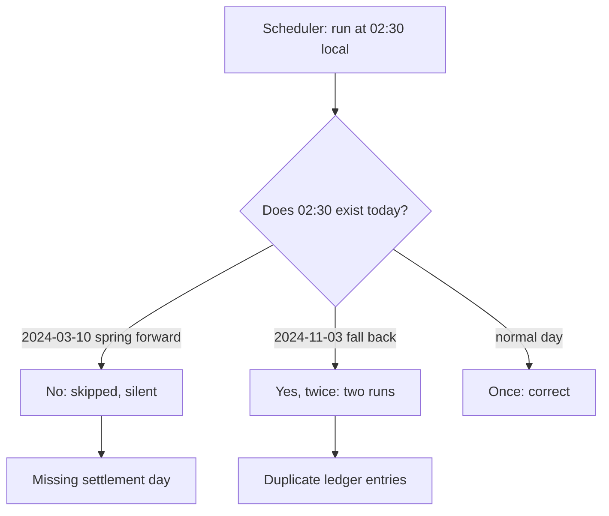
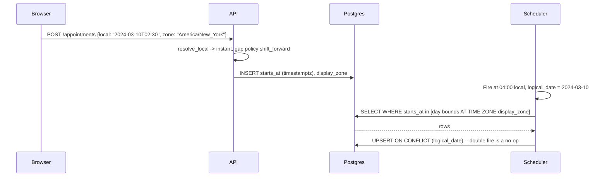

> **Scenario** - একটা nightly settlement job `America/New_York`-এ local `02:30`-এ schedule করা। 2024-03-10-এ ওই clock time নেই - 01:59:59 EST-এর পরেই 03:00:00 EDT। Job চুপচাপ চলে না। আট মাস পর, 2024-11-03-এ `01:30` দুইবার আসে, job দুইবার চলে, ১২,৪০০ ledger entry double-post হয়।

## Why it matters

- Time বাগ নীরব। কিছুই throw করে না; একটা দিন হারায় বা দুইবার আসে, আর পরের মাসের reconciliation-এ finance ধরে।
- Offset আর timezone এক নয়। `Asia/Dhaka` আজ `+06:00`, কিন্তু 2009-06-19 থেকে 2009-12-31 পর্যন্ত বাংলাদেশে DST ছিল `+07:00`-এ। ওই window-এ offset হিসেবে জমা যেকোনো historical timestamp এখন ambiguous।
- Timezone নিয়ম সরকারি সিদ্ধান্তে, কয়েক সপ্তাহের নোটিশে বদলায়। ব্রাজিল ২০১৯-এ DST বাতিল করে; hardcoded rule table ship করার দিনেই ভুল।
- "Local midnight" প্রত্যেক user-এর জন্য আলাদা instant। Daily report boundary একটা business সিদ্ধান্ত, technical constant নয়।
- বাগ বছরে দুইবার, production-এ, ০২:০০-তে reproduce হয় - ঠিক যখন কেউ দেখছে না।

## Symptoms

| Signal | What you observe |
|---|---|
| Missing runs | বছরে cron ৩৬৪ বার চলেছে; একটা তারিখে কোনো log line নেই |
| Duplicate runs | একই `logical_date`-এ দুইটা execution, এক ঘণ্টার ব্যবধানে |
| Reporting gaps | Daily-total chart-এ বছরে দুইবার ২৩ ঘণ্টার ও ২৫ ঘণ্টার দিন |
| Ordering | Fall-back ঘণ্টায় `ORDER BY created_at` causal order ভেঙে row মেশায় |
| Off-by-one | `Pacific/Kiritimati` (`+14:00`) user "আগামীকালের" data দেখে; `Pacific/Niue` (`-11:00`) গতকালের |
| Half-hour drift | `+06:00` ধরে নেওয়া সিস্টেমে `Asia/Kolkata` (`+05:30`) user-এর দিন-সীমা report-এর মাঝে পড়ে |
| Ambiguity errors | ঠিক 01:30-এ `pytz.AmbiguousTimeError` বা Java `DateTimeException` |

## How it breaks

মূল সমস্যা তিনটি আলাদা ধারণা মিলিয়ে ফেলা: *instant* (ভৌত timeline-এর একটা বিন্দু), *local date-time* (offset ছাড়া wall-clock পাঠ), আর *zoned date-time* (local date-time + IANA zone identifier)। Local date-time জমা করে read time-এ offset বসানো বছরের ৩৬৩ দিন কাজ করে। Spring-forward দিনে কিছু local time নেই; fall-back দিনে কিছু দুইবার আসে। একই মান যদি idempotency key বা partition boundary হিসেবেও ব্যবহৃত হয়, duplicate ঘণ্টা duplicate কাজ তৈরি করে।



## Root causes

1. Instant-এর বদলে wall-clock local time database-এ জমা করা।
2. IANA zone identifier (`Asia/Dhaka`)-এর বদলে fixed offset (`+06:00`) জমা।
3. DST transition window-এর ভেতর (local ০০:০০-০৩:০০) recurring job schedule করা।
4. স্পষ্ট UTC semantics-সহ `TIMESTAMPTZ`-এর বদলে `DATETIME` ব্যবহার।
5. প্রয়োজন "কালকে একই সময়" হলেও instant-এ date arithmetic (`t + 86400 সেকেন্ড`) করা।
6. Application container-এ পুরনো tzdata bundle করে কখনো update না করা।
7. `Intl.DateTimeFormat().resolvedOptions().timeZone`-এর বদলে browser offset (`getTimezoneOffset()`) থেকে zone বের করা।

## How to solve it

### 1. Instant UTC-তে জমা করুন, zone আলাদা রাখুন

```sql
-- Postgres: instant + user যে zone বুঝিয়েছে, আলাদা রাখা
CREATE TABLE appointments (
  id            bigserial PRIMARY KEY,
  starts_at     timestamptz NOT NULL,        -- instant
  display_zone  text        NOT NULL,        -- 'Asia/Dhaka'
  -- শুধু reporting-এর জন্য generated local view, source of truth নয়
  local_day     date GENERATED ALWAYS AS ((starts_at AT TIME ZONE display_zone)::date) STORED
);

-- কখনোই নয়: starts_at TIMESTAMP + offset_minutes INT
```

Postgres-এ `timestamptz` UTC instant জমা করে; input zone মনে রাখে না। তাই `display_zone` আলাদা column: render করতে ও পরে local day boundary গুনতে এটা দরকার।

### 2. Transition window-এর ভেতর কখনো schedule করবেন না

Recurring job local `04:00`-এ সরান, বা আরও ভালো - UTC-তে ঠিক করুন এবং local drift মেনে নিন:

```yaml
# Kubernetes CronJob: স্পষ্ট zone, local 00:00-03:00-এর বাইরে
apiVersion: batch/v1
kind: CronJob
metadata:
  name: nightly-settlement
spec:
  schedule: "0 4 * * *"
  timeZone: "America/New_York"   # k8s >= 1.27; আপডেটেড tzdata লাগে
  concurrencyPolicy: Forbid
  jobTemplate:
    spec:
      template:
        spec:
          containers:
            - name: settle
              image: registry.example.com/settlement:1.42.0
              args: ["--logical-date=$(LOGICAL_DATE)"]
          restartPolicy: OnFailure
```

`concurrencyPolicy: Forbid` আর `--logical-date` argument double-fire-কে নিরাপদ করে: দ্বিতীয় run-এর logical date একই, আর job সেটার উপর idempotent।

### 3. Local time স্পষ্টভাবে resolve করুন, ambiguity policy ঠিক করুন

```python
from datetime import datetime
from zoneinfo import ZoneInfo

NY = ZoneInfo("America/New_York")

def resolve_local(local: datetime, zone: ZoneInfo, on_gap="shift_forward", on_fold="first"):
    """Wall-clock পাঠকে স্পষ্টভাবে একটি instant-এ পরিণত করে।"""
    aware = local.replace(tzinfo=zone)
    # fold=0 প্রথম (DST) ঘটনা, fold=1 দ্বিতীয় (standard)
    first = aware.replace(fold=0)
    second = aware.replace(fold=1)
    if first.utcoffset() == second.utcoffset():
        # স্বাভাবিক দিন, বা অস্তিত্বহীন সময়: round-trip করে যাচাই
        utc = first.astimezone(ZoneInfo("UTC"))
        if utc.astimezone(zone).replace(tzinfo=zone) != aware:
            if on_gap == "shift_forward":
                return utc  # 02:30 -> 03:30 EDT
            raise ValueError(f"{local} does not exist in {zone}")
        return utc
    # ambiguous: দুইটা বৈধ instant আছে
    return (first if on_fold == "first" else second).astimezone(ZoneInfo("UTC"))

print(resolve_local(datetime(2024, 3, 10, 2, 30), NY))   # gap
print(resolve_local(datetime(2024, 11, 3, 1, 30), NY))   # fold
```

একটা policy বেছে নিন, কোডে লিখুন, আর দুই তারিখের জন্যই test রাখুন।

### 4. Calendar arithmetic local time-এ করুন, তারপর convert

"কালকে একই সময়" একটা *local* operation। Instant-কে user-এর zone-এ নিন, calendar-এ এক দিন যোগ করুন, তারপর ফেরান। Instant-এ ৮৬,৪০০ সেকেন্ড যোগ করলে transition দিনে ভুল wall-clock time আসে।

```ts
import { DateTime } from 'luxon'

const start = DateTime.fromISO('2024-11-02T09:00', { zone: 'America/New_York' })
const naive = start.toUTC().plus({ seconds: 86_400 }).setZone('America/New_York')
const correct = start.plus({ days: 1 })

console.log(naive.toFormat('HH:mm'))   // 08:00 - ভুল
console.log(correct.toFormat('HH:mm')) // 09:00 - ঠিক
```

### 5. tzdata টাটকা রাখুন ও version pin করুন

Image-এ `tzdata` যোগ করুন, IANA release-এ rebuild করুন। Startup log line-এ version লিখুন যাতে incident-এ পুরনো table ধরা যায়।

```bash
# Alpine
apk add --no-cache tzdata
# ব্যবসার জন্য গুরুত্বপূর্ণ zone যাচাই
TZ=Asia/Dhaka date -d '2009-07-01 12:00' +'%Y-%m-%d %H:%M %z'  # আশা করি +0700
```

শেষ command-টা ২০০৯-এর বাংলাদেশ DST window-এর সস্তা regression test: `+0600` দেখালে আপনার tzdata ভাঙা বা উপেক্ষিত।

### 6. User-এর offset নয়, IANA zone নিন

```ts
const zone = Intl.DateTimeFormat().resolvedOptions().timeZone // 'Asia/Dhaka'
```

Signup-এ এই string পাঠান ও জমা করুন। জুলাইয়ে নেওয়া offset জানুয়ারিতে অর্ধেক পৃথিবীর জন্য ভুল।

## Target design



## Tradeoffs

| Option | Pros | Cons | Choose when |
|---|---|---|---|
| শুধু UTC instant | Unambiguous, sortable | User-এর intended local time ফেরানো যায় না | Event log, audit trail |
| UTC instant + IANA zone | সঠিক rendering ও local-day হিসাব | দুই column, বেশি discipline | User-facing scheduling |
| Local time + zone জমা | User intent হুবহু মেলে | Fold-এ ambiguous, gap-এ invalid | Recurring rule ("প্রতি সোমবার ০৯:০০") |
| Fixed offset column | সহজ, tz library লাগে না | যেকোনো DST বা আইন বদলের পর ভুল | Future timestamp-এ কখনোই নয় |
| UTC-তে schedule | কখনো skip বা double নয় | Local run time এক ঘণ্টা সরে | Local অর্থ নেই এমন internal job |
| Local ০৪:০০-এ schedule | Business-aligned, transition-এর বাইরে | Scheduler-এ tzdata লাগে | Report ও settlement |

## Verification checklist

- [ ] `America/New_York`-এ `2024-03-10T02:30` (gap) ও `2024-11-03T01:30` (fold)-এর unit test আছে।
- [ ] একটা test assert করে `Asia/Dhaka`-তে `2009-07-01T12:00` `+07:00`-এ resolve হয়।
- [ ] `SELECT column_name, data_type FROM information_schema.columns WHERE data_type LIKE 'timestamp%'` user-facing table-এ naive `timestamp without time zone` দেখায় না।
- [ ] Repo-র কোনো cron entry local ০০:০০-০৩:০০-এর মধ্যে চলে না।
- [ ] প্রতিটি recurring job `logical_date`-এ idempotent, এবং তা প্রমাণ করা uniqueness constraint আছে।
- [ ] tzdata version startup-এ print হয় ও মাসিক dependency review-তে দেখা হয়।
- [ ] বছরে দুই transition তারিখের daily-total dashboard দেখা হয়, ২৩/২৫ ঘণ্টার anomaly নেই।
- [ ] User-এর জমা zone IANA identifier; `^[+-]\d{2}:\d{2}$` মেলে এমন query শূন্য row দেয়।

## Anti-patterns

- Connection-এ `SET time zone 'UTC'` দিয়ে সমাধান ভাবা, অথচ application তখনো local string বানাচ্ছে।
- PHP-তে global `date_default_timezone_set('Asia/Dhaka')` দিয়ে `DATETIME` column-এ `date('Y-m-d H:i:s')` জমা করা।
- "আমরা এক দেশেই চলি, offset-ই চলবে" - যতক্ষণ না সরকার offset বদলায়, বা আপনি বিদেশে নিয়োগ দেন।
- Skip হওয়া job হাতে cron আবার চালিয়ে retry করা, দ্বিতীয় চেষ্টা idempotent কি না না দেখে।
- আলাদা zone-এ format করার পর timestamp string হিসেবে তুলনা করা।
- `getTimezoneOffset()`-কে user-এর timezone ধরা।
- Ambiguity "মেটাতে" fold-ঘণ্টার timestamp নিকটতম ঘণ্টায় round করা।

## Related

- [Leap days and calendar edge cases](/systems/reliability-edge-cases/leap-day-and-calendar-edge-cases)
- [Long-running job recovery](/systems/reliability-edge-cases/long-running-job-recovery)
- [Money, rounding, and float traps](/systems/reliability-edge-cases/money-and-rounding-correctness)
- [Duplicate submission prevention](/systems/reliability-edge-cases/duplicate-submission-prevention)
