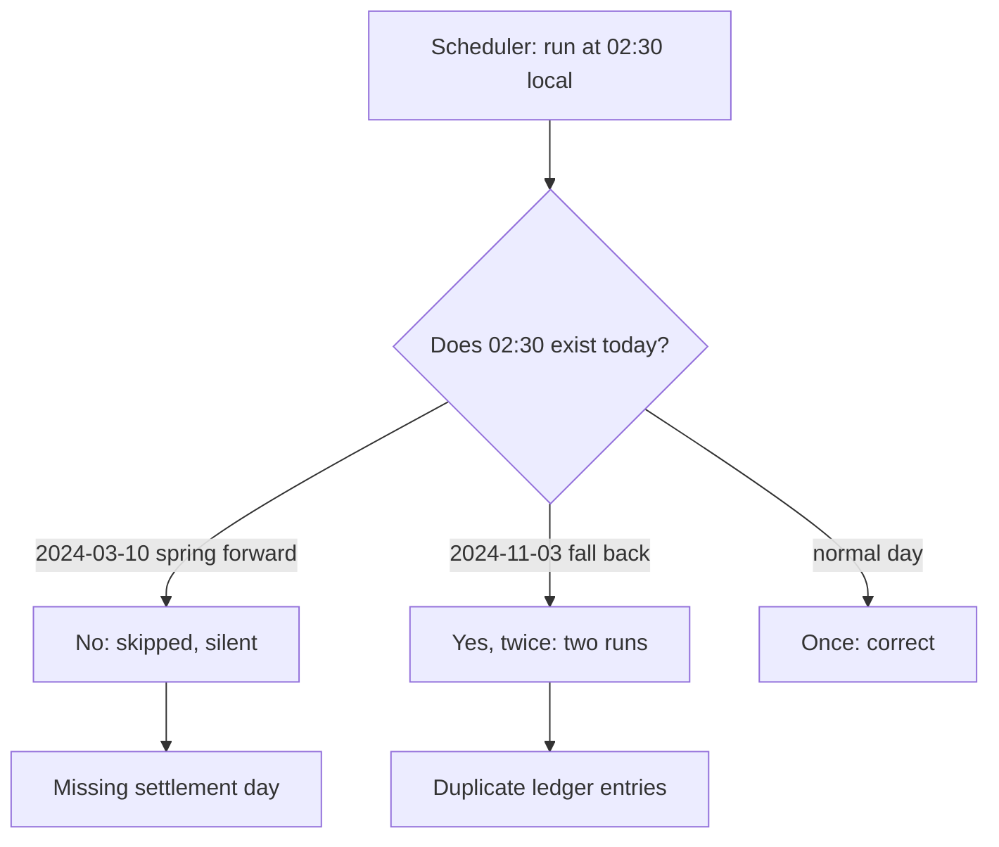
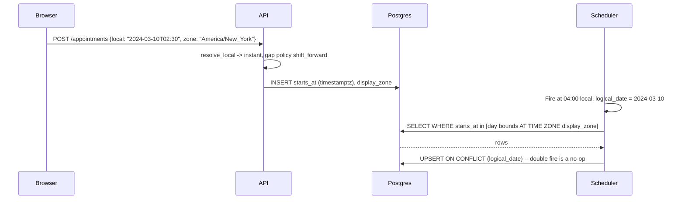

> **Scenario** — A nightly settlement job is scheduled at `02:30` local time in `America/New_York`. On 2024-03-10 that clock time does not exist — 01:59:59 EST is followed by 03:00:00 EDT. The job silently does not run. Eight months later, on 2024-11-03, `01:30` happens twice and the job runs twice, double-posting 12,400 ledger entries.

## Why it matters

- Time bugs are silent. Nothing throws; you get a missing day or a duplicated day, discovered by finance in the following month's reconciliation.
- Offsets are not timezones. `Asia/Dhaka` is `+06:00` today, but between 2009-06-19 and 2009-12-31 Bangladesh ran DST at `+07:00`. Any historical timestamp stored as an offset in that window is now ambiguous.
- Timezone rules change by government decree with weeks of notice. Brazil abolished DST in 2019; a hardcoded rule table is wrong the day it ships.
- "Local midnight" is a different instant for every user. A daily report boundary is a business decision, not a technical constant.
- The bug reproduces twice a year, in production, at 02:00, which is exactly when nobody is looking.

## Symptoms

| Signal | What you observe |
|---|---|
| Missing runs | Cron ran 364 times in a year; one date has no log line at all |
| Duplicate runs | Two executions with identical `logical_date`, one hour apart |
| Reporting gaps | A 23-hour day and a 25-hour day in a daily-totals chart, twice a year |
| Ordering | `ORDER BY created_at` interleaves rows out of causal order across a fall-back hour |
| Off-by-one | Users in `Pacific/Kiritimati` (`+14:00`) see "tomorrow's" data; `Pacific/Niue` (`-11:00`) sees yesterday's |
| Half-hour drift | `Asia/Kolkata` (`+05:30`) users' daily boundary lands mid-report in a `+06:00`-assuming system |
| Ambiguity errors | `pytz.AmbiguousTimeError` or Java `DateTimeException` at exactly 01:30 |

## How it breaks

The root problem is conflating three different concepts: an *instant* (a point on the physical timeline), a *local date-time* (wall-clock reading with no offset), and a *zoned date-time* (local date-time plus an IANA zone identifier). Storing a local date-time and applying an offset at read time works for 363 days a year. On a spring-forward day some local times do not exist; on a fall-back day some occur twice. If the same value is also used as an idempotency key or a partition boundary, the duplicate hour produces duplicate work.



## Root causes

1. Storing wall-clock local time in the database instead of an instant.
2. Storing a fixed offset (`+06:00`) instead of an IANA zone identifier (`Asia/Dhaka`).
3. Scheduling recurring jobs at clock times inside the DST transition window (00:00-03:00 local).
4. Using `DATETIME` instead of `TIMESTAMPTZ` / `TIMESTAMP` with explicit UTC semantics.
5. Doing date arithmetic on instants (`t + 86400 seconds`) when the requirement is "same time tomorrow".
6. Bundling a stale tzdata with the application container and never updating it.
7. Deriving the user's zone from a browser offset (`getTimezoneOffset()`) rather than `Intl.DateTimeFormat().resolvedOptions().timeZone`.

## How to solve it

### 1. Store instants in UTC, store zones separately

```sql
-- Postgres: instant + the zone the user meant, kept apart
CREATE TABLE appointments (
  id            bigserial PRIMARY KEY,
  starts_at     timestamptz NOT NULL,        -- the instant
  display_zone  text        NOT NULL,        -- 'Asia/Dhaka'
  -- generated local view for reporting only, never the source of truth
  local_day     date GENERATED ALWAYS AS ((starts_at AT TIME ZONE display_zone)::date) STORED
);

-- Never: starts_at TIMESTAMP + offset_minutes INT
```

`timestamptz` in Postgres stores a UTC instant; it does not remember the input zone. That is why `display_zone` is a separate column: you need it to render and to compute local day boundaries later.

### 2. Never schedule inside the transition window

Move recurring jobs to `04:00` local, or better, define them in UTC and accept the local drift:

```yaml
# Kubernetes CronJob: explicit zone, outside 00:00-03:00 local
apiVersion: batch/v1
kind: CronJob
metadata:
  name: nightly-settlement
spec:
  schedule: "0 4 * * *"
  timeZone: "America/New_York"   # k8s >= 1.27; requires updated tzdata
  concurrencyPolicy: Forbid
  jobTemplate:
    spec:
      template:
        spec:
          containers:
            - name: settle
              image: registry.example.com/settlement:1.42.0
              args: ["--logical-date=$(LOGICAL_DATE)"]
          restartPolicy: OnFailure
```

`concurrencyPolicy: Forbid` plus a `--logical-date` argument makes a double-fire harmless: the second run has the same logical date and the job is idempotent on it.

### 3. Resolve local times explicitly, and decide the ambiguity policy

```python
from datetime import datetime
from zoneinfo import ZoneInfo

NY = ZoneInfo("America/New_York")

def resolve_local(local: datetime, zone: ZoneInfo, on_gap="shift_forward", on_fold="first"):
    """Turn a wall-clock reading into a single instant, explicitly."""
    aware = local.replace(tzinfo=zone)
    # fold=0 is the first (DST) occurrence, fold=1 the second (standard)
    first = aware.replace(fold=0)
    second = aware.replace(fold=1)
    if first.utcoffset() == second.utcoffset():
        # normal day, or a nonexistent time: check by round-tripping
        utc = first.astimezone(ZoneInfo("UTC"))
        if utc.astimezone(zone).replace(tzinfo=zone) != aware:
            if on_gap == "shift_forward":
                return utc  # 02:30 -> 03:30 EDT
            raise ValueError(f"{local} does not exist in {zone}")
        return utc
    # ambiguous: two valid instants exist
    return (first if on_fold == "first" else second).astimezone(ZoneInfo("UTC"))

print(resolve_local(datetime(2024, 3, 10, 2, 30), NY))   # gap
print(resolve_local(datetime(2024, 11, 3, 1, 30), NY))   # fold
```

Pick a policy, write it in the code, and cover it with tests for both dates.

### 4. Do calendar arithmetic in local time, then convert

"Same time tomorrow" is a *local* operation. Convert the instant to the user's zone, add one day in the calendar, then convert back. Adding 86,400 seconds to an instant gives the wrong wall-clock time on transition days.

```ts
import { DateTime } from 'luxon'

const start = DateTime.fromISO('2024-11-02T09:00', { zone: 'America/New_York' })
const naive = start.toUTC().plus({ seconds: 86_400 }).setZone('America/New_York')
const correct = start.plus({ days: 1 })

console.log(naive.toFormat('HH:mm'))   // 08:00 — wrong
console.log(correct.toFormat('HH:mm')) // 09:00 — right
```

### 5. Keep tzdata fresh and pin its version

Add `tzdata` to the image and rebuild on IANA releases. Record the version in a startup log line so an incident can be correlated with a stale table.

```bash
# Alpine
apk add --no-cache tzdata
# Verify the zone your business cares about
TZ=Asia/Dhaka date -d '2009-07-01 12:00' +'%Y-%m-%d %H:%M %z'  # expect +0700
```

That last command is the cheap regression test for the 2009 Bangladesh DST window: if it prints `+0600`, your tzdata is broken or being ignored.

### 6. Capture the user's IANA zone, not their offset

```ts
const zone = Intl.DateTimeFormat().resolvedOptions().timeZone // 'Asia/Dhaka'
```

Send that string on signup and store it. An offset captured in July is wrong in January for half the world.

## Target design



## Tradeoffs

| Option | Pros | Cons | Choose when |
|---|---|---|---|
| Store UTC instant only | Unambiguous, sortable | Cannot reconstruct the user's intended local time | Event logs, audit trails |
| UTC instant + IANA zone | Correct rendering and local-day math | Two columns, more discipline | User-facing scheduling |
| Store local time + zone | Matches user intent exactly | Ambiguous on fold, invalid on gap | Recurring rules ("every Monday 09:00") |
| Fixed offset column | Simple, no tz library | Wrong after any DST or law change | Never for future timestamps |
| Schedule in UTC | Never skipped or doubled | Local run time drifts by an hour | Internal jobs with no local meaning |
| Schedule in local at 04:00 | Business-aligned, outside transitions | Needs tzdata in the scheduler | Reports and settlements |

## Verification checklist

- [ ] Unit tests exist for `2024-03-10T02:30` (gap) and `2024-11-03T01:30` (fold) in `America/New_York`.
- [ ] A test asserts `Asia/Dhaka` at `2009-07-01T12:00` resolves to `+07:00`.
- [ ] `SELECT column_name, data_type FROM information_schema.columns WHERE data_type LIKE 'timestamp%'` shows no naive `timestamp without time zone` on user-facing tables.
- [ ] No cron entry in the repo runs between 00:00 and 03:00 local.
- [ ] Every recurring job is idempotent on a `logical_date` and has a uniqueness constraint proving it.
- [ ] The tzdata version is printed at startup and checked in a monthly dependency review.
- [ ] Daily-total dashboards are reviewed for the two transition dates each year and show no 23/25-hour anomaly.
- [ ] Users' stored zones are IANA identifiers; a query for values matching `^[+-]\d{2}:\d{2}$` returns zero rows.

## Anti-patterns

- `SET time zone 'UTC'` on the connection and calling it a fix, while the application still builds local strings.
- Using `date_default_timezone_set('Asia/Dhaka')` globally in PHP and then storing `date('Y-m-d H:i:s')` in a `DATETIME` column.
- "We only operate in one country, so offsets are fine" — until the government changes the offset, or you hire abroad.
- Retrying a skipped job by re-running the cron manually without checking whether the second attempt is idempotent.
- Comparing timestamps as strings after formatting them in different zones.
- Treating `getTimezoneOffset()` as the user's timezone.
- Rounding a fold-hour timestamp to the nearest hour to "resolve" ambiguity.

## Related

- [Leap days and calendar edge cases](/systems/reliability-edge-cases/leap-day-and-calendar-edge-cases)
- [Long-running job recovery](/systems/reliability-edge-cases/long-running-job-recovery)
- [Money, rounding, and float traps](/systems/reliability-edge-cases/money-and-rounding-correctness)
- [Duplicate submission prevention](/systems/reliability-edge-cases/duplicate-submission-prevention)
