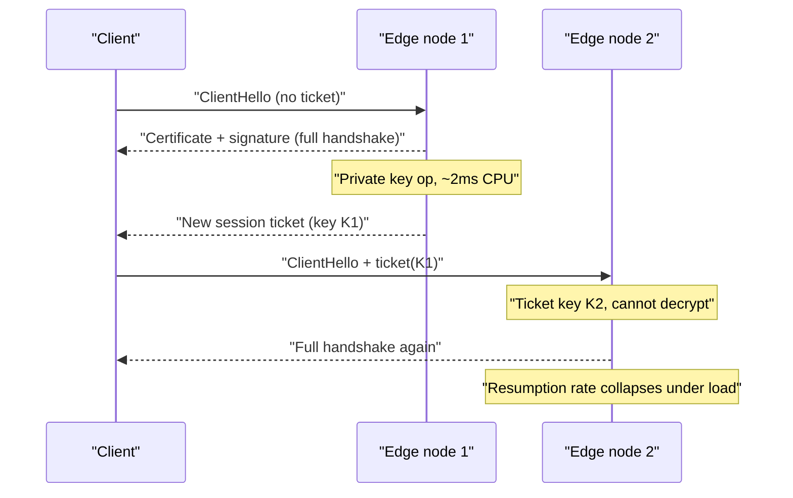
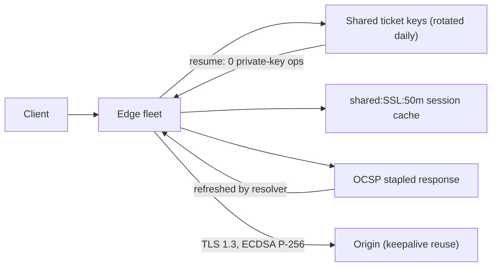

> **Scenario** — A marketing push sends 90,000 people to the site in four minutes. Backends are at 30% CPU, the database is bored, and yet the edge nodes are pinned at 100% with `ssl_handshake` dominating the profile. Median TTFB goes from 120ms to 2.1s. Nothing is "down" — the TLS layer is the whole outage.

## Why it matters

- A full TLS 1.3 handshake costs one extra round trip and a signature operation; TLS 1.2 with ECDHE costs two round trips. At 300ms RTT that is 300–600ms before a single byte of your response.
- Handshake CPU is asymmetric: an RSA-2048 private-key operation is roughly 10–40× the cost of the client side, so the attacker (or the flash crowd) always pays less than you.
- OCSP stapling failures add a *client-side* fetch to a third-party responder in the critical path — an outage you do not control appearing as your slowness.
- Session resumption converts most handshakes into a 0–1 RTT resume with no private-key operation, which is usually a 5–10× capacity difference at the edge.
- Cold traffic is exactly when handshakes matter: a flash crowd is, by definition, all new connections.

## Symptoms

| Signal | What you observe |
| --- | --- |
| Edge CPU | 100% with `ssl_handshake` / `ecdsa_sign` hot in `perf top` |
| `$ssl_session_reused` | `.` (not reused) on most requests |
| `curl -w` | `appconnect - connect` gap of 200ms+ on every request |
| Backend CPU | Low, while user-visible latency is high |
| First-byte time | Rises with connection rate, not with request complexity |
| `openssl s_client` | `New, TLSv1.3, Cipher is ...` instead of `Reused` |
| OCSP | `OCSP response: no response sent` and periodic multi-second stalls |

## How it breaks

Each new TLS connection runs a key exchange and an authentication step. In TLS 1.3 the client sends `ClientHello` with a key share, the server replies with its certificate and a signature, and application data flows after 1 RTT. That signature is a private-key operation on your edge node. Multiply by 90,000 arriving connections in four minutes — about 375 handshakes per second — and a node that comfortably proxies 20,000 rps can be saturated by signing alone.

Resumption exists to avoid this. With session tickets, the server encrypts the session state and hands it to the client; on return the client presents the ticket and both sides skip the certificate and signature entirely. But nginx generates ticket keys **per worker process at startup by default**, so in a multi-node edge tier every node — and after a reload, every worker — rejects tickets issued elsewhere. Resumption rate silently drops to near zero and nobody notices until a spike.



## Root causes

1. Per-node, per-worker session ticket keys, so resumption never works across a fleet.
2. `ssl_session_cache` left at the default `none` or `builtin`, which is per-worker and tiny.
3. `ssl_session_timeout` shorter than a typical user's browsing session.
4. RSA-2048 certificates where ECDSA P-256 would be several times cheaper to sign.
5. OCSP stapling disabled, pushing revocation checks onto clients and into the critical path.
6. TLS 1.2 still preferred, costing an extra round trip versus TLS 1.3.
7. No keepalive, so each request pays a fresh handshake — the connection-reuse bug wearing a TLS costume.

## How to solve it

### 1. Measure the resumption rate before changing anything

```nginx
log_format tls '$remote_addr $status ssl_proto=$ssl_protocol '
               'cipher=$ssl_cipher reused=$ssl_session_reused '
               'rt=$request_time';
```

```bash
awk -F'reused=' '{split($2,a," "); print a[1]}' /var/log/nginx/access.log \
  | sort | uniq -c
#  184213 .    <- not reused
#   11902 r    <- reused
```

A 6% resumption rate is the finding. Above 80% is a healthy target for browser traffic.

### 2. Share session ticket keys across the fleet

```bash
openssl rand 80 > /etc/nginx/ssl/ticket.key.new
```

```nginx
ssl_session_tickets on;
ssl_session_ticket_key /etc/nginx/ssl/ticket.key.current;
ssl_session_ticket_key /etc/nginx/ssl/ticket.key.previous;

ssl_session_cache   shared:SSL:50m;   # ~200k sessions
ssl_session_timeout 4h;
```

Rotate daily: distribute the new key as `current`, demote the old to `previous`, and keep both listed so in-flight tickets still resume. Ticket keys are long-lived secrets — treat them like private keys, because possession of one breaks forward secrecy for its window.

### 3. Prefer TLS 1.3 and cheaper signatures

```nginx
ssl_protocols       TLSv1.2 TLSv1.3;
ssl_prefer_server_ciphers off;
ssl_ecdh_curve      X25519:prime256v1;
ssl_certificate     /etc/ssl/ecdsa.crt;   # ECDSA P-256
ssl_certificate_key /etc/ssl/ecdsa.key;
ssl_certificate     /etc/ssl/rsa.crt;     # RSA fallback for old clients
ssl_certificate_key /etc/ssl/rsa.key;
```

nginx serves whichever certificate the client's signature algorithms allow, so modern clients get the cheap ECDSA path while old ones still work.

### 4. Staple OCSP so clients never leave your path

```nginx
ssl_stapling on;
ssl_stapling_verify on;
ssl_trusted_certificate /etc/ssl/chain.pem;
resolver 1.1.1.1 8.8.8.8 valid=300s;
resolver_timeout 5s;
```

Verify it is actually working:

```bash
echo | openssl s_client -connect app.example.com:443 -status 2>/dev/null \
  | grep -A2 'OCSP Response Status'
# OCSP Response Status: successful (0x0)
# Cert Status: good
```

`no response sent` means stapling is configured but the fetch is failing — usually a missing `resolver`.

### 5. Confirm resumption from a client

```bash
curl -sS -o /dev/null -w \
 'tcp=%{time_connect} tls=%{time_appconnect} ttfb=%{time_starttransfer}\n' \
 https://app.example.com/
# tcp=0.031 tls=0.098 ttfb=0.142   <- full handshake, 67ms of TLS
# tcp=0.030 tls=0.036 ttfb=0.081   <- resumed, 6ms of TLS
```

```bash
openssl s_client -connect app.example.com:443 -sess_out /tmp/s.pem </dev/null
openssl s_client -connect app.example.com:443 -sess_in  /tmp/s.pem </dev/null | grep Reused
# Reused, TLSv1.3, Cipher is TLS_AES_128_GCM_SHA256
```

### 6. Decide about 0-RTT deliberately

`ssl_early_data on` removes the last round trip for resumed connections, but 0-RTT data is replayable. Enable it only if the origin restricts early data to idempotent requests — nginx exposes `$ssl_early_data` so you can reject non-GET early requests at the edge.

## Target design



## Tradeoffs

| Option | Pros | Cons | Choose when |
| --- | --- | --- | --- |
| Session tickets | Stateless, scales across nodes | Key rotation is a real operational duty | Multi-node edge fleets |
| Server-side session cache | No shared secret to distribute | Node-local unless externalised | Single node or sticky routing |
| ECDSA certificate | Far cheaper signatures | Very old clients need an RSA fallback | High connection rates |
| 0-RTT (`early_data`) | Removes the last RTT | Replay risk on non-idempotent requests | GET-only edges with replay guards |
| OCSP stapling | Removes a third party from the client path | Needs `resolver` and monitoring | Always |

## Verification checklist

- [ ] `$ssl_session_reused` shows `r` for over 80% of requests during normal traffic.
- [ ] Ticket keys identical across all edge nodes (`sha256sum` matches) and rotated on a schedule.
- [ ] `openssl s_client -sess_in` prints `Reused`.
- [ ] `openssl s_client -status` prints `OCSP Response Status: successful`.
- [ ] `ssl_session_cache` is `shared:`, not `builtin` or `none`.
- [ ] A synthetic burst of 500 new connections per second does not exceed 60% edge CPU.
- [ ] `nginx -T | grep ssl_protocols` excludes TLS 1.0 and 1.1.

## Anti-patterns

- Leaving ticket keys auto-generated per worker and wondering why resumption is 5%.
- Rotating ticket keys hourly with only one key configured, invalidating every in-flight ticket.
- Enabling `ssl_early_data` globally so a replayed POST can charge a card twice.
- Adding edge nodes to fix TLS CPU rather than fixing resumption first.
- Turning on stapling without a `resolver`, which silently disables it.
- Benchmarking with a warm session and concluding the edge handles the flash crowd.

## Related

- [nginx edge TLS termination pitfalls](/systems/networking-edge/nginx-edge-tls-termination)
- [Keepalive and upstream connection reuse](/systems/networking-edge/keepalive-and-connection-reuse)
- [HTTP/2 and HTTP/3 multiplexing side effects](/systems/networking-edge/http2-http3-multiplexing-effects)
